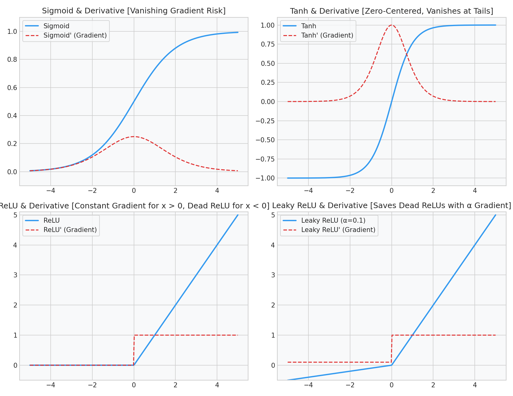

# Deep Learning: Neural Network Foundations & Forward Propagation

This guide details the structural and mathematical mechanics of Multi-Layer Perceptrons (MLPs), activation function gradients, and walks through a manual forward propagation pass step-by-step.

---

## 1. Multi-Layer Perceptron (MLP) Architecture

A Multi-Layer Perceptron (MLP) consists of an input layer, one or more hidden layers, and an output layer. We use **vectorized representation** where each column represents a training example, following Andrew Ng's dimension standards.

For a network of $L$ layers:
- **Input Matrix ($X$):** $A^{[0]} = X \in \mathbb{R}^{n_0 \times m}$, where $n_0$ is the input feature count and $m$ is the number of samples.
- **Weight Matrix ($W^{[l]}$):** $W^{[l]} \in \mathbb{R}^{n_l \times n_{l-1}}$, where $n_l$ is the number of neurons in layer $l$.
- **Bias Vector ($b^{[l]}$):** $b^{[l]} \in \mathbb{R}^{n_l \times 1}$ (broadcasted across columns during forward prop).

---

## 2. Activation Functions and Gradient Analysis

Activation functions introduce non-linearity, allowing neural networks to learn complex non-linear decision boundaries.

```text
Activation       Formula                        Range          Derivative / Gradient              Failure Mode
----------------------------------------------------------------------------------------------------------------------
Sigmoid          σ(z) = 1 / (1 + e^-z)          (0, 1)         σ'(z) = σ(z)(1 - σ(z))             Vanishing Gradient
Tanh             tanh(z) = (e^z - e^-z)/...     (-1, 1)        tanh'(z) = 1 - tanh²(z)            Vanishing Gradient
ReLU             g(z) = max(0, z)               [0, inf)       g'(z) = 1 (z > 0), 0 (z < 0)       Dead ReLU (z < 0)
Leaky ReLU       g(z) = max(αz, z)              (-inf, inf)    g'(z) = 1 (z > 0), α (z < 0)       None
```

### The Gradient Volatility Trap
- **Vanishing Gradients:** For Sigmoid and Tanh, when inputs are large positive or negative values ($z > 4$ or $z < -4$), the curve flattens. The derivative drops close to $0$. During backpropagation, this small derivative is multiplied layer-by-layer, causing weight updates in early layers to vanish, stalling training.
- **Dead ReLU Problem:** For ReLU, if a neuron's pre-activation $z$ is negative, both its output and its gradient become exactly $0$. Once a neuron is pushed into the negative zone (e.g., due to a large negative gradient step), it will never activate again. **Leaky ReLU** solves this by maintaining a small slope $\alpha$ (typically $0.01 - 0.1$) for negative inputs.

### Diagnostic Visual (Activations & Derivatives)
The plot below illustrates the activations (blue) and their corresponding gradient curves (red dashed):



---

## 3. Step-by-Step Hand Calculations: Forward Pass

Let's trace the forward pass for a tiny network:
- **Input:** $X = \begin{bmatrix} 0.5 \\ -0.2 \end{bmatrix}$ (2 features, $m=1$ sample)
- **Layer 1 (Hidden, 2 neurons, ReLU activation):**
  $$W^{[1]} = \begin{bmatrix} 0.2 & -0.3 \\ 0.4 & 0.1 \end{bmatrix}, \quad b^{[1]} = \begin{bmatrix} 0.05 \\ -0.1 \end{bmatrix}$$
- **Layer 2 (Output, 1 neuron, Sigmoid activation):**
  $$W^{[2]} = \begin{bmatrix} 0.5 & 0.8 \end{bmatrix}, \quad b^{[2]} = \begin{bmatrix} -0.2 \end{bmatrix}$$

---

### Step 1: Pre-Activation Layer 1 ($Z^{[1]}$)
Multiply weights by input and add bias:
$$Z^{[1]} = W^{[1]} X + b^{[1]} = \begin{bmatrix} 0.2 & -0.3 \\ 0.4 & 0.1 \end{bmatrix} \begin{bmatrix} 0.5 \\ -0.2 \end{bmatrix} + \begin{bmatrix} 0.05 \\ -0.1 \end{bmatrix}$$

$$Z_1^{[1]} = (0.2 \times 0.5) + (-0.3 \times -0.2) + 0.05 = 0.10 + 0.06 + 0.05 = 0.21$$
$$Z_2^{[1]} = (0.4 \times 0.5) + (0.1 \times -0.2) - 0.10 = 0.20 - 0.02 - 0.10 = 0.08$$

$$Z^{[1]} = \begin{bmatrix} 0.21 \\ 0.08 \end{bmatrix}$$

---

### Step 2: Post-Activation Layer 1 ($A^{[1]}$)
Apply the ReLU activation function $A^{[1]} = \max(0, Z^{[1]})$:
$$A_1^{[1]} = \max(0, 0.21) = 0.21$$
$$A_2^{[1]} = \max(0, 0.08) = 0.08$$

$$A^{[1]} = \begin{bmatrix} 0.21 \\ 0.08 \end{bmatrix}$$

---

### Step 3: Pre-Activation Layer 2 ($Z^{[2]}$)
Compute input to the output layer:
$$Z^{[2]} = W^{[2]} A^{[1]} + b^{[2]} = \begin{bmatrix} 0.5 & 0.8 \end{bmatrix} \begin{bmatrix} 0.21 \\ 0.08 \end{bmatrix} + \begin{bmatrix} -0.2 \end{bmatrix}$$

$$Z^{[2]} = (0.5 \times 0.21) + (0.8 \times 0.08) - 0.20 = 0.105 + 0.064 - 0.20 = -0.031$$

---

### Step 4: Post-Activation Layer 2 ($A^{[2]}$ / Prediction $\hat{y}$)
Apply the Sigmoid activation function:
$$\hat{y} = A^{[2]} = \sigma(Z^{[2]}) = \sigma(-0.031) = \frac{1}{1 + e^{-(-0.031)}} = \frac{1}{1 + e^{0.031}} \approx \frac{1}{1 + 1.03148} \approx 0.4922$$

**Result:** The forward pass predicts a probability of **$49.22\%$** for the positive class.

---

## 4. Interactive Practice Notebook
To see this vectorized forward pass run inside a training loop, check out:
- [01_mlp_from_scratch_numpy.ipynb](file:///d:/Study/Prep/machine-learning-prep/deep-learning-foundations/01_mlp_from_scratch_numpy.ipynb)
