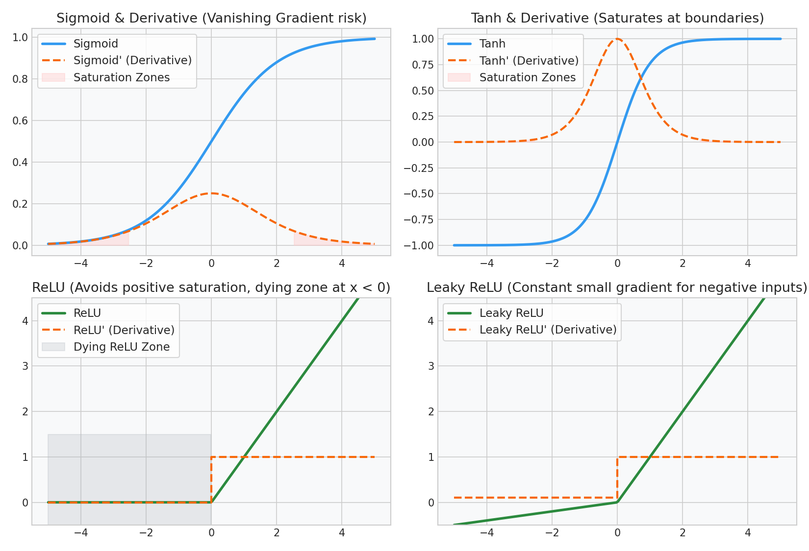

# Deep Learning: Activation Functions & Gradient Flow

This guide details the mathematical characteristics, derivatives, and production implications of activation functions, focusing on vanishing gradients, saturation, and dying node anomalies.

---

## 1. Mathematical Formulas & Derivatives

| Activation Function | Formula ($g(z)$) | Derivative ($g^\prime(z)$) | Range |
| :--- | :--- | :--- | :--- |
| **Sigmoid** | $$\frac{1}{1 + e^{-z}}$$ | $$g(z)(1 - g(z))$$ | $$(0, 1)$$ |
| **Tanh** | $$\tanh(z) = \frac{e^z - e^{-z}}{e^z + e^{-z}}$$ | $$1 - \tanh^2(z)$$ | $$(-1, 1)$$ |
| **ReLU** | $$\max(0, z)$$ | $$\begin{cases} 1 & z > 0 \\ 0 & z < 0 \end{cases}$$ | $$[0, \infty)$$ |
| **Leaky ReLU** | $$\max(\alpha z, z) \quad (\alpha \approx 0.01)$$ | $$\begin{cases} 1 & z > 0 \\ \alpha & z < 0 \end{cases}$$ | $$(-\infty, \infty)$$ |
| **ELU** | $$\begin{cases} z & z > 0 \\ \alpha(e^z - 1) & z \le 0 \end{cases}$$ | $$\begin{cases} 1 & z > 0 \\ g(z) + \alpha & z \le 0 \end{cases}$$ | $$(-\alpha, \infty)$$ |

---

## 2. Vanishing and Exploding Gradient Problems

The gradient of the cost function $J$ with respect to weight matrix $W^{[1]}$ in a deep network is calculated using the chain rule:

$$\frac{\partial J}{\partial W^{[1]}} = dZ^{[L]} \cdot W^{[L]T} \cdot g^{[L-1]\prime}(Z^{[L-1]}) \dots W^{[2]T} \cdot g^{[1]\prime}(Z^{[1]}) \cdot X^T$$

### Vanishing Gradients
If the derivatives of the activation functions ($g^{[l]\prime}$) are consistently less than $1.0$, multiplying these terms repeatedly across dozens of layers causes the gradient to decay exponentially as it propagates backward:

$$\frac{\partial J}{\partial W^{[1]}} \to 0 \quad \text{as } L \to \infty$$

The early layers update extremely slowly, halting representation learning.

### Exploding Gradients
Conversely, if the weights $W$ or activation derivatives are large ($> 1.0$), the gradients grow exponentially:

$$\frac{\partial J}{\partial W^{[1]}} \to \infty$$

This causes weights to take massive, unstable steps, leading to numerical overflow (`NaN` loss values).

---

## 3. Node Saturation & The Dying ReLU Problem

### Sigmoid and Tanh Saturation
For Sigmoid and Tanh, the derivative $g^\prime(z)$ peaks at $z = 0$ (maximum value of $0.25$ for Sigmoid, $1.0$ for Tanh). 
- **The Saturation Zone:** As $|z|$ becomes large ($z > 3.0$ or $z < -3.0$), the output of the activation function approaches its bounds ($0.0$/$1.0$ or $-1.0$/$1.0$). At these plateaus, the derivative $g^\prime(z)$ approaches exactly $0.0$, cutting off gradient flow.
- **ReLU Avoids Saturation:** For all positive inputs ($z > 0$), the derivative of ReLU is exactly $1.0$. This constant gradient prevents vanishing gradients during backpropagation.

### The "Dying ReLU" Problem
If a node receives large negative updates, its bias can become highly negative, forcing the pre-activation $z = Wx + b$ to be negative for all training samples.
- **The Bug:** For $z < 0$, ReLU's derivative is exactly $0.0$.
- **The Outcome:** The gradient through this node becomes exactly $0.0$. The parameters $W$ and $b$ for this node will never update again, rendering the neuron permanently dead.
- **The Fix:** Replace ReLU with **Leaky ReLU** or **ELU**, which provide a small, non-zero gradient ($\alpha$) for negative inputs, allowing dead neurons to recover.

### Diagnostic Visual (Activation & Derivative Curves)
The visualization below shows the activation curves and their derivatives. Notice the red saturation zones for Sigmoid/Tanh where derivatives approach zero, and the gray dying ReLU zone:

