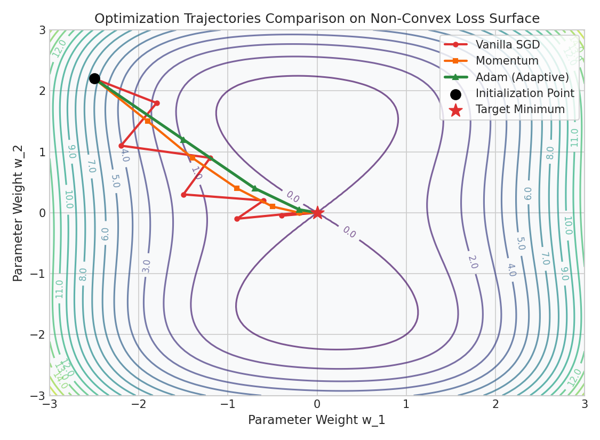

# Deep Learning: Backpropagation & Optimization Algorithms

This guide details the calculus behind backpropagation, walks through a manual backward propagation gradient update step-by-step, and explains Momentum and Adam optimization algorithms.

---

## 1. Backpropagation Calculus (The Chain Rule)

Backpropagation calculates the derivative of the loss function $L$ with respect to each weight and bias in the network by sequentially applying the **multivariable Chain Rule**.

For a single training example ($m=1$) with target $y$ and prediction $a^{[2]} = \hat{y}$, under **Binary Cross-Entropy Loss**:
$$L = -[y \ln(a^{[2]}) + (1 - y) \ln(1 - a^{[2]})]$$

### Output Layer Gradients (Layer 2)
1. **With respect to Pre-Activation ($dZ^{[2]}$):**
   $$dZ^{[2]} = \frac{\partial L}{\partial Z^{[2]}} = \frac{\partial L}{\partial A^{[2]}} \cdot \frac{\partial A^{[2]}}{\partial Z^{[2]}} = \left( -\frac{y}{A^{[2]}} + \frac{1-y}{1-A^{[2]}} \right) \cdot A^{[2]}(1 - A^{[2]}) = A^{[2]} - y$$
2. **With respect to Weights ($dW^{[2]}$):**
   $$dW^{[2]} = \frac{\partial L}{\partial W^{[2]}} = \frac{\partial L}{\partial Z^{[2]}} \cdot \frac{\partial Z^{[2]}}{\partial W^{[2]}} = dZ^{[2]} (A^{[1]})^T$$
3. **With respect to Bias ($db^{[2]}$):**
   $$db^{[2]} = dZ^{[2]}$$

### Hidden Layer Gradients (Layer 1)
1. **With respect to Pre-Activation ($dZ^{[1]}$):**
   $$dZ^{[1]} = \frac{\partial L}{\partial Z^{[1]}} = \frac{\partial L}{\partial Z^{[2]}} \cdot \frac{\partial Z^{[2]}}{\partial A^{[1]}} \cdot \frac{\partial A^{[1]}}{\partial Z^{[1]}} = (W^{[2]})^T dZ^{[2]} \odot g^{[1]\prime}(Z^{[1]})$$
   *(where $\odot$ represents element-wise multiplication and $g^{[1]\prime}$ is the derivative of the hidden activation).*
2. **With respect to Weights ($dW^{[1]}$):**
   $$dW^{[1]} = dZ^{[1]} (A^{[0]})^T = dZ^{[1]} X^T$$
3. **With respect to Bias ($db^{[1]}$):**
   $$db^{[1]} = dZ^{[1]}$$

---

## 2. Step-by-Step Hand Calculations: Backward Pass

Using our values from the forward pass calculation:
- **Inputs and Weights:**
  $$X = \begin{bmatrix} 0.5 \\ -0.2 \end{bmatrix}, \quad W^{[2]} = \begin{bmatrix} 0.5 & 0.8 \end{bmatrix}$$
- **Forward Pass Outputs:**
  $$Z^{[1]} = \begin{bmatrix} 0.21 \\ 0.08 \end{bmatrix}, \quad A^{[1]} = \begin{bmatrix} 0.21 \\ 0.08 \end{bmatrix}, \quad A^{[2]} = 0.4922$$
- **True Label:** $y = 1.0$ (representing positive class target).

---

### Step 1: Compute Output Error Gradient ($dZ^{[2]}$)
$$dZ^{[2]} = A^{[2]} - y = 0.4922 - 1.0 = -0.5078$$

---

### Step 2: Compute Layer 2 Gradients ($dW^{[2]}$, $db^{[2]}$)
$$dW^{[2]} = dZ^{[2]} (A^{[1]})^T = -0.5078 \times \begin{bmatrix} 0.21 & 0.08 \end{bmatrix} = \begin{bmatrix} -0.1066 & -0.0406 \end{bmatrix}$$
$$db^{[2]} = dZ^{[2]} = -0.5078$$

---

### Step 3: Compute Hidden Layer Error Gradient ($dZ^{[1]}$)
Calculate the backpropagated error through $W^{[2]}$:
$$(W^{[2]})^T dZ^{[2]} = \begin{bmatrix} 0.5 \\ 0.8 \end{bmatrix} (-0.5078) = \begin{bmatrix} -0.2539 \\ -0.4062 \end{bmatrix}$$

Multiply element-wise by the derivative of the ReLU activation $g^{[1]\prime}(Z^{[1]})$. Since both $Z_1^{[1]} = 0.21$ and $Z_2^{[1]} = 0.08$ are positive ($>0$), their derivatives are $1.0$:
$$dZ^{[1]} = \begin{bmatrix} -0.2539 \\ -0.4062 \end{bmatrix} \odot \begin{bmatrix} 1.0 \\ 1.0 \end{bmatrix} = \begin{bmatrix} -0.2539 \\ -0.4062 \end{bmatrix}$$

---

### Step 4: Compute Layer 1 Gradients ($dW^{[1]}$, $db^{[1]}$)
Multiply by input $X^T = \begin{bmatrix} 0.5 & -0.2 \end{bmatrix}$:
$$dW^{[1]} = dZ^{[1]} X^T = \begin{bmatrix} -0.2539 \\ -0.4062 \end{bmatrix} \begin{bmatrix} 0.5 & -0.2 \end{bmatrix} = \begin{bmatrix} -0.1270 & 0.0508 \\ -0.2031 & 0.0812 \end{bmatrix}$$
$$db^{[1]} = dZ^{[1]} = \begin{bmatrix} -0.2539 \\ -0.4062 \end{bmatrix}$$

**Conclusion:** The negative gradients indicate that weights and biases must adjust to make the network predict closer to $1.0$.

---

## 3. Optimization Algorithms: Momentum and Adam

Optimizers adjust weights using calculated gradients to find the minimum of the loss function.

### Gradient Descent with Momentum
Standard gradient descent oscillates heavily in steep directions. Momentum smooths this out by adding a velocity factor (exponentially weighted average of prior gradients):
$$v_W = \beta \cdot v_W + (1 - \beta) \cdot dW$$
$$W \leftarrow W - \alpha \cdot v_W$$
- **Intuition:** $\beta$ (typically $0.9$) acts as friction. It accumulates speed down the consistent gradient directions and cancels out orthogonal oscillations.
- **Production Utility / Where it is Helpful:** High utility in standard Convolutional Neural Networks (CNNs) and deep classifiers when trained on extremely clean, balanced tabular datasets. It achieves lower generalization error than Adam but requires more manual learning rate tuning.

### Adam (Adaptive Moment Estimation)
Adam combines **Momentum** (first moment) and **RMSprop** (second raw moment) to compute individual adaptive learning rates for each parameter:
1. **First Moment (Mean):** $v_W = \beta_1 v_W + (1 - \beta_1) dW$
2. **Second Moment (Uncentered Variance):** $s_W = \beta_2 s_W + (1 - \beta_2) dW^2$
3. **Bias Correction:** 
   $$v_W^{\text{corrected}} = \frac{v_W}{1 - \beta_1^t}, \quad s_W^{\text{corrected}} = \frac{s_W}{1 - \beta_2^t}$$
4. **Update:** 
   $$W \leftarrow W - \frac{\alpha}{\sqrt{s_W^{\text{corrected}}} + \epsilon} v_W^{\text{corrected}}$$
- **Intuition:** Parameters with large, volatile gradients see their updates scaled down (via the denominator $\sqrt{s_W}$), while stable parameters keep moving quickly, preventing divergence. Default hyperparameter standards: $\beta_1 = 0.9$, $\beta_2 = 0.999$, $\epsilon = 10^{-8}$.
- **Production Utility / Where it is Helpful:** The industry standard for **Transformers, LLMs, and highly multi-modal architectures** (e.g. text + audio embeddings). Since features in text are highly sparse (e.g., rare words have infrequent gradient updates), Adam's adaptive step-scaling ensures rare features receive large enough weight updates while frequent features remain stable, stabilizing multi-modal training curves.

### Diagnostic Visual (Optimization Trajectories)
The trajectory plot illustrates how Adam adapts to the saddle surface and converges directly to the minimum, while vanilla SGD oscillates heavily:

---

## 4. Interactive Practice Notebook
To see this backpropagation matrix math and Adam optimizer written in code, check out:
- [01_mlp_from_scratch_numpy.ipynb](file:///d:/Study/Prep/machine-learning-prep/deep-learning-foundations/01_mlp_from_scratch_numpy.ipynb)
