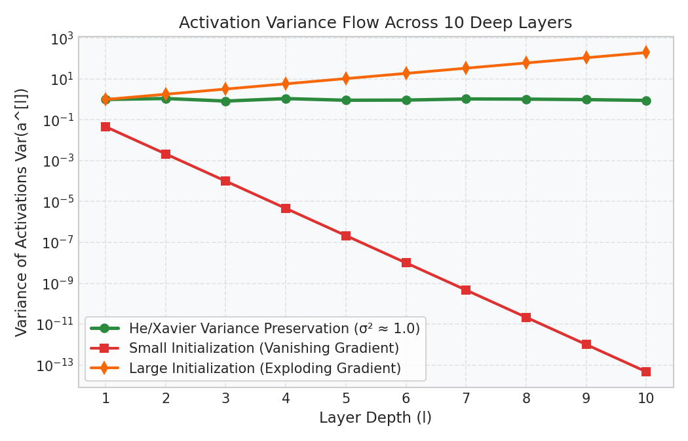

# Deep Learning: Weight Initialization & Regularization

This guide details the mathematical foundations of weight initialization (Xavier/He), $L_2$ regularization (Weight Decay), Inverted Dropout, and Batch Normalization.

---

## 1. Weight Initialization and Variance Scaling

Improper weight initialization leads to vanishing or exploding gradients in deep networks. 

- If weights are initialized too small (e.g., standard deviation $0.01$ in a 10-layer net), activation variance decays to exactly $0.0$ at the output layer, causing gradients to vanish.
- If weights are initialized too large, activation variance explodes to infinity, causing gradients to overflow.

### Xavier (Glorot) Initialization
Designed for **Sigmoid** and **Tanh** activation functions. It scales the weight variance to match input and output distributions:
$$\text{Var}(W) = \frac{2}{n_{\text{in}} + n_{\text{out}}} \quad \text{or} \quad W_{ij} \sim \mathcal{N}\left(0, \frac{1}{n_{\text{in}}}\right)$$

### He (Kaiming) Initialization
Designed for **ReLU** and **LeakyReLU** activations. Since ReLU discards half of its negative input space, He doubling the variance multiplier to maintain signal flow:
$$\text{Var}(W) = \frac{2}{n_{\text{in}}} \quad \text{or} \quad W_{ij} \sim \mathcal{N}\left(0, \frac{2}{n_{\text{in}}}\right)$$

### Diagnostic Visual (Gradient Flow & Variance)
The plot below illustrates how standard small initialization causes variance to vanish immediately, while He initialization maintains a stable variance of $1.0$ across 10 deep layers:

---

## 2. Regularization Math

### $L_2$ Regularization (Weight Decay)
$L_2$ regularization adds a quadratic penalty to the loss function to shrink weights toward zero, reducing model complexity:
$$L_{\text{reg}} = L + \frac{\lambda}{2m} \sum_{l=1}^L \sum_{i} \sum_{j} \left( W_{i,j}^{[l]} \right)^2$$

When taking a gradient step, this penalty alters the weight update formula:
$$\frac{\partial L_{\text{reg}}}{\partial W^{[l]}} = \frac{\partial L}{\partial W^{[l]}} + \frac{\lambda}{m} W^{[l]}$$
$$W^{[l]} \leftarrow W^{[l]} - \alpha \left( dW^{[l]} + \frac{\lambda}{m} W^{[l]} \right) = W^{[l]} \left( 1 - \frac{\alpha \lambda}{m} \right) - \alpha \cdot dW^{[l]}$$
- **Intuition:** Before applying the gradient update, the weights are multiplied by a decay factor $\left(1 - \frac{\alpha\lambda}{m}\right)$ which is slightly less than $1.0$, giving rise to the term **Weight Decay**.

---

### Inverted Dropout
Dropout randomly deactivates a fraction $1-p$ of activations during training to prevent neuron co-dependency. 

In production environments, we use **Inverted Dropout** to keep the forward pass scaling identical during training and evaluation:
1. **Mask Generation:** Generate a binary mask $D^{[l]}$ of shape $A^{[l]}$ where elements are $1$ with probability $p$, and $0$ otherwise.
2. **Deactivation:** Apply the mask to layer activations: $A^{[l]} = A^{[l]} \odot D^{[l]}$.
3. **Inverted Scaling:** Divide activations by $p$:
   $$A^{[l]} \leftarrow \frac{A^{[l]}}{p}$$
- **Intuition:** Dividing by $p$ scales the remaining active neurons back up to preserve the expected activation value. This eliminates the need to scale weights or activations during inference/evaluation, making evaluation deterministic.

---

## 3. Batch Normalization: Math & Serving Shifts

Batch Normalization stabilizes training by normalizing the inputs to each layer for each mini-batch, reducing internal covariate shift.

### The Batch Norm Transform (For a Mini-Batch $\mathcal{B}$)
1. **Compute Batch Mean:** $\mu_{\mathcal{B}} = \frac{1}{m_{\mathcal{B}}} \sum_{i=1}^{m_{\mathcal{B}}} x_i$
2. **Compute Batch Variance:** $\sigma_{\mathcal{B}}^2 = \frac{1}{m_{\mathcal{B}}} \sum_{i=1}^{m_{\mathcal{B}}} (x_i - \mu_{\mathcal{B}})^2$
3. **Normalize:** $\hat{x}_i = \frac{x_i - \mu_{\mathcal{B}}}{\sqrt{\sigma_{\mathcal{B}}^2 + \epsilon}}$
4. **Scale and Shift:** $y_i = \gamma \hat{x}_i + \beta$
   - $\gamma$ and $\beta$ are learnable parameters that allow the network to undo the normalization if a non-zero mean or specific variance is optimal.

### Training vs. Evaluation Serving Shifts
- **Training Mode:** The mean $\mu_{\mathcal{B}}$ and variance $\sigma_{\mathcal{B}}^2$ are calculated directly on the current mini-batch. Simultaneously, PyTorch maintains running averages of the mean and variance using exponentially weighted moving averages:
  $$\mu_{\text{running}} = (1 - \text{momentum}) \cdot \mu_{\text{running}} + \text{momentum} \cdot \mu_{\mathcal{B}}$$
  $$\sigma^2_{\text{running}} = (1 - \text{momentum}) \cdot \sigma^2_{\text{running}} + \text{momentum} \cdot \sigma^2_{\mathcal{B}}$$
- **Evaluation Mode (`model.eval()`):** Mini-batch statistics are frozen. The model normalizes activations using the fixed $\mu_{\text{running}}$ and $\sigma^2_{\text{running}}$, making inference predictions deterministic and independent of batch size.
