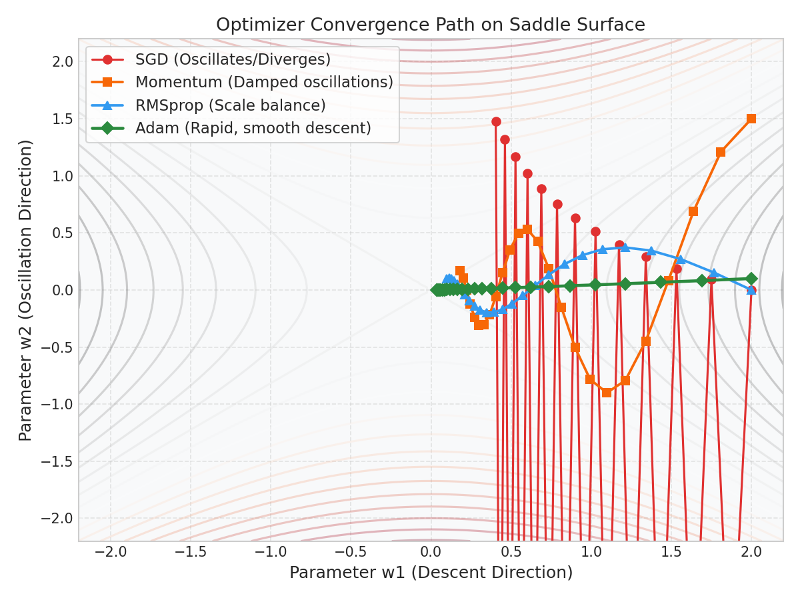

# Deep Learning: Optimizers & Adaptive Learning

This guide outlines the mathematical progression from SGD to Adam, explaining how exponential moving averages (EMA) of gradients and adaptive learning rates stabilize non-convex optimization.

---

## 1. The Optimizer Progression

### 1. Stochastic Gradient Descent (SGD)
The basic update adjusts weights in the direction of the local negative gradient:
$$W_t = W_{t-1} - \alpha \cdot dW$$

- **The Oscillation Issue:** If the loss surface is highly asymmetric (e.g., a ravine with steep sides and a gentle slope), SGD will oscillate wildly between the steep walls, making slow progress toward the minimum along the gentle slope.

---

### 2. SGD with Momentum (EMA of First Moments)
To dampen oscillations, Momentum accumulates a running average of past gradients:
$$v_t = \beta_1 v_{t-1} + (1 - \beta_1) dW$$
$$W_t = W_{t-1} - \alpha \cdot v_t$$

- **Intuition:** Think of a heavy ball rolling down a valley. Momentum (velocity $v_t$) carries the ball forward, reinforcing steps in consistent directions while averaging out alternating vertical oscillations.
- $\beta_1$ (usually $0.9$) controls the memory window of the moving average.

---

### 3. RMSprop (EMA of Second Moments)
RMSprop scales step sizes independently for each parameter based on the magnitude of recent gradients:
$$s_t = \beta_2 s_{t-1} + (1 - \beta_2) dW^2$$
$$W_t = W_{t-1} - \alpha \cdot \frac{dW}{\sqrt{s_t + \epsilon}}$$

- **Intuition:** If the gradient along dimension $j$ is very large (causing oscillations), $s_{tj}$ grows, shrinking the effective learning rate. If the gradient along another dimension is small, $s_{tj}$ remains small, allowing a larger step size.
- $\epsilon$ (usually $10^{-8}$) prevents division by zero.

---

## 2. Adam: Combining Momentum and RMSprop

Adam (Adaptive Moment Estimation) tracks both velocity (first moment $v_t$) and squared gradient variance (second moment $s_t$).

### Bias Corrections
In early training iterations ($t \approx 1$), $v_t$ and $s_t$ are initialized to zero, causing them to be heavily biased toward zero. Adam corrects this bias:
$$\hat{v}_t = \frac{v_t}{1 - \beta_1^t}, \quad \hat{s}_t = \frac{s_t}{1 - \beta_2^t}$$

As $t \to \infty$, the terms $\beta_1^t \to 0$ and $\beta_2^t \to 0$, rendering the bias correction inactive.

### Final Adam Update Equation:
$$W_t = W_{t-1} - \alpha \cdot \frac{\hat{v}_t}{\sqrt{\hat{s}_t} + \epsilon}$$

Standard parameters in production: $\alpha = 0.001$, $\beta_1 = 0.9$, $\beta_2 = 0.999$, $\epsilon = 10^{-8}$.

---

## 3. Visualization of Trajectories

The plot below shows convergence paths navigating a saddle point. Notice how **SGD** oscillates wildly along the steep y-axis, while **Adam** converges directly along the optimal trajectory:

---

## 4. Interactive Practice Notebook
To see custom optimizer loops in NumPy and compare convergence paths, open:
- [04_optimizers_momentum_and_adam.ipynb](file:///d:/Study/Prep/machine-learning-prep/deep-learning-foundations/04_optimizers_momentum_and_adam.ipynb)
