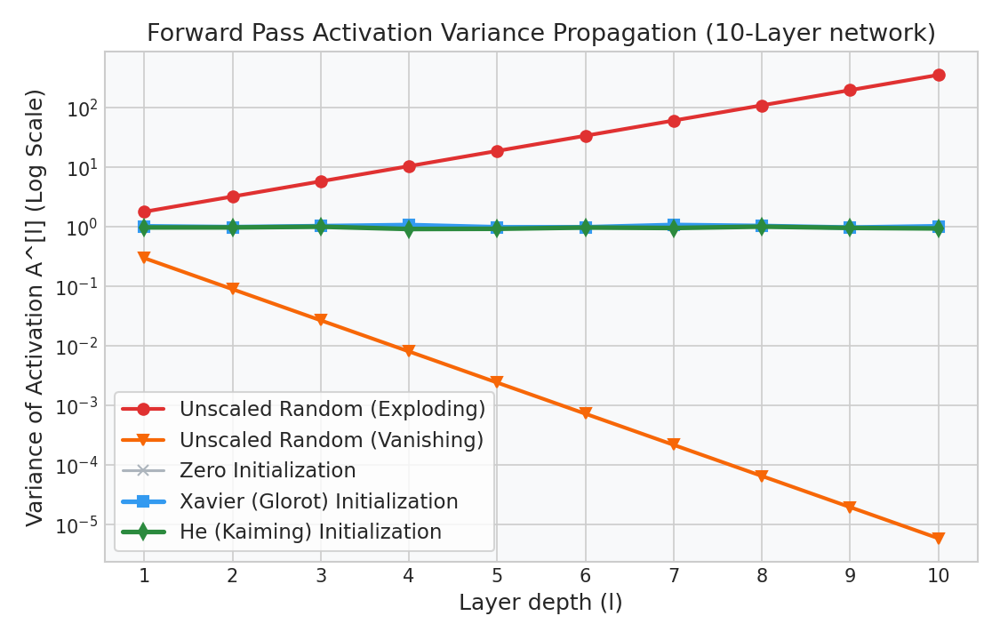

# Deep Learning: Weight Initialization & Variance Scaling

This guide details the mathematical derivation of Xavier (Glorot) and He (Kaiming) weight initializations, proving how maintaining signal variance across layers prevents vanishing or exploding gradients.

---

## 1. Why Initialization Matters

If weights are initialized improperly:
- **Weights Too Small:** The variance of activations decays exponentially toward zero as signals flow forward through layers. During the backward pass, gradients shrink to zero, halting learning.
- **Weights Too Large:** The variance of activations grows exponentially as signals propagate forward, saturating activation functions (like Sigmoid/Tanh) or causing numerical overflow (`NaN` loss) in ReLU.

---

## 2. Derivation of Variance Conservation

Let's analyze a single linear hidden unit $z_i^{[l]} = \sum_{j=1}^{n_{l-1}} w_{ij} a_j^{[l-1]} + b^{[l]}$. 

### Assumptions:
1. Weights $w_{ij}$ are independent and identically distributed (i.i.d.) with mean $\mathbb{E}[w] = 0$ and variance $\text{Var}(w)$.
2. Inputs $a_j^{[l-1]}$ are i.i.d. with mean $\mathbb{E}[a] = 0$ and variance $\text{Var}(a^{[l-1]})$.
3. Weights and inputs are mutually independent.
4. Biases $b^{[l]}$ are initialized to $0.0$.

### The Variance Step:
$$\text{Var}(z_i^{[l]}) = \text{Var}\left( \sum_{j=1}^{n_{l-1}} w_{ij} a_j^{[l-1]} \right) = \sum_{j=1}^{n_{l-1}} \text{Var}(w_{ij} a_j^{[l-1]})$$

Since $w$ and $a$ are independent with zero mean, the variance of their product is:
$$\text{Var}(w_{ij} a_j^{[l-1]}) = \mathbb{E}[w^2 a^2] - (\mathbb{E}[w a])^2 = \text{Var}(w) \text{Var}(a^{[l-1]})$$

Substituting this back into the sum:
$$\text{Var}(z_i^{[l]}) = n_{l-1} \cdot \text{Var}(w) \cdot \text{Var}(a^{[l-1]})$$

### The Conservation Condition:
To prevent signals from vanishing or exploding as they propagate through layers, we want the variance of the activation to remain constant: $\text{Var}(z_i^{[l]}) = \text{Var}(a^{[l-1]})$.

Substituting this target into our equation:
$$\text{Var}(a^{[l-1]}) = n_{l-1} \cdot \text{Var}(w) \cdot \text{Var}(a^{[l-1]})$$

Dividing both sides by $\text{Var}(a^{[l-1]})$:
$$\text{Var}(w) = \frac{1}{n_{l-1}}$$

---

## 3. Xavier vs. He Initializations

### Xavier (Glorot) Initialization (for Tanh / Linear)
Designed for symmetric activations (Tanh/Sigmoid) centered at zero. Averaging the input dimension ($n_{l-1}$) and output dimension ($n_l$) yields:

$$\text{Var}(w) = \frac{2}{n_{l-1} + n_l}$$

Weights are sampled from a normal distribution:
$$W^{[l]} \sim \mathcal{N}\left( 0, \, \sqrt{\frac{2}{n_{l-1} + n_l}} \right)$$

---

### He (Kaiming) Initialization (for ReLU)
ReLU activations ($a_j^{[l]} = \max(0, z_j^{[l]})$) zero out half of the negative signals. For symmetric inputs with mean zero, this cuts the variance of the outputs in half: $\text{Var}(a^{[l-1]}) = \frac{1}{2} \text{Var}(z^{[l-1]})$.

To maintain variance parity, we must double the weight variance:

$$\text{Var}(w) = \frac{2}{n_{l-1}}$$

Weights are sampled from:
$$W^{[l]} \sim \mathcal{N}\left( 0, \, \sqrt{\frac{2}{n_{l-1}}} \right)$$

---

## 4. Activation Variance Propagation Visual

The chart below shows how signal variance behaves across a 10-layer network under different initializations. Notice how **Xavier** and **He** preserve the variance floor, whereas unscaled initializations either explode or vanish:

---

## 5. Interactive Practice Notebook
To simulate signal variance decay and test Xavier vs. He initializations in PyTorch, open:
- [05_initialization_and_normalization.ipynb](file:///d:/Study/Prep/machine-learning-prep/deep-learning-foundations/05_initialization_and_normalization.ipynb)
