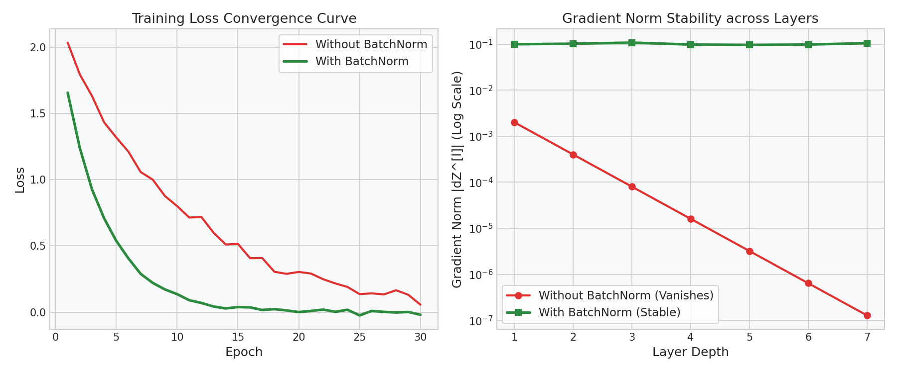

# Deep Learning: Normalization Techniques

This guide details the mechanics of Batch Normalization, Layer Normalization, and their production deployment properties.

---

## 1. Normalization Operations

Normalization stabilizes training by centering and scaling activation distributions at intermediate layers.

```text
  Batch Normalization (BatchNorm)         Layer Normalization (LayerNorm)
      Batch Size (m)                         Batch Size (m)
     +---+---+---+---+                      +---+---+---+---+
   f |   |   |   |   | (Normalize       f |===|===|===|===| (Normalize
   e |   |   |   |   |  down columns    e |===|===|===|===|  across features
   a |   |   |   |   |  per feature)    a |===|===|===|===|  per instance)
   t |   |   |   |   |                  t |===|===|===|===|
     +---+---+---+---+                      +---+---+---+---+
```

---

## 2. Batch Normalization (BatchNorm)

### The Mathematics (for a mini-batch $\mathcal{B} = \{x_1 \dots x_m\}$):
1. **Mini-Batch Mean:**
   $$\mu_{\mathcal{B}} = \frac{1}{m} \sum_{i=1}^m x_i$$
2. **Mini-Batch Variance:**
   $$\sigma_{\mathcal{B}}^2 = \frac{1}{m} \sum_{i=1}^m (x_i - \mu_{\mathcal{B}})^2$$
3. **Normalize:**
   $$\hat{x}_i = \frac{x_i - \mu_{\mathcal{B}}}{\sqrt{\sigma_{\mathcal{B}}^2 + \epsilon}}$$
4. **Scale and Shift:**
   $$\tilde{y}_i = \gamma \hat{x}_i + \beta$$
   *Where $\gamma$ (scale) and $\beta$ (shift) are learnable parameters adjusted during backpropagation.*

### Train vs. Eval Mode Behavior
This is a high-frequency systems design interview question:
- **`model.train()` (Training Mode):**
  - BatchNorm calculates $\mu_{\mathcal{B}}$ and $\sigma_{\mathcal{B}}^2$ using *only* the current mini-batch.
  - It maintains a running exponential moving average (EMA) of the global mean and variance:
    $$\mu_{\text{running}} \leftarrow (1 - \text{momentum}) \cdot \mu_{\text{running}} + \text{momentum} \cdot \mu_{\mathcal{B}}$$
    $$\sigma^2_{\text{running}} \leftarrow (1 - \text{momentum}) \cdot \sigma^2_{\text{running}} + \text{momentum} \cdot \sigma^2_{\mathcal{B}}$$
- **`model.eval()` (Evaluation/Inference Mode):**
  - Calculating batch-level statistics during single-sample inference is impossible ($m=1$).
  - BatchNorm freezes $\gamma$ and $\beta$, and uses the pre-computed $\mu_{\text{running}}$ and $\sigma^2_{\text{running}}$ to normalize test samples. This ensures predictions remain deterministic and independent of batch size.

---

## 3. Layer Normalization (LayerNorm)

Layer Normalization calculates mean and variance statistics across all features **for a single training instance**:

$$\mu_i = \frac{1}{D} \sum_{j=1}^D x_{ij}, \quad \sigma_i^2 = \frac{1}{D} \sum_{j=1}^D (x_{ij} - \mu_i)^2$$

- **Independence:** LayerNorm is completely independent of the mini-batch size.
- **Transformer standard:** Essential for sequence modeling (LSTMs, Transformers) where sequence lengths vary dynamically across samples.

---

## 4. BatchNorm Stabilization Visual

The subplots below demonstrate the impact of Batch Normalization on convergence. Notice the accelerated training loss reduction and the stable gradient norms across layers compared to unnormalized models:



---

## 5. Interactive Practice Notebook
To check BatchNorm vs. LayerNorm activation scaling and train vs. eval steps, open:
- [05_initialization_and_normalization.ipynb](file:///d:/Study/Prep/machine-learning-prep/deep-learning-foundations/05_initialization_and_normalization.ipynb)
