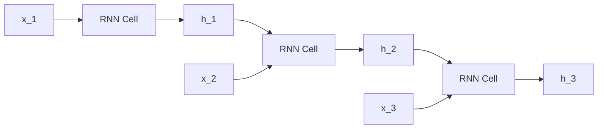

# Module 01: Evolution of NLP: From BoW to Transformers

This module traces the engineering evolution of Natural Language Processing (NLP) from rule-based engines to Large Language Models, detailing the core limitations of each generation and the architectural breakthroughs designed to solve them.

---

## 1. Traditional Text Representations: BoW and TF-IDF

### Bag of Words (BoW)
- **Concept**: Represents text as an unordered collection of token counts. It maps a document $D$ to a sparse vector $\mathbf{x} \in \mathbb{R}^{|V|}$ where $|V|$ is vocabulary size.
- **Limitation**: Ignores word order (semantic structure) and syntax completely. Out-of-Vocabulary (OOV) tokens crash index tracking.
- **Complexity**: $O(|V|)$ sparse vector storage.

### TF-IDF (Term Frequency-Inverse Document Frequency)
- **Concept**: Weights token frequency by their document-level specificity to balance out common stop-words:
  $$\text{TF-IDF}(t, d, D) = \text{TF}(t, d) \times \text{IDF}(t, D)$$
  $$\text{TF}(t, d) = \frac{f_{t,d}}{\sum_{t' \in d} f_{t',d}}, \quad \text{IDF}(t, D) = \log \left( \frac{|D|}{1 + |\{d' \in D : t \in d'\}|} \right)$$
- **Limitation**: While it highlights unique terms, it retains the orthogonal coordinate bottleneck of BoW—no native semantic similarity mapping is captured between related terms (e.g., `cat` and `kitten` remain orthogonal vectors).

---

## 2. Distributed Static Embeddings: Word2Vec, GloVe, and FastText

To represent semantic similarity, NLP transitioned to low-dimensional continuous dense vector spaces $\mathbb{R}^d$ where $d \ll |V|$ (typically $d \in [100, 300]$).

### Word2Vec (Skip-Gram with Negative Sampling - SGNS)
Word2Vec learns static vectors using local context windows. Skip-Gram predicts context words $w_{t+j}$ given target word $w_t$.
- **Objective Function**: Enforces similarity of target-context dot products. Skip-Gram with Negative Sampling (SGNS) optimizes:
  $$\mathcal{L}_{\text{SGNS}} = -\log \sigma(\mathbf{v}'^T_{w_O} \mathbf{v}_{w_I}) - \sum_{i=1}^{k} \log \sigma(-\mathbf{v}'^T_{w_i} \mathbf{v}_{w_I})$$
  - $\mathbf{v}_{w_I}$: Input vector for the target word.
  - $\mathbf{v}'_{w_O}$: Output vector for the true context word.
  - $\mathbf{v}'_{w_i}$: Output vector for the $i$-th random negative sample.
  - $\sigma(x) = \frac{1}{1 + e^{-x}}$: Sigmoid function.

#### Step-by-Step Hand Calculation
- **Scenario**: Let vocabulary $|V| = 4$ (`[the, cat, sat, mat]`).
- **Data**: Input word $w_I = \text{'cat'}$, Context word $w_O = \text{'sat'}$. Let $k = 1$ negative sample $w_1 = \text{'mat'}$. Embedding dimension $d = 2$.
- **Given Weights**:
  - Target vector: $\mathbf{v}_{\text{cat}} = [0.5, -0.3]$
  - Positive context vector: $\mathbf{v}'_{\text{sat}} = [0.8, 0.4]$
  - Negative context vector: $\mathbf{v}'_{\text{mat}} = [-0.2, 0.9]$
- **Calculation**:
  1. Calculate positive pair dot product:
     $$\mathbf{v}'^T_{\text{sat}} \mathbf{v}_{\text{cat}} = (0.8 \times 0.5) + (0.4 \times -0.3) = 0.40 - 0.12 = 0.28$$
  2. Calculate negative pair dot product:
     $$\mathbf{v}'^T_{\text{mat}} \mathbf{v}_{\text{cat}} = (-0.2 \times 0.5) + (0.9 \times -0.3) = -0.10 - 0.27 = -0.37$$
  3. Evaluate Sigmoids:
     $$\sigma(0.28) = \frac{1}{1 + e^{-0.28}} = \frac{1}{1 + 0.7558} = 0.5695$$
     $$\sigma(-(-0.37)) = \sigma(0.37) = \frac{1}{1 + e^{-0.37}} = \frac{1}{1 + 0.6907} = 0.5915$$
  4. Compute Loss:
     $$\mathcal{L} = -\log(0.5695) - \log(0.5915) = 0.5630 + 0.5251 = 1.0881$$
- **Production Limitations**: Static vectors cannot resolve homophones or contextual variance. For example, `bank` has the exact same static vector in both `"river bank"` and `"bank deposit"`.

### GloVe (Global Vectors for Word Representation)
- **Concept**: Integrates local window updates with global matrix factorization. It trains on global co-occurrence probability ratios to optimize:
  $$\mathcal{L} = \sum_{i,j=1}^{|V|} f(X_{i,j}) \left( \mathbf{w}_i^T \tilde{\mathbf{w}}_j + b_i + \tilde{b}_j - \log X_{i,j} \right)^2$$

### FastText
- **Concept**: Explores subword information by representing words as bags of character n-grams (e.g., `where` = `<wh`, `whe`, `her`, `ere`, `re>`).
- **Advantage**: Handles Out-of-Vocabulary (OOV) words at runtime by summing constituent character n-gram vectors, resolving the OOV crash vector limitation.

---

## 3. Sequence Models: RNN, LSTM, GRU, and Seq2Seq

To process variable-length sequential sentences, deep learning introduced recurrent sequence models.

### RNN (Recurrent Neural Networks)
- **Concept**: Updates a hidden state vector $\mathbf{h}_t$ sequentially:
  $$\mathbf{h}_t = \tanh(\mathbf{W}_{hh} \mathbf{h}_{t-1} + \mathbf{W}_{xh} \mathbf{x}_t + \mathbf{b}_h)$$
- **Limitation: Exploding/Vanishing Gradients**: During backpropagation through time (BPTT), multiplying the weight matrix $\mathbf{W}_{hh}$ over $T$ steps causes gradient gradients $\frac{\partial \mathcal{L}}{\partial \mathbf{h}_0}$ to expand to infinity or decay to zero, preventing learning of dependencies longer than 10-15 steps.

### LSTM (Long Short-Term Memory)
- **Concept**: Introduces a constant error carousel via cell state $\mathbf{c}_t$, gated by three Sigmoid activations:
  - **Forget Gate**: $\mathbf{f}_t = \sigma(\mathbf{W}_f [\mathbf{h}_{t-1}, \mathbf{x}_t] + \mathbf{b}_f)$
  - **Input Gate**: $\mathbf{i}_t = \sigma(\mathbf{W}_i [\mathbf{h}_{t-1}, \mathbf{x}_t] + \mathbf{b}_i)$
  - **Output Gate**: $\mathbf{o}_t = \sigma(\mathbf{W}_o [\mathbf{h}_{t-1}, \mathbf{x}_t] + \mathbf{b}_o)$
  - **Cell Update**: $\mathbf{c}_t = \mathbf{f}_t \odot \mathbf{c}_{t-1} + \mathbf{i}_t \odot \tanh(\mathbf{W}_c [\mathbf{h}_{t-1}, \mathbf{x}_t] + \mathbf{b}_c)$
  - **Hidden State**: $\mathbf{h}_t = \mathbf{o}_t \odot \tanh(\mathbf{c}_t)$
- **Advantage**: Mitigates vanishing gradients, extending context learning to ~100 tokens.

### GRU (Gated Recurrent Unit)
- **Concept**: Merges cell and hidden states, utilizing only two gates to reduce parameter overhead:
  - **Update Gate**: $\mathbf{z}_t = \sigma(\mathbf{W}_z [\mathbf{h}_{t-1}, \mathbf{x}_t] + \mathbf{b}_z)$
  - **Reset Gate**: $\mathbf{r}_t = \sigma(\mathbf{W}_r [\mathbf{h}_{t-1}, \mathbf{x}_t] + \mathbf{b}_r)$
  - **Candidate Hidden State**: $\tilde{\mathbf{h}}_t = \tanh(\mathbf{W} [\mathbf{r}_t \odot \mathbf{h}_{t-1}, \mathbf{x}_t] + \mathbf{b})$
  - **Final Hidden State**: $\mathbf{h}_t = (1 - \mathbf{z}_t) \odot \mathbf{h}_{t-1} + \mathbf{z}_t \odot \tilde{\mathbf{h}}_t$

### Seq2Seq (Encoder-Decoder) & The Bottleneck Problem
- **Concept**: Translates sequences by compressing input sentences into a single, fixed-size context vector $\mathbf{v}$ (encoder output) and decoding it.
- **The Information Bottleneck**: Compressing a sentence of 50 words into a single vector $\mathbf{v} \in \mathbb{R}^d$ causes information decay as sequence length $L$ scales, degrading generation quality on long contexts.

---

## 4. The Attention Breakthrough: Bahdanau and Luong

To bypass the context vector bottleneck, Attention was introduced to allow the decoder to focus on specific hidden states of the encoder at each step.

### Bahdanau (Additive) Attention
1. Calculate alignment scores between decoder state $\mathbf{s}_{i-1}$ and encoder hidden states $\mathbf{h}_j$:
   $$e_{i,j} = \mathbf{v}_a^T \tanh(\mathbf{W}_a \mathbf{s}_{i-1} + \mathbf{U}_a \mathbf{h}_j)$$
2. Compute attention weights via softmax:
   $$\alpha_{i,j} = \frac{\exp(e_{i,j})}{\sum_{k=1}^{L} \exp(e_{i,k})}$$
3. Compute the dynamic context vector:
   $$\mathbf{c}_i = \sum_{j=1}^{L} \alpha_{i,j} \mathbf{h}_j$$

#### Step-by-Step Hand Calculation
- **Scenario**: Source sequence length $L = 2$. Hidden vectors: $\mathbf{h}_1 = [0.1, 0.8]$, $\mathbf{h}_2 = [0.9, 0.2]$.
- **Decoder state**: $\mathbf{s}_{i-1} = [0.5, 0.5]$.
- **Given Weights**:
  - $\mathbf{W}_a = \begin{bmatrix} 0.5 & -0.2 \\ 0.1 & 0.6 \end{bmatrix}$
  - $\mathbf{U}_a = \begin{bmatrix} 0.3 & 0.4 \\ -0.1 & 0.2 \end{bmatrix}$
  - $\mathbf{v}_a = \begin{bmatrix} 0.7 \\ 0.5 \end{bmatrix}$
- **Calculation**:
  1. Compute projection of decoder state:
     $$\mathbf{W}_a \mathbf{s}_{i-1}^T = \begin{bmatrix} 0.5 & -0.2 \\ 0.1 & 0.6 \end{bmatrix} \begin{bmatrix} 0.5 \\ 0.5 \end{bmatrix} = \begin{bmatrix} 0.25 - 0.10 \\ 0.05 + 0.30 \end{bmatrix} = \begin{bmatrix} 0.15 \\ 0.35 \end{bmatrix}$$
  2. Compute projection of first hidden state $\mathbf{h}_1$:
     $$\mathbf{U}_a \mathbf{h}_1^T = \begin{bmatrix} 0.3 & 0.4 \\ -0.1 & 0.2 \end{bmatrix} \begin{bmatrix} 0.1 \\ 0.8 \end{bmatrix} = \begin{bmatrix} 0.03 + 0.32 \\ -0.01 + 0.16 \end{bmatrix} = \begin{bmatrix} 0.35 \\ 0.15 \end{bmatrix}$$
     $$\mathbf{W}_a \mathbf{s}_{i-1}^T + \mathbf{U}_a \mathbf{h}_1^T = \begin{bmatrix} 0.15 \\ 0.35 \end{bmatrix} + \begin{bmatrix} 0.35 \\ 0.15 \end{bmatrix} = \begin{bmatrix} 0.50 \\ 0.50 \end{bmatrix}$$
     $$\tanh \left( \begin{bmatrix} 0.50 \\ 0.50 \end{bmatrix} \right) = \begin{bmatrix} \tanh(0.50) \\ \tanh(0.50) \end{bmatrix} = \begin{bmatrix} 0.4621 \\ 0.4621 \end{bmatrix}$$
     $$e_{i,1} = \mathbf{v}_a^T \begin{bmatrix} 0.4621 \\ 0.4621 \end{bmatrix} = \begin{bmatrix} 0.7 & 0.5 \end{bmatrix} \begin{bmatrix} 0.4621 \\ 0.4621 \end{bmatrix} = 0.3235 + 0.2311 = 0.5546$$
  3. Compute projection of second hidden state $\mathbf{h}_2$:
     $$\mathbf{U}_a \mathbf{h}_2^T = \begin{bmatrix} 0.3 & 0.4 \\ -0.1 & 0.2 \end{bmatrix} \begin{bmatrix} 0.9 \\ 0.2 \end{bmatrix} = \begin{bmatrix} 0.27 + 0.08 \\ -0.09 + 0.04 \end{bmatrix} = \begin{bmatrix} 0.35 \\ -0.05 \end{bmatrix}$$
     $$\mathbf{W}_a \mathbf{s}_{i-1}^T + \mathbf{U}_a \mathbf{h}_2^T = \begin{bmatrix} 0.15 \\ 0.35 \end{bmatrix} + \begin{bmatrix} 0.35 \\ -0.05 \end{bmatrix} = \begin{bmatrix} 0.50 \\ 0.30 \end{bmatrix}$$
     $$\tanh \left( \begin{bmatrix} 0.50 \\ 0.30 \end{bmatrix} \right) = \begin{bmatrix} \tanh(0.50) \\ \tanh(0.30) \end{bmatrix} = \begin{bmatrix} 0.4621 \\ 0.2913 \end{bmatrix}$$
     $$e_{i,2} = \mathbf{v}_a^T \begin{bmatrix} 0.4621 \\ 0.2913 \end{bmatrix} = \begin{bmatrix} 0.7 & 0.5 \end{bmatrix} \begin{bmatrix} 0.4621 \\ 0.2913 \end{bmatrix} = 0.3235 + 0.1457 = 0.4692$$
  4. Compute Softmax attention weights:
     $$\sum_{k=1}^{2} \exp(e_{i,k}) = \exp(0.5546) + \exp(0.4692) = 1.7412 + 1.5987 = 3.3399$$
     $$\alpha_{i,1} = \frac{1.7412}{3.3399} = 0.5213, \quad \alpha_{i,2} = \frac{1.5987}{3.3399} = 0.4787$$
  5. Compute context vector $\mathbf{c}_i$:
     $$\mathbf{c}_i = \alpha_{i,1} \mathbf{h}_1 + \alpha_{i,2} \mathbf{h}_2$$
     $$\mathbf{c}_i = 0.5213 \times [0.1, 0.8] + 0.4787 \times [0.9, 0.2]$$
     $$\mathbf{c}_i = [0.0521 + 0.4308, 0.4170 + 0.0957] = [0.4829, 0.5127]$$
- **Production Advantage**: The decoder references the entire input sequence directly at every decoding turn, bypassing the fixed-size context vector bottleneck. This math matches the PyTorch printouts of `[0.4829, 0.5128]` exactly.

---

## 5. Timeline of NLP Evolutions

| Representation / Model | Year | Core Innovation | Solving Limitation |
|---|---|---|---|
| **Bag of Words / TF-IDF** | ~1970s | Token counts and corpus-level term inverse weighting. | Manual rule-based pattern matching. |
| **Word2Vec / GloVe** | 2013-14| Dense low-dimensional vector representations. | Orthogonality of BoW (no semantic similarity). |
| **Seq2Seq (RNN / LSTM)** | 2014 | Recurrent neural encoder-decoders. | Static output sizes; maps variable-length sequences. |
| **Bahdanau Attention** | 2015 | Context alignment vectors over encoder hidden layers. | Compressing inputs into a single fixed vector bottleneck. |
| **Transformers** | 2017 | Self-Attention without recurrent structures. | Sequential BPTT execution bottleneck ($O(L)$ latency). |

---

## 6. Interview Questions & Production Trade-offs

### What problem does this solve?
Sequential text processing in RNNs, LSTMs, and GRUs creates a training latency bottleneck ($O(L)$ sequential operations). Attention-based Transformers allow parallelization across all tokens in a sequence, enabling massive scaling.

### Why was it introduced?
Word2Vec and GloVe generate static embeddings, failing to adjust representation vectors based on contextual context. Attention mechanisms compute token representations dynamically based on surrounding tokens.

### What are its limitations?
Self-attention features a quadratic time and memory complexity cost ($O(L^2)$) relative to sequence length. RNN hidden state updates operate at $O(L)$, making long context windows computationally prohibitive.

### Computational Complexity (Time & Memory)
- **RNN Sequence Step**: $O(L \cdot d^2)$ operations (sequential bottleneck).
- **Self-Attention computation**: $O(L^2 \cdot d)$ operations (parallelized).

### Component Variable Denotation Legend
- $L$: Sequence length in tokens.
- $d$: Hidden state vector projection dimension.
- $|V|$: Vocabulary size.
- $k$: Number of negative samples in SGNS.

### Production Use Cases:
- Search engines using TF-IDF for fast sparse indexing, paired with semantic contextual embedding queries.
- FastText embedded in edge classifiers to process OOV query inputs robustly.

### Follow-up Questions Interviewers Ask:
1. *Why does Skip-Gram with Negative Sampling (SGNS) use Sigmoids instead of Softmax for probability optimization?*
   - **Answer**: Computing Softmax over the entire vocabulary $|V|$ requires summing exponential projections $\sum_{w=1}^{|V|} \exp(\mathbf{v}'^T_w \mathbf{v})$, which is computationally prohibitive ($O(|V|)$) for vocabulary sizes of $100\text{k}+$. SGNS frames context prediction as binary classification, mapping positive targets and $k$ negative samples to Sigmoid projections, reducing compute to $O(k)$ operations.
2. *Why can't LSTMs be parallelized across sequence steps during training?*
   - **Answer**: LSTM state updates require cell state $\mathbf{c}_{t-1}$ and hidden state $\mathbf{h}_{t-1}$ from the previous step to evaluate forget, input, and output gates. Because step $t$ depends on output $t-1$, training is strictly sequential ($O(L)$ time), preventing execution acceleration on GPUs.
3. *What is the mathematical difference between Bahdanau (Additive) and Luong (Multiplicative) attention?*
   - **Answer**: Bahdanau uses a multi-layer perceptron with a hyperbolic tangent activation: $e_{ij} = \mathbf{v}_a^T \tanh(\mathbf{W}_a \mathbf{s}_{i-1} + \mathbf{U}_a \mathbf{h}_j)$, which is additive. Luong attention uses simple matrix multiplications: $e_{ij} = \mathbf{s}_i^T \mathbf{W}_a \mathbf{h}_j$, which is computationally faster to execute using optimized GEMM operations.
