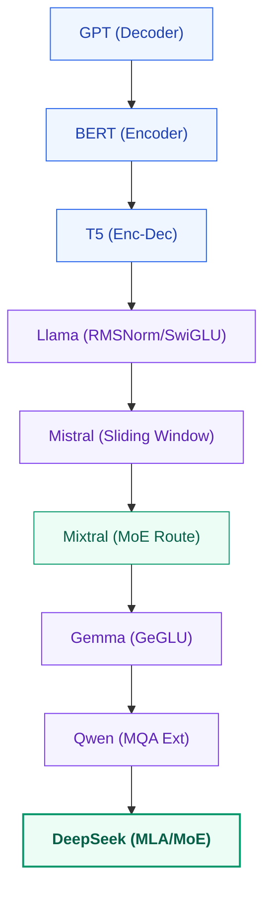

# Module 08: Modern LLM Architectures: Evolutionary Innovations

This study guide trace the chronological engineering evolution of Large Language Model architectures, detailing the specific problems each model solved, and explaining key KV cache optimizations like Grouped-Query Attention (GQA).

---

## 1. Timeline of Architectural Evolutions

---

## 2. Model-by-Model Architectural Breakdowns

### 1. GPT (Generative Pre-trained Transformer)
- **What's new?**: First scaled decoder-only autoregressive pre-training model.
- **Why was it introduced?**: To show that self-supervised next-token prediction over raw text datasets builds robust general representations.
- **Problem solved**: Eliminated the need for large task-specific labeled datasets by enabling unsupervised pre-training followed by supervised fine-tuning.

### 2. BERT (Bidirectional Encoder Representations from Transformers)
- **What's new?**: Bidirectional self-attention encoder utilizing a Masked Language Modeling (MLM) objective.
- **Why was it introduced?**: Causal decoders (like GPT) only attend to previous context, losing downstream sequence context.
- **Problem solved**: Allowed the model to access left-to-right and right-to-left contexts simultaneously, improving performance on natural language understanding (NLU) tasks like sequence classification and parsing.

### 3. T5 (Text-to-Text Transfer Transformer)
- **What's new?**: A unified encoder-decoder architecture that frames all NLP tasks as text-to-text mappings.
- **Why was it introduced?**: To standardize downstream processing; classification, translation, and summarization all share the same text-input-to-text-output interface.
- **Problem solved**: Replaced specialized classification heads with a single generative training pipeline.

### 4. Llama (Large Language Model Meta AI)
- **What's new?**: Pre-normalization (using RMSNorm to stabilize scaling), SwiGLU activation layers, and Rotary Positional Embeddings (RoPE).
- **Why was it introduced?**: To build a high-performance open-weights model capable of stable training at massive scale.
- **Problem solved**: Mitigated early-layer gradient vanishing and sequence length VRAM constraints during pre-training.

### 5. Mistral
- **What's new?**: Sliding Window Attention (SWA) and Grouped-Query Attention (GQA).
- **Why was it introduced?**: High batch-size inference is throttled by KV Cache memory bottlenecks.
- **Problem solved**: SWA limits attention bounds to $W$ tokens (pruning old KV Cache elements), while GQA shares Key/Value heads across Query clusters, reducing VRAM usage.

### 6. Mixtral
- **What's new?**: Sparse Mixture of Experts (MoE) utilizing Top-2 routing.
- **Why was it introduced?**: To scale model parameter capacity without increasing the active FLOPS computation count per token.
- **Problem solved**: Allowed building models with 47B total parameters where only 13B parameters are active per token, maintaining high quality at low execution latency.

### 7. Gemma
- **What's new?**: GeGLU gated activation functions, absolute parameter scaling tweaks, and RMSNorm weight additions.
- **Why was it introduced?**: To optimize small-parameter models ($2\text{B} - 7\text{B}$) for client-side device deployments.
- **Problem solved**: Improved representation density on small scale parameters.

### 8. Qwen
- **What's new?**: High-resolution byte-level vocabularies ($|V| \approx 150\text{k}$) and custom Multi-Query Attention extensions.
- **Why was it introduced?**: Standard English tokenizers represent non-Latin languages inefficiently.
- **Problem solved**: Drastically reduced sequence token lengths for multilingual and programming tasks.

### 9. DeepSeek
- **What's new?**: Multi-Head Latent Attention (MLA) and DeepSeekMoE sparse routing.
- **Why was it introduced?**: Standard GQA still consumes significant VRAM at large context windows, and traditional MoE routing exhibits expert load imbalance.
- **Problem solved**: MLA compresses Key/Value representations into a low-dimensional latent space before projection, reducing KV Cache footprint by up to $93\%$, while DeepSeekMoE isolates shared routing experts to prevent routing redundancy.

---

## 3. Attention Reductions: MHA vs. GQA vs. MQA

To save KV Cache VRAM, models project fewer Key/Value heads relative to Query heads.

- **Multi-Head Attention (MHA)**: Each Query head has its own Key and Value head ($h_Q = h_{KV} = 32$).
- **Multi-Query Attention (MQA)**: All Query heads share a single Key and Value head ($h_{KV} = 1$).
  - *Limitation*: Can degrade attention quality on multi-turn tasks.
- **Grouped-Query Attention (GQA)**: Query heads are split into $G$ groups. Each group shares one Key and Value head:
  $$h_{KV} = \frac{h_Q}{G}$$
  - *Advantage*: Matches the speed of MQA while retaining the representation accuracy of MHA.

#### Step-by-Step Hand Calculation (GQA Mapping)
- **Scenario**: Query heads $h_Q = 8$. Key-Value heads $h_{KV} = 2$.
- **Calculation**:
  1. Compute Group size $G$:
     $$G = \frac{h_Q}{h_{KV}} = \frac{8}{2} = 4 \text{ query heads per group}$$
  2. Map Query indices to Key-Value index heads:
     - Group 0 queries: indices `[0, 1, 2, 3]` map to Key/Value head `0`.
     - Group 1 queries: indices `[4, 5, 6, 7]` map to Key/Value head `1`.
  3. Memory Footprint Reduction:
     - Without GQA (MHA): We store $8$ Keys and $8$ Values per token.
     - With GQA: We store $2$ Keys and $2$ Values per token.
     - **VRAM Saving**: $\frac{8}{2} = 4\times$ reduction in active KV Cache memory storage.

---

## 4. Key Architectural Variations Matrix

| Model | Normalization | Attention Type | Activation | Positional Encoding |
|---|---|---|---|---|
| **GPT** | Post-LN LayerNorm | Multi-Head Attention | GELU | Learned Absolute |
| **BERT** | Post-LN LayerNorm | Bidirectional MHA | GELU | Learned Absolute |
| **Llama** | Pre-LN RMSNorm | GQA / MHA | SwiGLU | Rotary Embeddings (RoPE) |
| **Mistral** | Pre-LN RMSNorm | Sliding Window GQA | SwiGLU | Rotary Embeddings (RoPE) |
| **Gemma** | Pre-LN RMSNorm | Multi-Head Attention | GeGLU | Rotary Embeddings (RoPE) |

---

## 5. Interview Questions & Production Trade-offs

### What problem does this solve?
Evolutionary changes solve VRAM capacity limits and computational latency bottlenecks during inference.

### Why was it introduced?
Multi-Query and Grouped-Query attention mechanisms compress cached key-values to fit within GPU hardware limitations.

### What are its limitations?
Excessive GQA grouping ($G \ge 8$) can cause semantic resolution degradation on multi-hop reasoning tasks.

### Computational Complexity (Time & Memory)
- **MQA KV Cache update**: $O(b \cdot d_{\text{head}})$ memory writes.
- **GQA KV Cache update**: $O(b \cdot h_{KV} \cdot d_{\text{head}})$ memory writes.

### Component Variable Denotation Legend
- $b$: Batch size.
- $h_{KV}$: Key-Value heads count.
- $h_Q$: Query heads count.
- $d_{\text{head}}$: Vector dimension size per attention head.

### Production Use Cases:
- vLLM serving frameworks deploying GQA configurations (Llama-3) to increase batch throughput capacity.
- Code assistants loading Qwen or DeepSeek models to process long code sequences efficiently.

### Follow-up Questions Interviewers Ask:
1. *Why does Grouped-Query Attention (GQA) recover attention quality better than Multi-Query Attention (MQA)?*
   - **Answer**: MQA forces all query heads to query the exact same key-value projection, restricting attention patterns to a single shared coordinate system. GQA preserves multiple independent key-value subspaces ($h_{KV} > 1$). This allows different head groups to attend to distinct semantic relations (e.g., syntax vs. long-range dependencies), maintaining representation accuracy.
2. *Describe the structural difference between SwiGLU and GeGLU.*
   - **Answer**: Both are gated linear units. SwiGLU applies the Swish activation function to the gate channel: $\text{Swish}(\mathbf{x} \mathbf{W}_1) \odot \mathbf{x} \mathbf{W}_2$. GeGLU applies the GELU activation function to the gate channel: $\text{GELU}(\mathbf{x} \mathbf{W}_1) \odot \mathbf{x} \mathbf{W}_2$. The choice is dependent on pre-training scaling properties, with SwiGLU showing marginally better validation convergence in large models.
3. *How does DeepSeek's Multi-Head Latent Attention (MLA) compress the KV Cache?*
   - **Answer**: Instead of storing key-value vectors of size $h_{KV} \cdot d_{\text{head}}$ in memory directly, MLA uses low-rank projection to compress them into a compressed latent vector $\mathbf{c}_t \in \mathbb{R}^{d_c}$ where $d_c \ll h_{KV} \cdot d_{\text{head}}$. During decoding, only the compressed latent vector is cached. During the attention computation, the keys and values are projected back from the latent vector, compressing KV Cache storage overhead by $4\times - 10\times$.
