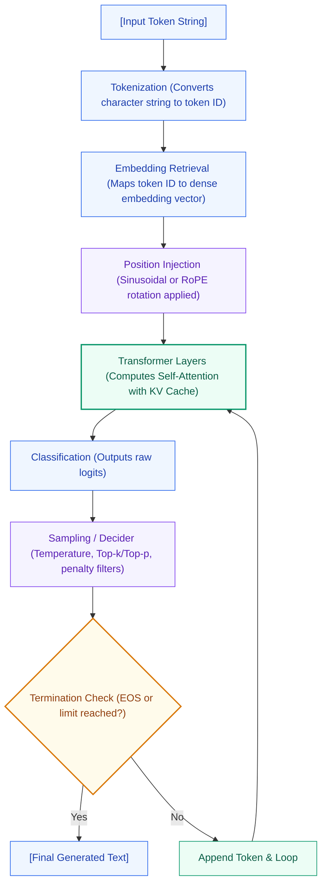

# Module 11: End-to-End LLM Inference Pipeline

This study guide explains the complete, sequential inference execution loop of a decoder-only Large Language Model, detailing how a prompt flows from raw character strings through embedding layers, Transformer blocks, and sampling heads to generate the next token.

---

## 1. Unified Inference Pipeline Diagram

The following chart outlines the lifecycle of a single token generation step during the **Decode Phase**:

---

## 2. Step-by-Step Hand Calculation of a Generation Turn

We trace a single decoding turn for a toy model.
- **Context**: Sequence `["the", "cat", "sat"]`. Prompt length $L = 3$.
- **Target**: Generate the next token at step $t=3$.

### Step 1: Pre-processing & Tokenization
- Input text: `"sat"` (the latest generated token).
- Tokenizer mapping: maps string `"sat"` to token ID $i_2 = 6$ (vocabulary index).

### Step 2: Embedding Lookup
- Embedding weights lookup table $\mathbf{W}_E \in \mathbb{R}^{|V| \times d}$ retrieves embedding vector for ID $6$:
  $$\mathbf{x}_2 = \mathbf{W}_E[6] = [0.5, -0.3]$$

### Step 3: Positional Embedding Addition
- Positional coordinate at index $pos = 2$:
  $$\mathbf{pe}_2 = [0.1, 0.2]$$
- Combine embedding and position representations:
  $$\mathbf{z}_2^{(0)} = \mathbf{x}_2 + \mathbf{pe}_2 = [0.5 + 0.1, -0.3 + 0.2] = [0.6, -0.1]$$

### Step 4: Attention Block with KV Cache Updates
- Key-Value Cache holds historical keys and values for positions 0 and 1:
  $$\mathbf{K}_{\text{cache}} = \begin{bmatrix} 1.0 & 1.0 \\ 0.0 & 1.0 \end{bmatrix}, \quad \mathbf{V}_{\text{cache}} = \begin{bmatrix} 2.0 & -1.0 \\ 0.0 & 3.0 \end{bmatrix}$$
- Compute Query, Key, and Value vectors for the current token $\mathbf{z}_2^{(0)}$ (using identity weights for simplicity):
  $$\mathbf{q}_2 = [1.0, 1.0], \quad \mathbf{k}_2 = [1.0, 0.0], \quad \mathbf{v}_2 = [1.0, 1.0]$$
- Update KV Cache: append new key and value:
  $$\mathbf{K}_{\text{updated}} = \begin{bmatrix} 1.0 & 1.0 \\ 0.0 & 1.0 \\ 1.0 & 0.0 \end{bmatrix}, \quad \mathbf{V}_{\text{updated}} = \begin{bmatrix} 2.0 & -1.0 \\ 0.0 & 3.0 \\ 1.0 & 1.0 \end{bmatrix}$$
- Compute scaled dot-product attention scores:
  $$\mathbf{A} = \mathbf{q}_2 \mathbf{K}_{\text{updated}}^T = [1.0, 1.0] \begin{bmatrix} 1.0 & 0.0 & 1.0 \\ 1.0 & 1.0 & 0.0 \end{bmatrix} = [2.0, 1.0, 1.0]$$
- Scale by $\sqrt{d_k} = \sqrt{2} \approx 1.4142$:
  $$\mathbf{S} = \frac{[2.0, 1.0, 1.0]}{1.4142} \approx [1.4142, 0.7071, 0.7071]$$
- Softmax over scores (Causal masking is trivially satisfied since this is the last step):
  $$\text{Denominator} = e^{1.4142} + e^{0.7071} + e^{0.7071} = 4.1133 + 2.0281 + 2.0281 = 8.1695$$
  $$\boldsymbol{\alpha}_2 = \left[ \frac{4.1133}{8.1695}, \frac{2.0281}{8.1695}, \frac{2.0281}{8.1695} \right] \approx [0.5035, 0.2483, 0.2483]$$
- Multiply by Value cache to get attention output:
  $$\mathbf{o}_2 = 0.5035 \times [2.0, -1.0] + 0.2483 \times [0.0, 3.0] + 0.2483 \times [1.0, 1.0] \approx [1.2553, 0.4897]$$

### Step 5: Feed-Forward Network & Projection
- Add residuals and process state. Assume the FFN outputs:
  $$\mathbf{y}_2 = [0.8, 0.4]$$

### Step 6: Logits Classification Head
- Apply language modeling classification projection $\mathbf{W}_{\text{LM}} \in \mathbb{R}^{d \times |V|}$ to get raw logits over vocabulary $|V| = 3$:
  $$\mathbf{z}_2 = \mathbf{y}_2 \mathbf{W}_{\text{LM}} = [2.0, 1.0, -1.0]$$

### Step 7: Gating & Sampling
- Apply repetition penalty $\theta = 1.2$ (on already-generated index 0), temperature $T=0.5$, and Top-k $k=2$:
  $$P_0 \approx 0.7914, \quad P_1 \approx 0.2086, \quad P_2 = 0.0000$$
- Sample next token ID using probabilities. Suppose we draw index 0 (which corresponds to token `"on"`).

### Step 8: Termination Check
- Check if sampled ID $0$ matches EOS token ID ($ID_{\text{EOS}} = 8$).
- Since $0 \ne 8$, append `"on"` to the sequence list and restart the loop for position $pos = 3$.

---

## 3. Computational and Memory Profiles per Phase

| Stage | Math Operations | Hardware Profile | Bottleneck |
|---|---|---|---|
| **Tokenizer & Embeddings** | Lookup | I/O Bound | Memory speed |
| **Attention & KV Cache** | $O(L \cdot d)$ MatMuls | Memory-Bandwidth Bound | VRAM Transfer rate |
| **FFN Layers** | $O(d^2)$ MatMuls | Compute Bound | Floating point execution cores |
| **Sampling & Gating** | Sort & Mask | CPU/GPU Kernel overhead | Gating latency |

---

## 4. Interview Questions & Production Trade-offs

### What problem does this solve?
Ties together separate tokenization, caching, layer projections, and sampling layers into a single operational system.

### Why was it introduced?
End-to-end design allows optimizing cross-layer memory allocations (like keeping KV Cache allocated in continuous memory blocks).

### What are its limitations?
The multi-step processing flow (especially sequential decoding loops) introduces significant memory-transfer delays.

### Computational Complexity (Time & Memory)
- **Single decoding iteration**: $O(n_{\text{layers}} \cdot (d^2 + L \cdot d))$ operations.
- **Inference memory footprint**: $O(\text{Model Parameters} + \text{KV Cache Size})$.

### Component Variable Denotation Legend
- $L$: Sequence context token length.
- $d$: Hidden vector dimension.
- $|V|$: Vocabulary size.
- $n_{\text{layers}}$: Transformer layer count.

### Production Use Cases:
- Production hosting endpoints (TensorRT-LLM, vLLM) designing execution graphs to link prefill and decode kernels.
- Custom chat clients parsing EOS tokens to terminate streaming text outputs.

### Follow-up Questions Interviewers Ask:
1. *Why does streaming token generation during inference reduce perceived user latency?*
   - **Answer**: In end-to-end inference, waiting for the model to generate the entire sequence of 200 tokens takes time. By streaming, the decider yields the token ID immediately at the end of each decoding loop iteration. The server decodes this ID back to string text and pushes it to the client, converting sequence latency to single-token inter-token latency.
2. *Where does the final LayerNorm occur in the end-to-end inference pipeline?*
   - **Answer**: Modern Pre-LN decoders apply a final layer normalization step immediately *after* the final Transformer block layer and *before* projecting activations to vocabulary logits using the language modeling head, capping unnormalized residual summation values.
3. *How do you prevent infinite loops if the model fails to generate an EOS token?*
   - **Answer**: Production systems enforce strict safety termination limits: a maximum output tokens parameter (e.g. `max_new_tokens = 512`) and a context ceiling (e.g., stopping when total context length reaches the model's physical window limit of 8192).
