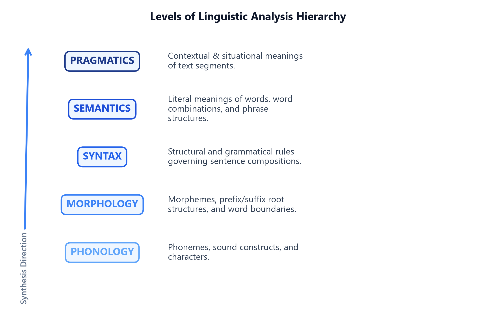
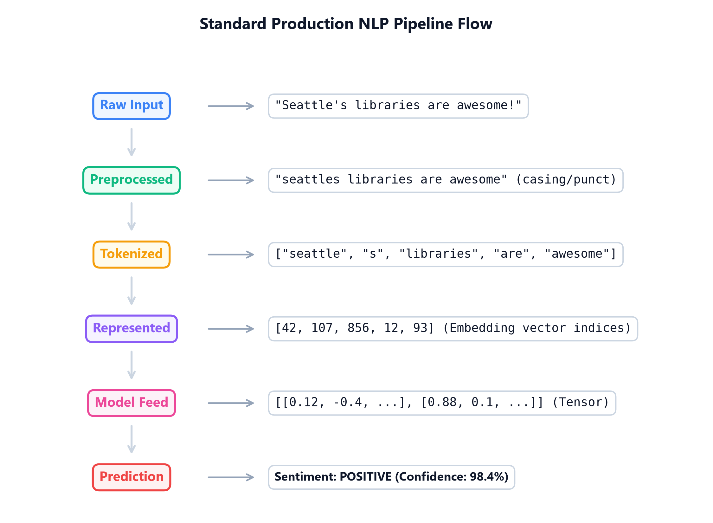

# Module 01: Introduction to NLP & Classical Tasks

## 1. Introduction & Intuition

### The Core Bottleneck
Computers process structured, deterministic data (like integers and relational tables) in binary states. However, human language is unstructured, variable, and highly ambiguous. Early attempts to process language relied on manual regular expressions or context-free grammars (CFGs). These systems broke down on common language variations, misspellings, or contextual shifts. The core bottleneck was the lack of representations that could capture the multi-layered, fuzzy structure of human language.

### High-Level Intuition
Think of language as a multi-layered code. To understand a message, you cannot just look at individual characters; you must analyze:
*   How letters form words (Morphology).
*   How words organize into grammatical sentences (Syntax).
*   What those sentences literally denote (Semantics).
*   How context and intent shape the message (Pragmatics).

NLP translates this multi-layered code into continuous numerical vectors that capture syntactic and semantic relations.



*   **Plot Interpretation:** The hierarchy of linguistic analysis illustrates how text flows from basic, discrete sound constructs (Phonology) up to multi-word morphological derivations (Morphology), grammatical structures (Syntax), literal semantics (Semantics), and finally, high-level context and intent (Pragmatics). As we move upward, computational representation shifts from simple character-matching heuristics to complex semantic vector embeddings.

In production systems, processing raw text requires translating unstructured strings into structured numerical matrices through a sequential pipeline:



*   **Flowchart Interpretation:** The standard production NLP pipeline demonstrates the conversion of raw, unstructured text into model predictions. Raw string input is first cleaned of punctuation and casing anomalies (Preprocessed), and then split into individual units (Tokenized). These token units are mapped to integer IDs (Represented) and looked up in a dense matrix to construct numerical tensor embeddings (Model Feed) which feed the sequence classifier to output the final prediction.

### Taxonomy of Classical Tasks
Classical NLP tasks are categorized into four major computational paradigms:
1.  **Text Classification:** Assigning categorical labels to documents (e.g., spam detection).
2.  **Sequence Tagging:** Assigning labels to individual words (e.g., POS tagging, NER).
3.  **Syntactic Parsing:** Extracting structural syntax trees from sentences (e.g., dependency parsing).
4.  **Text Generation:** Generating token sequences (e.g., translation, summarization).

---

## 2. Core Concepts & Mathematical Formulation

### Rule-Based vs. Statistical NLP Representation
In early NLP, sequence matching used deterministic rule dictionaries. Modern systems replace these rules with statistical tag lookups.

#### Purpose & Intuition
Instead of manually writing rules for every word, statistical NLP models estimate the likelihood of a word belonging to a class based on counts from a training corpus. For example, in Part-of-Speech (POS) tagging, a word like `"run"` can be either a Noun (N) or a Verb (V). We use the corpus frequency to determine the most likely tag given the surrounding words.

#### Step-by-Step Probability Lookup Example
Let's resolve the Part-of-Speech tag for the word `"run"` in two different contexts.
Suppose we have a trained vocabulary dictionary containing:
*   $P(\text{"run"} | \text{Verb}) = 0.80$
*   $P(\text{"run"} | \text{Noun}) = 0.20$

If we encounter `"run"` in isolation, our model performs a direct probability lookup:
*   $P(\text{Verb} | \text{"run"}) \propto 0.80$
*   $P(\text{Noun} | \text{"run"}) \propto 0.20$
The model predicts **Verb** because $0.80 > 0.20$.

Now, suppose we have contextual tag transition rules:
*   If the previous word is an Article (e.g., `"the"`), the tag transition probability is $P(\text{Noun} | \text{Article}) = 0.90$ and $P(\text{Verb} | \text{Article}) = 0.10$.
*   In the phrase `"the run"`, the model multiplies the word lookup probability by the transition likelihood:
    *   **Score as Noun:** $P(\text{Noun} | \text{Article}) \times P(\text{"run"} | \text{Noun}) = 0.90 \times 0.20 = 0.18$
    *   **Score as Verb:** $P(\text{Verb} | \text{Article}) \times P(\text{"run"} | \text{Verb}) = 0.10 \times 0.80 = 0.08$
Comparing the scores ($0.18 > 0.08$), the model correctly tags `"run"` as a **Noun** in this context.

#### Tensor & Shape Tracking
*   Input Sequence: `[N]` (list of word indices).
*   Vocabulary Tag Probability Table: `[T, V]` (where $T$ is the number of tags, $V$ is vocabulary size).
*   Output Sequence: `[N]` (predicted tag indices).

---

## 3. Implementation & Reference Code

Below is a Python regex classifier compared to a manual tag lookup.

```python
def run_classification_demo():
    import re
    
    corpus = [
        "URGENT: Win a free cash prize now!",
        "Hello, are we still meeting for lunch today?",
    ]
    
    # Rule-Based Regex Tagger (deterministic pattern dictionary)
    spam_patterns = [r"urgent", r"prize", r"reward"]
    
    def rule_based_classify(text: str) -> str:
        normalized_text = text.lower()
        for pattern in spam_patterns:
            if re.search(pattern, normalized_text):
                return "SPAM"
        return "HAM"
    
    print("Rule-Based Predictions:")
    for idx, doc in enumerate(corpus):
        pred = rule_based_classify(doc)
        print(f"  Doc {idx+1}: {doc:<45} | Prediction: {pred}")
        
if __name__ == "__main__":
    run_classification_demo()
```

---

## 4. Interview Deep-Dive & System Trade-offs

### 1. Architectural & Production Trade-offs
*   **Core Problem Solved:** Representing text data features for categorical mapping.
*   **Why Introduced over Legacy Approaches:** Statistical classification replaced manual regex rules because manual rules fail to scale or handle synonyms.
*   **Key Failure Modes & Limitations:** Rule-based models are brittle; simple statistical probability models fail to capture syntactic context on out-of-vocabulary terms.

### 2. System Complexity & Scaling
*   **Time Complexity (FLOPs):** Regular expression matching runs in $O(M \times N)$ where $M$ is pattern count and $N$ is text length.
*   **Space/Memory Footprint:** Space complexity scales as $O(|V|)$ for simple dictionary indexes.
*   **Primary Bottleneck Type:** CPU-bound string search throughput.

### 3. Production & Scalability
*   **Deployment Considerations:** Rule-based heuristics are frequently deployed as lightweight profanity filters or safety guards before hitting large-scale DL models.
*   **Common Interviewer Follow-Up Questions:**
    1.  *Q:* Contrast syntactic parsing with semantic understanding. Why is semantic representation fundamentally harder?
        *   *A:* Syntactic parsing maps grammatical linkages between tokens. Semantic understanding captures literal meaning. Semantics is harder because of polysemy (words with multiple meanings) and context dependency.
    2.  *Q:* What makes natural language unstructured, and what are the main dimensions of ambiguity?
        *   *A:* Natural language is unstructured because it has no fixed record layout. The main dimensions of ambiguity are **lexical** (multiple word meanings), **syntactic** (multiple grammatical interpretations), and **semantic** (contextual intent).
