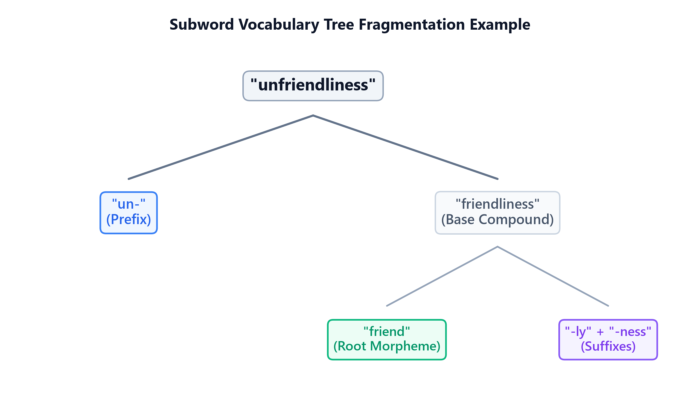

# Tokenization & Subword Algorithms

## 1. Introduction & Intuition

### The Core Bottleneck
Language models require a mapping between textual units and continuous embedding vectors. Early models split text by spaces into words. This word-level tokenization creates a massive bottleneck: if a word is missing from the training dictionary (e.g. spelling mistakes, new names, slang), it gets mapped to an Out-of-Vocabulary (`<unk>`) token. This discards all semantic info. If we try to expand the vocabulary to include every possible word, the embedding layer parameters ($V \times d$) blow up, consuming gigabytes of VRAM. Character-level tokenization solves OOV but makes sequences extremely long ($L$), increasing attention complexity quadratically ($O(L^2)$) and diluting the semantic signal per token. The bottleneck is finding an optimal representations partition between sequence length $L$ and vocabulary size $V$.

### High-Level Intuition
Think of tokenization as structural compression. We want to represent text using a code. If the code only has single letters (characters), writing a message takes a long sequence. If the code has a unique symbol for every single word (word-level), we need an infinite catalog of symbols. Subword tokenization is the middle-ground: we start with letters, identify the most common letter combinations (like `"ing"`, `"est"`, `"trans"`), and assign them unique codes. If we meet a new word like `"unfriendliness"`, we split it into known subword blocks: `"un-"`, `"friend"`, and `"-liness"`. We preserve semantics without exploding the vocabulary.



---

## 2. Core Concepts & Mathematical Formulation

### Subword Algorithms

#### Byte-Pair Encoding (BPE)
BPE starts by splitting all words in the training corpus into characters (adding a special end-of-word marker `_`). It counts the frequencies of all adjacent pairs (bigrams). The most frequent bigram is merged to form a new vocabulary token. This process repeats for a predefined number of merge iterations.

#### WordPiece
WordPiece is similar to BPE but differs in its merge selection criteria. Instead of picking the most frequent bigram, WordPiece selects the pair that maximizes the likelihood of the training data according to a unigram language model.
*   **Intuition & Practical Use:** WordPiece measures how much more frequently two tokens appear together than expected by their individual frequencies, prioritizing meaningful morphological units over simple high-frequency character transitions.
*   **Mathematical Scoring Formulation:**
    $$\text{Score}(a, b) = \frac{\text{Count}(ab)}{\text{Count}(a) \times \text{Count}(b)}$$

#### SentencePiece
SentencePiece operates directly on raw byte streams without requiring pre-tokenization. It treats space as a standard character (represented by `_`), allowing it to build language-independent vocabularies without whitespace boundaries.

---

### Hand Calculations

#### 1. BPE Merge Step
Let's trace one merge step of the BPE algorithm.
*   **Training Corpus:**
    1.  `"l o w _"` (Frequency = 5)
    2.  `"l o w e r _"` (Frequency = 2)
    3.  `"n e w _"` (Frequency = 3)
*   **Initial Vocabulary:** `{"e", "l", "n", "o", "r", "w", "_"}`

*   **Step 1: Count adjacent bigrams in the corpus**
    *   Bigram `('l', 'o')`: appears in `"low_"` (5 times) and `"lower_"` (2 times). Total = $5 + 2 = 7$.
    *   Bigram `('o', 'w')`: appears in `"low_"` (5 times) and `"lower_"` (2 times). Total = $5 + 2 = 7$.
    *   Bigram `('w', '_')`: appears in `"low_"` (5 times) and `"new_"` (3 times). Total = $5 + 3 = 8$.
    *   Bigram `('w', 'e')`: appears in `"lower_"` (2 times). Total = $2$.
    *   Bigram `('e', 'r')`: appears in `"lower_"` (2 times). Total = $2$.
    *   Bigram `('e', 'w')`: appears in `"new_"` (3 times). Total = $3$.
    *   Bigram `('n', 'e')`: appears in `"new_"` (3 times). Total = $3$.
*   **Step 2: Select the maximum frequency bigram**
    *   The maximum count is $8$, corresponding to bigram `('w', '_')`.
*   **Step 3: Merge the pair and update vocabulary**
    *   New token created: `"w_"`.
    *   Updated Vocabulary: `{"e", "l", "n", "o", "r", "w", "_", "w_"}`.
    *   Updated Corpus:
        1.  `"l o w_"` (Frequency = 5)
        2.  `"l o w e r _"` (Frequency = 2)
        3.  `"n e w_"` (Frequency = 3)

#### 2. WordPiece Score Calculation
Let's calculate the WordPiece scores to decide which candidate pair to merge.
*   Assume the corpus has:
    *   Count(`"un"`) = 1000, Count(`"able"`) = 500, Count(`"unable"`) = 50.
    *   Count(`"u"`) = 10000, Count(`"n"`) = 20000, Count(`"un"`) = 1000.
*   **Candidate A (merge `"un"` + `"able"` into `"unable"`):**
    $$\text{Score}(\text{"un"}, \text{"able"}) = \frac{\text{Count}(\text{"unable"})}{\text{Count}(\text{"un"}) \times \text{Count}(\text{"able"})} = \frac{50}{1000 \times 500} = \frac{50}{500000} = 0.0001$$
*   **Candidate B (merge `"u"` + `"n"` into `"un"`):**
    $$\text{Score}(\text{"u"}, \text{"n"}) = \frac{\text{Count}(\text{"un"})}{\text{Count}(\text{"u"}) \times \text{Count}(\text{"n"})} = \frac{1000}{10000 \times 20000} = \frac{1000}{200000000} = 0.000005$$
Since $\text{Score}(\text{"un"}, \text{"able"}) = 0.0001 > \text{Score}(\text{"u"}, \text{"n"}) = 0.000005$, the model merges `"un"` and `"able"` first, as they have higher mutual dependency.

---

#### Tensor & Shape Tracking
*   Input Token ID matrix: `[B, L]` (where $B$ is batch size, $L$ is sequence length).
*   Embedding lookup output: `[B, L, d]` (where $d$ is embedding dimensions).

---

## 3. Implementation & Reference Code

Below is a self-contained BPE merge loop in Python.

```python
import re
from collections import defaultdict

def run_bpe_demo():
    corpus = {
        "l o w _": 5,
        "l o w e r _": 2,
        "n e w e s t _": 6,
        "w i d e s t _": 3
    }
    
    vocab = set()
    for word in corpus.keys():
        vocab.update(word.split())
    
    def get_stats(corpus_dict):
        pairs = defaultdict(int)
        for word, freq in corpus_dict.items():
            symbols = word.split()
            for i in range(len(symbols) - 1):
                pairs[(symbols[i], symbols[i+1])] += freq
        return pairs
        
    def merge_vocab(pair, corpus_dict):
        new_corpus = {}
        bigram = re.escape(' '.join(pair))
        p = re.compile(r'(?<!\S)' + bigram + r'(?!\S)')
        for word, freq in corpus_dict.items():
            new_word = p.sub(''.join(pair), word)
            new_corpus[new_word] = freq
        return new_corpus

    num_merges = 5
    for i in range(num_merges):
        pairs = get_stats(corpus)
        if not pairs:
            break
        best_pair = max(pairs, key=pairs.get)
        corpus = merge_vocab(best_pair, corpus)
        vocab.add(''.join(best_pair))
        print(f"Merge {i+1}: {best_pair} (Freq={pairs[best_pair]})")

    print("Final Vocabulary:", sorted(list(vocab)))

if __name__ == "__main__":
    run_bpe_demo()
```

---

## 4. Interview Deep-Dive & System Trade-offs

### 1. Architectural & Production Trade-offs
*   **Core Problem Solved:** The sequence length vs. vocabulary parameter trade-off, and Out-of-Vocabulary (OOV) containment.
*   **Why Introduced over Legacy Approaches:** Subword tokenizers replaced word-level systems because they allow open-vocabulary representations (handling misspelled words, morphologic roots) at a fraction of the VRAM footprint required for full word lookups.
*   **Key Failure Modes & Limitations:** Tokenizer-model mismatch (training a model on tokens generated by a different tokenizer vocabulary corrupts embedding layers completely).

### 2. System Complexity & Scaling
*   **Time Complexity (FLOPs):** Tokenization lookup runs in $O(N)$ where $N$ is text character length, leveraging prefix trees (Tries) for fast matching.
*   **Space/Memory Footprint:** The vocabulary mapping occupies $O(V)$ storage. Embedding lookup matrices scale as $V \times d$ parameters.
*   **Primary Bottleneck Type:** Memory-bandwidth-bound during embedding lookup; CPU-bound during text preprocessing/tokenization loops.

### 3. Production & Scalability
*   **Deployment Considerations:** Subword vocabularies are fixed prior to model pre-training. Changing the tokenizer vocab size later requires retraining the entire model's embedding weights from scratch.
*   **Common Interviewer Follow-Up Questions:**
    1.  *Q:* How do BPE and SentencePiece handle Out-of-Vocabulary (OOV) tokens at inference?
        *   *A:* At inference, if a word is not directly present in the vocabulary, the subword tokenizer falls back to matching smaller character sequences down to individual byte tokens (SentencePiece byte-fallback). This guarantees that every text input is decomposed into a valid sequence of known token IDs, completely eliminating the `<unk>` tag.
    2.  *Q:* Detail the mathematical trade-off of choosing a small vocabulary size (e.g., $8\text{k}$) vs. a large vocabulary size (e.g., $128\text{k}$).
        *   *A:* A small vocabulary size ($8\text{k}$) reduces embedding parameter count ($V \times d$), saving VRAM. However, it splits words into smaller subwords, increasing the sequence length $L$ for the same sentence, which increases attention computational complexity quadratically ($O(L^2)$). A large vocabulary ($128\text{k}$) produces shorter sequence lengths but balloons the embedding layer VRAM footprint, which is a major constraint on consumer hardware.
