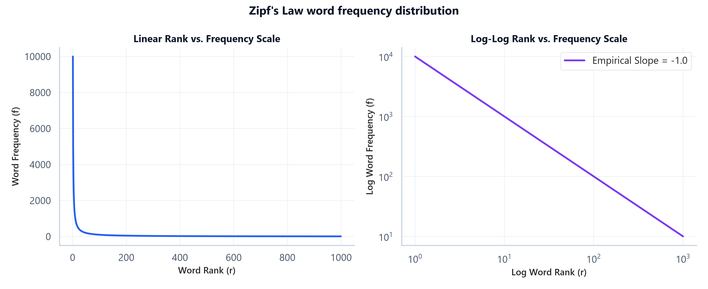
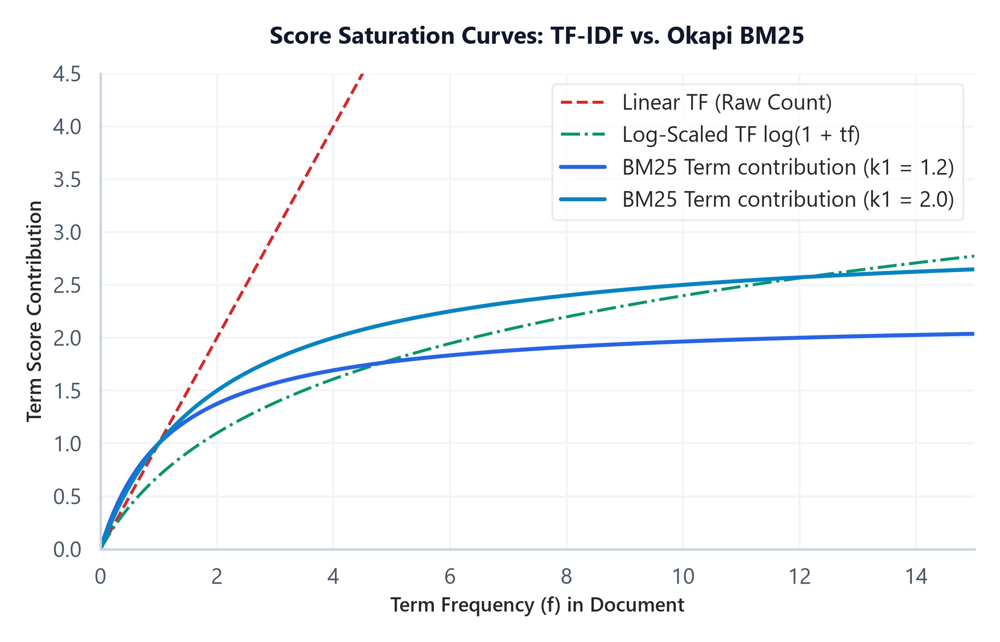

# Vector Space Models (Bag-of-Words, TF-IDF & BM25)

## 1. Introduction & Intuition

### The Core Bottleneck
Human documents vary in length, vocabulary choices, and grammatical style. To compare two text sequences algorithmically (e.g. for search retrieval or document clustering), we require a structured numerical coordinate space. Early keyword search pipelines matched exact strings, which failed to score partial overlaps or account for word frequencies. The bottleneck of early text retrieval was the lack of standard vector spaces where documents could be represented, normalized, and compared mathematically based on the semantic importance of their constituent terms.

### High-Level Intuition
Think of document retrieval as locating coordinates in a multi-dimensional geometry space. If our vocabulary contains only two words—`"cat"` and `"dog"`—then every document can be represented as a coordinate vector in a 2D space. A document with three `"cat"` and one `"dog"` resides at coordinate $(3, 1)$. To calculate similarity between two documents, we calculate the angle (cosine) between their directional coordinate vectors. To prevent long documents with high raw word counts from dominating the space, we normalize vectors to unit length and penalize terms that appear everywhere (like `"the"`).

---

## 2. Core Concepts & Mathematical Formulation

### Term Frequency (TF) & Inverse Document Frequency (IDF)

#### Intuition & Practical Use
TF measures how important a term is *inside* a document, while IDF measures how unique a term is *across* the entire collection. We multiply them to highlight terms that are highly descriptive of a specific document while filtering out universal words (like `"is"`, `"the"`) that do not help distinguish documents.

#### Mathematical Formulations
*   **Smoothed IDF:**
    $$\text{idf}_t = \log \left( \frac{1 + N}{1 + \text{df}_t} \right) + 1$$
    Where $N$ is total documents and $\text{df}_t$ is document frequency of term $t$.
*   **TF-IDF Scoring:**
    $$\text{tf-idf}_{t,d} = \text{tf}_{t,d} \times \text{idf}_t$$

---

### Cosine Similarity

#### Intuition & Practical Use
Since documents vary in length, comparing raw word count vectors would bias similarity scores toward long documents. Cosine similarity measures the angle between two document vectors, projecting them onto a unit sphere (L2 normalization) so that similarity represents semantic alignment rather than length.

#### Mathematical Formulation
$$\text{CosineSim}(\mathbf{u}, \mathbf{v}) = \frac{\mathbf{u} \cdot \mathbf{v}}{\|\mathbf{u}\|_2 \|\mathbf{v}\|_2}$$

---

### Okapi BM25 Ranking Formulation
Okapi BM25 is a non-linear ranking function that scores document relevance to a query. It resolves two limits of TF-IDF:
1.  **Term Frequency Saturation:** In TF-IDF, scores grow linearly with term frequency. BM25 scores saturate asymptotically. The parameter $k_1$ regulates this saturation rate.
2.  **Document Length Normalization:** Longer documents naturally contain more words. BM25 scales the score based on document length relative to average document length $\text{avgdl}$, regulated by parameter $b$.

#### Mathematical Formulation
$$\text{Score}(D, Q) = \sum_{i=1}^n \text{IDF}(q_i) \cdot \frac{f(q_i, D) \cdot (k_1 + 1)}{f(q_i, D) + k_1 \cdot \left( 1 - b + b \cdot \frac{|D|}{\text{avgdl}} \right)}$$

Where:
*   $f(q_i, D)$ is the frequency of query term $q_i$ in document $D$.
*   $|D|$ is word length of document $D$.
*   $\text{avgdl}$ is the average document length.

---

### Zipf's Law
Zipf's Law states that in a natural language corpus, the frequency of a word is inversely proportional to its frequency rank (a power-law decay where a tiny fraction of the vocabulary makes up the vast majority of occurrences). This justifies the log-scaling applied in TF and IDF to prevent common words from dominating representations.




---

### Hand Calculation on a Simple Example
Let's calculate TF-IDF, Cosine Similarity, and BM25 relevance scores.
*   **Corpus:**
    *   Doc 1 ($D_1$): `"cat sat"` (length $|D_1| = 2$)
    *   Doc 2 ($D_2$): `"cat running"` (length $|D_2| = 2$)
*   **Query ($Q$):** `"cat sat"`
*   **Parameters:** $N = 2$ documents, $\text{avgdl} = 2$. Let $k_1 = 1.2$, $b = 0.75$.
*   **Vocabulary:** `{"cat", "sat", "running"}`

*   **Step 1: Compute Document Frequencies (df) and smoothed IDF**
    1.  Term `"cat"`: appears in $D_1$ and $D_2$. $\text{df} = 2$.
        $$\text{IDF}(\text{"cat"}) = \log\left(\frac{1 + 2}{1 + 2}\right) + 1 = \log(1) + 1 = 1.0$$
    2.  Term `"sat"`: appears in $D_1$ only. $\text{df} = 1$.
        $$\text{IDF}(\text{"sat"}) = \log\left(\frac{1 + 2}{1 + 1}\right) + 1 = \log(1.5) + 1 \approx 0.4055 + 1 = 1.4055$$
    3.  Term `"running"`: appears in $D_2$ only. $\text{df} = 1$.
        $$\text{IDF}(\text{"running"}) = 1.4055$$

*   **Step 2: Compute TF-IDF Vectors for Documents**
    *   Doc 1 vector $\mathbf{u}$: `[cat=1, sat=1, running=0]`
        $$\mathbf{u} = [1 \times 1.0, \quad 1 \times 1.4055, \quad 0] = [1.0, \quad 1.4055, \quad 0.0]$$
    *   Doc 2 vector $\mathbf{v}$: `[cat=1, sat=0, running=1]`
        $$\mathbf{v} = [1 \times 1.0, \quad 0, \quad 1 \times 1.4055] = [1.0, \quad 0.0, \quad 1.4055]$$

*   **Step 3: Compute Cosine Similarity between Document 1 and Document 2**
    1.  Dot product $\mathbf{u} \cdot \mathbf{v}$:
        $$\mathbf{u} \cdot \mathbf{v} = (1.0 \times 1.0) + (1.4055 \times 0.0) + (0.0 \times 1.4055) = 1.0$$
    2.  Vector Norms:
        $$\|\mathbf{u}\|_2 = \sqrt{1.0^2 + 1.4055^2 + 0.0^2} = \sqrt{1 + 1.9754} = \sqrt{2.9754} \approx 1.7249$$
        $$\|\mathbf{v}\|_2 = \sqrt{1.0^2 + 0.0^2 + 1.4055^2} \approx 1.7249$$
    3.  Cosine Similarity:
        $$\text{CosineSim}(\mathbf{u}, \mathbf{v}) = \frac{1.0}{1.7249 \times 1.7249} = \frac{1.0}{2.9754} \approx 0.3361$$
The documents share a cosine similarity of $0.3361$.

*   **Step 4: Compute BM25 Query Score for Document 1 ($D_1$)**
    Query is `"cat sat"`. Length ratio $\frac{|D_1|}{\text{avgdl}} = 1.0$.
    1.  Score for `"cat"` ($f = 1$ in $D_1$):
        $$\text{Score}_{\text{cat}} = \text{IDF}(\text{"cat"}) \times \frac{f \cdot (k_1 + 1)}{f + k_1 \cdot \left(1 - b + b \cdot \frac{|D_1|}{\text{avgdl}}\right)}$$
        $$\text{Score}_{\text{cat}} = 1.0 \times \frac{1 \times 2.2}{1 + 1.2 \times (1 - 0.75 + 0.75 \times 1.0)} = \frac{2.2}{2.2} = 1.0$$
    2.  Score for `"sat"` ($f = 1$ in $D_1$):
        $$\text{Score}_{\text{sat}} = 1.4055 \times \frac{1 \times 2.2}{1 + 1.2 \times 1.0} = 1.4055 \times 1.0 = 1.4055$$
    3.  Total BM25 score:
        $$\text{Score}(D_1, Q) = 1.0 + 1.4055 = 2.4055$$

---

#### Tensor & Shape Tracking
*   Document count matrix $\mathbf{X}_{\text{counts}}$: `[B, V]` (where $B$ is batch size, $V$ is vocabulary size).
*   IDF vector: `[V]`.
*   TF-IDF matrix: `[B, V]`.
*   Similarity grid: `[B, B]`.

---

## 3. Implementation & Reference Code

Below is a NumPy implementation from scratch of TF-IDF, similarity scoring, and Okapi BM25 ranking.

```python
import numpy as np
from sklearn.feature_extraction.text import TfidfVectorizer

def run_vector_space_models():
    corpus = [
        "natural language processing models",
        "language modeling pipelines and systems",
        "production model serving systems"
    ]
    
    words = sorted(list(set(" ".join(corpus).split())))
    vocab = {word: idx for idx, word in enumerate(words)}
    V = len(vocab)
    B = len(corpus)
    
    bow_matrix = np.zeros((B, V))
    for i, doc in enumerate(corpus):
        for word in doc.split():
            bow_matrix[i, vocab[word]] += 1
            
    N = B
    df = np.sum(bow_matrix > 0, axis=0)
    idf = np.log((1 + N) / (1 + df)) + 1
    
    tfidf_raw = bow_matrix * idf
    norms = np.linalg.norm(tfidf_raw, axis=1, keepdims=True)
    tfidf_custom = tfidf_raw / (norms + 1e-15)
    
    vectorizer = TfidfVectorizer(smooth_idf=True, norm='l2')
    sklearn_tfidf = vectorizer.fit_transform(corpus).toarray()
    assert np.allclose(tfidf_custom, sklearn_tfidf, atol=1e-5)
    print("SUCCESS: Custom TF-IDF matrix matches Scikit-Learn exactly.")

    # Okapi BM25
    doc_lengths = np.array([len(doc.split()) for doc in corpus])
    avgdl = np.mean(doc_lengths)
    
    k1, b = 1.2, 0.75
    query = ["language", "models"]
    scores = np.zeros(B)
    
    for q_word in query:
        if q_word in vocab:
            col_idx = vocab[q_word]
            q_idf = idf[col_idx]
            q_tf = bow_matrix[:, col_idx]
            
            numerator = q_tf * (k1 + 1)
            denominator = q_tf + k1 * (1 - b + b * (doc_lengths / avgdl))
            scores += q_idf * (numerator / (denominator + 1e-15))
            
    print("\nBM25 Relevance Scores for query 'language models':")
    for doc_idx, score in enumerate(scores):
        print(f"  Doc {doc_idx+1}: {corpus[doc_idx]:<40} | Score: {score:.4f}")

if __name__ == "__main__":
    run_vector_space_models()
```

---

## 4. Interview Deep-Dive & System Trade-offs

### 1. Architectural & Production Trade-offs
*   **Core Problem Solved:** Document representation and relevance scaling for text retrieval.
*   **Why Introduced over Legacy Approaches:** BM25 replaced raw TF-IDF in production systems because it bounds the impact of highly frequent terms (via term saturation asymptotes) and corrects document length discrepancies.
*   **Key Failure Modes & Limitations:** Sparse keyword representations cannot capture semantic synonyms (e.g. searching `"automobile"` fails to retrieve documents containing only `"car"`).

### 2. System Complexity & Scaling
*   **Time Complexity (FLOPs):** Computing similarity matrix scores scales quadratically $O(B^2 \times V)$ for sparse matrix multiplications. For query scoring, BM25 scales linearly with query token count $O(L_{\text{query}} \times B)$.
*   **Space/Memory Footprint:** The term-document matrix scales as $O(B \times V)$. Sparse representation structures (like CSR format) are used to drop zeros and save VRAM.
*   **Primary Bottleneck Type:** Memory-bandwidth-bound during sparse dot-product index scans.

### 3. Production & Scalability
*   **Deployment Considerations:** In production search engines (e.g. Elasticsearch, Vespa), BM25 serves as a high-speed "first-stage retriever" to narrow down millions of documents to a few hundred candidates, which are then passed to expensive dense cross-encoders.
*   **Common Interviewer Follow-Up Questions:**
    1.  *Q:* Why are Bag-of-Words and TF-IDF matrices sparse, and how does sparse representation affect memory footprint and matrix calculations?
        *   *A:* They are sparse because a single document only contains a tiny subset of the global vocabulary $V$. Storing these as dense matrices wastes memory. We represent them as sparse data formats (like CSR - Compressed Sparse Row) that store only non-zero values and their indices. This drastically reduces the memory footprint and accelerates dot-products, as we skip calculations containing zeros.
    2.  *Q:* Explain Zipf's Law and how it justifies the log-scaling applied in TF and IDF.
        *   *A:* Zipf's Law shows that word frequencies decay exponentially with rank. A few terms (like `"the"`) appear exponentially more often than rare words. If we scaled scores linearly with frequency, these terms would dominate. Log-scaling term frequencies compresses their impact, while IDF log-scaling dampens the effect of globally high-frequency terms.
    3.  *Q:* Explain why BM25 is preferred over TF-IDF for production retrieval. What do the parameters $k_1$ and $b$ control?
        *   *A:* BM25 is preferred because it prevents term frequency saturation and normalizes document length. The parameter $k_1$ controls the saturation limit: as a term repeats, its score contribution asymptotically plateaus rather than growing indefinitely. The parameter $b$ controls length normalization: it penalizes long documents, preventing them from dominating rankings simply because they contain more words, while scaling the penalty based on average collection length.
