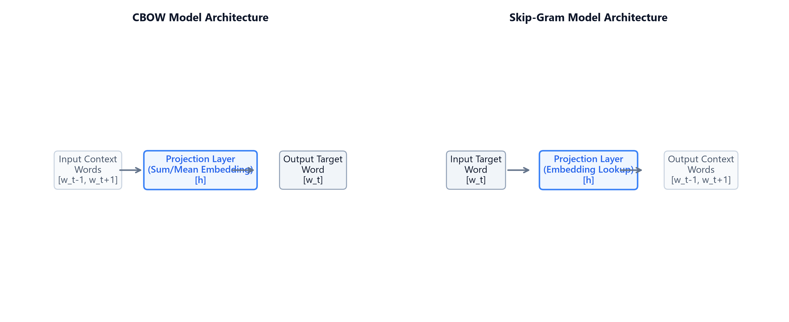

# Module 05: Distributed Representations (Word2Vec CBOW vs. Skip-gram)

## 1. Introduction & Intuition

### The Core Bottleneck
In sparse vector space models (such as one-hot encoding or TF-IDF), every unique word in the vocabulary is mapped to an independent dimension. This architecture has a fatal flaw: word vectors are orthogonal. The dot-product between the one-hot vectors for `"cat"` and `"kitten"` is exactly $0$. Sparse representations cannot capture semantic similarity or contextual relationships. Furthermore, storing these high-dimensional vectors ($V \approx 10^6$) balloons model parameters, leading to massive memory footprints and computational overhead. The bottleneck is the lack of compact, dense vector representations where semantic similarity maps directly to geometric proximity.

### High-Level Intuition
Think of word embeddings as compressing language into a multi-dimensional semantic map. Instead of assigning a unique, independent dimension to every single word, we define a small, fixed coordinate space (e.g., $d=300$ dimensions). We assign each dimension to represent a continuous semantic trait (like `"gender"`, `"plurality"`, or `"verbosity"`). Words that share traits project close to each other in this space. By moving from a high-dimensional sparse space to a low-dimensional dense space, we capture semantic concepts (e.g. `"king"` $-$ `"man"` $+$ `"woman"` $\approx$ `"queen"`).



---

## 2. Core Concepts & Mathematical Formulation

### Word2Vec Architectures
Word2Vec is a framework for learning word embeddings using simple feedforward neural networks:
1.  **Continuous Bag-of-Words (CBOW):** Predicts a target word $w_t$ given its surrounding context words within a window $C$.
2.  **Skip-Gram:** Predicts context words within window $C$ given target word $w_t$.

### Negative Sampling (SGNS)

#### Intuition & Practical Use
Computing a Softmax probability distribution over the entire vocabulary size $V$ (which can be millions of words) at each update step is a severe bottleneck ($O(V)$). Negative sampling simplifies this into a binary classification problem: for each true context word (positive sample), we select $k$ random words from the vocabulary (negative samples). The model is optimized to classify the true word as positive ($1$) and the noise words as negative ($0$). This reduces complexity from $O(V)$ to $O(k)$.

#### Mathematical Formulation
The objective function to minimize for a single target word $w_I$ and positive context word $w_O$ with $k$ negative samples $w_i$ is:
$$\mathcal{L}_{\text{NEG}} = -\log \sigma(\mathbf{v}'^{\top}_{w_O} \mathbf{v}_{w_I}) - \sum_{i=1}^k \log \sigma(-\mathbf{v}'^{\top}_{w_i} \mathbf{v}_{w_I})$$

Where $\sigma(z) = \frac{1}{1 + e^{-z}}$ is the sigmoid activation function.
*   $\mathbf{v}_{w_I} \in \mathbb{R}^d$ is the input embedding of the target word.
*   $\mathbf{v}'_{w_O} \in \mathbb{R}^d$ is the output embedding of the true context word.
*   $\mathbf{v}'_{w_i} \in \mathbb{R}^d$ is the output embedding of the $i$-th negative sample.

---

### Hand Calculation on a Simple Example
Let's compute the Negative Sampling Loss $\mathcal{L}_{\text{NEG}}$ for a single update step.
*   **Dimensionality:** $d = 2$ dimensions.
*   **Negative Samples count:** $k = 1$.
*   **Target word input vector ($\mathbf{v}_{w_I}$):** $[1.0, 0.0]$
*   **Positive context word output vector ($\mathbf{v}'_{w_O}$):** $[0.8, 0.6]$
*   **Negative sample word output vector ($\mathbf{v}'_{w_{\text{neg}}}$):** $[0.5, -0.5]$

*   **Step 1: Compute positive sample dot product and sigmoid score**
    $$z_{\text{pos}} = \mathbf{v}'^{\top}_{w_O} \mathbf{v}_{w_I} = (0.8 \times 1.0) + (0.6 \times 0.0) = 0.8$$
    $$\sigma(z_{\text{pos}}) = \frac{1}{1 + e^{-0.8}} = \frac{1}{1 + 0.4493} \approx 0.6901$$
    $$\text{Positive Loss Term} = -\log(0.6901) \approx 0.3709$$

*   **Step 2: Compute negative sample dot product and sigmoid score**
    $$z_{\text{neg}} = \mathbf{v}'^{\top}_{w_{\text{neg}}} \mathbf{v}_{w_I} = (0.5 \times 1.0) + (-0.5 \times 0.0) = 0.5$$
    $$\sigma(-z_{\text{neg}}) = \frac{1}{1 + e^{0.5}} = \frac{1}{1 + 1.6487} \approx 0.3775$$
    $$\text{Negative Loss Term} = -\log(0.3775) \approx 0.9742$$

*   **Step 3: Compute total Negative Sampling Loss**
    $$\mathcal{L}_{\text{NEG}} = 0.3709 + 0.9742 = 1.3451$$

Our total loss value for this step is $1.3451$. Backpropagation will compute gradients relative to this loss to push $\mathbf{v}_{w_I}$ closer to $\mathbf{v}'_{w_O}$ and further from $\mathbf{v}'_{w_{\text{neg}}}$.

---

#### Tensor & Shape Tracking
*   Target index tensor: `[B]` (where $B$ is batch size).
*   Input Embeddings Matrix $\mathbf{W}_{\text{in}}$: `[V, d]`.
*   Output Embeddings Matrix $\mathbf{W}_{\text{out}}$: `[V, d]`.
*   Negative sample index tensor: `[B, k]`.
*   Output Loss: `[]` (scalar float).

---

## 3. Implementation & Reference Code

Below is a PyTorch implementation of the Skip-Gram architecture with Negative Sampling.

```python
import torch
import torch.nn as nn
import torch.nn.functional as F

class SkipGramNegSampling(nn.Module):
    def __init__(self, vocab_size: int, embed_dim: int):
        super().__init__()
        self.in_embed = nn.Embedding(vocab_size, embed_dim)   # [V, d]
        self.out_embed = nn.Embedding(vocab_size, embed_dim)  # [V, d]
        
        torch.manual_seed(42)
        nn.init.xavier_uniform_(self.in_embed.weight)
        nn.init.xavier_uniform_(self.out_embed.weight)

    def forward(self, target: torch.Tensor, context: torch.Tensor, neg_samples: torch.Tensor) -> torch.Tensor:
        # 1. Lookup Embeddings
        v_target = self.in_embed(target)        # [B, d]
        v_context = self.out_embed(context)      # [B, d]
        v_neg = self.out_embed(neg_samples)      # [B, k, d]
        
        # 2. Positive term score
        pos_score = torch.sum(v_target * v_context, dim=1) # [B]
        pos_loss = F.logsigmoid(pos_score)                 # [B]
        
        # 3. Negative term score
        v_target_expanded = v_target.unsqueeze(1)          # [B, 1, d]
        v_neg_transposed = v_neg.transpose(1, 2)           # [B, d, k]
        neg_score = torch.bmm(v_target_expanded, v_neg_transposed).squeeze(1) # [B, k]
        neg_loss = torch.sum(F.logsigmoid(-neg_score), dim=1) # [B]
        
        return -torch.mean(pos_loss + neg_loss)

if __name__ == "__main__":
    B, V, d, k = 4, 1000, 32, 5
    model = SkipGramNegSampling(V, d)
    
    tgt = torch.randint(0, V, (B,))
    ctx = torch.randint(0, V, (B,))
    neg = torch.randint(0, V, (B, k))
    
    loss = model(tgt, ctx, neg)
    print(f"Skip-Gram Negative Sampling Model Loss: {loss.item():.4f}")
```

---

## 4. Interview Deep-Dive & System Trade-offs

### 1. Architectural & Production Trade-offs
*   **Core Problem Solved:** Representing semantic similarity geometrically using compact dense vector operations.
*   **Why Introduced over Legacy Approaches:** Word2Vec replaced sparse models because dense embeddings map contextual similarity to cosine distance, solving semantic sparsity.
*   **Key Failure Modes & Limitations:** Embeddings are static; they assign a single representation per word, failing to handle polysemy (e.g. `"bank"` has the same vector regardless of context).

### 2. System Complexity & Scaling
*   **Time Complexity (FLOPs):** Skip-gram with negative sampling scales as $O(B \times k \times d)$ calculations per update step, compared to $O(B \times V \times d)$ for full Softmax.
*   **Space/Memory Footprint:** Requires storing two matrices: $2 \times V \times d$ parameters.
*   **Primary Bottleneck Type:** Memory-bandwidth-bound during embedding weight index lookup and caching updates.

### 3. Production & Scalability
*   **Deployment Considerations:** Word2Vec models are often pre-trained and saved as static lookup tables to speed up downstream models, avoiding real-time projection computation during serving.
*   **Common Interviewer Follow-Up Questions:**
    1.  *Q:* Derive the computational complexity reduction of Skip-gram with negative sampling compared to Skip-gram with full Softmax.
        *   *A:* With full Softmax, the model must calculate the score for the true context word and compute a partition normalization sum over the entire vocabulary size $V$, leading to $O(V \times d)$ operations. Negative sampling maps this to a binary classification problem: computing the dot-product for the target word, the positive context word, and $k$ negative sample words. This reduces operations to $O(k \times d)$. For $V = 10^6$ and $k = 5$, this speeds up training by several orders of magnitude.
    2.  *Q:* Why does Skip-gram perform better on rare words compared to CBOW? Explain in terms of gradient updates.
        *   *A:* In CBOW, context word embeddings are averaged into a single context representation to predict the target word. This averaging acts as a smoothing operation, diluting the signal of rare context words. In Skip-gram, each target word independently predicts context words, applying direct gradient updates to context embeddings. Rare target words update their context vectors directly, preserving semantic distinctness.
