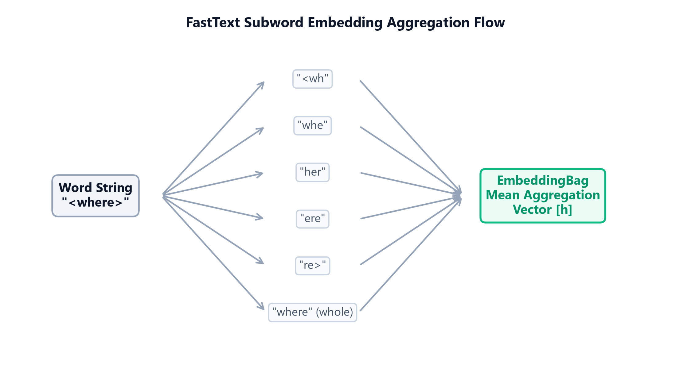

# Module 06: Subword and Matrix-Based Embeddings (GloVe & FastText)

## 1. Introduction & Intuition

### The Core Bottleneck
While Word2Vec embeddings capture local semantics, they suffer from two major limitations:
1.  **Inefficient Context Window Scaling:** Word2Vec slides context windows over the corpus, repeating lookup calculations. It fails to utilize the global statistical ratios of word co-occurrences directly, wasting compute on redundant local contexts.
2.  **The Out-of-Vocabulary (OOV) Wall:** Word2Vec learns representations at the word level. If a query word was not seen during training, or is a spelling variant (e.g. `"subword"` vs `"sub-word"`), the model cannot generate a vector representation, falling back to `<unk>`. The bottleneck is capturing global corpus-level co-occurrence statistics while retaining subword structural flexibility.

### High-Level Intuition
Think of GloVe as building a global coordinate grid by factoring a giant co-occurrence spreadsheet. If we know how often all words appear next to each other globally, we can solve a constraint optimization problem that projects words into a coordinate grid where dot-products directly match the logarithm of their co-occurrence counts.
Think of FastText as breaking a word into a set of puzzle pieces (character n-grams). A word like `"<where>"` is represented as the sum of its subword segments: `"<wh"`, `"whe"`, `"her"`, `"ere"`, and `"re>"`. If we encounter an unseen word like `"<wherever>"`, we can synthesize its vector representation by summing the vectors of its constituent subword pieces.



*   **Plot Interpretation:** The subword embedding aggregation flow details how FastText constructs a dense representation for the word `"<where>"`. The input string is fragmented into character n-grams ($n=3$ to $n=6$, wrapped in boundary brackets) plus the whole word itself. The model performs vector lookups for each individual subword piece, and passes them to PyTorch's `EmbeddingBag` module which computes the mean aggregation vector ($[h]$). This allows the model to reconstruct semantic vectors for out-of-vocabulary terms by pooling their subword embeddings.

---

## 2. Core Concepts & Mathematical Formulation

### GloVe (Global Vectors)

#### Purpose & Intuition
Instead of sliding local context windows continuously, GloVe optimizes embeddings directly on global co-occurrence statistics. The core intuition is that the relationship between words is captured by the *ratio* of their co-occurrence probabilities with other probe words, rather than raw context counts.
*   **Method:** GloVe solves a weighted least-squares regression problem over the entire co-occurrence matrix $\mathbf{X}$. The objective projects word vectors $\mathbf{w}_i$ and $\mathbf{w}_j$ such that their dot-product $\mathbf{w}_i^{\top} \mathbf{w}_j$ approximates the logarithm of their co-occurrence frequency $\log X_{ij}$.
*   **Weighting Function $f(X_{ij})$:** To prevent highly frequent words (like `"the"`, `"and"`) from dominating the loss, GloVe dampens their influence using a scaling function:
    $$f(X) = \begin{cases} \left( \frac{X}{x_{\text{max}}} \right)^\alpha & \text{if } X < x_{\text{max}} \\ 1.0 & \text{otherwise} \end{cases}$$
    Where $x_{\text{max}} = 100$ and $\alpha = 0.75$ are standard production bounds.

---

### FastText Subword Aggregation

#### Purpose & Intuition
To handle out-of-vocabulary (OOV) terms, FastText represents each word as the sum of its constituent character n-grams. During pre-training, the model learns embeddings for all subword fragments. At inference, if a word is unrecognized, FastText decomposes it and sums the vectors of its known subwords, preserving morphological signal.

#### Mathematical Formulation
$$\mathbf{v}_w = \sum_{g \in \mathcal{G}_w} \mathbf{z}_g$$

Where:
*   $\mathcal{G}_w$ is the set of all character n-grams representing word $w$.
*   $\mathbf{z}_g \in \mathbb{R}^d$ is the embedding vector for n-gram $g$.

---

### Hand Calculation on a Simple Example

#### 1. GloVe Weighting Function
Let's compute the GloVe weight $f(X_{ij})$ for two word pairs.
*   **Parameters:** $x_{\text{max}} = 100$, $\alpha = 0.75$.
*   **Case A (Rare co-occurrence):** Word $i$ and $j$ appear together $16$ times ($X_{ij} = 16$).
    $$f(16) = \left( \frac{16}{100} \right)^{0.75} = (0.16)^{0.75} \approx 0.2529$$
*   **Case B (High-frequency co-occurrence):** Word $i$ and $j$ appear together $200$ times ($X_{ij} = 200$).
    Since $200 \ge x_{\text{max}}$:
    $$f(200) = 1.0$$
The weighting function bounds the contribution of very frequent word transitions, preventing them from dominating the global factorization loss.

#### 2. FastText Subword Pooling
Let's synthesize the embedding representation for the word `"cat"`.
*   **Dimension:** $d = 3$.
*   **Character 3-grams of `"cat"`:** `{"<ca", "cat", "at>"}`.
*   Assume the hashed bucket vectors for these n-grams are:
    *   $\mathbf{z}_{\text{"<ca"}} = [0.1, \quad 0.2, \quad 0.3]$
    *   $\mathbf{z}_{\text{"cat"}} = [0.0, \quad 0.5, \quad -0.1]$
    *   $\mathbf{z}_{\text{"at>"}} = [0.5, \quad 0.2, \quad 0.4]$
*   **Synthesized Word Vector calculation:**
    $$\mathbf{v}_{\text{"cat"}} = \mathbf{z}_{\text{"<ca"}} + \mathbf{z}_{\text{"cat"}} + \mathbf{z}_{\text{"at>"}}$$
    $$\mathbf{v}_{\text{"cat"}} = [0.1 + 0.0 + 0.5, \quad 0.2 + 0.5 + 0.2, \quad 0.3 - 0.1 + 0.4] = [0.6, \quad 0.9, \quad 0.6]$$

---

#### Tensor & Shape Tracking
*   GloVe Co-occurrence Matrix $\mathbf{X}$: `[V, V]` (where $V$ is vocabulary size).
*   FastText subword n-gram indices: `[B, M]` (where $B$ is batch size, $M$ is n-grams per word).
*   Output word embedding: `[B, d]`.

---

## 3. Implementation & Reference Code

Below is a PyTorch implementation of a FastText subword pooling lookup using `nn.EmbeddingBag`.

```python
import torch
import torch.nn as nn

class FastTextEmbeddingBag(nn.Module):
    def __init__(self, num_buckets: int, embed_dim: int):
        super().__init__()
        # In EmbeddingBag, lookup and mean/sum pooling happen in a single kernel
        self.subword_embeddings = nn.EmbeddingBag(num_buckets, embed_dim, mode='mean')
        
        torch.manual_seed(42)
        nn.init.xavier_uniform_(self.subword_embeddings.weight)

    def forward(self, subword_flat_indices: torch.Tensor, offsets: torch.Tensor) -> torch.Tensor:
        # subword_flat_indices shape: [Total_Ngrams_In_Batch]
        # offsets shape: [B] (start index of each word in the flat array)
        return self.subword_embeddings(subword_flat_indices, offsets)

def simulate_fasttext_lookup():
    num_buckets = 1000
    embed_dim = 16
    model = FastTextEmbeddingBag(num_buckets, embed_dim)
    
    # 2 Words:
    # Word 1: index offsets 0-2 (indices [12, 45, 78])
    # Word 2: index offsets 3-6 (indices [99, 102, 105, 108])
    flat_indices = torch.tensor([12, 45, 78, 99, 102, 105, 108], dtype=torch.long)
    offsets = torch.tensor([0, 3], dtype=torch.long)
    
    with torch.no_grad():
        word_vectors = model(flat_indices, offsets)
        
    print("Output FastText Word Vectors Shape:", word_vectors.shape)
    print("Word Vector 1:\n", word_vectors[0])

if __name__ == "__main__":
    simulate_fasttext_lookup()
```

---

## 4. Interview Deep-Dive & System Trade-offs

### 1. Architectural & Production Trade-offs
*   **Core Problem Solved:** Global statistical co-occurrence representation efficiency, and Out-of-Vocabulary (OOV) reconstruction.
*   **Why Introduced over Legacy Approaches:** FastText replaced Word2Vec in production pipelines because it resolves spelling mutations and handles rare words via n-gram subword pooling, which prevents out-of-vocabulary lookup failures.
*   **Key Failure Modes & Limitations:** FastText hash collisions (different n-grams can hash to the same index, adding parameter noise).

### 2. System Complexity & Scaling
*   **Time Complexity (FLOPs):** GloVe matrix construction scales as $O(\text{Corpus\_Size})$. FastText inference scales as $O(M \times d)$ operations per word, where $M$ is the number of character n-grams.
*   **Space/Memory Footprint:** FastText requires massive storage since it needs to store embeddings for all $K_{\text{buckets}}$ n-grams (frequently $>2\text{GB}$ on disk), unlike static word indices.
*   **Primary Bottleneck Type:** Disk I/O and RAM loading latency during initialization; memory-bandwidth-bound during inference lookup.

### 3. Production & Scalability
*   **Deployment Considerations:** Due to the large memory footprint of FastText hash tables, production serving pipelines often compress model weights using quantization (e.g. float16 conversion, product quantization) to reduce RAM footprints.
*   **Common Interviewer Follow-Up Questions:**
    1.  *Q:* What is the conceptual difference between Word2Vec's predictive window objective and GloVe's matrix-factorization global co-occurrence objective?
        *   *A:* Word2Vec is a predictive model that slides context windows over the corpus, updating embeddings locally using stochastic gradient descent. It spends computations redundantly on frequent word pairs. GloVe is a count-based model that aggregates global counts over the entire corpus first, and then solves a matrix factorization problem. This directly models global co-occurrence statistics, resulting in faster convergence on large corpora.
    2.  *Q:* Detail the memory footprint penalty and inference speed trade-offs introduced by FastText subword storage systems during model loading.
        *   *A:* Word2Vec only stores one vector per word, requiring $V \times d$ parameters. FastText must store vectors for both words and character n-grams. Because the number of possible subword n-grams is massive, FastText maps them to a large hash table (e.g., $K = 2\text{M}$ buckets), scaling memory parameters to $K \times d$. This increases model load times and RAM usage by several gigabytes, while adding tokenization overhead to parse words into n-grams at runtime.
