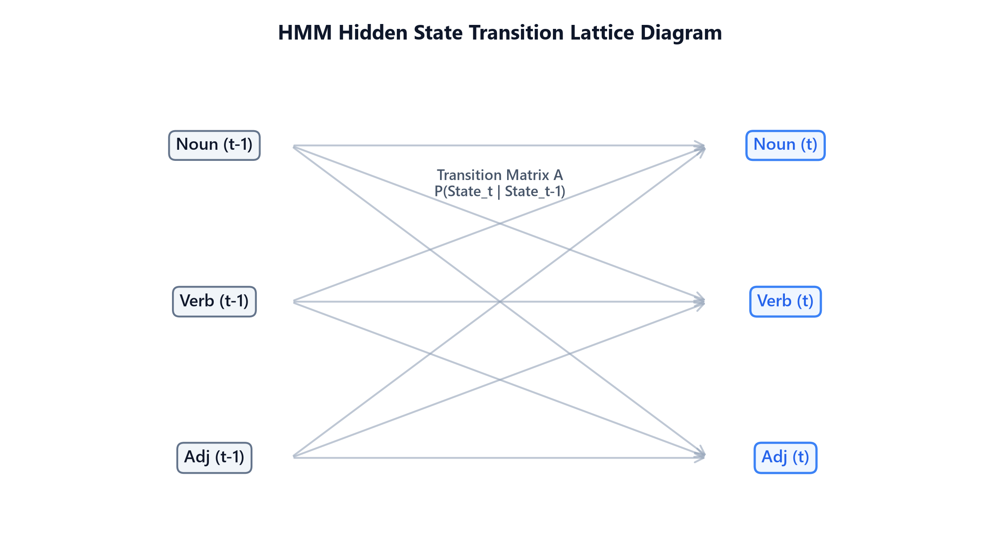

# Statistical Language Models

## 1. Introduction & Intuition

### The Core Bottleneck
Human communication consists of predicting sequence continuations: given `"please turn off the"`, a human intuitively predicts `"lights"` over `"refrigerator"` or `"blue"`. Early NLP pipelines lacked a probabilistic framework to score the "naturalness" or likelihood of text sequences. To score candidate sentences in machine translation or speech recognition, models needed to evaluate joint token probabilities. However, calculating the joint probability of a sentence requires accounting for all possible histories, which creates a massive history dimensionality wall. The bottleneck is estimating sequence probability transitions accurately without running out of computer memory or encountering zero-probabilities on unseen histories.

### High-Level Intuition
Think of sequence prediction as navigating a state transition highway. Instead of remembering the entire highway route you have driven since the start of your trip (the full history of words), you assume that your next turn depends only on the exit you are currently passing (the previous word or previous two words). This is the Markov assumption. By truncating the history window, we can estimate transition probabilities locally from corpus occurrence counts, making sequence scoring computationally feasible.



---

## 2. Core Concepts & Mathematical Formulation

### The Chain Rule of Probability
To score a text sequence, we calculate its joint probability. The exact joint probability of a sequence of $L$ words is factored sequentially using the chain rule:
$$P(w_1, w_2, \dots, w_L) = \prod_{i=1}^L P(w_i | w_{<i})$$

### The Markov Assumption & Bigrams
To make calculations tractable, N-gram models assume that the probability of a word depends only on the previous $N-1$ words. A **Bigram Model ($N=2$)** looks back only at the single immediate preceding word:
$$P(w_1, \dots, w_L) \approx \prod_{i=1}^L P(w_i | w_{i-1})$$

We estimate these transition probabilities from corpus counts using Maximum Likelihood Estimation (MLE):
$$P_{\text{MLE}}(w_i | w_{i-1}) = \frac{\text{Count}(w_{i-1} w_i)}{\text{Count}(w_{i-1})}$$

---

### Laplace (Add-One) Smoothing

#### Purpose & Intuition
If a word combination (bigram) like `"natural refrigerator"` never appears in our training corpus, its MLE count is zero, collapsing the entire sequence joint probability to $0$. Laplace smoothing prevents this score collapse by adding $+1$ to all possible transition combinations, reallocating a fraction of probability mass to unseen pairs.

#### Mathematical Formulation
$$P_{\text{Laplace}}(w_i | w_{i-1}) = \frac{\text{Count}(w_{i-1} w_i) + 1}{\text{Count}(w_{i-1}) + |V|}$$

Where $|V|$ is the size of the vocabulary.

---

### Hidden Markov Model (HMM) sequence labeling

#### Purpose & Intuition
For sequence labeling (like Part-of-Speech tagging), we assume that word tokens are observed emissions generated by a sequence of hidden tags (states). HMMs use two matrices to find the most likely hidden tag path:
1.  **Transition Matrix ($\mathbf{A}$):** Represents the probability of moving from one hidden tag to another (e.g. tag Verb following tag Noun).
2.  **Emission Matrix ($\mathbf{B}$):** Represents the probability of a hidden tag generating a specific word (e.g. tag Verb emitting the word `"run"`).
By multiplying transition and emission likelihoods, the model scores tag sequences.

---

### Hand Calculation on a Simple Example
Let's compute Laplace smoothed bigram probabilities and evaluate the joint probability of a sequence.
*   **Training Tokens:** `"language processing models language systems"`
    *   Total tokens = 5.
    *   Vocabulary ($V$): `{"language", "processing", "models", "systems"}`. Size $|V| = 4$.
*   **Corpus Frequency Counts:**
    *   Count(`"language"`) = 2.
    *   Bigram `"language models"` occurs 1 time.
    *   Bigram `"language systems"` occurs 0 times.

*   **Step 1: Compute Laplace Smoothed step probabilities**
    1.  Probability of `"models"` given `"language"`:
        $$P_{\text{Laplace}}(\text{"models"} | \text{"language"}) = \frac{\text{Count}(\text{"language models"}) + 1}{\text{Count}(\text{"language"}) + |V|}$$
        $$P_{\text{Laplace}}(\text{"models"} | \text{"language"}) = \frac{1 + 1}{2 + 4} = \frac{2}{6} \approx 0.3333$$
    2.  Probability of `"systems"` given `"language"` (resolving the zero count):
        $$P_{\text{Laplace}}(\text{"systems"} | \text{"language"}) = \frac{\text{Count}(\text{"language systems"}) + 1}{\text{Count}(\text{"language"}) + |V|}$$
        $$P_{\text{Laplace}}(\text{"systems"} | \text{"language"}) = \frac{0 + 1}{2 + 4} = \frac{1}{6} \approx 0.1667$$

*   **Step 2: Evaluate Joint Sequence Probability**
    Let's score the sequence: $W = [\text{"language"}, \text{"models"}]$.
    *   Assume initial unigram probability for the starting word is:
        $$P(\text{"language"}) = \frac{\text{Count}(\text{"language"}) + 1}{\text{Total Tokens} + |V|} = \frac{2 + 1}{5 + 4} = \frac{3}{9} \approx 0.3333$$
    *   Joint Probability:
        $$P(W) = P(\text{"language"}) \times P_{\text{Laplace}}(\text{"models"} | \text{"language"})$$
        $$P(W) = 0.3333 \times 0.3333 \approx 0.1111$$

The joint sequence probability is $0.1111$.

---

#### Tensor & Shape Tracking
*   Bigram Count Matrix $\mathbf{C}_{\text{bigram}}$: `[V, V]`.
*   Transition Probability Matrix $\mathbf{P}_{\text{transition}}$: `[V, V]`.

---

## 3. Implementation & Reference Code

Below is a Python implementation of bigram counts and sequence probability scoring.

```python
import numpy as np

def run_bigram_language_model():
    corpus = "natural language processing language models are systems"
    tokens = corpus.split()
    
    vocab = sorted(list(set(tokens)))
    vocab_to_idx = {w: idx for idx, word in enumerate(vocab)}
    V = len(vocab)
    
    unigram_counts = np.zeros(V)
    bigram_counts = np.zeros((V, V))
    
    for t in tokens:
        unigram_counts[vocab_to_idx[t]] += 1
        
    for i in range(len(tokens) - 1):
        w1, w2 = tokens[i], tokens[i+1]
        idx1, idx2 = vocab_to_idx[w1], vocab_to_idx[w2]
        bigram_counts[idx1, idx2] += 1
        
    def get_bigram_prob(w_prev: str, w_curr: str) -> float:
        if w_prev not in vocab_to_idx or w_curr not in vocab_to_idx:
            return 1.0 / V
        idx_prev = vocab_to_idx[w_prev]
        idx_curr = vocab_to_idx[w_curr]
        return (bigram_counts[idx_prev, idx_curr] + 1) / (unigram_counts[idx_prev] + V)
        
    test_seq = ["natural", "language", "models"]
    joint_prob = 1.0
    first_word_idx = vocab_to_idx[test_seq[0]] if test_seq[0] in vocab_to_idx else 0
    joint_prob *= (unigram_counts[first_word_idx] + 1) / (len(tokens) + V)
    
    for i in range(1, len(test_seq)):
        p_step = get_bigram_prob(test_seq[i-1], test_seq[i])
        joint_prob *= p_step
        
    print(f"Joint Probability of sequence {test_seq}: {joint_prob:.8f}")

if __name__ == "__main__":
    run_bigram_language_model()
```

---

## 4. Interview Deep-Dive & System Trade-offs

### 1. Architectural & Production Trade-offs
*   **Core Problem Solved:** Estimating sequence continuation probabilities and scoring generation candidates.
*   **Why Introduced over Legacy Approaches:** N-gram models replaced full joint history estimation because the Markov assumption bounds history size, making sequence calculations feasible.
*   **Key Failure Modes & Limitations:** History window truncation makes N-grams context-blind to dependencies longer than $N$ tokens (e.g. a bigram model cannot check if a closing parenthesis matches an opening one 10 tokens prior).

### 2. System Complexity & Scaling
*   **Time Complexity (FLOPs):** Sentence scoring scales linearly with sequence length $O(L)$.
*   **Space/Memory Footprint:** Space complexity scales exponentially with N-gram order: $O(|V|^N)$. A trigram model vocabulary index matrix grows as $V^3$.
*   **Primary Bottleneck Type:** Memory capacity bounds (RAM footprint of N-gram tables).

### 3. Production & Scalability
*   **Deployment Considerations:** Due to the exponential memory footprint of high-order N-grams, production systems rarely scale beyond trigram or 4-gram tables, instead using neural sequence models (RNNs/Transformers) to capture arbitrary history lengths in fixed embedding parameters.
*   **Common Interviewer Follow-Up Questions:**
    1.  *Q:* Why does memory space complexity scale exponentially ($O(|V|^k)$) for statistical k-gram models, and how did this limitation motivate sequential deep learning architectures?
        *   *A:* An N-gram model must allocate memory space for all potential token combinations: $V$ values for unigrams, $V^2$ values for bigrams, and $V^N$ values for N-grams. For a small vocabulary of $50\text{k}$ tokens, a trigram table requires allocating $50\text{k}^3 = 125 \times 10^{12}$ storage cells, which quickly exceeds computer RAM. Deep learning sequence models resolve this by compressing history into a fixed-size dense hidden state vector, scaling memory parameters linearly with layer depth rather than sequence history length.
    2.  *Q:* Explain backoff and interpolation smoothing techniques in statistical models.
        *   *A:* **Backoff** checks if the higher-order N-gram (e.g. trigram) exists; if its count is zero, it "backs off" to estimate the probability using the lower-order bigram, scaling by a normalization weight. **Interpolation** computes a weighted linear combination of unigram, bigram, and trigram probabilities simultaneously: $P(w_i | w_{i-2}, w_{i-1}) = \lambda_1 P(w_i | w_{i-2}, w_{i-1}) + \lambda_2 P(w_i | w_{i-1}) + \lambda_3 P(w_i)$, where $\sum \lambda_i = 1.0$.
