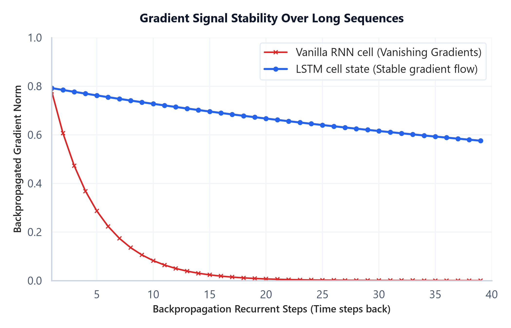
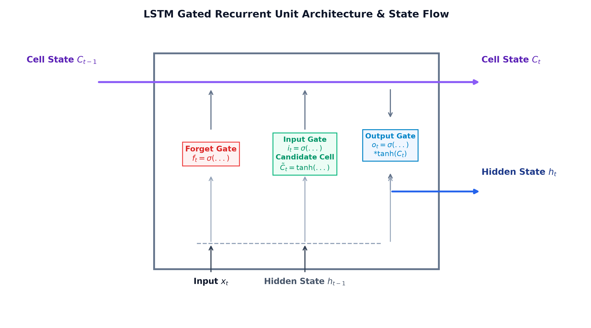

# Module 09: Recurrent Neural Networks (RNN, LSTM, GRU)

## 1. Introduction & Intuition

### The Core Bottleneck
Standard feedforward neural networks (like MLPs) fail on natural language sequences. They require a fixed-size input vector (which cannot handle variable-length documents) and lack temporal memory (treating the word `"not"` in `"not good"` and `"good, not bad"` identically, ignoring position order). Early sequence modeling attempted to pad inputs, but this didn't capture temporal dependencies. The bottleneck of early deep NLP was the lack of sequential layers capable of keeping a running state history, sharing weights across variable-length time steps, and propagating gradients back through long temporal chains.

### High-Level Intuition
Think of sequential reading as tracking a cognitive notepad (the hidden state). As you read a document word by word, you don't forget everything you read prior. Instead, you read the current word, merge it with what is currently on your cognitive notepad, erase low-value details, write down new high-value info, and update the notepad. This process repeats for every word. If the notepad has a linear carry path that isn't multiplied at each step, you can remember information from several sentences ago without losing the gradient signal.




*   **Plot Interpretation (Gradient Signal Stability):** The gradient norm decay curve compares a Vanilla RNN cell against an LSTM cell state over recurrent sequence steps. Because Vanilla RNN multiplies the hidden weight matrix repeatedly during Backpropagation Through Time (BPTT), the gradient norm decays exponentially (vanishing gradients) on contexts longer than 10-15 tokens. The LSTM cell state maintains stable gradient flow over 100+ steps because its cell state transition is additive, carrying memory linearly through time.
*   **Plot Interpretation (LSTM Cell Architecture):** The LSTM cell diagram details the gating mechanics that control information flow. The cell processes the previous hidden state ($\mathbf{h}_{t-1}$) and current input ($\mathbf{x}_t$) to compute the forget gate ($f_t$), input gate ($i_t$), candidate state ($\tilde{C}_t$), and output gate ($o_t$). These gates perform element-wise scaling to selectively forget history and write new information to the cell state ($C_t$), producing the new hidden output ($\mathbf{h}_t$).

---

## 2. Core Concepts & Mathematical Formulation

### The Recurrent Cell
A Recurrent Neural Network (RNN) processes input vectors $\mathbf{x}_1, \dots, \mathbf{x}_L$ sequentially, updating hidden state $\mathbf{h}_t$.
*   **Intuition & Practical Use:** Replaces independent word lookups with a shared parameter recurrent cell that updates memory continuously over arbitrary sequence lengths.
*   **Update Equation:**
    $$\mathbf{h}_t = \tanh(\mathbf{W}_{hh} \mathbf{h}_{t-1} + \mathbf{W}_{xh} \mathbf{x}_t + \mathbf{b}_h)$$

---

### Gradient Dynamics and the BPTT Bottleneck

#### Backpropagation Through Time (BPTT) & Gradient Decay
To train recurrent cells, we compute gradients by unrolling the model over sequence length $L$. The loss at the final step is backpropagated to the initial step using the chain rule. Because the hidden state weights $\mathbf{W}_{hh}$ are multiplied repeatedly (once for each time step), the gradient norm decays exponentially to zero if eigenvalues of $\mathbf{W}_{hh}$ are $<1.0$ (vanishing gradient), or blows up to infinity if eigenvalues are $>1.0$ (exploding gradient). This prevents standard RNNs from learning long-term dependencies.

---

### The Gating Principle
To solve vanishing gradients, LSTMs introduce **Gates** (sigmoidal filters outputting values $\in [0, 1]$ to control memory writing, reading, and forgetting) and carry information linearly along an additive memory superhighway called the **Cell State** ($\mathbf{C}_t$).

#### LSTM Cell State Formulation
*   **Forget Gate $\mathbf{f}_t$:** Decides what to drop from cell state (computed using sigmoid of context).
*   **Input Gate $\mathbf{i}_t$ & Candidate Update $\tilde{\mathbf{C}}_t$:** Decides what new context to add to memory.
*   **Cell State Update:** The core additive carriage equation that bypasses recurrent weight multiplications:
    $$\mathbf{C}_t = \mathbf{f}_t \odot \mathbf{C}_{t-1} + \mathbf{i}_t \odot \tilde{\mathbf{C}}_t$$

---

### Hand Calculation on a Simple Example

#### 1. Vanilla RNN Hidden State Update
Let's compute the updated hidden state $\mathbf{h}_t$ for a single recurrent cell.
*   **Dimensions:** Hidden size $d_h = 1$, Input dimension $d_x = 1$.
*   **Previous hidden state ($h_{t-1}$):** $0.5$
*   **Input token vector ($x_t$):** $1.0$
*   **Parameters:** Weight $W_{hh} = 0.8$, Weight $W_{xh} = 0.5$, bias $b_h = 0.0$.

*   **Step 1: Compute pre-activation sum**
    $$z_t = W_{hh} h_{t-1} + W_{xh} x_t + b_h$$
    $$z_t = (0.8 \times 0.5) + (0.5 \times 1.0) + 0.0 = 0.4 + 0.5 = 0.9$$
*   **Step 2: Apply non-linear tanh activation**
    $$h_t = \tanh(z_t) = \tanh(0.9) = \frac{e^{0.9} - e^{-0.9}}{e^{0.9} + e^{-0.9}} \approx 0.7163$$
The updated hidden state is $0.7163$.

#### 2. LSTM Cell State Update
Let's trace how the LSTM additive cell state updates.
*   **Previous Cell State ($C_{t-1}$):** $0.5$
*   **Gate Output Values:** Forget gate $f_t = 0.9$, Input gate $i_t = 0.8$, Candidate update $\tilde{C}_t = 0.5$.
*   **Step 1: Compute updated cell state**
    $$C_t = f_t \odot C_{t-1} + i_t \odot \tilde{C}_t$$
    $$C_t = (0.9 \times 0.5) + (0.8 \times 0.5) = 0.45 + 0.40 = 0.85$$
The new cell state is $0.85$. Because the update is additive, gradients can propagate back through this path without multiplying by weight matrix factors.

---

#### Tensor & Shape Tracking
*   Input Sequence Tensor $\mathbf{X}$: `[B, L, d_x]` where $B$ is batch size, $L$ sequence length, $d_x$ input dimensions.
*   Hidden state matrix $\mathbf{h}$: `[B, d_h]`.
*   Bidirectional output tensor: `[B, L, 2 * d_h]`.

---

## 3. Implementation & Reference Code

Below is a PyTorch implementation of a Bidirectional LSTM.

```python
import torch
import torch.nn as nn

class BidirLSTMClassifier(nn.Module):
    def __init__(self, vocab_size: int, embed_dim: int, hidden_dim: int, num_classes: int):
        super().__init__()
        self.embedding = nn.Embedding(vocab_size, embed_dim)
        self.lstm = nn.LSTM(
            input_size=embed_dim,
            hidden_size=hidden_dim,
            num_layers=1,
            batch_first=True,
            bidirectional=True
        )
        self.fc = nn.Linear(hidden_dim * 2, num_classes)
        
    def forward(self, x: torch.Tensor) -> torch.Tensor:
        embedded = self.embedding(x) # [B, L, embed_dim]
        out, (h_n, c_n) = self.lstm(embedded)
        last_step = out[:, -1, :] # [B, hidden_dim * 2]
        return self.fc(last_step) # [B, num_classes]

def run_lstm_demo():
    B, L, V, embed_dim, hidden_dim, num_classes = 4, 15, 1000, 32, 64, 2
    model = BidirLSTMClassifier(V, embed_dim, hidden_dim, num_classes)
    inputs = torch.randint(0, V, (B, L))
    logits = model(inputs)
    print("Output Logits Shape:", logits.shape)

if __name__ == "__main__":
    run_lstm_demo()
```

---

## 4. Interview Deep-Dive & System Trade-offs

### 1. Architectural & Production Trade-offs
*   **Core Problem Solved:** Sequence state propagation, sequence classification, and variable-length text representation.
*   **Why Introduced over Legacy Approaches:** LSTMs replaced vanilla RNNs because gating structures solve vanishing gradients, allowing models to learn long-range sequence context.
*   **Key Failure Modes & Limitations:** LSTMs cannot model bidirectional context in their native forward state, and bidirectional models concatenate states, which increases vector parameter size.

### 2. System Complexity & Scaling
*   **Time Complexity (FLOPs):** Scales linearly with sequence length $O(L \times B)$ but cannot run in parallel.
*   **Space/Memory Footprint:** VRAM parameters scale linearly with layer depth and hidden dimension: $O(4 \times (\text{embed\_dim} \times \text{hidden\_dim} + \text{hidden\_dim}^2))$.
*   **Primary Bottleneck Type:** Memory-bandwidth-bound due to sequential matrix multiplications at each time step.

### 3. Production & Scalability
*   **Deployment Considerations:** Due to the sequential dependency wall, LSTMs cannot leverage GPU parallelization along the sequence length dimension $L$ during training, which makes them much slower to train than Transformers.
*   **Common Interviewer Follow-Up Questions:**
    1.  *Q:* Explain mathematically why recurrent units are memory-bandwidth-bound during training and inference (the sequential dependency wall).
        *   *A:* In an LSTM, the hidden state at step $t$ ($\mathbf{h}_t$) cannot be computed until the state at step $t-1$ ($\mathbf{h}_{t-1}$) is completed. This serial constraint prevents parallelization across the sequence length dimension $L$. The GPU cannot run matrix operations for all words in parallel. Instead, it must read weights from High Bandwidth Memory (HBM) to SRAM, compute for one step, write back to HBM, and repeat $L$ times. This makes the pipeline memory-bandwidth-bound rather than compute-bound.
    2.  *Q:* How does the additive cell state update mechanism in LSTMs ($\mathbf{C}_t$) resolve the vanishing gradient problem?
        *   *A:* In vanilla RNNs, backpropagating gradients requires multiplying by weight matrix $\mathbf{W}_{hh}$ at each step, causing exponential decay. In LSTMs, the cell state updates using an additive equation: $\mathbf{C}_t = \mathbf{f}_t \odot \mathbf{C}_{t-1} + \mathbf{i}_t \odot \tilde{\mathbf{C}}_t$. The gradient backpropagation path contains an additive term: $\frac{\partial \mathbf{C}_t}{\partial \mathbf{C}_{t-1}} = \mathbf{f}_t$. If the forget gate is open ($\mathbf{f}_t \approx 1.0$), the gradient propagates back through time steps linearly without decaying, creating an "error carousel".
