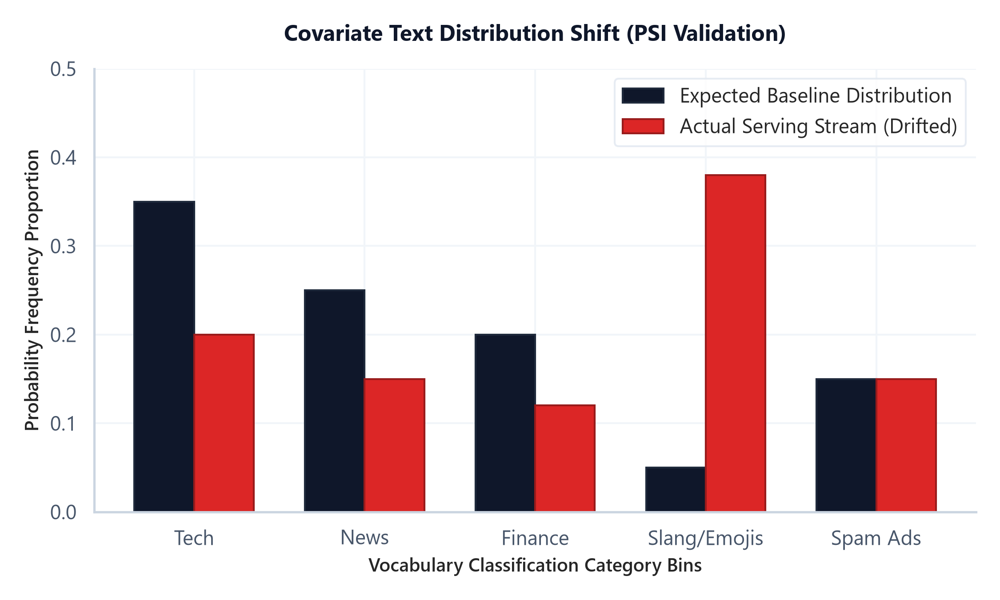

# Module 10: Production NLP Pipelines (Data Drift & Monitoring)

## 1. Introduction & Intuition

### The Core Bottleneck
Deploying an NLP model to production is not a one-off task. Human language patterns change dynamically: users adopt new slang, shift topics due to global news, or alter their emojis. A text classification model (such as a spam filter or customer intent router) trained on historical logs will degrade in performance over time when serving live requests. This phenomenon is called data drift. The bottleneck of production NLP is detecting this distribution shift on unlabeled inference streams in real time, before model degradation affects users, and automating retraining paths under tight compute budgets.

### High-Level Intuition
Think of data drift as a highway traffic shift. If your GPS maps the highway assuming $90\%$ passenger cars and $10\%$ trucks (your baseline expected distribution), but a new logistics hub shifts traffic to $50\%$ trucks (actual serving distribution), the travel times and bottlenecks will change. In NLP, if a spam filter expects a baseline vocabulary distribution but starts receiving a stream of messages containing new spam emojis and slang (covariate shift), the classifier will misclassify inputs. We monitor this shift by binning incoming text frequencies and measuring the statistical distance (PSI) between actual and expected distributions.



---

## 2. Core Concepts & Mathematical Formulation

### Data Drift Taxonomy
*   **Covariate Shift:** The input feature distribution changes, but the conditional probability of the target label remains constant:
    $$P(X_{\text{actual}}) \neq P(X_{\text{expected}}) \quad \text{while } P(Y|X) \text{ is unchanged}$$
    *   *Example:* Users write spam with emojis (shift in $X$), but the definition of spam remains the same.
*   **Concept Drift:** The mapping between features and labels changes:
    $$P(Y|X_{\text{actual}}) \neq P(Y|X_{\text{expected}}) \quad \text{while } P(X) \text{ is unchanged}$$
    *   *Example:* Words that were benign (e.g. `"zoom"`) become associated with business meetings during a remote work transition.

---

### Population Stability Index (PSI)

#### Intuition & Practical Use
PSI measures the extent of distribution shift between a reference dataset (Expected) and a target dataset (Actual) over $B$ bins. In production, this calculates a single numeric value indicating if the model inputs have drifted enough to require retraining, without needing expensive human-labeled data.
*   **PSI Interpretation Rules:**
    *   $\text{PSI} < 0.1$: Stable; no significant distribution change.
    *   $0.1 \le \text{PSI} < 0.25$: Moderate shift; monitor the model and consider retraining.
    *   $\text{PSI} \ge 0.25$: High shift; alert the pipeline and trigger retraining immediately.

#### Mathematical Formulation
$$\text{PSI} = \sum_{k=1}^B \left( \text{Actual}_k\% - \text{Expected}_k\% \right) \times \ln \left( \frac{\text{Actual}_k\%}{\text{Expected}_k\%} \right)$$

---

### Hand Calculation on a Simple Example
Let's compute the Population Stability Index (PSI) for 2 vocabulary category bins: `["Tech", "Other"]`.
*   **Expected (Baseline) distribution probabilities ($p_k$):**
    *   $p_{\text{Tech}} = 0.80$
    *   $p_{\text{Other}} = 0.20$
*   **Actual (Serving) distribution probabilities ($q_k$):**
    *   $q_{\text{Tech}} = 0.60$
    *   $q_{\text{Other}} = 0.40$

*   **Step 1: Compute contribution for the "Tech" bin**
    1.  Difference:
        $$\text{Diff}_{\text{Tech}} = q_{\text{Tech}} - p_{\text{Tech}} = 0.60 - 0.80 = -0.20$$
    2.  Log Ratio:
        $$\ln\left(\frac{q_{\text{Tech}}}{p_{\text{Tech}}}\right) = \ln\left(\frac{0.60}{0.80}\right) = \ln(0.75) \approx -0.2877$$
    3.  Contribution:
        $$\text{Contr}_{\text{Tech}} = -0.20 \times -0.2877 = 0.0575$$

*   **Step 2: Compute contribution for the "Other" bin**
    1.  Difference:
        $$\text{Diff}_{\text{Other}} = q_{\text{Other}} - p_{\text{Other}} = 0.40 - 0.20 = 0.20$$
    2.  Log Ratio:
        $$\ln\left(\frac{q_{\text{Other}}}{p_{\text{Other}}}\right) = \ln\left(\frac{0.40}{0.20}\right) = \ln(2.0) \approx 0.6931$$
    3.  Contribution:
        $$\text{Contr}_{\text{Other}} = 0.20 \times 0.6931 = 0.1386$$

*   **Step 3: Compute total PSI**
    $$\text{PSI} = \text{Contr}_{\text{Tech}} + \text{Contr}_{\text{Other}} = 0.0575 + 0.1386 = 0.1961$$

*   **Interpretation:** Since $0.10 \le \text{PSI} = 0.1961 < 0.25$, we flag a **moderate shift**. The pipeline should monitor the incoming stream closely and prepare for retraining, but doesn't need to alert developers yet.

---

#### Tensor & Shape Tracking
*   Expected baseline distribution: `[B]` where $B$ is the number of bins.
*   Actual counts vector: `[B]`.
*   PSI output: Scalar float.

---

## 3. Implementation & Reference Code

Below is a Python telemetry monitor that calculates PSI.

```python
import numpy as np

class TextDriftMonitor:
    def __init__(self, expected_dist: np.ndarray, categories: list):
        self.expected = expected_dist
        self.categories = categories
        self.B = len(categories)
        assert np.isclose(np.sum(self.expected), 1.0), "Expected distribution must sum to 1.0"

    def compute_psi(self, actual_counts: np.ndarray) -> float:
        total_counts = np.sum(actual_counts)
        if total_counts == 0:
            return 0.0
            
        actual_dist = actual_counts / total_counts
        
        # Epsilon smoothing
        eps = 1e-5
        expected_smoothed = np.clip(self.expected, eps, 1.0 - eps)
        actual_smoothed = np.clip(actual_dist, eps, 1.0 - eps)
        
        expected_smoothed /= np.sum(expected_smoothed)
        actual_smoothed /= np.sum(actual_smoothed)
        
        psi_value = np.sum((actual_smoothed - expected_smoothed) * np.log(actual_smoothed / expected_smoothed))
        return psi_value

def run_drift_monitoring_demo():
    categories = ['Tech', 'News', 'Finance', 'Slang/Emojis', 'Spam Ads']
    expected_distribution = np.array([0.35, 0.25, 0.20, 0.05, 0.15])
    
    monitor = TextDriftMonitor(expected_distribution, categories)
    
    stable_counts = np.array([340, 260, 190, 60, 150])
    psi_stable = monitor.compute_psi(stable_counts)
    
    drifted_counts = np.array([200, 150, 120, 380, 150])
    psi_drifted = monitor.compute_psi(drifted_counts)
    
    print(f"Stable Window PSI:  {psi_stable:.4f} (Action: {'Retrain' if psi_stable >= 0.25 else 'Keep Model'})")
    print(f"Drifted Window PSI: {psi_drifted:.4f} (Action: {'Retrain' if psi_drifted >= 0.25 else 'Keep Model'})")

if __name__ == "__main__":
    run_drift_monitoring_demo()
```

---

## 4. Interview Deep-Dive & System Trade-offs

### 1. Architectural & Production Trade-offs
*   **Core Problem Solved:** Detecting feature distribution shifts on unlabeled input streams to prevent silent model degradation.
*   **Why Introduced over Legacy Approaches:** Statistical drift monitoring (PSI) replaced manual label checks because labeling production data is slow and expensive, while PSI can run in real-time on raw inputs.
*   **Key Failure Modes & Limitations:** Epsilon smoothing can skew PSI calculations on small sample windows; monitoring requires representative bin selections.

### 2. System Complexity & Scaling
*   **Time Complexity (FLOPs):** PSI calculations run in $O(B)$ time, where $B$ is the number of bins, adding negligible latency to inference pipelines.
*   **Space/Memory Footprint:** Requires storing only reference distribution vectors: $O(B)$ parameters.
*   **Primary Bottleneck Type:** I/O bound during telemetry logging and aggregation passes.

### 3. Production & Scalability
*   **Deployment Considerations:** Telemetry services typically run asynchronously to prevent logging overhead from adding latency to the main model serving thread.
*   **Common Interviewer Follow-Up Questions:**
    1.  *Q:* What is covariate data drift in vocabulary distributions, and how can we detect it on an unlabeled serving stream in real time?
        *   *A:* Covariate data drift in NLP occurs when the frequency distribution of input words changes over time (e.g. a sudden surge in specific hashtags or emojis). Because the serving stream is unlabeled, we cannot calculate model accuracy directly. Instead, we compute the Population Stability Index (PSI) or perform a Kolmogorov-Smirnov (KS) test comparing the word frequency distributions of the live stream against the training baseline. If the PSI exceeds $0.25$, we flag significant drift.
    2.  *Q:* Detail the trade-offs of offline model batch retraining schedules vs. online real-time pipeline adjustments.
        *   *A:* **Offline batch retraining** is stable and allows thorough evaluation, but it is slow and can lead to lag in adapting to sudden shifts. **Online real-time retraining** adapts instantly but is computationally expensive, prone to catastrophic forgetting, and risks learning noise or adversarial inputs, which can corrupt the model.
