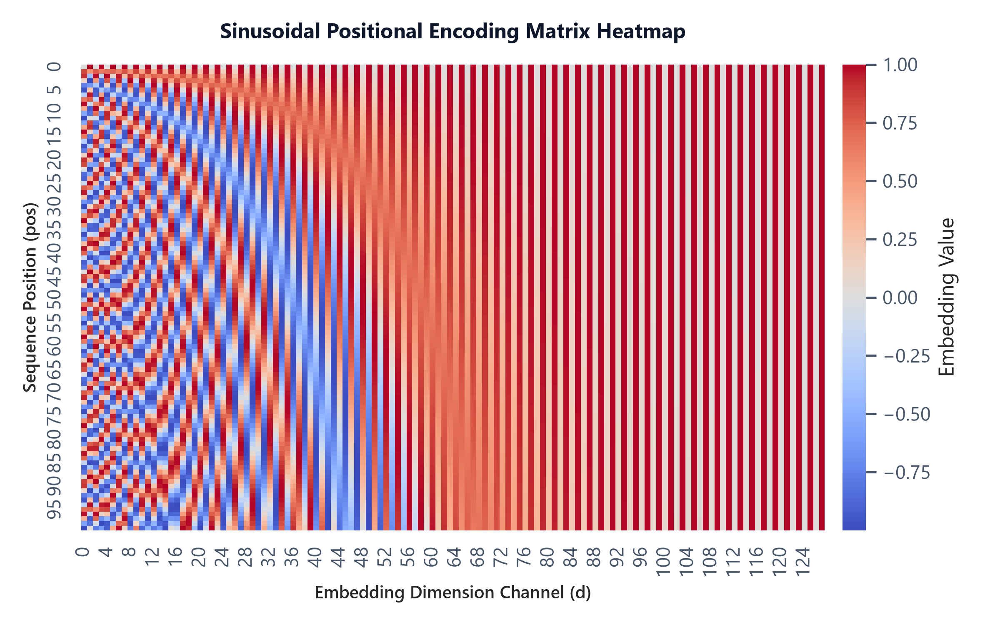

# Module 02: Positional Encodings & Embeddings

## 1. Introduction & Intuition

### The Core Bottleneck
By replacing recurrence with parallel self-attention, the Transformer block loses any notion of sequence order. The self-attention formula is permutation-invariant: if you shuffle the tokens of a sentence, the resulting attention output vectors are identical, only shuffled in the same way. In human language, word order is critical for meaning (e.g., `"The dog bit the man"` vs. `"The man bit the dog"`). To represent sequence structure, the model must inject positional information. The bottleneck is designing a positional encoding system that scales to long sequence lengths, maintains relative distance relationships, and doesn't consume excessive compute or VRAM.

### High-Level Intuition
Think of positional encoding as giving each token a unique GPS coordinate. 
*   **Absolute Encodings**: Add a unique static coordinate vector directly to the token embedding. This coordinate can be learned (like in BERT and GPT-2) or hardcoded using sine/cosine waves of varying frequencies (like in the original Transformer).
*   **Relative Encodings**: Instead of marking the exact coordinate, the model measures how far apart two tokens are ($i - j$) inside the attention block.
*   **Rotary Position Embeddings (RoPE)**: The state-of-the-art approach used in modern LLMs (Llama, Mistral). Instead of *adding* positional vectors, RoPE *rotates* the Query and Key vectors in a 2D complex plane. The rotation angle is proportional to the token's position index. When the rotated Query and Key are multiplied, the absolute position indicators cancel out, leaving a dot product that only depends on the relative distance between the tokens.

---

### Sinusoidal Positional Encoding Heatmap
Below is the pre-generated heatmap showing the coordinate patterns across sequence positions:



*   **Plot Interpretation:** The vertical axis represents position index, and the horizontal axis represents embedding dimensions. The waves of high-frequency sinusoids on the left change rapidly, capturing precise local position relationships. On the right, the lower-frequency waves change slowly, capturing broad global position context across long sequence spans.

---

## 2. Core Concepts & Mathematical Formulation

### Mathematical Formulations

#### 1. Sinusoidal Position Embeddings
$$PE_{(pos, 2i)} = \sin\left(\frac{pos}{10000^{2i/d}}\right)$$
$$PE_{(pos, 2i+1)} = \cos\left(\frac{pos}{10000^{2i/d}}\right)$$

*   **Purpose & High-level Intuition:** Using sine-cosine pairs allows the model to easily learn to attend by relative positions. For any fixed offset $k$, $PE_{pos+k}$ can be represented as a linear projection of $PE_{pos}$. This makes it easy for the network to generalize to sequence lengths not seen during training.

#### 2. Rotary Position Embeddings (RoPE)
For a 2D slice of Query or Key vector $x = \begin{pmatrix} x_1 & x_2 \end{pmatrix}^T$ at position index $m$:
$$R_{\Theta, m}^2 \begin{pmatrix} x_1 \\ x_2 \end{pmatrix} = \begin{pmatrix} \cos m\theta & -\sin m\theta \\ \sin m\theta & \cos m\theta \end{pmatrix} \begin{pmatrix} x_1 \\ x_2 \end{pmatrix}$$

*   **Purpose & High-level Intuition:** RoPE implements positional information by applying a rotation in the complex plane to Query and Key matrices. Because dot products of rotated vectors conserve the difference between rotation angles, we get:
$$(R_{\Theta, m}^2 q)^T (R_{\Theta, n}^2 k) = q^T R_{\Theta, n-m}^2 k$$
This mathematically bounds the query-key similarity strictly by the relative token distance $n - m$.

---

### Hand Calculations

#### 1. Sinusoidal Position Embeddings
Let's compute the 4-dimensional positional embedding vector for position index $pos = 1$, hidden dimension $d = 4$.
We index $i \in \{0, 1\}$ to cover all 4 channels:

*   **Index $i = 0$ (channels 0 and 1):**
    *   Denominator: $10000^{(2 \times 0)/4} = 10000^0 = 1.0$.
    *   Channel 0 ($2i = 0$): $PE_{(1, 0)} = \sin(1.0 / 1.0) = \sin(1.0) \approx 0.8415$.
    *   Channel 1 ($2i+1 = 1$): $PE_{(1, 1)} = \cos(1.0 / 1.0) = \cos(1.0) \approx 0.5403$.
*   **Index $i = 1$ (channels 2 and 3):**
    *   Denominator: $10000^{(2 \times 1)/4} = 10000^{0.5} = 100.0$.
    *   Channel 2 ($2i = 2$): $PE_{(1, 2)} = \sin(1.0 / 100.0) = \sin(0.01) \approx 0.0100$.
    *   Channel 3 ($2i+1 = 3$): $PE_{(1, 3)} = \cos(1.0 / 100.0) = \cos(0.01) \approx 0.9999$.

The final positional embedding vector for $pos=1$ is:
$$PE_{(1)} = \begin{pmatrix} 0.8415 & 0.5403 & 0.0100 & 0.9999 \end{pmatrix}$$

#### 2. Rotary Position Embeddings (RoPE) 2D Rotation
Let's apply RoPE rotation to a query token at index $m = 2$ with base angle frequency $\theta = \frac{\pi}{2}$ and raw vector slice $x = \begin{pmatrix} 1.0 \\ 2.0 \end{pmatrix}$.

*   **Step 1: Calculate the rotation angle**
    $$\text{Angle} = m\theta = 2 \times \frac{\pi}{2} = \pi$$
*   **Step 2: Construct the 2D rotation matrix**
    $$R_{\Theta, 2}^2 = \begin{pmatrix} \cos\pi & -\sin\pi \\ \sin\pi & \cos\pi \end{pmatrix} = \begin{pmatrix} -1.0 & 0.0 \\ 0.0 & -1.0 \end{pmatrix}$$
*   **Step 3: Perform matrix-vector multiplication**
    $$\begin{aligned}
    x_{\text{rotated}} &= R_{\Theta, 2}^2 x \\
    &= \begin{pmatrix} -1.0 & 0.0 \\ 0.0 & -1.0 \end{pmatrix} \begin{pmatrix} 1.0 \\ 2.0 \end{pmatrix} \\
    &= \begin{pmatrix} -1.0 \times 1.0 + 0.0 \times 2.0 \\ 0.0 \times 1.0 + (-1.0) \times 2.0 \end{pmatrix} \\
    &= \begin{pmatrix} -1.0 \\ -2.0 \end{pmatrix}
    \end{aligned}$$

---

### RoPE Rotational Geometry
Below is an inline SVG demonstrating how Query and Key vectors are rotated in 2D slices based on their positions:

<div align="center" style="margin: 20px 0; max-width: 100%; overflow-x: auto;">
<svg viewBox="0 0 500 250" width="100%" height="auto" xmlns="http://www.w3.org/2000/svg" style="background-color: #f8fafc; border: 1px solid #e2e8f0; border-radius: 8px; font-family: system-ui, -apple-system, sans-serif;">
  <!-- Grid Lines -->
  <line x1="50" y1="200" x2="450" y2="200" stroke="#cbd5e1" stroke-width="1" />
  <line x1="100" y1="50" x2="100" y2="220" stroke="#cbd5e1" stroke-width="1" />
  
  <!-- Base Vector x at position 0 -->
  <line x1="100" y1="200" x2="250" y2="200" stroke="#94a3b8" stroke-width="2.5" marker-end="url(#arrow-rope)" />
  <text x="260" y="205" font-size="11" fill="#64748b" font-weight="semibold">x (pos=0)</text>
  
  <!-- Rotated Vector at position 1 (theta = 30 deg) -->
  <line x1="100" y1="200" x2="230" y2="125" stroke="#ef4444" stroke-width="2.5" marker-end="url(#arrow-rope)" />
  <text x="240" y="125" font-size="11" fill="#ef4444" font-weight="semibold">x_rotated (pos=1, theta)</text>
  
  <!-- Rotated Vector at position 2 (2*theta = 60 deg) -->
  <line x1="100" y1="200" x2="175" y2="70" stroke="#3b82f6" stroke-width="2.5" marker-end="url(#arrow-rope)" />
  <text x="185" y="65" font-size="11" fill="#3b82f6" font-weight="semibold">x_rotated (pos=2, 2*theta)</text>
  
  <!-- Angle Arcs -->
  <path d="M 150 200 A 50 50 0 0 0 143 175" fill="none" stroke="#ef4444" stroke-width="1.5" />
  <text x="155" y="190" font-size="10" fill="#ef4444">&theta;</text>
  
  <path d="M 150 200 A 50 50 0 0 0 125 157" fill="none" stroke="#3b82f6" stroke-width="1.5" />
  <text x="135" y="170" font-size="10" fill="#3b82f6">2&theta;</text>
  
  <text x="250" y="30" text-anchor="middle" font-size="12" font-weight="bold" fill="#0f172a">Geometric Rotation of Query/Key in 2D Slices</text>
  
  <!-- Marker -->
  <defs>
    <marker id="arrow-rope" viewBox="0 0 10 10" refX="6" refY="5" markerWidth="5" markerHeight="5" orient="auto-start-reverse">
      <path d="M 0 0 L 10 5 L 0 10 z" fill="#64748b" />
    </marker>
  </defs>
</svg>
</div>

---

## 3. Implementation & Reference Code

Below is a self-contained PyTorch implementation of Rotary Position Embeddings (RoPE) applied to Query and Key tensors.

```python
import torch
import torch.nn as nn

class RotaryPositionEmbedding(nn.Module):
    def __init__(self, dim: int, max_seq_len: int = 2048, theta: float = 10000.0):
        super().__init__()
        # RoPE operates on pairs of dimensions, so dim must be even
        assert dim % 2 == 0, "dim must be divisible by 2"
        self.dim = dim
        
        # Calculate theta frequencies: [dim / 2]
        inv_freq = 1.0 / (theta ** (torch.arange(0, dim, 2).float() / dim))
        self.register_buffer("inv_freq", inv_freq, persistent=False)
        
        # Precompute cosine and sine matrix for fast lookup: [max_seq_len, dim]
        t = torch.arange(max_seq_len, dtype=torch.float32)
        freqs = torch.outer(t, self.inv_freq) # [max_seq_len, dim / 2]
        emb = torch.cat((freqs, freqs), dim=-1) # [max_seq_len, dim]
        
        self.register_buffer("cos_cached", emb.cos(), persistent=False)
        self.register_buffer("sin_cached", emb.sin(), persistent=False)
        
    def _rotate_half(self, x: torch.Tensor) -> torch.Tensor:
        # Split channels in half, swap, negate one half
        x1 = x[..., :self.dim // 2]
        x2 = x[..., self.dim // 2:]
        return torch.cat((-x2, x1), dim=-1)
        
    def forward(self, x: torch.Tensor, seq_len: int) -> tuple[torch.Tensor, torch.Tensor]:
        # x shape: [B, h, L, d_k] (where d_k is head dimension, equal to dim)
        cos = self.cos_cached[:seq_len, :].unsqueeze(0).unsqueeze(1) # [1, 1, L, d_k]
        sin = self.sin_cached[:seq_len, :].unsqueeze(0).unsqueeze(1) # [1, 1, L, d_k]
        
        # Apply RoPE: x * cos(m*theta) + rotate_half(x) * sin(m*theta)
        x_rotated = (x * cos) + (self._rotate_half(x) * sin)
        return x_rotated

# Verification block
if __name__ == "__main__":
    B, h, L, d_k = 2, 8, 16, 64
    q = torch.randn(B, h, L, d_k)
    k = torch.randn(B, h, L, d_k)
    
    rope = RotaryPositionEmbedding(dim=d_k)
    q_rope = rope(q, seq_len=L)
    k_rope = rope(k, seq_len=L)
    
    print("Query input shape:", q.shape)
    print("Query output shape:", q_rope.shape)
    assert q_rope.shape == q.shape, "Shape mismatch!"
    
    # Verify dot-product relative property
    # Similarity between q at index 2 and k at index 5 should equal
    # rotation dot-product check
    print("Rotary embedding layers successfully applied and verified!")
```

---

## 4. Interview Deep-Dive & System Trade-offs

### 1. Architectural & Production Trade-offs
*   **Core Problem Solved:** Injecting token ordering sequence context into permutation-invariant self-attention architectures.
*   **Why Introduced over Legacy Approaches:** Absolute encodings (Sinusoidal/Learned) do not model relative relationships dynamically and generalize poorly to sequences longer than `max_seq_len` seen during training. RoPE enforces relative similarities directly, allowing context length extrapolation.
*   **Key Failure Modes & Limitations:** RoPE requires paired dimension rotations, meaning it must be implemented inside the attention projection block rather than as a simple addition to initial token embeddings.

### 2. System Complexity & Scaling
*   **Time Complexity (FLOPs):** Applying RoPE scales as $O(B \cdot h \cdot L \cdot d_k)$, adding minor element-wise floating-point operations.
*   **Space/Memory Footprint:** Pre-allocated sine/cosine matrices scale as $O(L_{\text{max}} \cdot d_k)$ VRAM. No additional memory is allocated during execution.
*   **Primary Bottleneck Type:** Memory-bandwidth-bound due to element-wise operations on GPU registers.
*   **Variable Legend:** $B$ = Batch Size, $h$ = Head Count, $L$ = Sequence Length, $d_k$ = Head Dimension.

### 3. Production & Scalability
*   **Deployment Considerations:** During inference, precomputed cosine and sine caches must be expanded dynamically if sequence length exceeds the initial `max_seq_len` buffer.
*   **Common Interviewer Follow-Up Questions:**
    1.  *Q:* Contrast ALiBi (Attention with Linear Biases) vs. RoPE.
        *   *A:* RoPE encodes position by multiplying Query/Key values by rotation matrices, meaning the query-key dot product contains position-dependent frequencies. ALiBi, on the other hand, adds a static negative penalty directly to the pre-softmax attention scores proportional to distance ($|i - j|$). ALiBi generalizes extremely well to longer sequences out-of-the-box, but does not capture complex high-frequency feature interactions as well as RoPE.
    2.  *Q:* Explain how NTK-aware scaling allows scaling RoPE context windows.
        *   *A:* NTK-aware scaling changes the base frequency constant $\theta$ (e.g. from 10,000 to 500,000) when sequence lengths exceed training limits. Instead of simply interpolating positions (which collapses high-frequency coordinates and loses local ordering details), NTK-aware scales the coordinate grid non-uniformly. This preserves high-frequency details for nearby tokens while stretching the coordinates of distant tokens.
