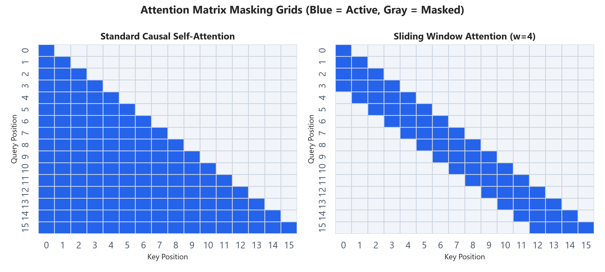
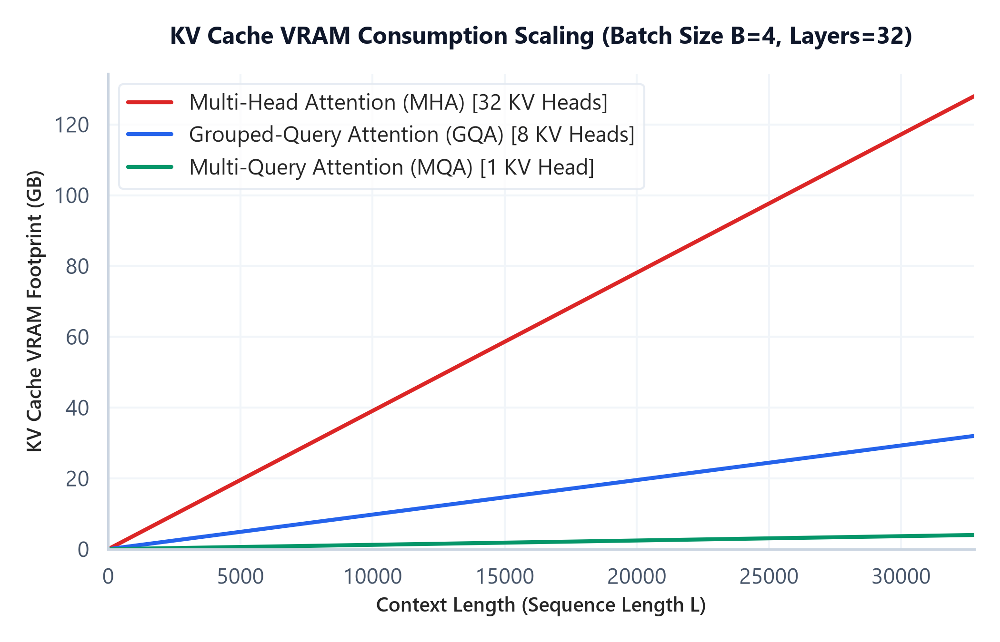

# Module 05: Modern Attention Variants (MQA, GQA, and Context Windows)

## 1. Introduction & Intuition

### The Core Bottleneck
In vanilla Multi-Head Attention (MHA), every Query head has a corresponding Key and Value head. During autoregressive token generation, the key and value vectors of all past tokens must be stored in VRAM (the KV Cache) to avoid redundant computations. Because the size of the KV cache grows linearly with batch size, sequence length, and head count, it quickly consumes all available GPU memory. This limits the maximum batch size and sequence context window. 

The bottleneck is the **Memory Bandwidth Wall**. During generation, loading the large KV Cache from slow global High Bandwidth Memory (HBM) to fast on-chip SRAM registers for every single token is memory-bandwidth bound. The compute arithmetic is fast, but the GPU spends most of its time waiting for memory to load.

### High-Level Intuition
To solve the memory bandwidth bottleneck, engineers designed attention variants that reduce the size of the KV cache:
*   **Multi-Query Attention (MQA)**: Keeps multiple Query heads but collapses Key and Value matrices down to a **single head** shared across all Query heads. This reduces the KV Cache memory footprint, but can degrade model capacity and generation quality.
*   **Grouped-Query Attention (GQA)**: A middle ground. It groups Query heads into clusters, and assigns **one shared Key and Value head per cluster**. For example, 32 Query heads are grouped into 8 groups of 4, where each group shares a single KV head. This restores most of MHA's capacity while keeping KV Cache footprints close to MQA.
*   **Sliding Window Attention (SWA)**: Restricts the attention range. Instead of attending to all past tokens, each token only attends to a fixed window of $W$ previous tokens. This caps the local attention matrix complexity and limits the maximum KV cache size to $W$.

---

### Attention Variants Masking & Memory Curves
Below are the pre-generated plots showing attention masks and KV Cache scaling profiles:



*   **Plot Interpretation:** The left matrix represents standard Causal Self-Attention, where every query attends to all prior positions, creating a full lower-triangular grid ($O(L^2)$ elements). The right matrix shows Sliding Window Attention (window size $W=4$). The mask restricts attention to a local band along the diagonal, containing memory and FLOP scaling to $O(L \cdot W)$.



*   **Plot Interpretation:** This curve shows the VRAM footprint of the KV Cache as sequence length grows for a batch size $B=4$. Vanilla MHA scales rapidly, consuming significant memory. GQA reduces this footprint by 4x, while MQA achieves a 32x reduction. GQA provides the best trade-off, enabling long-context inference on consumer hardware.

---

## 2. Core Concepts & Mathematical Formulation

### Mathematical Formulations

#### 1. KV Projection Head Ratio
$$\text{Ratio} = \frac{G}{H}$$

*   **Purpose & High-level Intuition:** This ratio measures the memory saving of GQA/MQA over MHA. It represents the number of Key/Value heads ($G$) relative to Query heads ($H$). In MHA, $G = H$ (ratio = 1.0). In GQA, $G < H$ (ratio = $G/H$, e.g. 0.25). In MQA, $G = 1$ (ratio = $1/H$, e.g. 0.031). Since KV Cache size scales directly with $G$, this ratio represents the direct reduction in VRAM consumption.

---

### Hand Calculations & Tensor Shapes
Let's analyze a model with $H = 32$ Query heads, batch size $B$, sequence length $L$, and head dimension $d_k = 128$.
We compare MHA, MQA, and GQA with $G = 8$ KV heads (group size = 4).

#### 1. Key-Value Head Ratio
*   **MHA**: $G = 32 \implies \text{Ratio} = \frac{32}{32} = 1.0$ (100% KV cache size).
*   **GQA**: $G = 8 \implies \text{Ratio} = \frac{8}{32} = 0.25$ (75% VRAM savings).
*   **MQA**: $G = 1 \implies \text{Ratio} = \frac{1}{32} \approx 0.0312$ (96.8% VRAM savings).

#### 2. Tensor Shapes in Attention Projections
For a single token input vector $x$ of shape `[B, 1, d]`:
*   **MHA Projections**:
    *   Query ($Q$): `[B, 32, 1, d_k]`
    *   Key ($K$): `[B, 32, 1, d_k]`
    *   Value ($V$): `[B, 32, 1, d_k]`
*   **GQA Projections**:
    *   Query ($Q$): `[B, 32, 1, d_k]`
    *   Key ($K$): `[B, 8, 1, d_k]`
    *   Value ($V$): `[B, 8, 1, d_k]`
    *   *To compute attention, Key/Value heads are repeated (broadcasted) 4 times to match the Query head count of 32.*
*   **MQA Projections**:
    *   Query ($Q$): `[B, 32, 1, d_k]`
    *   Key ($K$): `[B, 1, 1, d_k]`
    *   Value ($V$): `[B, 1, 1, d_k]`
    *   *Here, the single KV head is repeated 32 times.*

---

### Query-Key-Value Head Connectivity Routing
Below is an inline SVG demonstrating how Query heads map to Key/Value heads across variants:

<div align="center" style="margin: 20px 0; max-width: 100%; overflow-x: auto;">
<svg viewBox="0 0 750 250" width="100%" height="auto" xmlns="http://www.w3.org/2000/svg" style="background-color: #f8fafc; border: 1px solid #e2e8f0; border-radius: 8px; font-family: system-ui, -apple-system, sans-serif;">
  <!-- Column 1: MHA -->
  <g transform="translate(10, 0)">
    <text x="110" y="30" text-anchor="middle" font-size="12" font-weight="bold" fill="#0f172a">MHA (1-to-1)</text>
    <!-- Q heads -->
    <circle cx="50" cy="70" r="10" fill="#eff6ff" stroke="#3b82f6" stroke-width="1.5" />
    <circle cx="50" cy="110" r="10" fill="#eff6ff" stroke="#3b82f6" stroke-width="1.5" />
    <circle cx="50" cy="150" r="10" fill="#eff6ff" stroke="#3b82f6" stroke-width="1.5" />
    <circle cx="50" cy="190" r="10" fill="#eff6ff" stroke="#3b82f6" stroke-width="1.5" />
    <text x="25" y="135" font-size="10" fill="#1e3a8a">Queries</text>
    
    <!-- KV heads -->
    <circle cx="170" cy="70" r="10" fill="#fef2f2" stroke="#ef4444" stroke-width="1.5" />
    <circle cx="170" cy="110" r="10" fill="#fef2f2" stroke="#ef4444" stroke-width="1.5" />
    <circle cx="170" cy="150" r="10" fill="#fef2f2" stroke="#ef4444" stroke-width="1.5" />
    <circle cx="170" cy="190" r="10" fill="#fef2f2" stroke="#ef4444" stroke-width="1.5" />
    <text x="195" y="135" font-size="10" fill="#7f1d1d">Keys/Vals</text>
    
    <!-- Paths -->
    <line x1="60" y1="70" x2="160" y2="70" stroke="#94a3b8" stroke-width="1.5" />
    <line x1="60" y1="110" x2="160" y2="110" stroke="#94a3b8" stroke-width="1.5" />
    <line x1="60" y1="150" x2="160" y2="150" stroke="#94a3b8" stroke-width="1.5" />
    <line x1="60" y1="190" x2="160" y2="190" stroke="#94a3b8" stroke-width="1.5" />
  </g>

  <!-- Column 2: GQA -->
  <g transform="translate(260, 0)">
    <text x="110" y="30" text-anchor="middle" font-size="12" font-weight="bold" fill="#0f172a">GQA (Grouped)</text>
    <!-- Q heads -->
    <circle cx="50" cy="70" r="10" fill="#eff6ff" stroke="#3b82f6" stroke-width="1.5" />
    <circle cx="50" cy="110" r="10" fill="#eff6ff" stroke="#3b82f6" stroke-width="1.5" />
    <circle cx="50" cy="150" r="10" fill="#eff6ff" stroke="#3b82f6" stroke-width="1.5" />
    <circle cx="50" cy="190" r="10" fill="#eff6ff" stroke="#3b82f6" stroke-width="1.5" />
    
    <!-- KV heads -->
    <circle cx="170" cy="90" r="10" fill="#fef2f2" stroke="#ef4444" stroke-width="1.5" />
    <circle cx="170" cy="170" r="10" fill="#fef2f2" stroke="#ef4444" stroke-width="1.5" />
    
    <!-- Paths -->
    <line x1="60" y1="70" x2="160" y2="90" stroke="#94a3b8" stroke-width="1.5" />
    <line x1="60" y1="110" x2="160" y2="90" stroke="#94a3b8" stroke-width="1.5" />
    <line x1="60" y1="150" x2="160" y2="170" stroke="#94a3b8" stroke-width="1.5" />
    <line x1="60" y1="190" x2="160" y2="170" stroke="#94a3b8" stroke-width="1.5" />
  </g>

  <!-- Column 3: MQA -->
  <g transform="translate(510, 0)">
    <text x="110" y="30" text-anchor="middle" font-size="12" font-weight="bold" fill="#0f172a">MQA (Many-to-1)</text>
    <!-- Q heads -->
    <circle cx="50" cy="70" r="10" fill="#eff6ff" stroke="#3b82f6" stroke-width="1.5" />
    <circle cx="50" cy="110" r="10" fill="#eff6ff" stroke="#3b82f6" stroke-width="1.5" />
    <circle cx="50" cy="150" r="10" fill="#eff6ff" stroke="#3b82f6" stroke-width="1.5" />
    <circle cx="50" cy="190" r="10" fill="#eff6ff" stroke="#3b82f6" stroke-width="1.5" />
    
    <!-- KV heads -->
    <circle cx="170" cy="130" r="10" fill="#fef2f2" stroke="#ef4444" stroke-width="1.5" />
    
    <!-- Paths -->
    <line x1="60" y1="70" x2="160" y2="130" stroke="#94a3b8" stroke-width="1.5" />
    <line x1="60" y1="110" x2="160" y2="130" stroke="#94a3b8" stroke-width="1.5" />
    <line x1="60" y1="150" x2="160" y2="130" stroke="#94a3b8" stroke-width="1.5" />
    <line x1="60" y1="190" x2="160" y2="130" stroke="#94a3b8" stroke-width="1.5" />
  </g>
</svg>
</div>

---

## 3. Implementation & Reference Code

Below is a self-contained PyTorch implementation of Grouped-Query Attention (GQA), showing how Key and Value tensors are broadcasted to match Query dimensions.

```python
import torch
import torch.nn as nn
import torch.nn.functional as F

class GroupedQueryAttention(nn.Module):
    def __init__(self, embed_dim: int, num_query_heads: int, num_kv_heads: int):
        super().__init__()
        assert num_query_heads % num_kv_heads == 0, "Query heads must be divisible by KV heads"
        
        self.embed_dim = embed_dim
        self.num_query_heads = num_query_heads
        self.num_kv_heads = num_kv_heads
        self.group_size = num_query_heads // num_kv_heads
        self.head_dim = embed_dim // num_query_heads
        
        # Projection sizes
        # KV dimensions are smaller than Query dimensions
        self.q_proj = nn.Linear(embed_dim, embed_dim, bias=False)
        self.k_proj = nn.Linear(embed_dim, num_kv_heads * self.head_dim, bias=False)
        self.v_proj = nn.Linear(embed_dim, num_kv_heads * self.head_dim, bias=False)
        self.out_proj = nn.Linear(embed_dim, embed_dim, bias=False)
        
    def _repeat_heads(self, x: torch.Tensor, reps: int) -> torch.Tensor:
        # Helper to repeat Key/Value heads along head dimension
        # Input shape: [B, num_kv_heads, L, d_k]
        B, n_heads, L, d_k = x.shape
        if reps == 1:
            return x
        # Interpolate dimensions to repeat
        x = x.unsqueeze(2) # [B, n_heads, 1, L, d_k]
        x = x.expand(B, n_heads, reps, L, d_k) # [B, n_heads, reps, L, d_k]
        return x.reshape(B, n_heads * reps, L, d_k) # [B, n_heads * reps, L, d_k]
        
    def forward(self, x: torch.Tensor, mask: torch.Tensor = None) -> torch.Tensor:
        B, L, d = x.shape
        
        # 1. Project inputs
        q = self.q_proj(x) # [B, L, d]
        k = self.k_proj(x) # [B, L, num_kv_heads * head_dim]
        v = self.v_proj(x) # [B, L, num_kv_heads * head_dim]
        
        # 2. Reshape to multi-head structures
        q = q.view(B, L, self.num_query_heads, self.head_dim).transpose(1, 2) # [B, h_q, L, d_k]
        k = k.view(B, L, self.num_kv_heads, self.head_dim).transpose(1, 2)    # [B, h_kv, L, d_k]
        v = v.view(B, L, self.num_kv_heads, self.head_dim).transpose(1, 2)    # [B, h_kv, L, d_k]
        
        # 3. Repeat KV heads to match query heads (Group broadcasting)
        k = self._repeat_heads(k, self.group_size) # [B, h_q, L, d_k]
        v = self._repeat_heads(v, self.group_size) # [B, h_q, L, d_k]
        
        # 4. Standard Scaled Dot-Product Attention: [B, h_q, L, L]
        scores = torch.matmul(q, k.transpose(-2, -1)) / (self.head_dim ** 0.5)
        
        if mask is not None:
            scores = scores.masked_fill(mask == 0, float('-inf'))
            
        attn_weights = F.softmax(scores, dim=-1)
        
        # 5. Compute output: [B, h_q, L, d_k]
        context = torch.matmul(attn_weights, v)
        
        # 6. Concatenate heads and project down
        context = context.transpose(1, 2).contiguous().view(B, L, d)
        return self.out_proj(context)

# Verification block
if __name__ == "__main__":
    B, L, d, h_q, h_kv = 2, 8, 16, 4, 2
    x = torch.randn(B, L, d)
    
    gqa = GroupedQueryAttention(embed_dim=d, num_query_heads=h_q, num_kv_heads=h_kv)
    out = gqa(x)
    
    print("Input shape:", x.shape)
    print("GQA Output shape:", out.shape)
    assert out.shape == x.shape, "Shape mismatch!"
    print("GQA block successfully executed and verified broadcast shapes!")
```

---

## Interview Deep-Dive & System Trade-offs

### 1. Architectural & Production Trade-offs
*   **Core Problem Solved:** The high memory-bandwidth requirement of loading large KV caches from HBM to SRAM during autoregressive decoding, which bottlenecks token generation throughput.
*   **Why Introduced over Legacy Approaches:** MQA saves massive VRAM but degrades quality. GQA groups Query heads to match MHA performance while reducing the VRAM footprint and memory bandwidth usage significantly.
*   **Key Failure Modes & Limitations:** Reducing Key/Value heads cuts down representation capacity, which can slightly degrade reasoning on tasks requiring precise index matching.

### 2. System Complexity & Scaling
*   **Time Complexity (FLOPs):** Linear projections scale as $O(L \cdot d^2 \cdot (1 + \frac{2G}{H}))$. Attention dot-product scales as $O(L^2 \cdot d)$.
*   **Space/Memory Footprint:** KV Cache size scales as $O(B \cdot L \cdot n_{\text{layers}} \cdot G \cdot d_k)$. By reducing $G$, we scale down VRAM requirements by a factor of $H / G$.
*   **Primary Bottleneck Type:** Memory-bandwidth-bound during generation; Compute-bound during pre-fill.
*   **Variable Legend:** $B$ = Batch Size, $L$ = Sequence Length, $G$ = KV Head Count, $H$ = Query Head Count, $d_k$ = Head Dimension.

### 3. Production & Scalability
*   **Deployment Considerations:** Broadcasters during GQA must copy/expand the KV representations in GPU SRAM registers. Native kernels like FlashAttention-2 handle this expansion on-the-fly without allocating extra memory.
*   **Common Interviewer Follow-Up Questions:**
    1.  *Q:* Why does decreasing the number of KV heads speed up token generation, even though the total model FLOPs remain almost identical?
        *   *A:* Token generation is memory-bandwidth bound. The GPU spends most of its execution cycles reading the KV Cache from global HBM memory into SRAM caches rather than executing floating-point calculations. Decreasing KV heads by a factor of 8 (e.g. in GQA) means 8x fewer bytes need to be read from HBM for every token generated. This cuts down memory latency and dramatically increases throughput.
    2.  *Q:* Detail the shape transformations and broadcasting required to run GQA.
        *   *A:* For Query projections `[B, H, L, d_k]` and KV projections `[B, G, L, d_k]`, we must replicate the $G$ KV heads to match the $H$ Query heads. We do this by unsqueezing to `[B, G, 1, L, d_k]`, expanding to `[B, G, H/G, L, d_k]` along the singleton dimension, and reshaping to `[B, H, L, d_k]`. This aligns dimensions for standard dot-product calculations.
