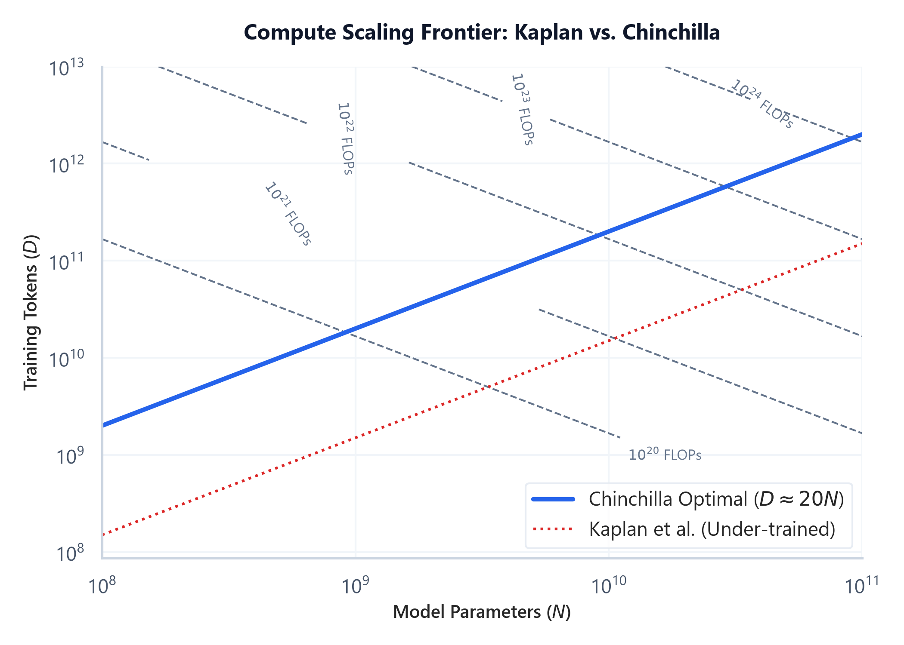

# Module 08: Pre-training: Architecture Styles, Objectives & Data Engineering

## 1. Introduction & Intuition

### The Core Bottleneck
Training state-of-the-art LLMs consumes millions of dollars in compute budgets. The pre-training phase exposes a model to trillions of tokens to learn general representations and grammar. Historically, researchers scaled models by simply increasing the parameter size $N$ while keeping the training token count $D$ relatively small. 

This led to a major bottleneck: **Compute Inefficiency**. As discovered by Kaplan et al. and corrected by Chinchilla (Hoffmann et al.), many early models (like GPT-3 175B) were severely under-trained because they did not have enough tokens relative to their size. The bottleneck is finding the optimal trade-off between model parameters $N$ and dataset size $D$ to maximize accuracy under a fixed training compute budget.

### High-Level Intuition
*   **Architecture Styles**: 
    *   **Encoder-Only (BERT)**: Uses masked language modeling (predicts missing tokens in the middle). Ideal for extraction, classification, and embeddings.
    *   **Decoder-Only (GPT, Llama)**: Uses causal language modeling (predicts the next token from left-to-right). Ideal for generative tasks, reasoning, and conversational agents.
    *   **Encoder-Decoder (T5, BART)**: Combines both. Ideal for translation, summarization, and sequence mapping.
*   **Scaling Laws**: 
    *   **Kaplan's Law**: Claimed that parameter size $N$ should grow much faster than training tokens $D$ as compute increases.
    *   **Chinchilla's Law**: Proved that parameters and tokens should scale in a **1:1 proportion**. For every doubling of compute, we should increase the model size by $1.4\times$ and the token count by $1.4\times$. This means a model should be trained on approximately $20\text{ tokens per parameter}$ to be compute-optimal.

---

### Compute Scaling Frontier: Kaplan vs. Chinchilla
Below is the pre-generated scaling chart demonstrating optimal allocations under compute constraints:



*   **Plot Interpretation:** The dotted contour curves represent lines of constant training compute budgets (in FLOPs). The blue line shows the Chinchilla optimal path ($D \approx 20N$), demonstrating that as compute budgets scale up, model size and token count should be scaled in equal proportions. The red dotted line represents Kaplan's scaling strategy, which results in over-parameterized and under-trained models (low token-to-parameter ratio) that underperform on downstream benchmarks relative to their size.

---

## 2. Core Concepts & Mathematical Formulation

### Mathematical Formulations

#### 1. Pre-training Compute Cost Estimator (FLOPs)
For decoder-only models, the computational budget $C$ to train a model is:
$$C \approx 6 N D$$

*   **Purpose & High-level Intuition:** This formula estimates the total floating-point operations (FLOPs) required to pre-train a model of size $N$ (parameters) on a dataset of size $D$ (tokens).
    *   **Forward Pass**: Requires $2ND$ FLOPs ($2$ floating-point operations per parameter per token: one multiply, one add).
    *   **Backward Pass**: Requires $4ND$ FLOPs (gradients are calculated and accumulated, which takes twice the operations of the forward pass).
    *   **Total**: $2ND + 4ND = 6ND$ FLOPs.

#### 2. Chinchilla Optimal Scaling Equation
Under a fixed compute budget $C$:
$$C = 6 N D \implies N \propto \sqrt{C}, \quad D \propto \sqrt{C}$$

*   **Purpose & High-level Intuition:** Restates that model size and training tokens should scale equally ($N \approx 20 D$ tokens, or more precisely $D \approx 20 N$).

---

### Hand Calculations: Chinchilla Optimal Allocation
Let's calculate the compute-optimal model size $N$ and token count $D$ for a training budget of $C = 6 \times 10^{23}$ FLOPs.

#### Step 1: Set up the Chinchilla ratio rule of thumb
Assume the optimal dataset size $D$ is proportional to model parameters $N$ by a factor of 20:
$$D = 20 N$$

#### Step 2: Substitute into the compute budget equation
$$\begin{aligned}
C &= 6ND \\
6 \times 10^{23} &= 6 \times N \times (20N) \\
6 \times 10^{23} &= 120 N^2 \\
N^2 &= \frac{6 \times 10^{23}}{120} \\
N^2 &= 5 \times 10^{21} \\
N &= \sqrt{5 \times 10^{21}} \\
N &\approx 7.071 \times 10^{10} \text{ parameters } (70\text{B})
\end{aligned}$$

#### Step 3: Compute optimal token count
$$\begin{aligned}
D &= 20 N \\
&= 20 \times 7.071 \times 10^{10} \\
&= 1.414 \times 10^{12} \text{ tokens } (1.4\text{T})
\end{aligned}$$

*   **Conclusion:** For a training budget of $6 \times 10^{23}$ FLOPs, the optimal model size is **70 Billion parameters** trained on **1.4 Trillion tokens**. Training a larger model (e.g. 100B) on fewer tokens, or a smaller model (e.g. 30B) on more tokens, would result in worse performance for this budget.

---

### Tensor & Shape Tracking
*   **Vocabulary Output Projection**: `[B * L, V]`
*   **Cross-Entropy Loss Input**: `[B * L, V]` against targets `[B * L]` (shifted by 1 token for causal prediction).
*   **Weights shape**: `[N]` total variables.

---

## 3. Implementation & Reference Code

Below is a Python simulation tracking Chinchilla compute allocations and training FLOP counts.

```python
def estimate_training_time_and_compute(params_billions: float, tokens_billions: float, gpu_tflops: float, hardware_utilization: float = 0.45):
    # Convert inputs to raw scales
    N = params_billions * 1e9
    D = tokens_billions * 1e9
    
    # 1. Compute total training FLOPs
    flops = 6 * N * D
    
    # 2. Compute effective hardware throughput per GPU per second
    effective_tflops = gpu_tflops * hardware_utilization # Account for overhead (MFU)
    flops_per_gpu_day = effective_tflops * 1e12 * 60 * 60 * 24
    
    # Let's assume a cluster of 512 GPUs
    num_gpus = 512
    total_flops_per_day = flops_per_gpu_day * num_gpus
    
    training_days = flops / total_flops_per_day
    
    print(f"Model Parameters: {params_billions}B")
    print(f"Dataset Size    : {tokens_billions}B tokens")
    print(f"Total FLOPs     : {flops:.2e} FLOPs")
    print(f"Training Time on {num_gpus} GPUs: {training_days:.2f} days")
    return flops, training_days

if __name__ == "__main__":
    # Estimate for a 7B model trained on 2 Trillion tokens (Llama-2 style)
    # Using A100 GPU specs: 312 TFLOPS bfloat16 tensor cores
    estimate_training_time_and_compute(
        params_billions=7.0,
        tokens_billions=2000.0,
        gpu_tflops=312.0,
        hardware_utilization=0.45
    )
```

---

## 4. Interview Deep-Dive & System Trade-offs

### 1. Architectural & Production Trade-offs
*   **Core Problem Solved:** The computational waste of training models that are either too large (under-trained relative to parameter sizes) or too small (under-performing) for a given compute budget.
*   **Why Introduced over Legacy Approaches:** Chinchilla proved that scaling datasets is just as critical as scaling weights, changing industry practices towards training smaller models longer (over-training) to reduce inference serving costs.
*   **Key Failure Modes & Limitations:** Chinchilla optimization only minimizes training compute. In production, we often prefer to train a model *past* the Chinchilla limit (over-training) because the higher training cost is amortized by the lower inference cost of a smaller model.

### 2. System Complexity & Scaling
*   **Time Complexity (FLOPs):** Total pre-training training cost scales linearly as $O(6ND)$.
*   **Space/Memory Footprint:** Parameter weights require $N \times \text{BytesPerParam}$. Optimization state VRAM scales as $16 \times N$ to $20 \times N$ bytes (using Adam optimizer).
*   **Primary Bottleneck Type:** Compute-bound during matrix projections; Network/IO bound during distributed pipeline communication (AllReduce).
*   **Variable Legend:** $N$ = Parameter Count, $D$ = Token Count.

### 3. Production & Scalability
*   **Deployment Considerations:** Training models with tens of billions of parameters requires distributed systems techniques, including Tensor Parallelism (splitting layers across GPUs) and Pipeline Parallelism (splitting sequential blocks across cards).
*   **Common Interviewer Follow-Up Questions:**
    1.  *Q:* Why are modern models like Llama 3 trained *beyond* the Chinchilla optimal limit (e.g. Llama 3 8B was trained on 15T tokens, a ratio of 1800+ tokens/param instead of 20)?
        *   *A:* Chinchilla optimal scaling only minimizes training compute cost. However, in commercial settings, a model is trained once but served billions of times at inference. Training a smaller 8B model longer costs more upfront but keeps inference VRAM and latency footprints low. A 70B model trained on 1.4T tokens might match the 8B model's quality, but serving the 70B model would be 8x more expensive at inference.
    2.  *Q:* Derive the memory overhead of the Adam optimizer during training.
        *   *A:* For $N$ parameters in mixed-precision training (FP16/BF16):
            *   Model parameters: $2N$ bytes.
            *   Model gradients: $2N$ bytes.
            *   Master weights copy (FP32): $4N$ bytes (for stable gradient updates).
            *   Adam momentum state (FP32): $4N$ bytes.
            *   Adam variance state (FP32): $4N$ bytes.
            *   **Total optimizer overhead**: $16N$ bytes. Storing a 7B model during training requires at least $20 \times 7 = 140\text{ GB}$ of VRAM just for training state variables, before accounting for activations.
