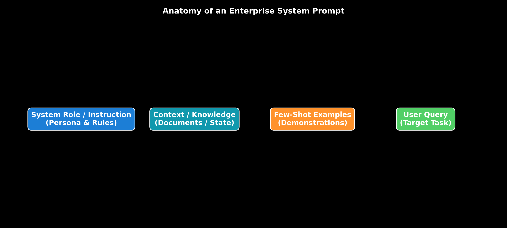

# Module 01: Fundamentals of Prompt Engineering

This guide provides an in-depth, self-explanatory breakdown of Prompt Engineering fundamentals, Prompt Anatomy, Prompt Lifecycles, Context Engineering vs. Prompt Engineering, how LLMs process tokens autoregressively, and token budget calculations, complete with step-by-step hand calculations, LangChain execution code, and production trade-offs.

> **Notebook Companion**: [01_fundamentals_of_prompt_engineering.ipynb](file:///d:/Study/Prep/machine-learning-prep/generative-ai-and-agentic-ai/01_prompt_engineering/01_fundamentals_of_prompt_engineering.ipynb)

---

## 1. What is Prompt Engineering?

Prompt Engineering is the systematic discipline of designing, structuring, and optimizing textual inputs to guide Large Language Models (LLMs) toward deterministic, accurate, and safety-compliant outputs without altering the underlying model parameters (weights).

### Core Objectives of Enterprise Prompt Engineering:
1. **Instruction Following**: Guiding the LLM to strictly execute specified tasks while ignoring extraneous or conflicting user input.
2. **Format Enforcement**: Ensuring outputs strictly adhere to target specifications (JSON, XML, Markdown tables, or Pydantic schemas).
3. **Hallucination Mitigation**: Constraining generation strictly to provided context data (grounding).
4. **Token & Cost Efficiency**: Minimizing input/output token footprint to lower API latency and inference costs.

---

## 2. Context Engineering vs. Prompt Engineering

As GenAI architectures mature from simple chatbots to complex enterprise pipelines, **Context Engineering** has emerged as the broader systems discipline encompassing Prompt Engineering.

```text
Dimension              Prompt Engineering                      Context Engineering
----------------------------------------------------------------------------------------------------------------------
Primary Focus          Formatting static instructions & rules  Retrieving & injecting dynamic context at runtime
System Scope           Single text prompt string               RAG Vector DB + Memory Buffers + Tool State
Key Metric             Instruction Follow Rate (IFR)           Context Relevance & Groundedness Accuracy
Primary Artifact       System & User Prompt Templates          Retrieval Pipelines, Hybrid Search, & Memory Graph
```

- **Prompt Engineering**: *"Write a prompt that forces the LLM to output a 3-bullet summary in JSON."*
- **Context Engineering**: *"Retrieve the top-3 most relevant document chunks from Qdrant, format them into a sliding conversation memory window, apply prompt caching, and pass them to the LLM."*

---

## 3. The Anatomy of an Enterprise Prompt

A production-grade prompt is structured into distinct, isolated sections to maximize attention mechanism clarity and prevent instruction drift.

```text
┌──────────────────────────────────────────────────────────────────────────────────┐
│ 1. SYSTEM ROLE & PERSONA                                                         │
│    "You are a Senior Financial Analyst at a Tier-1 Investment Bank."              │
├──────────────────────────────────────────────────────────────────────────────────┤
│ 2. CORE TASK INSTRUCTION                                                         │
│    "Extract key financial metrics from the document and calculate YoY growth."   │
├──────────────────────────────────────────────────────────────────────────────────┤
│ 3. NEGATIVE CONSTRAINTS                                                          │
│    "- Do NOT output conversational preambles (e.g. 'Sure, here is your summary')."│
│    "- Do NOT hallucinate data not explicitly present in the document."           │
├──────────────────────────────────────────────────────────────────────────────────┤
│ 4. CONTEXT & KNOWLEDGE DATA                                                      │
│    "<context>\n{retrieved_chunks_from_rag}\n</context>"                         │
├──────────────────────────────────────────────────────────────────────────────────┤
│ 5. FEW-SHOT DEMONSTRATIONS                                                       │
│    "Input: Revenue $4.2B | Output: {\"metric\": \"Revenue\", \"value\": \"$4.2B\"}"   │
├──────────────────────────────────────────────────────────────────────────────────┤
│ 6. TARGET USER INPUT & OUTPUT INDICATOR                                          │
│    "Input Document: {user_document}\nJSON Output:"                              │
└──────────────────────────────────────────────────────────────────────────────────┘
```



---

## 4. The Enterprise Prompt Lifecycle

Designing prompts for enterprise production requires an iterative, software-engineering lifecycle:

1. **Design & Templating**: Formulate prompt templates separating static system instructions from dynamic variables using frameworks like LangChain `ChatPromptTemplate`.
2. **Validation & Unit Testing**: Run automated assertion suites (`pytest`) to test output format adherence across edge-case inputs.
3. **Evaluation (LLM-as-a-Judge / RAGAS)**: Benchmark accuracy, hallucination rates, and groundedness across $N=500+$ test queries.
4. **Versioning & Registry**: Store prompts in version-controlled registries (Git, LangSmith, or PromptLayer) with semantic tags (e.g., `v1.4.2-prod`).
5. **Optimization (Prompt Caching & LLMLingua)**: Apply KV Cache static prefix caching and token compression to prune low-information tokens.
6. **Production Monitoring & Observability**: Track Time-To-First-Token (TTFT), token consumption, cost per call, and output drift using tracing frameworks (LangSmith, LangFuse).

---

## 5. How LLMs Interpret Prompts: Autoregressive Sampling Mechanics

LLMs do not "understand" prompts as holistic concepts; they process text as sequence tokens $x_1, x_2, \dots, x_N$ and predict the next token $x_{N+1}$ probabilistically via autoregressive sampling:

$$P(x_{N+1} = k \mid x_1, \dots, x_N) = \text{softmax}\left( \frac{z_k}{T} \right) = \frac{\exp(z_k / T)}{\sum_{j=1}^{|V|} \exp(z_j / T)}$$

### Sampling Parameters & Behavior Impact:

- **Temperature ($T$)**:
  - Scales raw logits $z_k$ before Softmax.
  - $T \to 0$: Forces greedy deterministic sampling ($\arg\max$). Essential for Tool Calling, Math, and Structured JSON.
  - $T > 0.7$: Flattens logit distribution, increasing output randomness and creativity.
- **Top-$p$ (Nucleus Sampling)**:
  - Considers only the smallest cumulative subset of top tokens whose combined probability exceeds $p$ (e.g., $p=0.9$).
  - Prevents the model from sampling extremely low-probability tail tokens while preserving diversity.
- **Top-$k$ Sampling**:
  - Truncates sampling to the top $k$ highest-probability tokens (e.g. $k=40$).
- **Repetition / Frequency Penalty**:
  - Penalizes tokens based on their existing frequency in the generated text, preventing repetitive loops.

---

## 6. Prompt Tokens & Token Budget Mathematics (Andrew Ng Style)

Transformer context windows are hard-constrained by maximum sequence lengths $C_{\text{max}}$ (e.g., 128,000 tokens for GPT-4o / Claude 3.5 Sonnet). Managing token budgets is critical to prevent context truncation and budget overruns.

### Token Budget Equation:
$$C_{\text{max}} \ge C_{\text{system}} + C_{\text{fewshot}} + C_{\text{rag}} + C_{\text{query}} + C_{\text{output\_reservation}}$$

### Step-by-Step Hand Calculation Example:

Suppose an enterprise customer service RAG system uses a model with a context window limit $C_{\text{max}} = 128,000$ tokens.
- System Role & Instructions: $C_{\text{system}} = 2,500$ tokens.
- 3 Few-Shot Demonstrations: $C_{\text{fewshot}} = 1,500$ tokens.
- Target Output Reservation: $C_{\text{output\_resolution}} = 4,000$ tokens.
- Average User Query: $C_{\text{query}} = 500$ tokens.

#### 1. Calculate Maximum Allowed RAG Context Allocation ($C_{\text{rag}}$):
$$C_{\text{rag}} = C_{\text{max}} - (C_{\text{system}} + C_{\text{fewshot}} + C_{\text{query}} + C_{\text{output\_reservation}})$$
$$C_{\text{rag}} = 128,000 - (2,500 + 1,500 + 500 + 4,000) = 128,000 - 8,500 = \mathbf{119,500 \text{ tokens}}$$

#### 2. Calculate Financial API Request Cost:
Given OpenAI GPT-4o pricing: Input = $\$2.50 / 1,000,000$ tokens, Output = $\$10.00 / 1,000,000$ tokens.
Assume a fully loaded request uses $50,000$ input tokens ($C_{\text{input}} = 50,000$) and generates $1,000$ output tokens ($C_{\text{output}} = 1,000$).

$$\text{Input Cost} = \frac{50,000}{1,000,000} \times \$2.50 = 0.05 \times \$2.50 = \mathbf{\$0.125}$$
$$\text{Output Cost} = \frac{1,000}{1,000,000} \times \$10.00 = 0.001 \times \$10.00 = \mathbf{\$0.010}$$
$$\text{Total Cost per Request} = \$0.125 + \$0.010 = \mathbf{\$0.135 \ (13.5 \text{ cents / request})}$$

For $50,000$ requests/day: $50,000 \times \$0.135 = \mathbf{\$6,750 / \text{day}}$ ($ \$202,500 / \text{month}$).

---

## 7. Production LangChain Code Implementation

The following self-contained script loads API credentials from `.env` using `python-dotenv` and executes structured system prompts across OpenAI (`ChatOpenAI`) and local Ollama (`OllamaLLM`) via LangChain.

```python
import os
from dotenv import load_dotenv
from langchain_core.prompts import ChatPromptTemplate
from langchain_openai import ChatOpenAI
from langchain_community.llms import Ollama

# 1. Load API keys from root .env
load_dotenv()

# 2. Define System Prompt Template with Role Division
prompt_template = ChatPromptTemplate.from_messages([
    ("system", """You are an expert financial entity extraction system.
Rules:
1. Extract specified metrics from the context.
2. Return ONLY a structured format.
3. If metric is absent, output 'N/A'."""),
    ("user", "Company Document: {document}\nTarget Metric: {metric}")
])

# 3. Format Input Variables
formatted_prompt = prompt_template.format(
    document="Nvidia Q3 revenue reached $18.12 billion, up 206% year-over-year driven by Hopper GPU demand.",
    metric="Revenue Growth YoY"
)

print("--- Formatted System Prompt ---\n", formatted_prompt)

# 4. Multi-Provider Execution (OpenAI & Ollama)
print("\n=== 1. Executing via OpenAI ChatOpenAI ===")
try:
    openai_key = os.getenv("OPENAI_API_KEY")
    if openai_key:
        llm_openai = ChatOpenAI(model="gpt-4o-mini", temperature=0.0, api_key=openai_key)
        response_openai = llm_openai.invoke(formatted_prompt)
        print("OpenAI GPT-4o-mini Response:\n", response_openai.content)
    else:
        print("OPENAI_API_KEY not found in .env file.")
except Exception as e:
    print("OpenAI execution error:", e)

print("\n=== 2. Executing via Local Ollama ===")
try:
    llm_ollama = Ollama(model="llama3", timeout=5)
    response_ollama = llm_ollama.invoke(formatted_prompt)
    print("Local Ollama (Llama-3) Response:\n", response_ollama)
except Exception as e:
    print("Ollama local server not running (Start with 'ollama run llama3'):", e)
```

---

## 8. Common Production Failure Modes & Selection Rules

- **Failure Mode 1: Instruction Bleed / Role Confusion**: Blending system rules inside the user prompt allows user inputs to override rules.
  - *Fix:* Enforce strict `("system", ...)` and `("user", ...)` message role separation in LangChain.
- **Failure Mode 2: Conversational Boilerplate Pollution**: LLM outputs *"Sure! Here is the JSON output you requested..."* before the JSON block, breaking downstream parsers.
  - *Fix:* Set temperature $T=0.0$, add negative constraint rules (*"Output raw JSON ONLY. No preamble"*), or use native constrained decoding.
