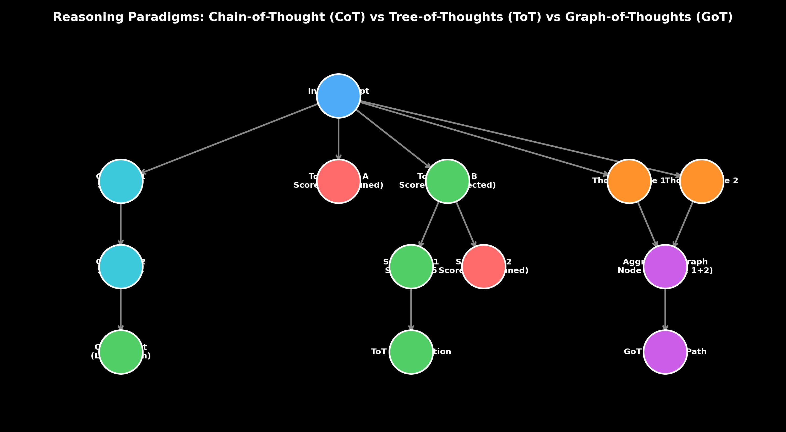

# Prompt Engineering Patterns: CoT, ToT & Graph-of-Thoughts

This guide details reasoning prompt architecture patterns, walking through Chain-of-Thought (CoT), Tree-of-Thoughts (ToT), Graph-of-Thoughts (GoT), Directional Stimulus Prompting, and Skeleton-of-Thought, complete with hand calculations, Python search code, and production failure modes.

> **Notebook Companion**: [01_prompt_patterns_cot_tot_got.ipynb](file:///d:/Study/Prep/machine-learning-prep/generative-ai-and-agentic-ai/01_prompt_engineering/01_prompt_patterns_cot_tot_got.ipynb)

---

## 1. Evolution of Reasoning Prompt Architectures

Standard zero-shot prompting directly maps an input query $x$ to an output response $y$. For complex multi-step reasoning tasks (e.g. arithmetic, logic puzzles, planning), standard greedy decoding frequently fails because the model must compute the final answer in a single forward pass without intermediate computation steps.

```text
Pattern Name              Search Topology      Best Suited For                      Latency Penalty
----------------------------------------------------------------------------------------------------------------------
Zero-Shot / Few-Shot      Direct (Point-wise)  Simple classification, extraction     1x (Baseline)
Chain-of-Thought (CoT)    Linear Chain         Sequential logic, multi-step math     2x - 5x
Tree-of-Thoughts (ToT)    Tree (BFS/DFS)       Combinatorial search, Game of 24      10x - 50x
Graph-of-Thoughts (GoT)   Arbitrary DAG        Aggregation, sorting, summarization   15x - 60x
Skeleton-of-Thought       Parallel Star        Long-form generation, speedup         0.3x - 0.5x (Speedup)
```



> [!NOTE]
> **Plot Interpretation & Interview Takeaways:**
> - **What is shown:** Structural topology comparing linear Chain-of-Thought (CoT), branching Tree-of-Thoughts (ToT) with branch pruning, and DAG Graph-of-Thoughts (GoT) node aggregation.
> - **Key Systems Insight:** Linear CoT explores a single path; if an early reasoning step makes an error, the error propagates catastrophically. ToT evaluates multiple candidate thoughts per step and backtracks when a branch score drops below threshold $S_{\text{prune}}$. GoT allows merging multiple independent thought branches ($N_1 + N_2 \to N_{3}$) for collaborative aggregation.
> - **Interview Application:** When asked *"How do you solve complex multi-step reasoning failures in LLMs?"*, explain the transition from single-chain greedy sampling to tree search (BFS/DFS) with heuristic branch evaluations.

---

## 2. Mathematical Heuristic & Hand Calculation (Andrew Ng Style)

In Tree-of-Thoughts (ToT), at each step $t$, the model generates $k$ candidate thought steps $\{z_{t}^{(1)}, z_{t}^{(2)}, \dots, z_{t}^{(k)}\}$. An evaluator function $V(s)$ assigns a scalar score $s \in [0, 1]$ to each state.

### Step-by-Step Hand Calculation on a 3-Branch ToT Search:

Let an input query be a logic puzzle. At step $t=1$, the model generates 3 candidate reasoning branches ($z_1, z_2, z_3$).

1. **Candidate Thought Generation:**
   - Branch 1 ($z_1$): *"Assume $A$ is true. Then $B$ must be false."*
   - Branch 2 ($z_2$): *"Assume $A$ is false. Then $B$ can be either true or false."*
   - Branch 3 ($z_3$): *"Ignore $A$ and assume $B$ is true."*

2. **Evaluator Scoring ($V(s)$):**
   - $V(z_1) = 0.85$ (High promise, constraint consistent)
   - $V(z_2) = 0.40$ (Low promise, ambiguous)
   - $V(z_3) = 0.15$ (Violates puzzle constraints)

3. **Pruning Threshold Application ($S_{\text{prune}} = 0.50$):**
   - $z_1: 0.85 \ge 0.50 \implies \mathbf{\text{KEEP}}$ (Expand in next step)
   - $z_2: 0.40 < 0.50 \implies \mathbf{\text{PRUNE}}$ (Discard branch)
   - $z_3: 0.15 < 0.50 \implies \mathbf{\text{PRUNE}}$ (Discard branch)

4. **Outcome:** Search budget is concentrated entirely on exploring descendants of $z_1$, avoiding compute waste on invalid paths.

---

## 3. Production Python Implementation

```python
import numpy as np

class TreeOfThoughtsSearch:
    def __init__(self, eval_threshold=0.50):
        self.eval_threshold = eval_threshold

    def evaluate_thought(self, prompt: str, candidate_thought: str) -> float:
        """Simulates an LLM evaluator scoring a candidate thought step."""
        # Simple heuristic scoring for demonstration
        if "invalid" in candidate_thought.lower() or "ignore" in candidate_thought.lower():
            return 0.15
        elif "assume" in candidate_thought.lower():
            return 0.85
        return 0.40

    def run_bfs(self, prompt: str, candidates: list[str]) -> list[str]:
        valid_branches = []
        for thought in candidates:
            score = self.evaluate_thought(prompt, thought)
            if score >= self.eval_threshold:
                valid_branches.append((thought, score))
        # Sort by evaluation score descending
        valid_branches.sort(key=lambda x: x[1], reverse=True)
        return [b[0] for b in valid_branches]

# Execution Demonstration
tot = TreeOfThoughtsSearch(eval_threshold=0.50)
sample_candidates = [
    "Assume A is true, then B must be false.",
    "Assume A is false, then B can be arbitrary.",
    "Ignore constraint A and assume B is true."
]

selected = tot.run_bfs("Solve logic puzzle", sample_candidates)
print(f"Selected Branches for Expansion ({len(selected)}/{len(sample_candidates)}):")
for idx, b in enumerate(selected, 1):
    print(f"  {idx}. {b}")
```

---

## 4. Production Failure Modes & Trade-offs

- **Computational Latency Cost**: ToT and GoT require $10\text{x} - 50\text{x}$ more LLM calls per request compared to standard inference, making them unsuitable for real-time user-facing chatbots ($> 10\text{s}$ response times).
- **Evaluator Bias & Self-Enhancement**: If the evaluator model is the same LLM generating the thoughts, it often over-scores its own flawed reasoning branches.
- **Context Window Saturation**: Amalgamating all branches in GoT graph nodes rapidly exhausts context windows, requiring aggressive token trimming.
