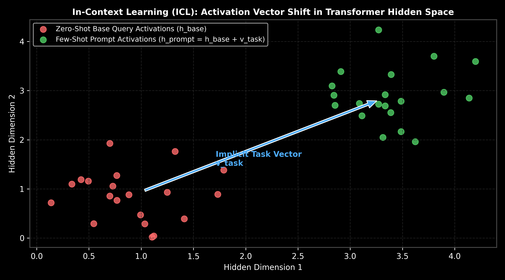

# In-Context Learning (ICL) Internal Mechanics

This guide details how Large Language Models perform In-Context Learning (ICL) without updating model weights, examining attention activation shifts, the implicit task vector hypothesis, hand calculations, PyTorch activation extraction, and production trade-offs.

> **Notebook Companion**: [02_in_context_learning_mechanisms.ipynb](file:///d:/Study/Prep/machine-learning-prep/generative-ai-and-agentic-ai/01_prompt_engineering/02_in_context_learning_mechanisms.ipynb)

---

## 1. What is In-Context Learning (ICL)?

In-Context Learning (ICL) refers to the capability of pre-trained LLMs to learn new tasks at inference time given only a few input-output demonstration pairs inside the prompt, **without any backpropagation or parameter updates**.

```text
Paradigm                   Weights Updated?  Execution Time      Context Overhead
----------------------------------------------------------------------------------------------------------------------
Fine-Tuning (SFT / PEFT)   Yes (Model parameters) Pre-deployment     Zero (No extra prompt tokens)
In-Context Learning (ICL)  No (Static weights)  Inference Time      High (Consumes token context)
```



> [!NOTE]
> **Plot Interpretation & Interview Takeaways:**
> - **What is shown:** Scatter plot of hidden activation vectors comparing zero-shot base queries ($h_{\text{base}}$) vs. few-shot prompts ($h_{\text{prompt}}$), illustrating the linear displacement vector $v_{\text{task}}$.
> - **Key Systems Insight:** In-context demonstration examples shift intermediate transformer hidden representations along a consistent trajectory in representation space. Attention heads aggregate demonstration tokens into an implicit task vector $v_{\text{task}}$ that steers final token predictions.
> - **Interview Application:** When asked *"How does a model 'learn' from prompt examples without updating weights?"*, cite attention activation shifts and the implicit task vector hypothesis.

---

## 2. Mathematical Intuition & Hand Calculation (Andrew Ng Style)

Let $h_{\text{base}} \in \mathbb{R}^d$ be the final layer activation vector for a zero-shot input token query. Adding $k$ prompt demonstrations shifts the final layer representation to:

$$h_{\text{prompt}} = h_{\text{base}} + v_{\text{task}}$$

Where $v_{\text{task}}$ is the centroid shift vector aggregated across the demonstration pairs:
$$v_{\text{task}} = \frac{1}{k} \sum_{i=1}^k \left( h(x_i, y_i) - h(x_i) \right)$$

### Step-by-Step Hand Calculation on a 2D Activation Vector:

Let a 2D activation vector for a zero-shot sentiment query be $h_{\text{base}} = \begin{bmatrix} 1.0 \\ 1.0 \end{bmatrix}$.

1. **Demonstration 1 Shift Vector:**
   - Prompt: *"Great movie -> Positive"*
   - Shift $\Delta h_1 = \begin{bmatrix} 2.0 \\ 1.5 \end{bmatrix}$

2. **Demonstration 2 Shift Vector:**
   - Prompt: *"Terrible service -> Negative"*
   - Shift $\Delta h_2 = \begin{bmatrix} 3.0 \\ 2.5 \end{bmatrix}$

3. **Compute Implicit Task Vector ($v_{\text{task}}$):**
   $$v_{\text{task}} = \frac{\Delta h_1 + \Delta h_2}{2} = \frac{\begin{bmatrix} 2.0 \\ 1.5 \end{bmatrix} + \begin{bmatrix} 3.0 \\ 2.5 \end{bmatrix}}{2} = \begin{bmatrix} 2.5 \\ 2.0 \end{bmatrix}$$

4. **Compute Final Steered Hidden Representation ($h_{\text{prompt}}$):**
   $$h_{\text{prompt}} = h_{\text{base}} + v_{\text{task}} = \begin{bmatrix} 1.0 \\ 1.0 \end{bmatrix} + \begin{bmatrix} 2.5 \\ 2.0 \end{bmatrix} = \mathbf{\begin{bmatrix} 3.5 \\ 3.0 \end{bmatrix}}$$

**Result:** The final activation vector is shifted into the "Sentiment Classifier" region of the hidden feature space.

---

## 3. Production PyTorch Activation Vector Extraction

```python
import torch

# Simulate PyTorch hidden representations for zero-shot vs few-shot
torch.manual_seed(42)
d_model = 64
num_samples = 10

# Base queries (zero-shot)
h_base = torch.randn(num_samples, d_model) + 1.0

# Synthesize implicit task vector shift
v_task = torch.tensor([2.5 if i % 2 == 0 else 2.0 for i in range(d_model)])
h_prompt = h_base + v_task + (torch.randn(num_samples, d_model) * 0.1)

# Extract estimated task vector from activations
estimated_v_task = (h_prompt - h_base).mean(dim=0)

print(f"Extracted Task Vector Shape: {estimated_v_task.shape}")
print(f"First 5 dimensions of extracted task vector: {estimated_v_task[:5].numpy().round(3)}")
```

---

## 4. Production Trade-offs & Failure Modes

- **Demonstration Order Sensitivity**: Reordering the prompt examples can swing benchmark accuracy by $20\% - 30\%$ due to recency bias in multi-head attention.
- **Label Invariance Trap**: Larger LLMs ($> 70\text{B}$) rely heavily on pre-trained priors; providing incorrect labels in demonstrations (e.g. *"2 + 2 = 5"*) can be ignored by the model, reverting to pre-trained ground truth.
- **Context Overhead**: Every demonstration consumes input token budget, increasing Time-to-First-Token (TTFT) latency and serving costs.
