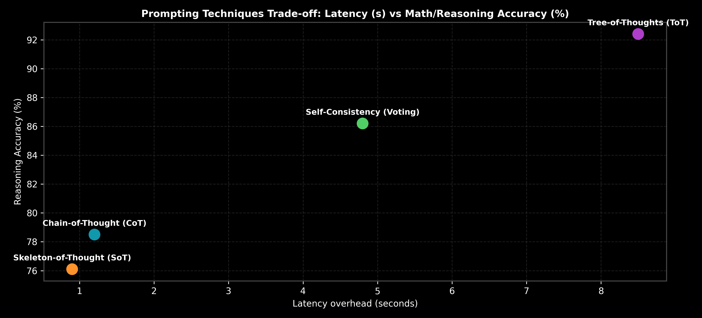

# Module 02: Advanced Prompting Techniques & Reasoning Paradigms

This guide provides an in-depth analysis of 14 core prompting techniques, detailing when to use and when NOT to use each technique, mathematical formulations of majority voting, tree search evaluations, step-by-step hand calculations, and complete LangChain execution pipelines across OpenAI and Ollama.

> **Notebook Companion**: [02_prompting_techniques.ipynb](file:///d:/Study/Prep/machine-learning-prep/generative-ai-and-agentic-ai/01_prompt_engineering/02_prompting_techniques.ipynb)

---

## 1. Deep Dive into 14 Prompting Techniques

```text
Technique               Core Concept                                      Latency / Cost Impact   Best Suited For
----------------------------------------------------------------------------------------------------------------------
1. Zero-Shot            Direct task instruction without examples          1x Latency, 1x Cost     Simple classification/summary
2. Few-Shot             Provides 2-5 input-output demonstration pairs    1.2x Latency, 1.3x Cost Hard format/style matching
3. Chain-of-Thought     Forces intermediate step-by-step reasoning        1.5x Latency, 1.8x Cost Multi-step math & logic
4. Self-Consistency     Sample N CoT paths; take majority vote            N x Latency, N x Cost   High-precision benchmark tasks
5. Tree-of-Thoughts     BFS/DFS graph search over evaluated thoughts      10x - 20x Latency/Cost  Complex planning & exploration
6. Graph-of-Thoughts    DAG aggregation of non-linear thoughts            15x - 25x Latency/Cost  Consensus & multi-path aggregation
7. Least-to-Most        Decomposes hard problem into sub-problem chain    3x - 5x Latency/Cost    Symbolic reasoning & coding
8. Plan-and-Solve       Generates full plan before executing sub-tasks    2x Latency/Cost         Multi-step agent tasks
9. Skeleton-of-Thought  Generates skeleton outline; expands in parallel   0.3x Speedup (Parallel) Long document generation
10. Step-Back           Generates high-level abstract question first      2x Latency/Cost         Complex physics/math principles
11. Directional Stimulus Injects explicit guidance hints into prompt      1.1x Latency/Cost       Summarization steering
12. Generated Knowledge Forces LLM to generate domain facts before query 2x Latency/Cost         Fact-heavy QA
13. Auto Prompt Eng(APE) Uses LLM to generate & evaluate optimal prompts  Offline Compilation     Automated prompt optimization
14. ReAct               Interleaves Thought -> Action -> Observation      Variable Agent Loop     Interactive Tool & API use
```



---

## 2. Detailed Technical Breakdown: When to Use & When NOT to Use

### 1. Zero-Shot Prompting
- **Mechanism:** Provides direct task instructions without any input-output demonstrations.
- **When to Use:** Standard tasks (sentiment analysis, translation, basic text summarization) where modern LLMs have high baseline accuracy.
- **When NOT to Use:** Niche domain entity extraction, custom JSON schemas, or complex mathematical multi-step reasoning.

### 2. Few-Shot Prompting
- **Mechanism:** Injects 2–5 demonstration pairs (`Input: ... -> Output: ...`) into the prompt context.
- **When to Use:** Enforcing strict output formats, teaching novel domain terminology, or standardizing output tone.
- **When NOT to Use:** Simple tasks (wastes token budget), long-context prompts where examples cause attention degradation, or tasks requiring deep multi-step logic (use CoT instead).

### 3. Chain-of-Thought (CoT) & Zero-Shot CoT
- **Mechanism:** Prompts the model to generate explicit intermediate reasoning steps ("*Let's think step by step*") before outputting the answer.
- **Why it Works:** Expands the autoregressive sequence length, giving the model's self-attention layers more compute steps to resolve dependencies.
- **When to Use:** Mathematical word problems, logic puzzles, multi-step code debugging, symbolic reasoning.
- **When NOT to Use:** Simple retrieval QA, basic classification, or latency-critical APIs ($50\text{ms}$ budget limit).

### 4. Self-Consistency Voting
- **Mechanism:** Samples $N$ independent CoT reasoning paths at temperature $T > 0.5$ and selects the final answer via majority voting.
- **When to Use:** High-stakes financial calculations, medical diagnosis benchmarks, or competitive coding where accuracy is paramount.
- **When NOT to Use:** Real-time user interfaces (multiplies API costs and latency by $N$).

### 5. Tree-of-Thoughts (ToT) & Graph-of-Thoughts (GoT)
- **Mechanism:** Maintains a tree/graph of thought candidates. Uses an evaluator LLM to score branches ($V(s) \in [0, 1]$) and executes BFS/DFS search to prune low-scoring reasoning paths.
- **When to Use:** Complex strategy games (Chess, Game of 24), theorem proving, multi-file code refactoring.
- **When NOT to Use:** Standard enterprise RAG pipelines (adds $10\text{s} - 30\text{s}$ latency and massive token costs).

### 6. Skeleton-of-Thought (SoT)
- **Mechanism:** First generates a high-level skeleton outline (e.g. 5 points). Then issues 5 parallel API calls to expand each point simultaneously, concatenating the final result.
- **When to Use:** Long-form blog posts, report generation, documentation writing where generation speed is bottlenecked by sequential token decoding.
- **When NOT to Use:** Sequential tasks where Point 3 depends directly on the output of Point 2.

---

## 3. Mathematical Precision & Hand Calculation: Self-Consistency (Andrew Ng Style)

Let single-path CoT accuracy be $p = 0.60$ on a 3-choice math problem. Suppose we sample $N=5$ independent reasoning paths.

The probability that the correct answer wins a majority vote ($\ge 3$ out of $5$ votes) is given by the Binomial cumulative distribution:

$$P(\text{Majority Success}) = \sum_{k=\lceil N/2 \rceil}^N \binom{N}{k} p^k (1-p)^{N-k}$$

### Hand Calculation:
For $N=5, p=0.60, q = 1-p = 0.40$:

1. **$k=3$ Correct Votes:**
   $$\binom{5}{3} (0.60)^3 (0.40)^2 = 10 \times 0.216 \times 0.16 = \mathbf{0.3456}$$

2. **$k=4$ Correct Votes:**
   $$\binom{5}{4} (0.60)^4 (0.40)^1 = 5 \times 0.1296 \times 0.40 = \mathbf{0.2592}$$

3. **$k=5$ Correct Votes:**
   $$\binom{5}{5} (0.60)^5 (0.40)^0 = 1 \times 0.07776 \times 1 = \mathbf{0.07776}$$

4. **Total Majority Vote Success Probability:**
   $$P(\text{Success}) = 0.3456 + 0.2592 + 0.07776 = \mathbf{0.68256 \ (68.26\%)}$$

**Takeaway:** Self-Consistency boosts reasoning accuracy from **$60.0\%$** to **$68.3\%$** simply through parallel sampling and majority voting.

---

## 4. Production LangChain Code Implementation

```python
import os
from dotenv import load_dotenv
from langchain_core.prompts import ChatPromptTemplate, FewShotChatMessagePromptTemplate
from langchain_openai import ChatOpenAI
from langchain_community.llms import Ollama

# 1. Load API keys from root .env
load_dotenv()

# 2. Few-Shot Demonstration Template
example_prompt = ChatPromptTemplate.from_messages([
    ("user", "{input}"),
    ("assistant", "{output}")
])

few_shot_prompt = FewShotChatMessagePromptTemplate(
    example_prompt=example_prompt,
    examples=[
        {
            "input": "A store has 3 boxes of 12 pencils. They sell 15 pencils. How many remain?",
            "output": "1. Total initial pencils = 3 boxes * 12 pencils = 36 pencils.\n2. Pencils remaining = 36 - 15 = 21 pencils.\nAnswer: 21"
        }
    ]
)

final_prompt = ChatPromptTemplate.from_messages([
    ("system", "You are a mathematical reasoning engine. Always break down problems step by step."),
    few_shot_prompt,
    ("user", "{input}")
])

formatted = final_prompt.format(input="A factory makes 50 cars per day. It operates for 5 days. 40 cars are shipped. How many remain in inventory?")

# 3. Model Execution
if os.getenv("OPENAI_API_KEY"):
    llm = ChatOpenAI(model="gpt-4o-mini", temperature=0.0)
    print("=== OpenAI CoT Execution ===")
    print(llm.invoke(formatted).content)
```

---

## 5. Failure Modes & Remediation Rules

- **CoT Hallucination Cascade**: In long CoT chains, an error in Step 1 propagates to all subsequent steps.
  - *Fix:* Use **Self-Consistency Voting** or **Least-to-Most** sub-task decomposition to verify Step 1 independently before proceeding.
