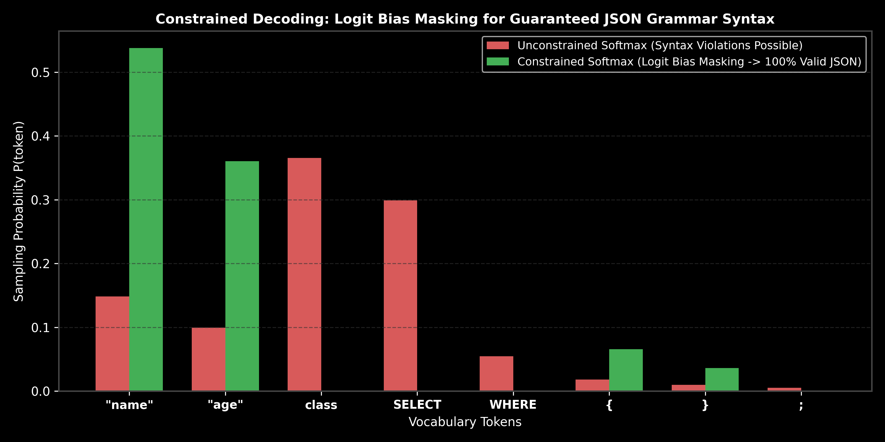

# Constrained Decoding & Structured Output Enforcement

This guide details techniques for enforcing $100\%$ valid structured outputs (JSON, Pydantic, SQL) from LLMs using constrained decoding, logit bias masking, GBNF grammars, hand calculations, PyTorch code, and production failure modes.

> **Notebook Companion**: [03_constrained_decoding_and_structured_outputs.ipynb](file:///d:/Study/Prep/machine-learning-prep/generative-ai-and-agentic-ai/01_prompt_engineering/03_constrained_decoding_and_structured_outputs.ipynb)

---

## 1. Why Constrained Decoding is Needed

Standard LLM generation samples tokens freely from the full vocabulary $\mathcal{V}$. Even with strict system prompts requesting JSON outputs, unconstrained sampling frequently outputs trailing commas, invalid keys, markdown formatting codeblocks, or truncated syntax.

```text
Approach               Enforcement Level  Latency Overhead    Syntax Guarantee
----------------------------------------------------------------------------------------------------------------------
Prompting ("Output JSON") Soft / Heuristic  Zero                No (20% - 40% syntax failure rate)
JSON Mode (OpenAI)        Medium            Minimal             Partial (Keys forced, values unconstrained)
Logit Masking / Grammars  Hard Constraint   Zero (Mask overlay) 100% Guaranteed valid JSON/SQL schema
```



> [!NOTE]
> **Plot Interpretation & Interview Takeaways:**
> - **What is shown:** Bar plot comparing unconstrained token sampling probabilities vs. constrained logit bias masking ($b_i = -\infty$ for illegal tokens).
> - **Key Systems Insight:** Constrained decoding operates directly at the model output logit tensor level before softmax sampling. By dynamically applying a mask vector overlay $M \in \{0, -\infty\}$ based on finite state automata (FSA) or GBNF grammar state, invalid token transitions are rendered impossible ($P(\text{token}) = 0$).
> - **Interview Application:** When asked *"How do you guarantee an LLM returns parseable JSON in production without retry loops?"*, explain grammar-guided logit masking via finite state automata.

---

## 2. Mathematical Formulation & Hand Calculation (Andrew Ng Style)

Let $z \in \mathbb{R}^{|\mathcal{V}|}$ be the raw logit output vector from the LLM final projection layer for vocabulary $\mathcal{V}$.

A grammar state tracker maintains a set of allowed token IDs $\mathcal{A} \subset \mathcal{V}$. The logit bias mask $b \in \mathbb{R}^{|\mathcal{V}|}$ is defined as:

$$b_i = \begin{cases} 0 & \text{if } i \in \mathcal{A} \\ -\infty & \text{if } i \notin \mathcal{A} \end{cases}$$

The constrained probability distribution $p$ becomes:
$$p_i = \text{softmax}(z_i + b_i) = \frac{\exp(z_i + b_i)}{\sum_{j \in \mathcal{V}} \exp(z_j + b_j)}$$

### Step-by-Step Hand Calculation on a 4-Token Vocabulary:

Let vocabulary $\mathcal{V} = [\text{'"name"', '"age"', 'SELECT', ';'}]$, with raw logits $z = [4.2, \ 3.8, \ 5.1, \ 0.8]$.

Suppose the parser is currently inside a JSON object `{` and expects a string key. Allowed tokens: $\mathcal{A} = [0, 1]$ (`"name"`, `"age"`).

1. **Construct Logit Mask Overlay ($b$):**
   $$b = [0, \ 0, \ -\infty, \ -\infty]$$

2. **Apply Logit Mask ($z + b$):**
   $$z_{\text{masked}} = [4.2 + 0, \ 3.8 + 0, \ 5.1 - \infty, \ 0.8 - \infty] = [4.2, \ 3.8, \ -\infty, \ -\infty]$$

3. **Compute Constrained Softmax Probabilities:**
   - $\exp(4.2) \approx 66.69, \quad \exp(3.8) \approx 44.70, \quad \exp(-\infty) = 0.0$
   - $\text{Sum} = 66.69 + 44.70 = 111.39$
   - $p_0 = \frac{66.69}{111.39} \approx \mathbf{0.598} \ (59.8\%)$
   - $p_1 = \frac{44.70}{111.39} \approx \mathbf{0.402} \ (40.2\%)$
   - $p_2 = \mathbf{0.000}, \quad p_3 = \mathbf{0.000}$

**Result:** Tokens `SELECT` and `;` are completely masked out, ensuring $100\%$ valid JSON syntax output.

---

## 3. Production PyTorch LogitProcessor Implementation

```python
import torch
import torch.nn.functional as F

class SchemaConstrainedLogitProcessor:
    def __init__(self, allowed_token_ids: list[int]):
        self.allowed_token_ids = set(allowed_token_ids)

    def __call__(self, logits: torch.Tensor) -> torch.Tensor:
        mask = torch.full_like(logits, float('-inf'))
        for token_id in self.allowed_token_ids:
            mask[..., token_id] = 0.0
        return logits + mask

# Execution Demonstration
raw_logits = torch.tensor([4.2, 3.8, 5.1, 0.8])
allowed_ids = [0, 1] # Allow only "name" and "age"

processor = SchemaConstrainedLogitProcessor(allowed_token_ids=allowed_ids)
constrained_logits = processor(raw_logits)
constrained_probs = F.softmax(constrained_logits, dim=-1)

print(f"Raw Softmax Probabilities:         {F.softmax(raw_logits, dim=-1).numpy().round(3)}")
print(f"Constrained Softmax Probabilities: {constrained_probs.numpy().round(3)}")
```

---

## 4. Production Failure Modes & Trade-offs

- **Sub-Token Splitting Traps**: Tokenizers break words across boundaries (e.g. `"SELECT"` split into `"SE"` and `"LECT"`). If a grammar mask expects `"SELECT"`, masking must track partial token sub-trees across multi-token prefixes.
- **Model Reasoning Degradation**: Forcing strict schema output constraints from token $0$ can lower reasoning quality because the model is deprived of free-form Chain-of-Thought planning workspace tokens.
