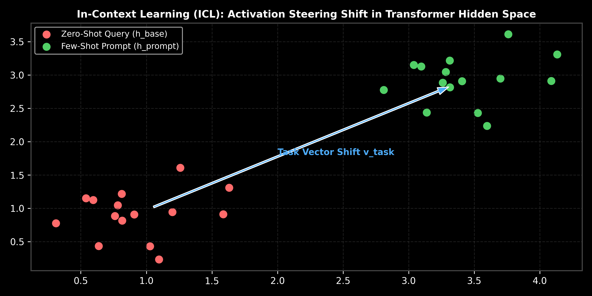

# Module 03: In-Context Learning (ICL) & Vector Steering

This guide provides an in-depth exploration of In-Context Learning (ICL) mechanics, hidden space activation steering vectors ($v_{\text{task}}$), emergent abilities vs. scale, ICL vs. Fine-tuning, demonstration selection strategies (k-NN, MMR), ordering effects, long-context dynamics ("Lost in the Middle"), hand calculations, and production LangChain implementations.

> **Notebook Companion**: [03_in_context_learning_mechanisms.ipynb](file:///d:/Study/Prep/machine-learning-prep/generative-ai-and-agentic-ai/01_prompt_engineering/03_in_context_learning_mechanisms.ipynb)

---

## 1. What is In-Context Learning (ICL)?

In-Context Learning (ICL) is the ability of pretrained Large Language Models to perform novel tasks simply by ingesting a few input-output demonstration pairs within their prompt context, without updating any model weights ($\nabla_\theta \mathcal{L} = 0$).

```text
Dimension              In-Context Learning (ICL)               Parameter Fine-Tuning (PEFT / SFT)
----------------------------------------------------------------------------------------------------------------------
Weight Updates         Zero weight updates (Fixed \theta)     Updates subset (LoRA) or all weights
Latency                Zero upfront training latency          Requires hours to days of GPU training
Task Adaptability      Instantaneous via prompt swaps          Requires deploying a new model checkpoint
Context Consumption    Consumes valuable context window tokens Zero prompt token overhead during inference
Domain Mastery         Moderate (Bounded by context length)    High (Deep specialization on massive datasets)
```

---

## 2. Why Does ICL Work? Activation Steering Mechanics

Recent mechanistic interpretability research (e.g., von Oswald et al., Dai et al.) reveals that transformer self-attention layers perform an implicit form of **gradient descent in activation space**.

When a model processes few-shot demonstrations, the key-value projections map the demonstration pairs into a task steering vector $v_{\text{task}} \in \mathbb{R}^d$:

$$h_{\text{prompt}} = h_{\text{query}} + v_{\text{task}}$$

Where:
- $h_{\text{query}}$ is the unconditioned base representation of the user query.
- $v_{\text{task}}$ is the implicit task displacement vector extracted from few-shot demonstrations.



---

## 3. Demonstration Selection Strategies

The choice of demonstrations dramatically impacts ICL accuracy:

1. **Random Selection**: Selects random examples from a dataset. High risk of injecting irrelevant noise.
2. **k-NN Semantic Similarity Selection**: Embeds the user query and selects the top-$k$ most semantically similar demonstrations using cosine similarity.
3. **Maximal Marginal Relevance (MMR)**: Balances similarity to the query with diversity among selected examples to prevent redundant demonstrations:
   $$\text{MMR} = \arg\max_{d_i \in \mathcal{D} \setminus S} \left[ \lambda \cos(d_i, q) - (1-\lambda) \max_{d_j \in S} \cos(d_i, d_j) \right]$$

---

## 4. Ordering Effects & Biases in ICL

ICL performance is highly sensitive to demonstration order and formatting:

- **Recency Bias**: Models tend to over-weight the last demonstration provided right before the user query.
- **Majority Label Bias**: If 4 out of 5 demonstrations belong to Class A, the LLM will heavily bias its output toward Class A regardless of input.
- **Common Word Bias**: LLMs favor outputting frequent tokens over rare domain terms unless explicitly reinforced in demonstrations.

---

## 5. Mathematical Hand Calculation: k-NN Exemplar Selection (Andrew Ng Style)

Suppose a sentiment classification query $q = \text{"Stock prices plummeted 15\% after earnings call"}$.
Embedding vector $q = \begin{bmatrix} 0.80 \\ 0.20 \end{bmatrix}$ (Normalized unit vector).

Candidate demonstration pool $\mathcal{D}$:
- $d_1 = \text{"Revenue dropped 10\%"}$, $d_1 = \begin{bmatrix} 0.90 \\ 0.10 \end{bmatrix}$, Label = `Negative`
- $d_2 = \text{"Company hired 500 employees"}$, $d_2 = \begin{bmatrix} 0.20 \\ 0.80 \end{bmatrix}$, Label = `Positive`
- $d_3 = \text{"Shares fell sharp in Q3"}$, $d_3 = \begin{bmatrix} 0.85 \\ 0.15 \end{bmatrix}$, Label = `Negative`

### 1. Calculate Cosine Similarity to Query $q$:
- $\text{sim}(q, d_1) = (0.80)(0.90) + (0.20)(0.10) = 0.72 + 0.02 = \mathbf{0.74}$
- $\text{sim}(q, d_2) = (0.80)(0.20) + (0.20)(0.80) = 0.16 + 0.16 = \mathbf{0.32}$
- $\text{sim}(q, d_3) = (0.80)(0.85) + (0.20)(0.15) = 0.68 + 0.03 = \mathbf{0.71}$

### 2. Select Top-$k=2$ Exemplars:
Rankings: $d_1 (0.74) > d_3 (0.71) > d_2 (0.32)$.
Select **$d_1$** and **$d_3$** as demonstrations for the prompt context.

---

## 6. Production LangChain Code Implementation

```python
import os
from dotenv import load_dotenv
from langchain_community.vectorstores import FAISS
from langchain_openai import OpenAIEmbeddings
from langchain_core.prompts import ChatPromptTemplate, FewShotChatMessagePromptTemplate

load_dotenv()

# Sample Few-Shot Dataset
examples = [
    {"input": "Revenue dropped 10% in Q3.", "output": "Negative"},
    {"input": "Company hired 500 engineers.", "output": "Positive"},
    {"input": "Shares fell sharply after earnings.", "output": "Negative"}
]

# Configure Semantic Similarity Selector
if os.getenv("OPENAI_API_KEY"):
    embeddings = OpenAIEmbeddings()
    to_vectorize = [" ".join(example.values()) for example in examples]
    vectorstore = FAISS.from_texts(to_vectorize, embeddings, metadatas=examples)
    
    # Retrieve Top-1 Most Similar Exemplar
    docs = vectorstore.similarity_search("Stock prices plummeted 15%", k=1)
    selected_example = docs[0].metadata
    
    print("k-NN Selected Demonstration:", selected_example)
```

---

## 7. Failure Modes & Limitations

- **"Lost in the Middle" Degradation**: Injecting 20+ demonstrations causes middle examples to be ignored by self-attention layers. Limit demonstrations $k \le 5$.
- **Format Over-fitting**: If demonstrations contain typos or formatting errors, the LLM will mirror those exact errors in its output.
