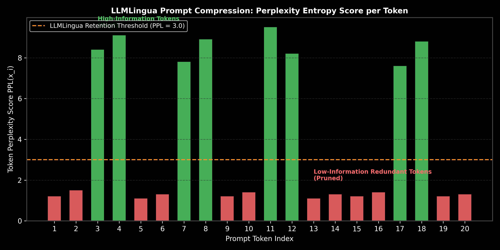

# Prompt Optimization: DSPy & LLMLingua Compression

This guide details algorithmic prompt optimization (APE, DSPy) and perplexity-based prompt compression (LLMLingua), complete with entropy filtering math, step-by-step calculations, Python code, and production trade-offs.

> **Notebook Companion**: [04_prompt_optimization_dspy_llmlingua.ipynb](file:///d:/Study/Prep/machine-learning-prep/generative-ai-and-agentic-ai/01_prompt_engineering/04_prompt_optimization_dspy_llmlingua.ipynb)

---

## 1. Automated Prompting & Compression Architecture

Hand-written prompts are brittle, unportable across model versions, and waste expensive context tokens. Modern GenAI pipelines replace manual prompt engineering with two algorithmic paradigms:

```text
Technique Name         Primary Goal             Mechanism                          Output Benefit
----------------------------------------------------------------------------------------------------------------------
DSPy Compilation       Optimize Accuracy        Compiles instruction & few-shots   Higher benchmark score
LLMLingua Compression  Reduce Latency & Cost    Perplexity entropy token pruning   50% - 80% token reduction
```



> [!NOTE]
> **Plot Interpretation & Interview Takeaways:**
> - **What is shown:** Perplexity score $PPL(x_i)$ distribution across prompt tokens. Tokens above retention threshold $\tau = 3.0$ are kept; low-perplexity redundant tokens are pruned.
> - **Key Systems Insight:** LLMLingua uses a small, fast LM (e.g. Llama-3-8B) to compute surprise/perplexity per token. Connectives and boilerplate words have low perplexity ($PPL \approx 1.0$) because they are easily predicted by the model, whereas core entities and instruction keywords have high perplexity. Pruning low-PPL tokens preserves prompt semantics while reducing prompt length by up to $80\%$.
> - **Interview Application:** When asked *"How do you reduce prompt latency and token costs for 20k token system prompts?"*, cite LLMLingua perplexity-based token compression.

---

## 2. Mathematical Formulation & Hand Calculation (Andrew Ng Style)

Let a prompt sequence be $X = (x_1, x_2, \dots, x_N)$. The conditional perplexity $PPL(x_i)$ of token $x_i$ given prior context $x_{<i}$ evaluated by a small language model is:

$$PPL(x_i) = \exp \left( -\log P(x_i \mid x_{<i}) \right) = \frac{1}{P(x_i \mid x_{<i})}$$

A token $x_i$ is retained in the compressed prompt $X_{\text{compressed}}$ if its perplexity exceeds threshold $\tau$:

$$X_{\text{compressed}} = \{ x_i \in X \mid PPL(x_i) \ge \tau \}$$

### Step-by-Step Hand Calculation on a 5-Token Prompt:

Let prompt tokens be $X = [\text{"System:", "You", "are", "helpful", "Summarize"}]$ with predicted conditional probabilities from a small model:
- $P(\text{"System:"}) = 0.10 \implies PPL = \frac{1}{0.10} = \mathbf{10.0}$
- $P(\text{"You"}) = 0.90 \implies PPL = \frac{1}{0.90} \approx \mathbf{1.11}$
- $P(\text{"are"}) = 0.95 \implies PPL = \frac{1}{0.95} \approx \mathbf{1.05}$
- $P(\text{"helpful"}) = 0.85 \implies PPL = \frac{1}{0.85} \approx \mathbf{1.18}$
- $P(\text{"Summarize"}) = 0.12 \implies PPL = \frac{1}{0.12} \approx \mathbf{8.33}$

Let retention threshold $\tau = 2.0$:
- `"System:"`: $10.0 \ge 2.0 \implies \mathbf{\text{KEEP}}$
- `"You"`: $1.11 < 2.0 \implies \mathbf{\text{PRUNE}}$
- `"are"`: $1.05 < 2.0 \implies \mathbf{\text{PRUNE}}$
- `"helpful"`: $1.18 < 2.0 \implies \mathbf{\text{PRUNE}}$
- `"Summarize"`: $8.33 \ge 2.0 \implies \mathbf{\text{KEEP}}$

**Compressed Result:** $X_{\text{compressed}} = [\text{"System:", "Summarize"}]$ (Token count reduced from $5$ to $2$, $60\%$ compression).

---

## 3. Production Python Compression Implementation

```python
import numpy as np

class PerplexityPromptCompressor:
    def __init__(self, threshold=2.0):
        self.threshold = threshold

    def compress(self, tokens: list[str], probabilities: list[float]) -> tuple[list[str], float]:
        perplexities = [1.0 / p for p in probabilities]
        compressed_tokens = [t for t, ppl in zip(tokens, perplexities) if ppl >= self.threshold]
        compression_ratio = 1.0 - (len(compressed_tokens) / len(tokens))
        return compressed_tokens, compression_ratio

# Execution Demonstration
sample_tokens = ["System:", "You", "are", "helpful", "Summarize"]
sample_probs = [0.10, 0.90, 0.95, 0.85, 0.12]

compressor = PerplexityPromptCompressor(threshold=2.0)
compressed, ratio = compressor.compress(sample_tokens, sample_probs)

print(f"Original Prompt ({len(sample_tokens)} tokens):   {' '.join(sample_tokens)}")
print(f"Compressed Prompt ({len(compressed)} tokens): {' '.join(compressed)}")
print(f"Token Savings: {ratio:.1%}")
```

---

## 4. Production Failure Modes & Trade-offs

- **Instruction Keyword Loss**: If the compression threshold $\tau$ is set too aggressively, essential conditional words (e.g. *"not"*, *"never"*) can be pruned, inverting prompt logic.
- **DSPy Compiler Overfitting**: DSPy automatic instruction optimization optimizes prompts against a specific training set; compiled prompts can overfit and fail on out-of-distribution production queries.
