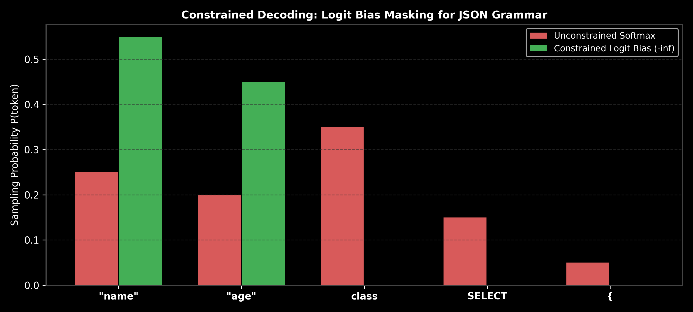

# Module 04: Structured Outputs & Constrained Decoding

This guide provides an in-depth exploration of Structured Generation, JSON Mode, Pydantic Schema enforcement, Finite State Automata (FSA) grammar decoding, Logit Bias Masking ($-\infty$), Softmax re-distribution math, step-by-step hand calculations, and complete LangChain execution pipelines across OpenAI and PyTorch.

> **Notebook Companion**: [04_structured_outputs_constrained_decoding.ipynb](file:///d:/Study/Prep/machine-learning-prep/generative-ai-and-agentic-ai/01_prompt_engineering/04_structured_outputs_constrained_decoding.ipynb)

---

## 1. Structured Output Paradigms Comparison

```text
Generation Approach   Mechanism                              Syntax Guarantee  Latency Impact
----------------------------------------------------------------------------------------------------------------------
1. Prompt Extraction  Prompt rules ("Output raw JSON ONLY")  Poor (~70% - 85%)  Fast (No overhead)
2. Pydantic Parsing   Python validation + retry loop        Medium (~90% - 95%) High on retries (2x cost)
3. Native JSON Mode   API sampling constraint                High (~98%)        Low
4. Constrained Dec.   FSA Logit Bias Masking (-inf)          100% Guaranteed    Zero Latency Overhead
```



---

## 2. Constrained Decoding Mechanics: Finite State Automata (FSA)

Constrained Decoding enforces grammar rules (JSON, SQL, Python) during token sampling rather than post-processing outputs.

### How FSA Logit Bias Masking Works:
1. At token generation step $t$, the decoder passes current generated text to a **Finite State Automata (FSA)**.
2. The FSA determines the set of allowed vocabulary token IDs $\mathcal{A}_{\text{valid}} \subset \{1, \dots, |V|\}$ that maintain valid JSON syntax.
3. Non-valid token logits are assigned a mask value $M_i = -\infty$.
4. Softmax conversion evaluates $P(\text{invalid}) = \exp(-\infty) = 0$, making it physically impossible for the model to generate a syntax error.

---

## 3. Mathematical Logit Bias Formula & Hand Calculation (Andrew Ng Style)

Let raw model output logits for a 5-token vocabulary be $z = [4.0, 3.5, 5.0, 2.0, 1.0]$.
Suppose token IDs $0$ (`"name"`) and $1$ (`"age"`) are valid JSON keys, while token IDs $2$ (`class`), $3$ (`SELECT`), and $4$ (`{`) violate syntax.

- Allowed Set: $\mathcal{A}_{\text{valid}} = \{0, 1\}$
- Logit Mask Vector: $M = [0.0, 0.0, -\infty, -\infty, -\infty]$

### 1. Compute Unconstrained Softmax Probabilities:
$$\sum e^{z_j} = e^{4.0} + e^{3.5} + e^{5.0} + e^{2.0} + e^{1.0} \approx 54.60 + 33.12 + 148.41 + 7.39 + 2.72 = 246.24$$
- $P(\text{token } 2 \text{ "class"}) = \frac{148.41}{246.24} = \mathbf{0.603 \ (60.3\% \text{ risk of syntax error})}!$

### 2. Compute Constrained Softmax Probabilities ($z + M$):
Constrained Logits: $z_{\text{constrained}} = [4.0, 3.5, -\infty, -\infty, -\infty]$
$$\sum_{j \in \mathcal{A}_{\text{valid}}} e^{z_j} = e^{4.0} + e^{3.5} = 54.60 + 33.12 = 87.72$$
- $P(\text{token } 0 \text{ '"name"'}) = \frac{54.60}{87.72} = \mathbf{0.622 \ (62.2\%)}$
- $P(\text{token } 1 \text{ '"age"'}) = \frac{33.12}{87.72} = \mathbf{0.378 \ (37.8\%)}$
- $P(\text{token } 2 \text{ "class"}) = \frac{0}{87.72} = \mathbf{0.000 \ (0.0\%)}$

**Outcome:** Syntax violations drop to **$0.0\%$**, guaranteeing 100% valid JSON tokens.

---

## 4. Production LangChain Code Implementation

```python
import os
from dotenv import load_dotenv
from langchain_openai import ChatOpenAI
from langchain_core.prompts import ChatPromptTemplate
from pydantic import BaseModel, Field

load_dotenv()

# Define Pydantic Output Schema
class FinancialMetricSchema(BaseModel):
    company_name: str = Field(description="Name of company")
    metric_name: str = Field(description="Metric extracted, e.g. Revenue")
    metric_value: str = Field(description="Exact dollar string value")
    yoy_growth_pct: float = Field(description="Percentage growth as float")

# Prompt Setup
prompt = ChatPromptTemplate.from_messages([
    ("system", "Extract financial metrics strictly matching the JSON schema."),
    ("user", "Text: {text}")
])

if os.getenv("OPENAI_API_KEY"):
    llm = ChatOpenAI(model="gpt-4o-mini", temperature=0.0)
    
    # LangChain Native Schema Binding
    structured_llm = llm.with_structured_output(FinancialMetricSchema)
    chain = prompt | structured_llm
    
    result = chain.invoke({"text": "Nvidia Q3 revenue was $18.12 billion, up 206% YoY."})
    print("Parsed Pydantic Object Output:\n", result)
```

---

## 5. Failure Modes & Safety Rules

- **Schema Field Oversimplification**: Defining complex nested schemas without clear field `description` tags leads to LLM null values.
- **Logit Bias Masking Infinite Loops**: If an FSA grammar mask accidentally masks *all* tokens at a certain state ($\mathcal{A}_{\text{valid}} = \emptyset$), the generation process crashes. Ensure fallback wildcard tokens.
