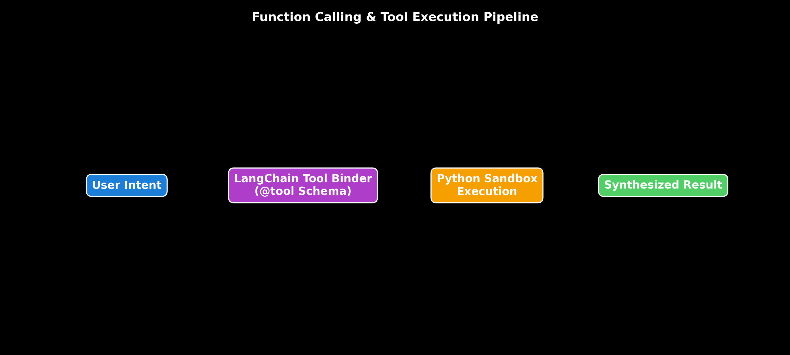

# Module 05: Function Calling & Tool Execution Systems

This guide provides an in-depth exploration of Function Calling, Tool Calling, Tool Selection, Parameter Extraction, Parallel Multi-Tool Execution, Error Retries, Dynamic Tool Routing, hand calculations, and production LangChain tool execution pipelines across OpenAI and Ollama.

> **Notebook Companion**: [05_function_calling_and_tool_calling.ipynb](file:///d:/Study/Prep/machine-learning-prep/generative-ai-and-agentic-ai/01_prompt_engineering/05_function_calling_and_tool_calling.ipynb)

---

## 1. Function Calling vs. Tool Calling Architecture

```text
Dimension              Function Calling (Legacy)               Tool Calling (Modern Standard)
----------------------------------------------------------------------------------------------------------------------
Schema Standard        OpenAI `functions` spec                 OpenAI `tools` / Anthropic `tools` spec
Execution Capability   Single function invocation per turn     Multiple parallel tool calls in 1 turn
Response Payload       `function_call` dictionary              `tool_calls` list with unique `tool_call_id`
Routing Mechanics      Hardcoded function selection            Dynamic vector tool routing & agent loops
```



---

## 2. Tool Execution Lifecycle & Error Recovery

```text
User Request ──► LLM Tool Selection ──► Schema Validation ──► Python Execution ──► Observation ──► Final Response
                        │                     │                     │
                        ▼                     ▼                     ▼
                 (Tool Name Error)    (Pydantic Type Error) (API Timeout 504)
                        │                     │                     │
                        └─────────────────────┴─────────────────────┘
                                              │
                                   [Error Context Retry Loop]
```

1. **Schema Binding**: Decorate Python functions with `@tool(args_schema=PydanticSchema)` to auto-generate JSON Schemas.
2. **LLM Tool Call Selection**: The model emits a `tool_calls` JSON payload containing `id`, `name`, and `args`.
3. **Pydantic Validation**: Validates argument types before execution.
4. **Execution & Observation**: Invokes local Python function and formats returned result as an `Observation` string.
5. **Error Feedback Retry**: If execution fails, the exception message is appended to context, allowing the LLM to auto-correct arguments.

---

## 3. Mathematical Retry Probability Hand Calculation (Andrew Ng Style)

Let a tool call's single-attempt success probability be $p = 0.70$. We implement an automated retry loop with $k=3$ max attempts.

The probability of complete system failure (all $k$ attempts fail) is:

$$P(\text{System Failure}) = (1 - p)^k = (1 - 0.70)^3 = (0.30)^3 = \mathbf{0.027 \ (2.7\%)}$$

The overall system success rate with retries is:

$$P(\text{System Success}) = 1 - P(\text{System Failure}) = 1 - 0.027 = \mathbf{0.973 \ (97.3\%)}$$

**Takeaway:** Automated exception retries increase tool execution reliability from **$70.0\%$** to **$97.3\%$**.

---

## 4. Production LangChain Code Implementation

```python
import os
from dotenv import load_dotenv
from langchain_core.tools import tool
from langchain_openai import ChatOpenAI
from pydantic import BaseModel, Field

load_dotenv()

# 1. Define Typed Pydantic Schema
class StockPriceArgs(BaseModel):
    ticker: str = Field(description="Stock ticker symbol, e.g. NVDA, AAPL")
    days: int = Field(default=30, ge=1, le=365, description="Historical range in days")

# 2. Define LangChain Tool with Decorator
@tool(args_schema=StockPriceArgs)
def get_stock_price(ticker: str, days: int = 30) -> str:
    \"\"\"Fetches historical stock prices for a given ticker.\"\"\"
    return f"Ticker {ticker}: Last {days} days average price = $125.40."

# 3. Model Tool Binding
if os.getenv("OPENAI_API_KEY"):
    llm = ChatOpenAI(model="gpt-4o-mini", temperature=0.0)
    llm_with_tools = llm.bind_tools([get_stock_price])
    
    # 4. Invoke LLM Tool Selection
    ai_msg = llm_with_tools.invoke("What is the 7-day average price of Nvidia stock?")
    print("LLM Tool Call Intent Output:\n", ai_msg.tool_calls)
    
    # 5. Execute Tool Manually
    if ai_msg.tool_calls:
        tool_call = ai_msg.tool_calls[0]
        obs = get_stock_price.invoke(tool_call["args"])
        print("\nTool Execution Observation Result:\n", obs)
```

---

## 5. Production Failure Modes & Mitigation Rules

- **Failure Mode 1: Tool Selection Hallucination**: LLM invokes a tool name that does not exist in `bind_tools()`.
  - *Fix:* Intercept tool dispatches in Python, verify tool name in dictionary, and return `"Error: Tool X missing"` observation to LLM.
- **Failure Mode 2: Large Toolset Context Degradation**: Passing 50+ tool schemas in a single prompt exhausts context and confuses tool selection.
  - *Fix:* Use **Dynamic Tool Routing** (embed tool descriptions into a Vector DB and retrieve only the top-3 relevant tools for the query).
