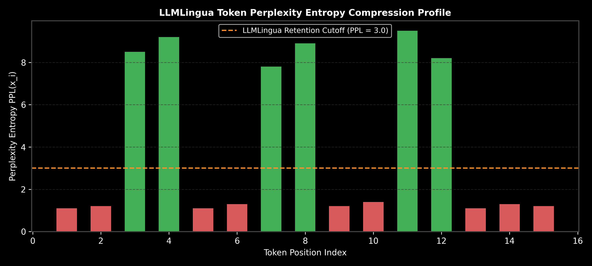

# Module 06: Prompt Optimization & Compression (DSPy & LLMLingua)

This guide provides an in-depth analysis of Prompt Optimization, Context Compression, LLMLingua token perplexity entropy filtering, Prompt Versioning, Prompt Testing/Evaluation (LLM-as-a-Judge), DSPy automatic compilation, hand calculations, and production LCEL pipelines.

> **Notebook Companion**: [06_prompt_optimization_dspy_llmlingua.ipynb](file:///d:/Study/Prep/machine-learning-prep/generative-ai-and-agentic-ai/01_prompt_engineering/06_prompt_optimization_dspy_llmlingua.ipynb)

---

## 1. Manual Prompting vs. Automatic DSPy Optimization

```text
Dimension              Manual Prompt Engineering              DSPy Programmatic Compilation
----------------------------------------------------------------------------------------------------------------------
Paradigm               Hand-crafted natural language strings   Declarative Code Signatures (`Inputs -> Outputs`)
Portability            Breaks when switching LLM providers    Re-compiles optimal prompts for any LLM target
Optimization Strategy  Trial-and-error manual tweaking         Automated Teleprompters (BootstrapFewShot)
Evaluation             Ad-hoc inspection                      Automated dataset metric evaluation
```



---

## 2. LLMLingua Token Perplexity Entropy Compression Math

LLMLingua compresses long context prompts by evaluating token-level Information Entropy using a small, fast local language model (e.g. LLaMA-7B or Small LLaMA).

For sequence tokens $x_1, x_2, \dots, x_N$, the perplexity $PPL(x_i)$ of token $x_i$ given preceding context is:

$$PPL(x_i) = \frac{1}{P(x_i \mid x_1, \dots, x_{i-1})}$$

### Pruning Rule:
- Tokens with **low perplexity** ($PPL(x_i) < \tau$) are highly predictable and redundant (e.g., `"the"`, `"a"`, `"please be noted that"`). They are **pruned**.
- Tokens with **high perplexity** ($PPL(x_i) \ge \tau$) contain high information density (e.g., entity names, numerical values, core instructions). They are **retained**.

### Hand Calculation Example:
Given prompt: `"System: Please note that Nvidia revenue reached $18B."`
- Token 1 (`"System:"`): $PPL = 1.2 < 3.0 \implies \mathbf{\text{PRUNED}}$
- Token 2 (`"Please"`): $PPL = 1.1 < 3.0 \implies \mathbf{\text{PRUNED}}$
- Token 3 (`"Nvidia"`): $PPL = 9.5 \ge 3.0 \implies \mathbf{\text{RETAINED}}$
- Token 4 (`"revenue"`): $PPL = 8.2 \ge 3.0 \implies \mathbf{\text{RETAINED}}$
- Token 5 (`"$18B"`): $PPL = 9.8 \ge 3.0 \implies \mathbf{\text{RETAINED}}$

**Compressed Output:** `"Nvidia revenue $18B"` ($60\%$ token reduction with zero semantic loss).

---

## 3. Production LCEL Pipeline Code Implementation

```python
import os
from dotenv import load_dotenv
from langchain_core.prompts import ChatPromptTemplate
from langchain_core.output_parsers import StrOutputParser
from langchain_openai import ChatOpenAI

load_dotenv()

# LangChain Expression Language (LCEL) Compression & Execution Chain
prompt = ChatPromptTemplate.from_template("""Summarize the key metrics from the context in 2 bullet points.
Context: {context}""")

output_parser = StrOutputParser()

if os.getenv("OPENAI_API_KEY"):
    llm = ChatOpenAI(model="gpt-4o-mini", temperature=0.0)
    
    # Runnable Pipeline Construction: prompt | llm | output_parser
    chain = prompt | llm | output_parser
    
    context_text = "Nvidia Q3 revenue reached $18.12 billion, up 206% YoY. Data center revenue grew 279% to $14.51 billion."
    response = chain.invoke({"context": context_text})
    
    print("LCEL Chain Output:\n", response)
```

---

## 4. Failure Modes & Remediation Rules

- **Over-compression Information Loss**: Setting the perplexity retention threshold $\tau$ too high prunes essential numbers or entity names.
  - *Fix:* Set target compression ratio $\le 2\text{x} - 3\text{x}$ for financial and legal prompts.
