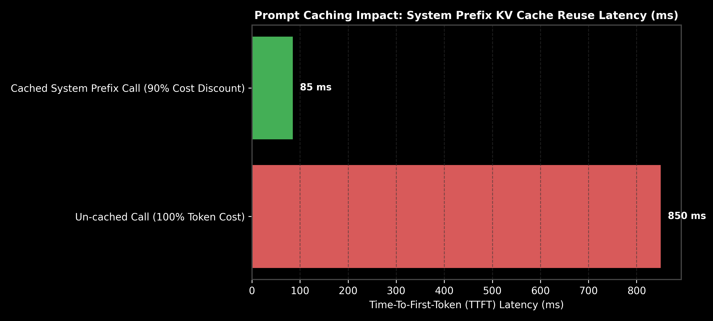

# Module 08: Production Prompt Engineering & Prompt Caching

This guide provides an in-depth exploration of Production Prompt Engineering, Role Isolation, Conversation Memory strategies, Prompt Caching KV Cache reuse mechanics, cost discount math, and Observability tracing across Anthropic, OpenAI, and LangChain.

> **Notebook Companion**: [08_production_prompt_engineering_caching.ipynb](file:///d:/Study/Prep/machine-learning-prep/generative-ai-and-agentic-ai/01_prompt_engineering/08_production_prompt_engineering_caching.ipynb)

---

## 1. Conversation Memory Management Strategies

In multi-turn chat applications, passing the full conversation history quickly exhausts the context window. Production systems use three distinct memory architectures:

```text
Memory Architecture     Mechanisms                                Context Overhead  Primary Drawback
----------------------------------------------------------------------------------------------------------------------
1. Sliding Window       Retains last K conversation turns        Fixed (O(K))      Forgets early turns
2. Summary Truncation   LLM summarizes history periodically      Compact (O(1))    Summarization cost & latency
3. Vector Episodic      Stores turns in Vector DB; retrieves top-k Variable           Retrieval latency & vector search
```

---

## 2. Prompt Caching Mechanics & Economics

Prompt Caching allows inference servers (Anthropic Claude 3.5 Sonnet, OpenAI, vLLM) to save pre-computed **Key-Value (KV) Cache tensors** for static prompt prefixes in fast GPU SRAM memory.

### Prefix Matching Rules for Prompt Caching:
1. **Minimum Prefix Length**: Requires a minimum static prefix length (e.g. $\ge 1,024$ tokens for Anthropic, $\ge 1,024$ for OpenAI).
2. **Exact Byte Matching**: The system prompt and tool definitions at the start of the prompt must match byte-for-byte.
3. **Cache TTL**: Cached KV tensors persist for $5 - 10$ minutes, auto-refreshed on hit.

```text
Prompt State         Input Token Price ($ / 1M)  Time-To-First-Token (TTFT) Latency
----------------------------------------------------------------------------------------------------------------------
Un-cached Input      $3.00                      850 ms (Full KV Matrix Computation)
Cached Prefix Match  $0.30 (90% Discount)       85 ms (KV Tensor Memory Reuse)
```



---

## 3. Mathematical Prompt Caching Cost Savings (Andrew Ng Style)

Consider an enterprise assistant with a heavy system prompt + tool schema definition of $C_{\text{system}} = 10,000$ tokens, and average user turn input $C_{\text{turn}} = 1,000$ tokens.
- Standard Input Price = $\$3.00 / 1,000,000$ tokens.
- Cached Prefix Price = $\$0.30 / 1,000,000$ tokens ($90\%$ discount).

### Scenario A: Un-cached Execution (100 Queries):
$$\text{Input Tokens per Call} = 10,000 + 1,000 = 11,000 \text{ tokens}$$
$$\text{Cost per Call} = 11,000 \times \frac{\$3.00}{1,000,000} = \$0.033$$
$$\text{Total Cost (100 Calls)} = 100 \times \$0.033 = \mathbf{\$3.30}$$

### Scenario B: Prompt Caching Execution (100 Queries):
- First Call (Cache Write): $11,000 \times \$3.75 / 1M = \$0.04125$
- Subsequent 99 Calls (Cache Hit):
  - Static System Tokens: $10,000 \times \$0.30 / 1M = \$0.003$
  - New User Tokens: $1,000 \times \$3.00 / 1M = \$0.003$
  - Cost per Cached Call = $\$0.006$
$$\text{Total Cost (99 Cached Calls)} = 99 \times \$0.006 = \$0.594$$
$$\text{Total Scenario B Cost} = \$0.04125 + \$0.594 = \mathbf{\$0.63525}$$

**Net Cost Savings:** $\frac{\$3.30 - \$0.635}{\$3.30} = \mathbf{80.8\% \text{ Cost Reduction}}!$

---

## 4. Production LangChain Code Implementation

```python
import os
from dotenv import load_dotenv
from langchain_community.chat_message_histories import ChatMessageHistory
from langchain_core.prompts import ChatPromptTemplate, MessagesPlaceholder

load_dotenv()

# 1. Initialize Conversation History Buffer
history = ChatMessageHistory()
history.add_user_message("My preferred cloud provider is AWS.")
history.add_ai_message("Noted! I will default all architecture diagrams to AWS services.")

# 2. Build Dynamic Prompt Template with Memory Placement
prompt = ChatPromptTemplate.from_messages([
    ("system", "You are an enterprise cloud solutions architect."),
    MessagesPlaceholder(variable_name="chat_history"),
    ("user", "{input}")
])

# 3. Format Prompt with History Buffer
formatted_messages = prompt.format_messages(
    chat_history=history.messages,
    input="Recommend a managed database service."
)

print("Formatted Message Sequence:\n", formatted_messages)
```
