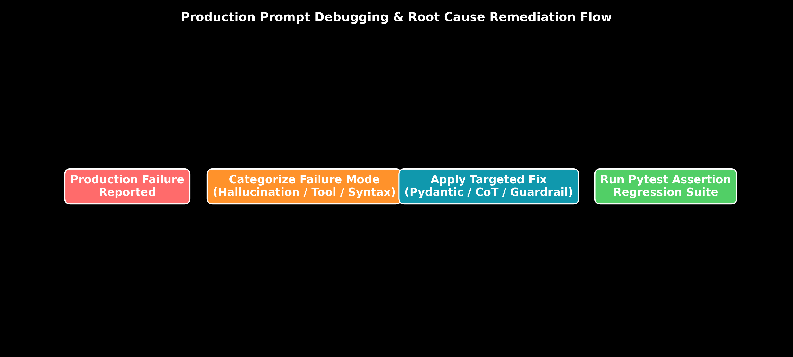

# Module 09: Common Failure Cases & Production Debugging

This guide provides an in-depth exploration of production LLM failure modes (Hallucinations, Ambiguity, Conflicting Instructions, Context Overflow, Prompt Drift, Tool Selection Errors), and presents a systematic Production Debugging Playbook with automated `pytest` assertion suites.

> **Notebook Companion**: [09_common_failure_cases_debugging.ipynb](file:///d:/Study/Prep/machine-learning-prep/generative-ai-and-agentic-ai/01_prompt_engineering/09_common_failure_cases_debugging.ipynb)

---

## 1. Production Failure Mode Remediation Matrix

```text
Failure Mode           Root Cause                              Target Remediation Strategy
----------------------------------------------------------------------------------------------------------------------
1. Factual Hallucination Unbounded generation space             Inject strict RAG context + Negative constraints
2. Logical Hallucination Attempting single-step complex math   Switch from Zero-Shot to Chain-of-Thought (CoT)
3. Context Overflow    Tokens exceed model limit               Apply LLMLingua compression & sliding window memory
4. Prompt Drift        Provider model version update           Build Pytest prompt regression evaluation suite
5. Schema Violation    Unconstrained free-form generation      Enforce Logit Bias Masking via `.with_structured_output()`
6. Tool Selection Error Ambiguous docstrings in `@tool`        Refactor Pydantic docstrings & param type hints
```



---

## 2. Production Debugging Playbook: 4-Step RCA

When an LLM pipeline fails in production, follow this systematic Root Cause Analysis (RCA) workflow:

1. **Step 1: Inspect Raw Traces (LangSmith / LangFuse)**: Inspect the exact input prompt string sent to the model, including system rules, context variables, and message order.
2. **Step 2: Isolate Failure Category**:
   - *Syntax Error?* $\implies$ Constrained Decoding failure.
   - *Logic Error?* $\implies$ Missing CoT reasoning steps.
   - *Factual Error?* $\implies$ RAG context missing or chunk retrieval quality issue.
3. **Step 3: Apply Targeted Remediation**: Refactor prompt instructions, inject negative rules, or lower sampling temperature $T=0.0$.
4. **Step 4: Regression Test Assertion Suite**: Add the failing input case to the automated prompt unit test dataset to prevent future regression.

---

## 3. Production Python Prompt Assertion Suite (`pytest`)

```python
import json

def test_prompt_financial_extraction():
    # Simulated Output from LLM Pipeline
    raw_llm_response = '{"company": "Nvidia", "revenue": "$18.12B", "growth_yoy": 206.0}'
    
    # Assertion 1: Must be valid JSON
    try:
        data = json.loads(raw_llm_response)
    except json.JSONDecodeError:
        assert False, "Regression Failure: LLM output is not valid JSON!"

    # Assertion 2: Required Keys Present
    required_keys = ["company", "revenue", "growth_yoy"]
    for key in required_keys:
        assert key in data, f"Regression Failure: Missing key '{key}' in output!"

    # Assertion 3: Type Validation
    assert isinstance(data["growth_yoy"], (float, int)), "Type Failure: growth_yoy must be float!"
    
    print("All Production Prompt Assertions Passed Successfully!")

# Run Test Suite
test_prompt_financial_extraction()
```
