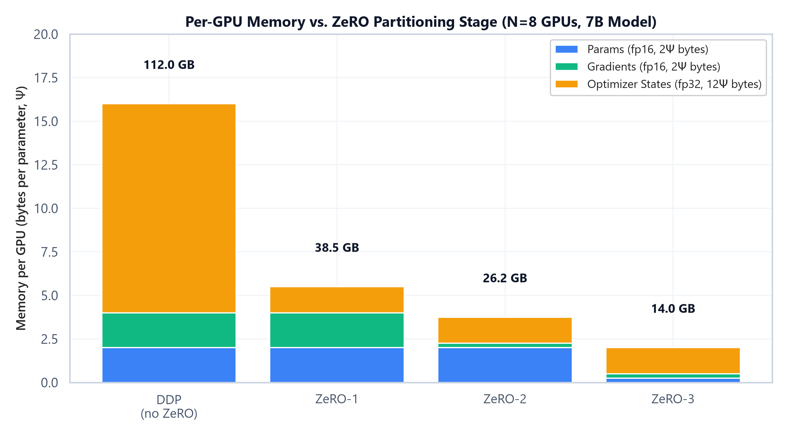

# Module 01: Fine-Tuning Fundamentals & Distributed Training Infrastructure

## 1. Introduction & Intuition

### The Core Bottleneck
A pretrained base model — its architecture, attention mechanism, and KV cache behavior are covered in `01_llm_foundations` — is only a starting point. Turning it into something useful requires updating its weights via gradient descent, and *training* memory is a much larger burden than *inference* memory. At inference, you only need to hold the model weights (plus a KV cache). At training time, you additionally need gradients for every parameter, and — if using Adam, the standard optimizer for LLM training — two more full-precision buffers per parameter to track momentum and variance. A model that comfortably fits on a single GPU for inference can require 6-8x more memory just to fine-tune. The bottleneck is that full fine-tuning of a modern LLM routinely exceeds single-GPU VRAM, forcing a choice between distributing training across many GPUs or reducing the number of trainable parameters (the subject of Module 03).

### High-Level Intuition
Think of training memory as a backpack you must carry for every parameter in the model. Inference only requires the "item itself" (the weight). Training adds a duplicate-weight-sized item for the gradient, plus two more duplicate-weight-sized items for Adam's momentum and variance trackers — and typically a full-precision master copy of the weight itself, since mixed-precision training keeps the "source of truth" copy in fp32 even while computing in bf16/fp16. None of this can be dropped without changing the optimizer or the fine-tuning strategy.

When one GPU's backpack won't fit, there are two different ways to lighten the load:
1. **Shard the backpack's contents** across a group of GPUs, so each GPU only carries a fraction of the gradients/optimizer-states/parameters (ZeRO, FSDP) — every GPU still sees every token, but only owns a slice of the model's "extra baggage."
2. **Shard the model itself** across GPUs, so each GPU only computes a slice of every layer (Tensor Parallelism) or owns a contiguous set of layers (Pipeline Parallelism) — different GPUs are responsible for different parts of the actual computation, not just different slices of the same computation's bookkeeping.

---

## 2. Core Concepts & Mathematical Formulation

### Mixed-Precision Training Memory: The "16Ψ Bytes" Wall

#### Purpose & Intuition
This is the single most commonly asked number in LLM training system-design interviews. In standard mixed-precision training (bf16/fp16 compute, fp32 optimizer state — the convention popularized by the ZeRO paper), every parameter carries five separate buffers: an fp16/bf16 copy of the weight used for the forward/backward pass, an fp16/bf16 gradient, and three fp32 buffers (a master weight copy, Adam's first moment $m$, and Adam's second moment $v$). Knowing this breakdown lets you compute, from parameter count alone, whether a training job fits on your hardware before you ever launch it.

#### Mathematical Formulation
For a model with $\Psi$ parameters:
$$\text{Memory}_{\text{bytes}} = \underbrace{2\Psi}_{\text{fp16 params}} + \underbrace{2\Psi}_{\text{fp16 grads}} + \underbrace{4\Psi + 4\Psi + 4\Psi}_{\text{fp32 master + Adam } m,v} = 16\Psi \text{ bytes}$$

### ZeRO: Partitioning the "16Ψ" Across GPUs

#### Intuition & Practical Use
Data-Parallel training (DDP) replicates the full 16Ψ bytes on every GPU — wasteful, since each GPU only ever needs its own optimizer-state shard to update its own parameter shard, not everyone else's. ZeRO (Zero Redundancy Optimizer) progressively shards this 16Ψ across $N$ GPUs in three stages, trading a small amount of extra communication for a large reduction in per-GPU memory:
* **ZeRO-1:** Partitions only the optimizer states (the 12Ψ fp32 portion) across $N$ GPUs.
* **ZeRO-2:** Additionally partitions the gradients (2Ψ) across $N$ GPUs.
* **ZeRO-3:** Additionally partitions the parameters themselves (2Ψ) across $N$ GPUs — every GPU only permanently owns $1/N$ of the model, all-gathering the rest just-in-time for each layer's forward/backward pass.



*   **Plot Interpretation:** As ZeRO stage increases, more of the 16Ψ-byte total is divided by $N$ instead of replicated. The params-only portion (2Ψ, blue) stays replicated until ZeRO-3, at which point it too shrinks by a factor of $N$, collapsing per-GPU memory from 16Ψ bytes down to just $16\Psi/N$ bytes.

---

### Hand Calculation: 7B Model, N=8 GPUs
Let's compute per-GPU memory at each ZeRO stage for a 7B-parameter model ($\Psi = 7 \times 10^9$) sharded across $N=8$ GPUs.

*   **Step 1: Baseline (DDP, no ZeRO) — full 16Ψ replicated on every GPU**
    $$\text{Memory}_{\text{DDP}} = 16 \times 7\text{B bytes} = 112\text{ GB per GPU}$$

*   **Step 2: ZeRO-1 — optimizer states (12Ψ) partitioned across 8 GPUs**
    $$\text{Memory}_{\text{ZeRO-1}} = \left(2\Psi + 2\Psi + \frac{12\Psi}{8}\right) = 5.5\Psi \text{ bytes} = 5.5 \times 7\text{B} = 38.5\text{ GB}$$

*   **Step 3: ZeRO-2 — optimizer states and gradients (12Ψ + 2Ψ = 14Ψ) partitioned**
    $$\text{Memory}_{\text{ZeRO-2}} = \left(2\Psi + \frac{14\Psi}{8}\right) = 3.75\Psi \text{ bytes} = 3.75 \times 7\text{B} = 26.25\text{ GB}$$

*   **Step 4: ZeRO-3 — everything (16Ψ) partitioned**
    $$\text{Memory}_{\text{ZeRO-3}} = \frac{16\Psi}{8} = 2\Psi \text{ bytes} = 2 \times 7\text{B} = 14\text{ GB}$$

Going from DDP to ZeRO-3 takes a 7B model's static training memory from 112 GB — infeasible on a single 80GB GPU — down to 14 GB, which comfortably fits, at the cost of additional all-gather/reduce-scatter communication for the sharded parameters.

---

### Gradient Accumulation: Decoupling Batch Size from GPU Memory

#### Intuition & Practical Use
Larger batch sizes generally produce more stable gradient estimates, but a large batch may not fit in memory alongside the model, gradients, and optimizer states. Gradient accumulation runs several small "micro-batches" forward/backward, summing their gradients *without* stepping the optimizer, and only applies the optimizer step after the full accumulation window — simulating a much larger batch size without ever materializing it in memory at once.

#### Mathematical Formulation
$$B_{\text{eff}} = B_{\text{micro}} \times \text{accum\_steps} \times N_{\text{GPUs}}$$

#### Hand Calculation
With a micro-batch size of 4 sequences per GPU, 8 accumulation steps, and 4 GPUs:
$$B_{\text{eff}} = 4 \times 8 \times 4 = 128$$
Each GPU processes 4 sequences at a time — small enough to fit in memory — but the optimizer sees an effective batch of 128 sequences' worth of accumulated gradient signal before it takes a single step.

---

### FSDP vs. ZeRO: Same Idea, Different Implementations

Both FSDP (PyTorch's Fully Sharded Data Parallel) and DeepSpeed's ZeRO shard optimizer state, gradients, and parameters across GPUs — conceptually, FSDP is very close to ZeRO-3. The differences that matter in practice:

| | ZeRO (DeepSpeed) | FSDP (PyTorch-native) |
|---|---|---|
| **Ecosystem** | Requires the DeepSpeed library | Built into PyTorch directly |
| **Stage granularity** | Explicit stages 1/2/3, independently configurable | Primarily full-sharding (ZeRO-3-equivalent), with configurable wrapping policies |
| **Offload** | Mature CPU/NVMe offload support | CPU offload supported, less mature than DeepSpeed's |
| **When to reach for it** | Already in a DeepSpeed/Megatron-DeepSpeed stack, or need fine-grained stage control or NVMe offload | Native PyTorch workflows (e.g. `torchtune`, plain PyTorch training loops) without adding a new dependency |

### Tensor & Pipeline Parallelism: Sharding the Model Itself

Unlike ZeRO/FSDP (which shard the *optimizer's bookkeeping* while every GPU still runs the full forward/backward computation), Tensor and Pipeline Parallelism shard the *computation*:
*   **Tensor Parallelism (TP):** Splits individual weight matrices column-wise or row-wise across GPUs. For example, an FFN up-projection weight of shape `[d, 4d]` becomes `[d, 4d/N]` per GPU; each GPU computes its own partial output, and an all-reduce combines the partial results before the next layer. TP requires a fast interconnect (NVLink) since it synchronizes *within* every layer.
*   **Pipeline Parallelism (PP):** Splits the model *by layer* — GPU 0 holds layers 1-8, GPU 1 holds layers 9-16, and so on — with activations passed between GPUs as data flows through the pipeline stages. This introduces a "bubble": GPUs downstream sit idle while waiting for the first micro-batch to arrive, and upstream GPUs sit idle waiting for the pipeline to drain at the end. Micro-batching (splitting each batch into smaller chunks that flow through the pipeline in an interleaved 1F1B schedule) is the standard mitigation.

<div align="center" style="margin: 20px 0; max-width: 100%; overflow-x: auto;">
<svg viewBox="0 0 820 300" width="100%" height="auto" xmlns="http://www.w3.org/2000/svg" style="background-color: #f8fafc; border: 1px solid #e2e8f0; border-radius: 8px; font-family: system-ui, -apple-system, sans-serif;">
  <text x="410" y="25" text-anchor="middle" font-size="14" font-weight="bold" fill="#0f172a">Data vs. Tensor vs. Pipeline Parallelism (4 GPUs)</text>

  <!-- DATA PARALLEL -->
  <g transform="translate(20, 45)">
    <text x="115" y="14" text-anchor="middle" font-size="12" font-weight="bold" fill="#1e3a8a">Data Parallel</text>
    <g transform="translate(0, 25)">
      <rect x="0" y="0" width="230" height="45" rx="4" fill="#eff6ff" stroke="#3b82f6" stroke-width="1.3" />
      <text x="115" y="27" text-anchor="middle" font-size="10" fill="#1e3a8a">Full Model (copy on each GPU)</text>
    </g>
    <text x="0" y="90" font-size="9" fill="#475569">GPU 0: batch shard A</text>
    <text x="0" y="104" font-size="9" fill="#475569">GPU 1: batch shard B</text>
    <text x="0" y="118" font-size="9" fill="#475569">GPU 2: batch shard C</text>
    <text x="0" y="132" font-size="9" fill="#475569">GPU 3: batch shard D</text>
    <text x="0" y="152" font-size="9" fill="#64748b">Sync: all-reduce gradients</text>
  </g>

  <!-- TENSOR PARALLEL -->
  <g transform="translate(300, 45)">
    <text x="115" y="14" text-anchor="middle" font-size="12" font-weight="bold" fill="#7c3aed">Tensor Parallel</text>
    <g transform="translate(0, 25)">
      <rect x="0" y="0" width="55" height="45" rx="4" fill="#f5f3ff" stroke="#7c3aed" stroke-width="1.3" />
      <text x="27" y="27" text-anchor="middle" font-size="8" fill="#5b21b6">[d, d/4]</text>
      <rect x="59" y="0" width="55" height="45" rx="4" fill="#f5f3ff" stroke="#7c3aed" stroke-width="1.3" />
      <text x="87" y="27" text-anchor="middle" font-size="8" fill="#5b21b6">[d, d/4]</text>
      <rect x="118" y="0" width="55" height="45" rx="4" fill="#f5f3ff" stroke="#7c3aed" stroke-width="1.3" />
      <text x="146" y="27" text-anchor="middle" font-size="8" fill="#5b21b6">[d, d/4]</text>
      <rect x="177" y="0" width="55" height="45" rx="4" fill="#f5f3ff" stroke="#7c3aed" stroke-width="1.3" />
      <text x="205" y="27" text-anchor="middle" font-size="8" fill="#5b21b6">[d, d/4]</text>
    </g>
    <text x="0" y="88" font-size="9" fill="#475569">One weight matrix split column-wise</text>
    <text x="0" y="102" font-size="9" fill="#475569">across all 4 GPUs, every layer.</text>
    <text x="0" y="122" font-size="9" fill="#64748b">Sync: all-reduce within each layer</text>
    <text x="0" y="136" font-size="9" fill="#64748b">(needs fast NVLink interconnect)</text>
  </g>

  <!-- PIPELINE PARALLEL -->
  <g transform="translate(580, 45)">
    <text x="115" y="14" text-anchor="middle" font-size="12" font-weight="bold" fill="#059669">Pipeline Parallel</text>
    <g transform="translate(0, 25)">
      <rect x="0" y="0" width="55" height="45" rx="4" fill="#ecfdf5" stroke="#10b981" stroke-width="1.3" />
      <text x="27" y="22" text-anchor="middle" font-size="8" fill="#065f46">Layers</text>
      <text x="27" y="34" text-anchor="middle" font-size="8" fill="#065f46">1-8</text>
      <rect x="59" y="0" width="55" height="45" rx="4" fill="#ecfdf5" stroke="#10b981" stroke-width="1.3" />
      <text x="87" y="22" text-anchor="middle" font-size="8" fill="#065f46">Layers</text>
      <text x="87" y="34" text-anchor="middle" font-size="8" fill="#065f46">9-16</text>
      <rect x="118" y="0" width="55" height="45" rx="4" fill="#ecfdf5" stroke="#10b981" stroke-width="1.3" />
      <text x="146" y="22" text-anchor="middle" font-size="8" fill="#065f46">Layers</text>
      <text x="146" y="34" text-anchor="middle" font-size="8" fill="#065f46">17-24</text>
      <rect x="177" y="0" width="55" height="45" rx="4" fill="#ecfdf5" stroke="#10b981" stroke-width="1.3" />
      <text x="205" y="22" text-anchor="middle" font-size="8" fill="#065f46">Layers</text>
      <text x="205" y="34" text-anchor="middle" font-size="8" fill="#065f46">25-32</text>
      <path d="M 55 22 L 59 22" stroke="#059669" stroke-width="1.3" marker-end="url(#arrow-pp)" />
      <path d="M 114 22 L 118 22" stroke="#059669" stroke-width="1.3" marker-end="url(#arrow-pp)" />
      <path d="M 173 22 L 177 22" stroke="#059669" stroke-width="1.3" marker-end="url(#arrow-pp)" />
    </g>
    <text x="0" y="88" font-size="9" fill="#475569">Each GPU owns a contiguous</text>
    <text x="0" y="102" font-size="9" fill="#475569">block of layers; activations flow</text>
    <text x="0" y="116" font-size="9" fill="#475569">GPU-to-GPU as data passes through.</text>
    <text x="0" y="136" font-size="9" fill="#64748b">Cost: pipeline "bubble" idle time</text>
  </g>

  <defs>
    <marker id="arrow-pp" viewBox="0 0 10 10" refX="6" refY="5" markerWidth="5" markerHeight="5" orient="auto-start-reverse">
      <path d="M 0 0 L 10 5 L 0 10 z" fill="#059669" />
    </marker>
  </defs>
</svg>
</div>

---

### Tensor & Shape Tracking
*   **Full model weight matrix (e.g. FFN up-projection):** `[d, 4d]`
*   **Tensor-Parallel shard (N-way column split):** `[d, 4d/N]` per GPU
*   **Pipeline-Parallel per-stage parameter set:** `[num_layers / N_stages]` transformer blocks per GPU
*   **Micro-batch (gradient accumulation):** `[B_micro, L, d]`, accumulated over `accum_steps` before an optimizer step processes the effective `[B_eff, L, d]` gradient signal

---

## 3. Implementation & Reference Code

Below is a self-contained memory-accounting utility that reproduces the hand calculations above, plus a minimal gradient-accumulation training loop.

```python
import torch
import torch.nn as nn

def zero_stage_memory_gb(num_params: int, zero_stage: int, num_gpus: int) -> float:
    """Computes per-GPU training memory (GB) for mixed-precision Adam training at a given ZeRO stage."""
    params_bytes = 2 * num_params      # fp16/bf16 params
    grads_bytes = 2 * num_params       # fp16/bf16 grads
    optim_bytes = 12 * num_params      # fp32 master weight + Adam m + Adam v

    if zero_stage >= 3:
        params_bytes //= num_gpus
    if zero_stage >= 2:
        grads_bytes //= num_gpus
    if zero_stage >= 1:
        optim_bytes //= num_gpus

    total_bytes = params_bytes + grads_bytes + optim_bytes
    return total_bytes / 1e9  # GB


if __name__ == "__main__":
    num_params = 7_000_000_000  # 7B model
    num_gpus = 8

    for stage in [0, 1, 2, 3]:
        mem_gb = zero_stage_memory_gb(num_params, stage, num_gpus)
        label = "DDP (no ZeRO)" if stage == 0 else f"ZeRO-{stage}"
        print(f"{label:<16}: {mem_gb:6.2f} GB per GPU")

    # --- Gradient accumulation training loop ---
    torch.manual_seed(42)
    model = nn.Linear(16, 16)
    optimizer = torch.optim.AdamW(model.parameters(), lr=3e-4)

    B_micro, accum_steps, N_GPUS = 4, 8, 4  # matches the B_eff = 4 x 8 x 4 = 128 hand calc above
    optimizer.zero_grad()
    for step in range(accum_steps):
        x = torch.randn(B_micro, 16)          # [B_micro, d]
        target = torch.randn(B_micro, 16)     # [B_micro, d]
        loss = nn.functional.mse_loss(model(x), target) / accum_steps  # normalize contribution
        loss.backward()  # accumulates .grad, does NOT step

    optimizer.step()  # single step after accumulating gradient from B_micro * accum_steps samples
    optimizer.zero_grad()
    # This single-process demo only runs one GPU's worth of accumulation (B_micro * accum_steps = 32);
    # in an actual N_GPUS=4 distributed run, each GPU accumulates independently before an all-reduce,
    # so the true effective batch is scaled by N_GPUS as well, matching the hand calc above.
    b_eff_single_gpu = B_micro * accum_steps
    b_eff_distributed = b_eff_single_gpu * N_GPUS
    print(f"\nEffective batch size (this single-GPU demo): {b_eff_single_gpu}")
    print(f"Effective batch size (if distributed across N_GPUS={N_GPUS}): {b_eff_distributed}")
```

---

## Interview Deep-Dive & System Trade-offs

### 1. Architectural & Production Trade-offs
*   **Core Problem Solved:** Fitting the training-time memory footprint (params + gradients + optimizer states, ~16 bytes/param) of a large model onto hardware where it would otherwise be infeasible on a single GPU.
*   **Why Introduced over Legacy Approaches:** Naive Data-Parallel (DDP) training replicates the full optimizer state redundantly on every GPU. ZeRO/FSDP eliminate that redundancy by sharding, while TP/PP go further and shard the actual computation for models too large to fit even a single sharded replica's activations comfortably.
*   **Key Failure Modes & Limitations:** ZeRO-3/FSDP introduce additional all-gather communication on every forward and backward pass, which can become bandwidth-bound on slow interconnects. Pipeline Parallelism's bubble overhead wastes GPU-time proportional to the number of pipeline stages if micro-batching isn't tuned well.

### 2. System Complexity & Scaling
*   **Time Complexity (FLOPs):** Sharding strategies (ZeRO/FSDP/TP/PP) do not change the total FLOPs of training — they change *where* those FLOPs execute and how much *communication* is needed to keep GPUs fed.
*   **Space/Memory Footprint:** DDP: $16\Psi$ bytes replicated per GPU. ZeRO-$k$: shrinks the corresponding portion of $16\Psi$ by a factor of $N$. TP: shrinks per-GPU *activation and weight* memory for the sharded layers by roughly $1/N_{\text{TP}}$. PP: shrinks per-GPU *parameter* memory by roughly $1/N_{\text{stages}}$.
*   **Primary Bottleneck Type:** Memory-bandwidth/interconnect-bound for ZeRO-3/FSDP (frequent all-gather) and Tensor Parallelism (per-layer all-reduce); compute-bound within each GPU's local matrix multiplications; pipeline-bubble-bound (wasted idle time) for Pipeline Parallelism at small micro-batch counts.
*   **Variable Legend:** $\Psi$ = parameter count, $N$ = number of GPUs, $B_{\text{micro}}$ = micro-batch size, $B_{\text{eff}}$ = effective batch size, $d$ = hidden dimension.

### 3. Production & Scalability
*   **Deployment Considerations:** Most production LLM training stacks combine strategies (e.g., ZeRO-3 within a node + data parallelism across nodes, or 3D parallelism combining TP + PP + data parallelism for the largest models) rather than picking a single one in isolation.
*   **Common Interviewer Follow-Up Questions:**
    1.  *Q:* You have 8 GPUs and a 7B model that needs 112GB unsharded. Which ZeRO stage is the minimum needed to fit on 80GB GPUs, and why?
        *   *A:* ZeRO-1 already gets it to 38.5GB per GPU, comfortably under 80GB. The interviewer signal here is recognizing you don't need to jump straight to ZeRO-3 (which adds the most communication overhead) if a lighter stage already fits — match the stage to the actual memory constraint, not maximal sharding by default.
    2.  *Q:* Why does gradient accumulation not increase peak memory usage, even though it simulates a larger batch?
        *   *A:* Because each micro-batch is fully processed (forward, backward, gradients accumulated into the existing `.grad` buffers) and its activations freed before the next micro-batch starts. Peak memory is bounded by one micro-batch's activation footprint, not the effective batch's — only the accumulated gradient buffer (already sized for the full parameter count regardless) persists across steps.
