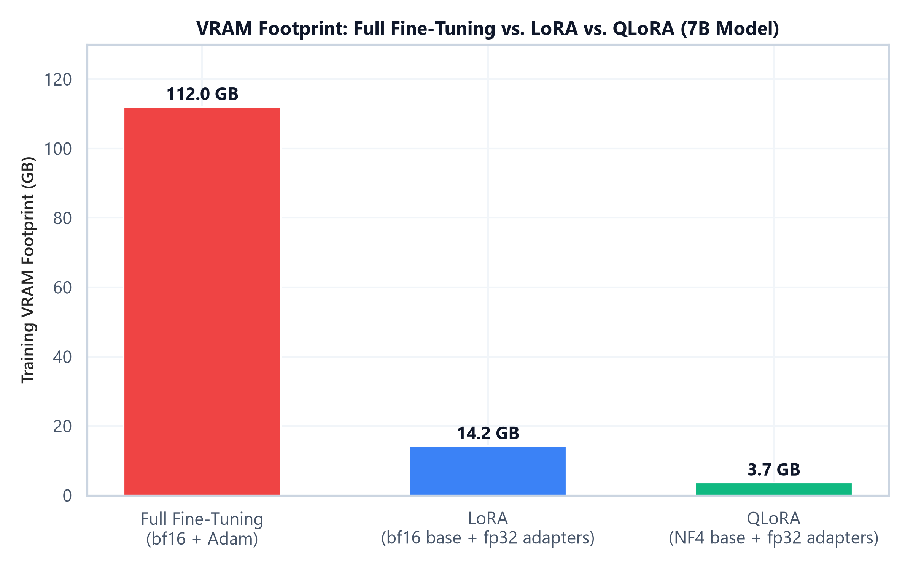

# Module 03: Parameter-Efficient Fine-Tuning (LoRA, QLoRA, Adapters)

## 1. Introduction & Intuition

### The Core Bottleneck
Module 01 established that full fine-tuning of a 7B model costs roughly 112GB of training memory even before activations — and that number scales linearly with model size, reaching well past a single high-end GPU for anything in the tens-of-billions-of-parameters range. Distributed training (ZeRO/FSDP/TP/PP) solves this by adding *more hardware*. Parameter-Efficient Fine-Tuning (PEFT) solves it from the opposite direction: instead of training all $\Psi$ parameters, freeze the pretrained weights entirely and train a much smaller set of *new* parameters injected into the model — shrinking the optimizer-state memory (the dominant cost) by orders of magnitude, without needing extra GPUs at all.

### High-Level Intuition
The key empirical observation behind LoRA (Low-Rank Adaptation) is that the *change* a model's weights need to undergo during fine-tuning — the delta between the pretrained weight and the ideally-fine-tuned weight — tends to have low "intrinsic rank." Rather than learning a full, dense update matrix the same size as the original weight, LoRA learns that update as the product of two much smaller matrices, $B \times A$, whose rank $r$ is a tiny fraction of the original dimension. The frozen base weight stays untouched; only the small $B$ and $A$ matrices are trained, and at inference they can be merged back into the base weight ($W' = W + BA$) with zero added latency.

---

## 2. Core Concepts & Mathematical Formulation

### LoRA: Low-Rank Weight Decomposition

#### Purpose & Intuition
For a frozen weight matrix $W \in \mathbb{R}^{d \times d}$, LoRA represents the *fine-tuning update* as $\Delta W = BA$, where $B \in \mathbb{R}^{d \times r}$ and $A \in \mathbb{R}^{r \times d}$, with rank $r \ll d$. Instead of training $d^2$ parameters per weight matrix, LoRA trains only $2rd$ — and because $r$ is typically 8-64 while $d$ is in the thousands, this is a 100-1000x reduction in trainable parameters for that matrix.

#### Mathematical Formulation
$$W' = W + \Delta W = W + BA, \qquad \text{params}_{\text{LoRA}} = 2rd \quad \text{vs.} \quad \text{params}_{\text{full}} = d^2$$

$A$ is initialized with small random values (or zero) and $B$ is initialized to zero, so that $\Delta W = 0$ at the start of training — the adapted model is numerically identical to the base model before any training happens, guaranteeing training starts from the pretrained model's exact behavior.

---

### Hand Calculation: LoRA Trainable Parameters vs. Full Fine-Tuning
Let's compute the trainable-parameter savings for a single attention projection matrix with $d = 4096$ and LoRA rank $r = 8$.

*   **Step 1: Full fine-tuning parameter count for this one matrix**
    $$\text{params}_{\text{full}} = d^2 = 4096^2 = 16{,}777{,}216 \approx 16.8\text{M params}$$

*   **Step 2: LoRA trainable parameter count for the same matrix**
    $$\text{params}_{\text{LoRA}} = 2rd = 2 \times 8 \times 4096 = 65{,}536 \approx 0.066\text{M params}$$

*   **Step 3: Compute the reduction ratio**
    $$\frac{\text{params}_{\text{full}}}{\text{params}_{\text{LoRA}}} = \frac{16{,}777{,}216}{65{,}536} = 256\times$$

For this one matrix, LoRA trains 256x fewer parameters than full fine-tuning — and since the optimizer state (Adam's $m$, $v$, and fp32 master copy) is only allocated for *trainable* parameters, this 256x reduction applies directly to the dominant memory cost from Module 01, not just to parameter count.

---

### QLoRA: Quantized Base Weights + LoRA Adapters

#### Purpose & Intuition
LoRA already freezes the base weights, but they still need to be stored in memory (typically bf16, 2 bytes/param) to run the forward pass. QLoRA goes further: it quantizes the *frozen* base weights down to 4-bit precision (NF4, a data type tuned for the roughly-normal distribution of neural network weights), while keeping the small trainable LoRA adapters in higher precision (bf16/fp32). Because the base weights are frozen and only used for the forward pass (dequantized on-the-fly for each matrix multiply), the 4-bit precision loss has a much smaller effect on training quality than it would if those weights were also being updated.



*   **Plot Interpretation:** Full fine-tuning of a 7B model requires the full 16-bytes/param training memory (112GB). LoRA drops this to just the base model's inference-time footprint (bf16, ~14GB) plus a negligible adapter optimizer-state cost. QLoRA compresses the base weights further to 4-bit (NF4), cutting the base footprint to roughly a quarter of LoRA's — under 4GB total for a 7B model, small enough to fine-tune on a single consumer GPU.

---

### Hand Calculation: QLoRA Base-Weight Memory Savings
For the same 7B-parameter base model, compare 16-bit vs. 4-bit (NF4) storage of the *frozen* weights.

*   **Step 1: 16-bit (bf16) base weight storage**
    $$\text{Memory}_{\text{bf16}} = 2 \text{ bytes} \times 7\text{B params} = 14\text{ GB}$$

*   **Step 2: 4-bit (NF4) base weight storage**
    $$\text{Memory}_{\text{NF4}} = 0.5 \text{ bytes} \times 7\text{B params} = 3.5\text{ GB}$$

*   **Step 3: Compute the reduction**
    $$\text{Memory}_{\text{bf16}} - \text{Memory}_{\text{NF4}} = 14\text{ GB} - 3.5\text{ GB} = 10.5\text{ GB saved}$$

Combined with LoRA's tiny trainable-adapter footprint, QLoRA brings a 7B model's total fine-tuning memory down to under 4GB — a reduction from 112GB (full fine-tuning) of roughly 30x.

---

### Tensor & Shape Tracking
*   **Frozen base weight $W$:** `[d, d]` (bf16 for LoRA, NF4-packed for QLoRA)
*   **LoRA down-projection $A$:** `[r, d]`
*   **LoRA up-projection $B$:** `[d, r]`
*   **LoRA update $\Delta W = BA$:** `[d, d]` (same shape as $W$, computed on-the-fly, never materialized densely during training)
*   **Forward pass output:** `[B, L, d]` = `x @ (W + BA).T`, equivalently `x @ W.T + (x @ A.T) @ B.T`

---

### Adapters, Prefix Tuning, and LoRA Target Module Selection

#### Adapter Layers vs. LoRA
Adapter layers insert small bottleneck feed-forward blocks (down-project → nonlinearity → up-project) *between* existing transformer layers, adding extra sequential computation at inference time. LoRA instead reparameterizes an *existing* weight matrix's update and — because $BA$ can be merged directly into $W$ after training — adds zero extra inference latency, which is why LoRA has become the more widely adopted default over classic adapters for LLM fine-tuning.

#### Prefix / Prompt Tuning
Prefix Tuning prepends a small number of trainable "virtual token" embeddings to the input at every layer, steering the model's behavior without touching any existing weights at all. It trains even fewer parameters than LoRA in many configurations, but tends to be more sensitive to initialization and harder to optimize than LoRA in practice.

#### LoRA Target Module Selection
LoRA can be applied to any weight matrix, but not all choices are equal:

| Target modules | Trainable params | Typical effect |
|---|---|---|
| `q_proj`, `v_proj` only | Smallest | Original LoRA paper's default; captures most of the benefit cheaply |
| `q_proj`, `k_proj`, `v_proj`, `o_proj` | Small-medium | Adapts the full attention block, often a small quality gain over Q/V-only |
| Attention + FFN (`gate_proj`, `up_proj`, `down_proj`) | Largest (still ≪ full FT) | Closest to full fine-tuning quality, at a proportionally higher (but still small) parameter/memory cost |

The trade-off is monotonic but has diminishing returns: extending LoRA to FFN layers usually narrows the quality gap to full fine-tuning further, at a parameter cost still orders of magnitude below full fine-tuning — the right choice depends on how much of that remaining gap matters for the task.

---

## 3. Implementation & Reference Code

Below is a self-contained PyTorch implementation of a LoRA-wrapped linear layer, verified against the trainable-parameter hand calculation above.

```python
import torch
import torch.nn as nn

class LoRALinear(nn.Module):
    def __init__(self, in_features: int, out_features: int, rank: int = 8, alpha: int = 16):
        super().__init__()
        self.base = nn.Linear(in_features, out_features, bias=False)
        self.base.weight.requires_grad_(False)  # freeze the pretrained weight

        self.lora_A = nn.Parameter(torch.randn(rank, in_features) * 0.01)  # [r, d_in]
        self.lora_B = nn.Parameter(torch.zeros(out_features, rank))        # [d_out, r]
        self.scaling = alpha / rank

    def forward(self, x: torch.Tensor) -> torch.Tensor:
        # x: [B, L, d_in]
        base_out = self.base(x)                                   # [B, L, d_out]
        lora_out = (x @ self.lora_A.T) @ self.lora_B.T             # [B, L, d_out]
        return base_out + self.scaling * lora_out                  # [B, L, d_out]

    def count_trainable_params(self) -> int:
        return self.lora_A.numel() + self.lora_B.numel()


if __name__ == "__main__":
    torch.manual_seed(42)
    d, r = 4096, 8
    layer = LoRALinear(in_features=d, out_features=d, rank=r)

    full_ft_params = d * d
    lora_params = layer.count_trainable_params()
    print(f"Full fine-tuning params for this matrix: {full_ft_params:,}")
    print(f"LoRA trainable params (r={r}):            {lora_params:,}")
    print(f"Reduction factor:                          {full_ft_params / lora_params:.0f}x")

    x = torch.randn(2, 10, d)  # [B=2, L=10, d=4096]
    out = layer(x)
    print(f"\nOutput shape: {tuple(out.shape)} (unchanged by LoRA, as expected)")

    # Confirm zero-initialization: with lora_B == 0, output must exactly equal the frozen base layer
    assert torch.allclose(out, layer.base(x)), "LoRA output should match base model at initialization"
    print("Verified: LoRA output matches frozen base model exactly before training (B initialized to 0).")
```

---

## Interview Deep-Dive & System Trade-offs

### 1. Architectural & Production Trade-offs
*   **Core Problem Solved:** Reducing trainable-parameter count (and therefore optimizer-state memory) by orders of magnitude, making fine-tuning of large models feasible on a single GPU without any distributed training infrastructure.
*   **Why Introduced over Legacy Approaches:** Earlier adapter methods added inference-time latency by inserting new sequential layers. LoRA's reparameterization can be merged directly into the frozen weight after training, making it functionally free at inference — a major reason it displaced classic adapters as the default PEFT method.
*   **Key Failure Modes & Limitations:** Too small a rank $r$ can underfit tasks that require substantial behavioral change from the base model; QLoRA's 4-bit quantization introduces a small but nonzero error that compounds if the base model is quantized multiple times in a pipeline (e.g., quantize → fine-tune → merge → re-quantize).

### 2. System Complexity & Scaling
*   **Time Complexity (FLOPs):** LoRA adds a small amount of extra compute per forward pass ($2 \times B \times L \times r \times d$ for the low-rank path) on top of the frozen base matmul — negligible relative to the base model's own FLOPs since $r \ll d$.
*   **Space/Memory Footprint:** Trainable parameters and their optimizer states scale with $2rd$ per adapted matrix instead of $d^2$; QLoRA additionally reduces the frozen base weight storage from 2 bytes/param (bf16) to roughly 0.5 bytes/param (NF4).
*   **Primary Bottleneck Type:** Compute-bound on the (tiny) low-rank matmuls; the frozen base weights remain memory-bandwidth-bound to load for the forward pass, same as inference.
*   **Variable Legend:** $d$ = hidden dimension, $r$ = LoRA rank, $\alpha$ = LoRA scaling factor, $\Psi$ = total parameter count.

### 3. Production & Scalability
*   **Deployment Considerations:** LoRA adapters can be merged into the base weights for zero-latency serving, or kept unmerged and swapped per-request to serve many fine-tuned "personalities" from one base model in memory (see Module 06 for multi-adapter composition and routing).
*   **Common Interviewer Follow-Up Questions:**
    1.  *Q:* Why is `lora_B` initialized to zero while `lora_A` is initialized with small random values, rather than both being zero or both being random?
        *   *A:* Initializing $B$ to zero guarantees $\Delta W = BA = 0$ at the start of training regardless of $A$'s values, so the adapted model exactly reproduces the pretrained model's behavior before any gradient updates — a safe, deterministic starting point. If both were zero, gradients through $A$ would also be zero (since $\partial \mathcal{L}/\partial A$ depends on $B$), stalling training entirely.
    2.  *Q:* Why does QLoRA quantize only the base weights and not the LoRA adapters themselves?
        *   *A:* The base weights are frozen and only read during the forward pass, so quantization error there is a fixed, bounded perturbation. The LoRA adapters are what's actually being trained — quantizing parameters that need precise gradient updates would directly degrade training quality, so they're kept in higher precision (bf16/fp32).
