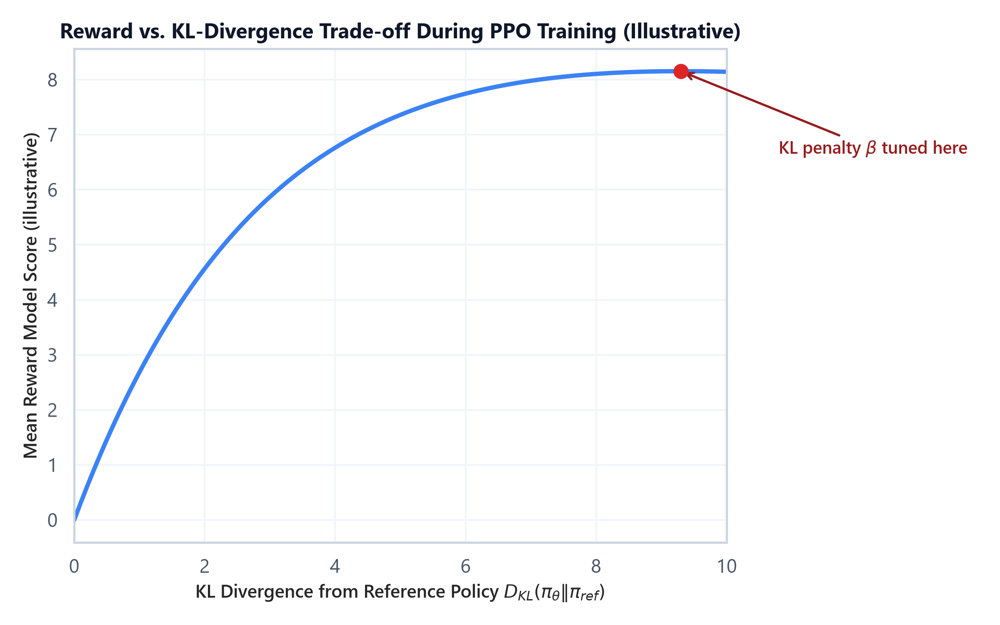

# Module 04: Reward Modeling & Reinforcement Learning from Human Feedback (RLHF)

## 1. Introduction & Intuition

### The Core Bottleneck
SFT (Module 02) teaches a model to imitate example responses, but imitation has a ceiling: it can only be as good as the demonstrations it was trained on, and it provides no signal about *which of several plausible responses is better* — only "produce something like this one." Many desirable qualities (helpfulness, harmlessness, following subtle instructions precisely) are far easier for a human to *judge by comparison* ("response A is better than response B") than to *demonstrate* by writing a single ideal response from scratch. The bottleneck is that SFT has no mechanism to learn from comparative preference judgments at all.

### High-Level Intuition
RLHF closes this gap in two stages. First, train a **reward model** — a separate model that takes a (prompt, response) pair and outputs a scalar score — using human preference comparisons (given two responses to the same prompt, which one do people prefer?). Second, use that reward model as a learned objective to further train the SFT model via reinforcement learning (PPO): generate a response, score it with the reward model, and nudge the policy's weights to make higher-scoring responses more likely — while a KL-divergence penalty keeps the policy from drifting too far from its SFT starting point, which would otherwise let it find degenerate outputs that score well on the reward model but are no longer coherent or safe.

---

## 2. Core Concepts & Mathematical Formulation

### Reward Model Training: The Bradley-Terry Preference Loss

#### Purpose & Intuition
Human preference data comes in the form of pairwise comparisons: given a prompt and two candidate responses, a labeler picks the preferred one. The Bradley-Terry model converts this pairwise-preference signal into a training objective for a scalar reward model $r_\theta$: the model should assign a *higher* score to the preferred response than the rejected one, and the loss penalizes it proportionally to how wrong (or barely right) that ordering is.

#### Mathematical Formulation
For a preferred response $y_w$ ("winner") and rejected response $y_l$ ("loser") to the same prompt $x$:
$$\mathcal{L}_{\text{RM}} = -\log \sigma\big(r_\theta(x, y_w) - r_\theta(x, y_l)\big)$$

where $\sigma$ is the sigmoid function. This loss is minimized when $r_\theta(x, y_w) \gg r_\theta(x, y_l)$ (confidently correct ordering) and grows large when the model scores the rejected response higher than the preferred one.

---

### Hand Calculation: Reward Model Loss for One Preference Pair
Suppose the reward model assigns these scores to two candidate responses for the same prompt:

*   Preferred response: $r_\theta(x, y_w) = 2.4$
*   Rejected response: $r_\theta(x, y_l) = 0.9$

*   **Step 1: Compute the score difference**
    $$\Delta r = r_\theta(x, y_w) - r_\theta(x, y_l) = 2.4 - 0.9 = 1.5$$

*   **Step 2: Apply the sigmoid**
    $$\sigma(1.5) = \frac{1}{1 + e^{-1.5}} \approx \frac{1}{1 + 0.2231} \approx 0.8176$$

*   **Step 3: Compute the loss**
    $$\mathcal{L}_{\text{RM}} = -\log(0.8176) \approx 0.2014$$

The loss is small because the model already scores the preferred response comfortably higher. If the scores were reversed ($r_\theta(x, y_w) = 0.9$, $r_\theta(x, y_l) = 2.4$, i.e. $\Delta r = -1.5$), $\sigma(-1.5) \approx 0.1824$ and $\mathcal{L}_{\text{RM}} = -\log(0.1824) \approx 1.7014$ — a much larger loss, correctly penalizing the wrong ordering.

---

### PPO: The RLHF Training Objective

#### Purpose & Intuition
Proximal Policy Optimization (PPO) updates the policy (the LLM being fine-tuned) to increase the probability of actions (generated tokens/responses) that scored well under the reward model — but it *clips* how large a single update can be, preventing the kind of large, destabilizing policy shift that plain policy-gradient methods are prone to. A separate KL-divergence penalty against the frozen SFT reference policy further discourages the model from drifting into degenerate, reward-hacking outputs that score well on the reward model but no longer resemble coherent language.

#### Mathematical Formulation
$$\mathcal{L}_{\text{PPO}} = \mathbb{E}\Big[\min\big(\rho_t \cdot \hat{A}_t,\; \text{clip}(\rho_t, 1-\epsilon, 1+\epsilon) \cdot \hat{A}_t\big)\Big] - \beta \cdot D_{KL}(\pi_\theta \,\|\, \pi_{\text{ref}})$$

where $\rho_t = \frac{\pi_\theta(a_t \mid s_t)}{\pi_{\text{old}}(a_t \mid s_t)}$ is the probability ratio between the updated and previous policy for the action taken, $\hat{A}_t$ is the estimated advantage (roughly, "how much better than average was this action"), $\epsilon$ is the clip range (commonly 0.1-0.2), and $\beta$ controls the strength of the KL penalty against the reference policy $\pi_{\text{ref}}$ (the frozen SFT model).

---

### Hand Calculation: PPO Clipped Objective for One Token
Let's compute the clipped surrogate objective for a single token with an estimated advantage $\hat{A}_t = 1.2$ (this action was better than average), a probability ratio $\rho_t = 1.35$, and clip range $\epsilon = 0.2$.

*   **Step 1: Compute the unclipped term**
    $$\rho_t \cdot \hat{A}_t = 1.35 \times 1.2 = 1.62$$

*   **Step 2: Compute the clipped ratio**
    $$\text{clip}(1.35,\ 1-0.2,\ 1+0.2) = \text{clip}(1.35,\ 0.8,\ 1.2) = 1.2 \quad \text{(1.35 exceeds the upper bound 1.2, so it's clamped)}$$

*   **Step 3: Compute the clipped term**
    $$\text{clip}(\rho_t, 0.8, 1.2) \cdot \hat{A}_t = 1.2 \times 1.2 = 1.44$$

*   **Step 4: Take the minimum of the two terms**
    $$\mathcal{L}_{\text{PPO}}^{\text{(this token)}} = \min(1.62,\ 1.44) = 1.44$$

Because the advantage is positive (this action was good), PPO takes the *smaller* of the two terms — capping how much credit a single update can take for a large probability-ratio swing, even though the raw (unclipped) term would have been larger. This clipping is what prevents one favorable batch of samples from causing an outsized, destabilizing policy update.

---

### The Full RLHF Pipeline: Four Models in Memory

RLHF's PPO stage requires holding **four models simultaneously**:
1.  **Policy model** — the model being trained (starts as a copy of the SFT model).
2.  **Reference model** — a frozen copy of the SFT model, used only to compute the KL penalty; never updated.
3.  **Reward model** — frozen, scores generated responses.
4.  **Value model** — estimates expected future reward from a given state, used to compute the advantage estimate $\hat{A}_t$; trained alongside the policy.

Unlike SFT or LoRA, this is not just a memory-scaling problem solvable by sharding — it's a *qualitative* increase in pipeline complexity, since four different models with different roles (two frozen, two trained) must be orchestrated together for every training step.

<div align="center" style="margin: 20px 0; max-width: 100%; overflow-x: auto;">
<svg viewBox="0 0 780 260" width="100%" height="auto" xmlns="http://www.w3.org/2000/svg" style="background-color: #f8fafc; border: 1px solid #e2e8f0; border-radius: 8px; font-family: system-ui, -apple-system, sans-serif;">
  <text x="390" y="24" text-anchor="middle" font-size="13" font-weight="bold" fill="#0f172a">RLHF Pipeline: SFT Model to PPO-Trained Policy</text>

  <!-- Column 1: SFT Model, vertically centered between the two rows below -->
  <rect x="20" y="115" width="140" height="45" rx="4" fill="#f1f5f9" stroke="#94a3b8" stroke-width="1.4" />
  <text x="90" y="142" text-anchor="middle" font-size="11" font-weight="bold" fill="#334155">SFT Model</text>

  <!-- Column 2, row 1: Policy -->
  <rect x="200" y="50" width="150" height="45" rx="4" fill="#eff6ff" stroke="#3b82f6" stroke-width="1.6" />
  <text x="275" y="77" text-anchor="middle" font-size="11" font-weight="bold" fill="#1e3a8a">Policy (trained)</text>

  <!-- Column 2, row 2: Reference -->
  <rect x="200" y="150" width="150" height="45" rx="4" fill="#f8fafc" stroke="#94a3b8" stroke-width="1.4" stroke-dasharray="3" />
  <text x="275" y="170" text-anchor="middle" font-size="10" fill="#475569">Reference (frozen)</text>
  <text x="275" y="184" text-anchor="middle" font-size="8" fill="#94a3b8">KL penalty anchor</text>

  <!-- Column 3, row 1: Reward Model -->
  <rect x="400" y="50" width="150" height="45" rx="4" fill="#fef2f2" stroke="#ef4444" stroke-width="1.6" />
  <text x="475" y="70" text-anchor="middle" font-size="10" font-weight="bold" fill="#7f1d1d">Reward Model</text>
  <text x="475" y="84" text-anchor="middle" font-size="8" fill="#991b1b">(frozen, from Bradley-Terry)</text>

  <!-- Column 3, row 2: Value Model -->
  <rect x="400" y="150" width="150" height="45" rx="4" fill="#ecfdf5" stroke="#10b981" stroke-width="1.6" />
  <text x="475" y="170" text-anchor="middle" font-size="10" font-weight="bold" fill="#065f46">Value Model</text>
  <text x="475" y="184" text-anchor="middle" font-size="8" fill="#065f46">(trained, estimates A_t)</text>

  <!-- Column 4: PPO Update, vertically centered -->
  <rect x="590" y="100" width="160" height="55" rx="4" fill="#f5f3ff" stroke="#7c3aed" stroke-width="1.6" />
  <text x="670" y="122" text-anchor="middle" font-size="10" font-weight="bold" fill="#5b21b6">PPO Update</text>
  <text x="670" y="138" text-anchor="middle" font-size="8" fill="#5b21b6">clipped objective + KL</text>

  <!-- Arrows -->
  <path d="M 160 130 L 200 82" stroke="#64748b" stroke-width="1.4" fill="none" marker-end="url(#arrow-rlhf)" />
  <text x="145" y="105" text-anchor="middle" font-size="8" fill="#64748b">seed</text>

  <path d="M 160 148 L 200 168" stroke="#64748b" stroke-width="1.4" fill="none" marker-end="url(#arrow-rlhf)" />
  <text x="145" y="168" text-anchor="middle" font-size="8" fill="#64748b">frozen copy</text>

  <path d="M 275 95 L 275 150" stroke="#dc2626" stroke-width="1.4" stroke-dasharray="3" marker-end="url(#arrow-rlhf)" />
  <text x="360" y="126" text-anchor="middle" font-size="8" fill="#991b1b">KL(&#960;_&#952; &#8214; &#960;_ref)</text>

  <path d="M 350 68 L 400 68" stroke="#64748b" stroke-width="1.4" marker-end="url(#arrow-rlhf)" />
  <text x="375" y="60" text-anchor="middle" font-size="8" fill="#64748b">scores response</text>

  <path d="M 350 172 L 400 172" stroke="#64748b" stroke-width="1.4" marker-end="url(#arrow-rlhf)" />

  <path d="M 550 82 L 590 112" stroke="#64748b" stroke-width="1.4" fill="none" marker-end="url(#arrow-rlhf)" />
  <path d="M 550 160 L 590 142" stroke="#64748b" stroke-width="1.4" fill="none" marker-end="url(#arrow-rlhf)" />

  <path d="M 590 150 L 590 225 L 10 225 L 10 90 L 200 90" stroke="#7c3aed" stroke-width="1.4" stroke-dasharray="3" fill="none" marker-end="url(#arrow-rlhf)" />
  <text x="300" y="240" text-anchor="middle" font-size="8" fill="#5b21b6">updates policy weights</text>

  <defs>
    <marker id="arrow-rlhf" viewBox="0 0 10 10" refX="6" refY="5" markerWidth="5" markerHeight="5" orient="auto-start-reverse">
      <path d="M 0 0 L 10 5 L 0 10 z" fill="#64748b" />
    </marker>
  </defs>
</svg>
</div>



*   **Plot Interpretation:** As the policy is allowed to drift further from the reference model (higher KL divergence), the reward model score rises — up to a point. Push too far and the policy starts producing outputs that exploit the reward model's blind spots rather than genuinely improving (see Module 08 for reward hacking in depth); the KL penalty coefficient $\beta$ is tuned to stop training in the productive region before that happens.

---

### Tensor & Shape Tracking
*   **Prompt + generated response tokens:** `[B, L]`
*   **Reward model output (per full response):** `[B]` (a single scalar score per response, not per token)
*   **Value model output (per token, for advantage estimation):** `[B, L]`
*   **Policy log-probabilities per generated token:** `[B, L]`
*   **PPO loss:** `[]` (scalar, averaged over the batch and sequence)

---

## 3. Implementation & Reference Code

Below is a self-contained implementation of the Bradley-Terry reward model loss and the PPO clipped surrogate objective, matching the hand calculations above.

```python
import torch
import torch.nn as nn
import torch.nn.functional as F

def bradley_terry_loss(reward_preferred: torch.Tensor, reward_rejected: torch.Tensor) -> torch.Tensor:
    """Reward model pairwise preference loss.
    reward_preferred, reward_rejected: [B] scalar reward scores.
    """
    return -F.logsigmoid(reward_preferred - reward_rejected).mean()


def ppo_clipped_objective(ratio: torch.Tensor, advantage: torch.Tensor, epsilon: float = 0.2) -> torch.Tensor:
    """PPO clipped surrogate objective (to be maximized; return negative for use as a loss).
    ratio, advantage: [B, L] per-token probability ratios and advantage estimates.
    """
    unclipped = ratio * advantage
    clipped = torch.clamp(ratio, 1 - epsilon, 1 + epsilon) * advantage
    return torch.min(unclipped, clipped).mean()


if __name__ == "__main__":
    # --- Reward model loss, matching the hand calc ---
    r_preferred = torch.tensor([2.4])
    r_rejected = torch.tensor([0.9])
    rm_loss = bradley_terry_loss(r_preferred, r_rejected)
    print(f"Reward model loss (preferred=2.4, rejected=0.9): {rm_loss.item():.4f}")

    r_preferred_swapped = torch.tensor([0.9])
    r_rejected_swapped = torch.tensor([2.4])
    rm_loss_swapped = bradley_terry_loss(r_preferred_swapped, r_rejected_swapped)
    print(f"Reward model loss (scores reversed):             {rm_loss_swapped.item():.4f}")

    # --- PPO clipped objective, matching the hand calc ---
    ratio = torch.tensor([[1.35]])
    advantage = torch.tensor([[1.2]])
    ppo_obj = ppo_clipped_objective(ratio, advantage, epsilon=0.2)
    print(f"\nPPO clipped objective (ratio=1.35, advantage=1.2, eps=0.2): {ppo_obj.item():.4f}")
```

---

## Interview Deep-Dive & System Trade-offs

### 1. Architectural & Production Trade-offs
*   **Core Problem Solved:** Learning from comparative human preference judgments (which response is better) rather than only from imitation of single demonstrated responses (SFT).
*   **Why Introduced over Legacy Approaches:** SFT alone cannot express "prefer this over that" signal; RLHF's reward model captures preference structure directly from comparison data, and PPO uses that learned reward as a training signal without needing a hand-written reward function.
*   **Key Failure Modes & Limitations:** Reward hacking (the policy finds outputs that score highly on the reward model without genuinely being better — covered in depth in Module 08), RL training instability if the KL penalty or clip range is poorly tuned, and the reward model's own biases/blind spots become the policy's blind spots too.

### 2. System Complexity & Scaling
*   **Time Complexity (FLOPs):** Each PPO step requires a full generation rollout (autoregressive, sequential) plus forward passes through the reward and value models — substantially more expensive per training example than a single SFT forward/backward pass.
*   **Space/Memory Footprint:** Four models resident simultaneously (policy, reference, reward, value) — even with PEFT reducing the *trainable* parameter count, the frozen reference and reward models still consume full inference-time memory each.
*   **Primary Bottleneck Type:** Compute-bound during autoregressive rollout generation (inherently sequential, same bottleneck class as inference); the 4-model memory footprint is a hard capacity constraint independent of compute.
*   **Variable Legend:** $\rho_t$ = probability ratio, $\hat{A}_t$ = advantage estimate, $\epsilon$ = PPO clip range, $\beta$ = KL penalty coefficient, $\pi_\theta$ = policy, $\pi_{\text{ref}}$ = frozen reference policy.

### 3. Production & Scalability
*   **Deployment Considerations:** The reward model and reference model can often run on separate, smaller-footprint inference-optimized deployments (they don't need training-time memory), while only the policy and value models need full training infrastructure — a common cost-saving split in production RLHF pipelines.
*   **Common Interviewer Follow-Up Questions:**
    1.  *Q:* Why does PPO need a *reference* model in addition to the reward model?
        *   *A:* The reward model only scores individual responses; nothing stops the policy from drifting arbitrarily far from sensible language to chase a high score. The KL penalty against a frozen reference model directly constrains how far the policy's output distribution can move from its SFT starting point, which is what keeps generations coherent while still improving on the reward signal.
    2.  *Q:* What does the PPO clip range $\epsilon$ actually protect against?
        *   *A:* It caps how much a single update can change the policy based on one batch of rollouts with a favorable probability ratio, preventing a large, potentially destabilizing policy shift from one noisy batch — the "proximal" in Proximal Policy Optimization refers exactly to this constraint of staying close to the previous policy each step.
