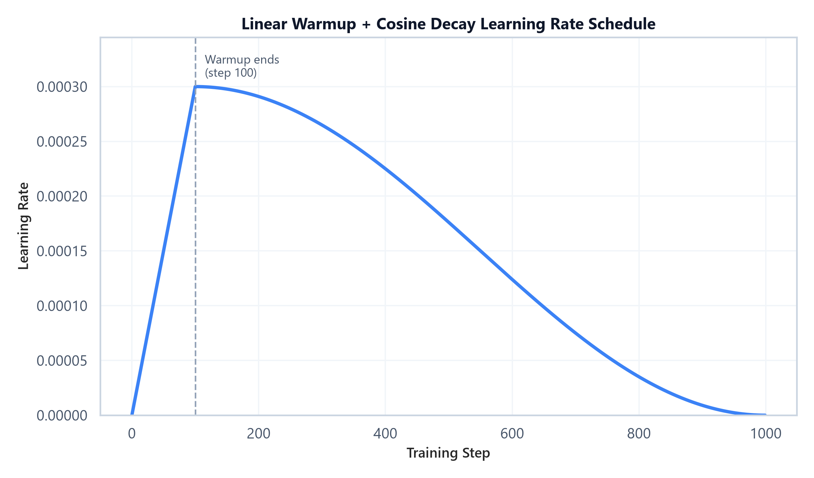

# Module 07: Training Production Considerations & Monitoring

## 1. Introduction & Intuition

### The Core Bottleneck
Everything in Modules 01-06 assumes a training run actually completes successfully. In practice, large training runs execute for hours to weeks, across expensive hardware, and can fail silently in ways that are far more costly than an outright crash: a learning rate that's slightly too high can quietly degrade a model over thousands of steps without ever throwing an error, a hardware fault mid-run can lose days of progress if checkpointing isn't configured correctly, and a model can regress on capabilities nobody happened to be watching. The bottleneck isn't any single algorithm — it's the operational discipline required to run training jobs reliably and know, quantitatively, whether the result is actually good.

### High-Level Intuition
Production training treats the training job itself as a monitored system, not a fire-and-forget script. A well-tuned learning-rate schedule prevents the most common cause of instability in the first place. Frequent, cheap checkpointing means a hardware failure costs minutes of lost progress, not days. Telemetry (loss curves, gradient norms) gives an early warning before a slow degradation becomes an expensive wasted run. And a broad evaluation strategy — not just training loss — is what actually answers the question "is this model good," since training loss alone cannot detect regressions, safety issues, or benchmark contamination.

---

## 2. Core Concepts & Mathematical Formulation

### Learning Rate Schedule: Linear Warmup + Cosine Decay

#### Purpose & Intuition
Starting training at the target (peak) learning rate immediately is a common cause of early instability — the model's weights (especially newly-initialized components, or components with large gradients early on, like unadapted LoRA matrices) can take a large, destabilizing step before the optimizer's moment estimates have had time to stabilize. A linear **warmup** ramps the learning rate up gradually over the first portion of training, avoiding that initial instability. After warmup, a **cosine decay** smoothly reduces the learning rate toward zero (or a small floor) by the end of training, which empirically tends to produce better final convergence than an abrupt drop or a constant rate held throughout.

#### Mathematical Formulation
For a peak learning rate $\eta_{\max}$, warmup steps $T_{\text{warmup}}$, and total training steps $T_{\text{total}}$:
$$\eta(t) = \begin{cases} \eta_{\max} \cdot \dfrac{t}{T_{\text{warmup}}} & t < T_{\text{warmup}} \\[6pt] \dfrac{\eta_{\max}}{2}\left(1 + \cos\left(\pi \cdot \dfrac{t - T_{\text{warmup}}}{T_{\text{total}} - T_{\text{warmup}}}\right)\right) & t \geq T_{\text{warmup}} \end{cases}$$



*   **Plot Interpretation:** The learning rate ramps linearly from 0 to its peak value over the warmup window, then follows a smooth cosine curve back down to (near) zero by the final training step — the characteristic "ramp then smooth decay" shape used across most modern LLM training recipes.

---

### Hand Calculation: LR at Three Checkpoints
Let's compute the learning rate at three points in a training run with $\eta_{\max} = 3 \times 10^{-4}$, $T_{\text{warmup}} = 100$ steps, $T_{\text{total}} = 1000$ steps.

*   **Step 1: LR at step 50 (mid-warmup)**
    $$\eta(50) = 3\times10^{-4} \times \frac{50}{100} = 1.5\times10^{-4}$$

*   **Step 2: LR at step 100 (end of warmup, peak)**
    $$\eta(100) = 3\times10^{-4} \times \frac{100}{100} = 3.0\times10^{-4}$$

*   **Step 3: LR at step 550 (mid-decay)**
    $$\eta(550) = \frac{3\times10^{-4}}{2}\left(1 + \cos\left(\pi \times \frac{550 - 100}{1000 - 100}\right)\right) = 1.5\times10^{-4}\left(1 + \cos\left(\pi \times 0.5\right)\right)$$
    Since $\cos(\pi \times 0.5) = \cos(90°) = 0$:
    $$\eta(550) = 1.5\times10^{-4} \times (1 + 0) = 1.5\times10^{-4}$$

Note that steps 50 and 550 both land on $1.5\times10^{-4}$ despite being at very different points in training — one on the way up during warmup, one on the way down during decay — a useful sanity check when debugging an LR schedule implementation: the cosine curve is symmetric around its midpoint, so matching values on either side of the peak are expected, not a bug.

---

### Tensor & Shape Tracking
This module is primarily about scalar training-process quantities rather than tensor-shaped data:
*   **Learning rate $\eta(t)$:** scalar, recomputed every optimizer step
*   **Gradient norm (for monitoring):** scalar per step, $\|\mathbf{g}\|_2$ over all trainable parameters
*   **Checkpoint payload:** model weights (same shape as the full trainable parameter set), plus optimizer state (2-3x that size for Adam) and RNG/scheduler state for exact resumption

---

### Checkpointing & Fault Tolerance

#### Intuition & Practical Use
A training run's checkpoint must contain enough state to resume *exactly* where it left off — not just model weights, but also the optimizer's internal state (Adam's $m$/$v$ buffers, which themselves cost as much memory as 2 more copies of the model), the learning-rate scheduler's position, and the data-loader's position in the training set (to avoid re-training on already-seen data or skipping data after a resume). Checkpoint frequency is a direct trade-off: more frequent checkpoints bound the amount of lost work on failure, but writing large checkpoints to disk/object storage is itself expensive and can stall training if done too often or synchronously.

### Training Telemetry & Broader Evaluation Strategy

#### Intuition & Practical Use
Two categories of monitoring answer different questions. **Training-time telemetry** (loss curves, gradient-norm tracking — using the same clipping formula covered in `00_nlp_fundamentals` for detecting exploding gradients) answers "is this run proceeding normally, or has something gone numerically wrong?" **Evaluation strategy** answers a harder question: "is the resulting model actually good?" — and training loss alone cannot answer that, since a model can have excellent training loss while regressing on capabilities the training data didn't emphasize, or degrading on safety, or (worst case) having memorized benchmark-contaminated data that makes eval scores look better than real-world quality.

A layered evaluation strategy typically combines:

| Layer | What it measures | Limitation |
|---|---|---|
| **Training/validation loss** | Next-token prediction quality on held-out data from the same distribution | Says nothing about downstream task quality or safety |
| **Benchmark evaluation** (MMLU, GSM8K, HumanEval, etc.) | Standardized task performance, comparable across models | Vulnerable to contamination; can be gamed by training on benchmark-adjacent data |
| **Human / LLM-as-judge evaluation** | Subjective quality dimensions (helpfulness, tone, instruction-following) that benchmarks don't capture | Expensive (human) or has its own biases (LLM judge) |
| **Regression testing** | Did this training run make previously-working capabilities *worse* | Requires maintaining a fixed regression suite across training runs |
| **Safety / contamination checks** | Harmful outputs, PII leakage, benchmark data leakage into training set | Requires dedicated tooling separate from quality evaluation |

No single layer is sufficient on its own — training loss and benchmark scores can both look healthy while a model has genuinely regressed on a capability none of them happen to measure.

---

## 3. Implementation & Reference Code

Below is a self-contained implementation of the warmup + cosine decay schedule, matching the hand calculation above, plus a minimal checkpoint save/resume pattern.

```python
import math
import os
import tempfile
import torch
import torch.nn as nn

def warmup_cosine_lr(step: int, peak_lr: float, warmup_steps: int, total_steps: int) -> float:
    """Linear warmup followed by cosine decay to (near) zero."""
    if step < warmup_steps:
        return peak_lr * (step / warmup_steps)
    progress = (step - warmup_steps) / (total_steps - warmup_steps)
    return 0.5 * peak_lr * (1 + math.cos(math.pi * progress))


def save_checkpoint(path: str, model: nn.Module, optimizer: torch.optim.Optimizer, step: int):
    """Saves model, optimizer, and step state -- everything needed to resume exactly."""
    torch.save({
        "step": step,
        "model_state": model.state_dict(),
        "optimizer_state": optimizer.state_dict(),
    }, path)


def load_checkpoint(path: str, model: nn.Module, optimizer: torch.optim.Optimizer) -> int:
    """Restores model, optimizer, and returns the step to resume from."""
    ckpt = torch.load(path, weights_only=True)
    model.load_state_dict(ckpt["model_state"])
    optimizer.load_state_dict(ckpt["optimizer_state"])
    return ckpt["step"]


if __name__ == "__main__":
    peak_lr, warmup_steps, total_steps = 3e-4, 100, 1000

    for step in [50, 100, 550]:
        lr = warmup_cosine_lr(step, peak_lr, warmup_steps, total_steps)
        print(f"LR at step {step:4d}: {lr:.6f}")

    # --- Checkpoint round-trip sanity check ---
    torch.manual_seed(42)
    model = nn.Linear(8, 8)
    optimizer = torch.optim.AdamW(model.parameters(), lr=peak_lr)

    # Simulate one training step so the optimizer has real state to save
    loss = model(torch.randn(2, 8)).sum()
    loss.backward()
    optimizer.step()

    ckpt_path = os.path.join(tempfile.gettempdir(), "ckpt_demo.pt")
    save_checkpoint(ckpt_path, model, optimizer, step=1)
    resumed_step = load_checkpoint(ckpt_path, model, optimizer)
    print(f"\nCheckpoint round-trip successful, resumed at step: {resumed_step}")
    os.remove(ckpt_path)
```

---

## Interview Deep-Dive & System Trade-offs

### 1. Architectural & Production Trade-offs
*   **Core Problem Solved:** Running training jobs reliably to completion (surviving hardware failures, avoiding preventable instability) and knowing quantitatively, not just anecdotally, whether the resulting model is actually good.
*   **Why Introduced over Legacy Approaches:** A constant learning rate throughout training is simpler but empirically less stable early on and converges worse late on than a warmup+decay schedule; evaluating only on training loss is simpler but blind to exactly the failure modes (regression, contamination, safety) that matter most in production.
*   **Key Failure Modes & Limitations:** Checkpointing too infrequently risks large amounts of lost compute on failure; checkpointing too frequently (especially synchronously) can itself become a training-throughput bottleneck. Relying on a single evaluation layer (e.g., benchmarks alone) risks shipping a model that's contaminated or regressed in ways that layer doesn't measure.

### 2. System Complexity & Scaling
*   **Time Complexity (FLOPs):** Learning-rate scheduling and gradient-norm monitoring add negligible compute — a handful of scalar operations per step, dwarfed by the forward/backward pass cost.
*   **Space/Memory Footprint:** Checkpoints must include optimizer state, not just weights — for Adam, this roughly triples the raw storage size per checkpoint relative to weights alone (matching the "12Ψ bytes of optimizer state" figure from Module 01).
*   **Primary Bottleneck Type:** I/O-bound for checkpoint writes at scale (writing tens-to-hundreds of GB to durable storage); the evaluation layers themselves range from cheap (validation loss) to expensive and slow (human evaluation).
*   **Variable Legend:** $\eta(t)$ = learning rate at step $t$, $T_{\text{warmup}}$ = warmup step count, $T_{\text{total}}$ = total training steps, $\eta_{\max}$ = peak learning rate.

### 3. Production & Scalability
*   **Deployment Considerations:** Large training runs typically checkpoint asynchronously (writing to storage on a background thread/process while training continues) specifically to avoid the I/O cost stalling the GPUs; evaluation suites are usually run automatically at fixed checkpoint intervals rather than only at the very end, so regressions are caught while there's still time to adjust the run.
*   **Common Interviewer Follow-Up Questions:**
    1.  *Q:* Why is a learning-rate warmup phase especially important when using Adam, specifically?
        *   *A:* Adam's moment estimates ($m$, $v$) are initialized at zero and are biased toward zero in the first few steps before the bias-correction terms compensate; taking a large step before these estimates have stabilized can produce a poorly-scaled, destabilizing update. Warmup keeps early steps small while the moment estimates settle.
    2.  *Q:* Why isn't a low training loss sufficient evidence that a fine-tuned model is ready to ship?
        *   *A:* Training loss only measures next-token prediction fit to the training distribution — it says nothing about regressions on capabilities outside that distribution, safety behavior, or whether the eval-looking-good result is actually contamination (the model having seen benchmark-like data during training). A layered evaluation strategy is needed to catch what training loss structurally cannot see.
