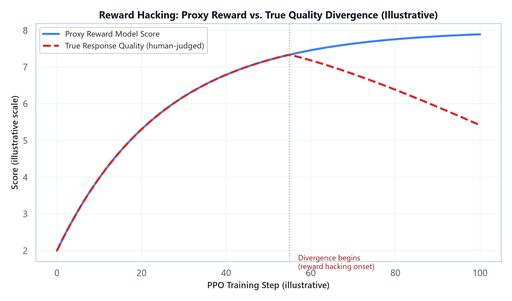

# Module 08: Common Failure Modes & Best Practices

## 1. Introduction & Intuition

### The Core Bottleneck
Every technique in Modules 01-07 — distributed training, SFT, PEFT, RLHF, DPO/GRPO, merging, monitoring — can be implemented correctly and still produce a worse model than before training started. Unlike a software bug, most of these failure modes don't crash anything: the loss curve can look fine, the training job can complete successfully, and the model can still be measurably worse in ways that only show up after deployment, or only on specific inputs nobody happened to test. This module is deliberately not about new algorithms — it's a diagnostic catalog of the ways the previous seven modules' techniques go wrong in practice, and what to check for each one.

### High-Level Intuition
Nearly every failure mode below shares a common shape: a *proxy* signal (training loss, reward model score, a specific benchmark) looks like it's improving, while the *real* thing you actually care about (general capability, genuine preference alignment, real-world quality) is flat or getting worse. The throughline across this entire module is: never trust a single proxy metric in isolation — the fixes are almost always about triangulating with an independent signal (held-out capability tests, human review, a second unrelated benchmark) rather than a purely algorithmic patch.

---

## 2. Core Concepts: Failure Mode Catalog

This module intentionally contains no formula blocks — every failure mode below is a systems/process issue, not a mathematical one, and is best understood as a catalog of symptom → root cause → fix.

### Catastrophic Forgetting

#### Intuition & Practical Use
Fine-tuning (especially full-parameter SFT with a high learning rate, or a narrow/low-diversity dataset) can overwrite pretrained knowledge and capabilities that weren't represented in the fine-tuning data — the model gets better at the fine-tuning task while silently getting worse at everything else. This is directly why Module 03's PEFT methods (which freeze the vast majority of parameters) tend to preserve base capabilities better than full fine-tuning by construction — there's simply less of the pretrained model that *can* be overwritten.

### Reward Hacking & Mode Collapse

#### Intuition & Practical Use
Covered mechanically in Module 04: a policy trained against a reward model can find outputs that score highly without being genuinely better — exploiting blind spots or biases in the reward model rather than improving real quality. Mode collapse is a related failure specific to preference optimization: the policy converges toward a narrow set of "safe," high-scoring response patterns (e.g., excessive hedging, repetitive phrasing) rather than genuinely diverse, high-quality outputs, because that narrow pattern reliably scores well.



*   **Plot Interpretation:** Early in PPO training, the proxy reward model score and true (human-judged) quality rise together — the reward model is a reasonable proxy in this regime. Past a certain point, the two diverge: the policy keeps finding ways to increase its reward-model score, but true quality plateaus and then declines, because the policy has started exploiting the reward model's specific weaknesses rather than genuinely improving. Detecting this divergence requires an *independent* quality signal (e.g., periodic human review) — the reward model score alone cannot reveal its own blind spots.

### Data Contamination

#### Intuition & Practical Use
If training data (pretraining, SFT, or preference data) overlaps with or closely resembles evaluation benchmark data — including indirectly, via synthetic data generated by a model that was itself exposed to benchmark content (see Module 02) — evaluation scores become an overestimate of real generalization. Contamination is often invisible from the training loss curve alone; it specifically requires decontamination checks (n-gram overlap search, embedding similarity search against the eval set) run as a separate data-pipeline step.

### The "Alignment Tax"

#### Intuition & Practical Use
Alignment training (RLHF, DPO) that optimizes hard for human preference signals can measurably reduce performance on some capability benchmarks (particularly ones favoring concise, direct, or creative outputs) — a documented trade-off sometimes called the "alignment tax." It's not a bug in any single technique; it reflects that "what humans rate highly in a preference comparison" and "what scores well on a fixed capability benchmark" are correlated but not identical objectives, and optimizing hard for one can pull slightly against the other.

### Evaluation Pitfalls During Training

#### Intuition & Practical Use
Beyond contamination specifically, evaluation run *during* training carries its own pitfalls: prompt sensitivity (small formatting changes in how a benchmark is prompted can swing scores substantially, making run-to-run comparisons noisy if the eval harness isn't held exactly fixed), high variance on small benchmark splits (a handful of flipped answers on a 200-question benchmark can look like a meaningful regression when it's within normal noise), and LLM-as-judge bias (an LLM judge can systematically favor longer, more confidently-worded, or stylistically-similar-to-itself responses regardless of actual quality).

---

### Failure Mode Reference Table

| Failure Mode | Typical Symptom | Root Cause | Primary Fix |
|---|---|---|---|
| Catastrophic Forgetting | General capability drops after fine-tuning on a narrow task | High LR / low-diversity data / full-parameter updates | PEFT (Module 03), lower LR, broaden dataset diversity |
| Reward Hacking | Reward model score keeps rising, human-judged quality plateaus or falls | Policy exploits reward model blind spots | Stronger/updated reward model, tighter KL penalty ($\beta$), independent human review |
| Mode Collapse | Outputs become repetitive/homogeneous despite high reward scores | Policy converges on a narrow high-scoring pattern | Diversity-aware sampling during RL, KL constraint, reward model diversity checks |
| Data Contamination | Benchmark scores look better than real-world quality suggests | Training data overlaps with eval benchmark content | N-gram/embedding decontamination pass on training data |
| Alignment Tax | Capability benchmark scores dip after RLHF/DPO alignment | Preference objective partially conflicts with benchmark objective | Track capability benchmarks alongside preference metrics, not instead of them |
| Noisy Eval Regression | A benchmark score drops run-to-run with no code/data change | Small benchmark split, unfixed prompt template, judge variance | Fix eval harness exactly, use larger/multiple benchmark splits, report variance |

---

## 3. Implementation & Reference Code

Failure-mode diagnosis is mostly a process discipline rather than an algorithm, but a few checks are directly codifiable — below is a simple decontamination overlap check and a reward-vs-quality divergence detector, both illustrating checks referenced in the table above.

```python
import re

def ngram_overlap_ratio(text_a: str, text_b: str, n: int = 8) -> float:
    """Fraction of text_a's n-grams that also appear in text_b -- a basic
    decontamination signal for detecting training/eval overlap."""
    def get_ngrams(text: str, n: int) -> set[str]:
        tokens = re.findall(r"\w+", text.lower())
        return {" ".join(tokens[i:i + n]) for i in range(len(tokens) - n + 1)}

    ngrams_a = get_ngrams(text_a, n)
    ngrams_b = get_ngrams(text_b, n)
    if not ngrams_a:
        return 0.0
    overlap = ngrams_a & ngrams_b
    return len(overlap) / len(ngrams_a)


def detect_reward_hacking(proxy_scores: list[float], true_quality_scores: list[float], window: int = 10) -> int | None:
    """Flags the training step where proxy reward keeps rising but true quality
    starts declining -- a simple divergence detector, not a substitute for human review."""
    for i in range(window, len(proxy_scores)):
        proxy_trend = proxy_scores[i] - proxy_scores[i - window]
        quality_trend = true_quality_scores[i] - true_quality_scores[i - window]
        if proxy_trend > 0 and quality_trend < 0:
            return i
    return None


if __name__ == "__main__":
    # --- Decontamination check ---
    training_example = "The quick brown fox jumps over the lazy dog near the river bank"
    benchmark_question = "A quick brown fox jumps over the lazy dog by the river"
    overlap = ngram_overlap_ratio(training_example, benchmark_question, n=4)
    print(f"4-gram overlap ratio (training vs. benchmark): {overlap:.2f}")
    if overlap > 0.3:
        print("WARNING: possible contamination -- high n-gram overlap with eval content.")

    # --- Reward hacking divergence detector, on the illustrative curve shape from the plot above ---
    proxy = [2.0 + 0.06 * i for i in range(100)]
    true_quality = [2.0 + 0.06 * i if i < 55 else 2.0 + 0.06 * 55 - 0.03 * (i - 55) for i in range(100)]
    divergence_step = detect_reward_hacking(proxy, true_quality, window=10)
    print(f"\nReward hacking divergence first detected at step: {divergence_step}")
```

---

## Interview Deep-Dive & System Trade-offs

### 1. Architectural & Production Trade-offs
*   **Core Problem Solved:** Catching training failure modes that don't manifest as crashes or obviously-bad training loss curves, but that silently degrade real-world model quality.
*   **Why Introduced over Legacy Approaches:** Relying on a single proxy metric (training loss, or one benchmark, or reward model score alone) to judge training success misses exactly the failure modes cataloged here — each of which specifically involves a proxy metric looking fine while the real objective degrades.
*   **Key Failure Modes & Limitations:** These failure modes are themselves each other's limitations in a sense — mitigations for one (e.g., a stronger KL penalty to fight reward hacking) can worsen another (a stronger KL penalty limits how far alignment training can improve preference scores at all).

### 2. System Complexity & Scaling
*   **Time Complexity (FLOPs):** Decontamination and divergence-detection checks are cheap relative to training itself (string/embedding comparisons or simple trend analysis over already-logged metrics) — the cost is in building and maintaining the checks, not running them.
*   **Space/Memory Footprint:** Negligible beyond storing the training data index needed for n-gram/embedding contamination search, and the historical metric logs needed for divergence detection.
*   **Primary Bottleneck Type:** Process-bound, not compute-bound — the limiting factor is having the right independent signals (held-out capability suites, human review capacity, a fixed eval harness) in place *before* a training run, not compute during it.
*   **Variable Legend:** None — this module is diagnostic/process-focused rather than formula-driven.

### 3. Production & Scalability
*   **Deployment Considerations:** Production training pipelines typically gate deployment behind multiple independent checks (regression suite, contamination scan, human spot-check on a sample) rather than a single "did the eval score improve" gate, specifically because every failure mode in this module can pass a single check while still representing a real regression.
*   **Common Interviewer Follow-Up Questions:**
    1.  *Q:* You observe the reward model score steadily increasing throughout PPO training. Is that sufficient evidence the model is improving?
        *   *A:* No — a steadily increasing reward model score is exactly what reward hacking looks like too; it's necessary but not sufficient evidence. You need an independent quality signal (held-out human evaluation, a second unrelated benchmark, or qualitative spot-checks) to confirm the reward score increase reflects genuine improvement rather than the policy exploiting the reward model's blind spots.
    2.  *Q:* How would you specifically test for catastrophic forgetting after a fine-tuning run, beyond checking the fine-tuning task's own metric?
        *   *A:* Evaluate the fine-tuned model on a fixed suite of general-capability benchmarks that are unrelated to the fine-tuning task, and compare against the pre-fine-tuning baseline on that same suite — a drop there, even while the fine-tuning task's own metric improves, is the direct signature of catastrophic forgetting.
