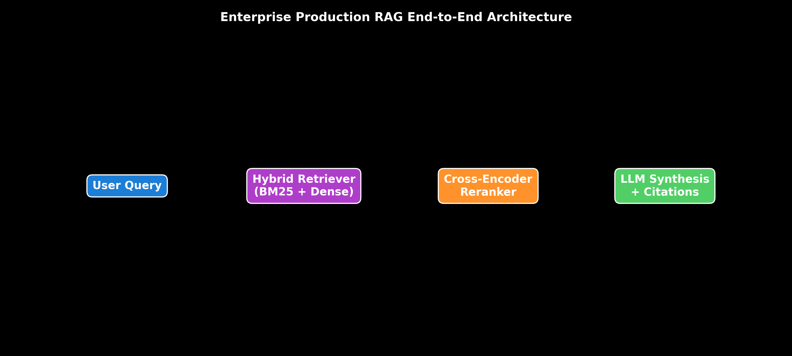

# Module 01: Introduction to Enterprise RAG Architecture

This guide provides an exhaustive breakdown of why Retrieval-Augmented Generation (RAG) exists, Parametric vs. Non-Parametric Memory trade-offs, how RAG solves LLM hallucinations, and the complete end-to-end architecture of an Enterprise Production RAG System, complete with step-by-step hand calculations, LangChain execution code, and production failure modes.

> **Notebook Companion**: [01_introduction_to_enterprise_rag.ipynb](file:///d:/Study/Prep/machine-learning-prep/generative-ai-and-agentic-ai/02_retrieval_augmented_generation_rag/01_introduction_to_enterprise_rag.ipynb)

---

## 1. What is Retrieval-Augmented Generation (RAG)?

Retrieval-Augmented Generation (RAG) is a hybrid system architecture that combines **information retrieval algorithms** (dense vector search, sparse keyword BM25) with **autoregressive language models** (LLMs). Instead of relying solely on internal model weights to generate answers, RAG dynamically fetches relevant document chunks from an external knowledge store and injects them into the LLM's prompt context at inference time.

### Primary Enterprise Objectives of RAG:
1. **Eliminating Hallucinations**: Grounding model generation strictly within retrieved context passages.
2. **Accessing Private Enterprise Data**: Indexing internal PDFs, SQL tables, and confluence documents inaccessible to public foundation models.
3. **Deterministic Auditability**: Providing source document links and line-number citations for every generated sentence.
4. **Real-time Knowledge Updates**: Updating vector database records in milliseconds without retraining model weights.

---

## 2. Parametric vs. Non-Parametric Memory

```text
Dimension              Parametric Memory (LLM Weights)        Non-Parametric Memory (Vector DB / RAG)
----------------------------------------------------------------------------------------------------------------------
Knowledge Source       Frozen model weights (theta)           External vector database & document stores
Update Cost            High (Requires GPU Fine-Tuning / SFT)  Instantaneous (Single vector insert/upsert)
Auditability & Trace   Zero (Black-box weight activations)   100% Deterministic (Exact document & line citations)
Knowledge Cutoff       Fixed training data cutoff date        Real-time (Live APIs & continuous ingestion)
Access Security / ACL  Cannot enforce role-based security    Role-based Access Control (ACL) payload metadata
Primary Failure Mode   Factual & Logical Hallucinations       Retrieval Failure & Missing Context
```

---

## 3. End-to-End Enterprise RAG Architecture

An Enterprise Production RAG system separates data processing into three distinct pipelines:

```text
┌──────────────────────────────────────────────────────────────────────────────────┐
│ 1. OFFLINE INGESTION PIPELINE                                                    │
│    Data Connectors ──► Parsing & OCR ──► Deduplication ──► Chunking ──► Vector Index│
├──────────────────────────────────────────────────────────────────────────────────┤
│ 2. ONLINE RETRIEVAL PIPELINE                                                     │
│    User Query ──► Query Expansion ──► Hybrid Search (BM25 + Vector) ──► Reranker  │
├──────────────────────────────────────────────────────────────────────────────────┤
│ 3. ONLINE GENERATION PIPELINE                                                    │
│    Context Assembly ──► Grounded System Prompt ──► LLM Inference ──► Citations    │
└──────────────────────────────────────────────────────────────────────────────────┘
```



> [!NOTE]
> **Plot Interpretation & Interview Takeaways:**
> - **What is shown:** Enterprise Production RAG pipeline separating User Query, Hybrid Retrieval (BM25 + Dense), Cross-Encoder Reranking, and LLM Synthesis.
> - **Key Systems Insight:** Decoupling retrieval from generation allows updating enterprise knowledge in real time without retraining LLM weights.
> - **Interview Application:** When asked *"How do you eliminate hallucinations in enterprise chatbots?"*, explain grounded non-parametric retrieval with strict context boundaries.

---

## 4. Mathematical Precision & Memory Economics (Andrew Ng Style)

Suppose an enterprise needs to index $1\text{ TB}$ of internal technical documentation ($250,000,000,000$ tokens).

### Option A: Storing Knowledge in Model Weights (Parametric Fine-Tuning)
- Fine-tuning a 70B parameter model on $250\text{B}$ tokens requires $\approx 500$ H100 GPU days $\approx \mathbf{\$250,000}$.
- Knowledge cannot be selectively deleted when a document is updated.

### Option B: Storing Knowledge in Vector Database (Non-Parametric RAG)
- Embedding $250\text{B}$ tokens via OpenAI `text-embedding-3-small` ($\$0.02 / 1\text{M}$ tokens):
  $$\text{Embedding Cost} = \frac{250,000,000,000}{1,000,000} \times \$0.02 = 250,000 \times \$0.02 = \mathbf{\$5,000}$$
- Vector Database hosting ($250\text{M}$ vectors in Qdrant/Milvus): $\approx \mathbf{\$400 / \text{month}}$.
- Updating a single document takes $10\text{ms}$ and costs fraction of a cent.

---

## 5. Production LangChain Code Implementation

```python
import os
from dotenv import load_dotenv
from langchain_community.vectorstores import FAISS
from langchain_openai import OpenAIEmbeddings
from langchain_core.prompts import ChatPromptTemplate
from langchain_openai import ChatOpenAI

load_dotenv()

tech_specs = [
    "Microservice Architecture: Microservice A communicates with Database B via gRPC over TLS 1.3.",
    "Latency SLA: API endpoints must maintain a P99 latency of under 100 milliseconds.",
    "Security Policy: All JWT authentication tokens expire after 3600 seconds (1 hour)."
]

if os.getenv("OPENAI_API_KEY"):
    embeddings = OpenAIEmbeddings()
    vectorstore = FAISS.from_texts(tech_specs, embeddings)
    retriever = vectorstore.as_retriever(search_kwargs={"k": 2})
    
    prompt = ChatPromptTemplate.from_template("Answer strictly using context:\nContext: {context}\nQuestion: {question}")
    llm = ChatOpenAI(model="gpt-4o-mini", temperature=0.0)
    
    query = "What is the communication protocol between Microservice A and Database B?"
    docs = retriever.invoke(query)
    context_text = "\n".join([d.page_content for d in docs])
    
    response = llm.invoke(prompt.format(context=context_text, question=query))
    print("=== Baseline Enterprise RAG Response ===")
    print(response.content)
```

---

## 6. Production Failure Modes & Selection Rules

- **Unconstrained Vector Search**: Relying solely on dense vector search causes keyword misses (e.g. searching exact SKU `"PART-9021"` fails).
  - *Fix:* Deploy **Hybrid Search (BM25 + Dense Vector)** paired with **Cross-Encoder Reranking**.
- **Context Pollution**: Injecting irrelevant top-$k$ chunks degrades generation quality.
  - *Fix:* Set minimum vector similarity thresholds ($\text{score} \ge 0.75$) or use a Cross-Encoder reranker.