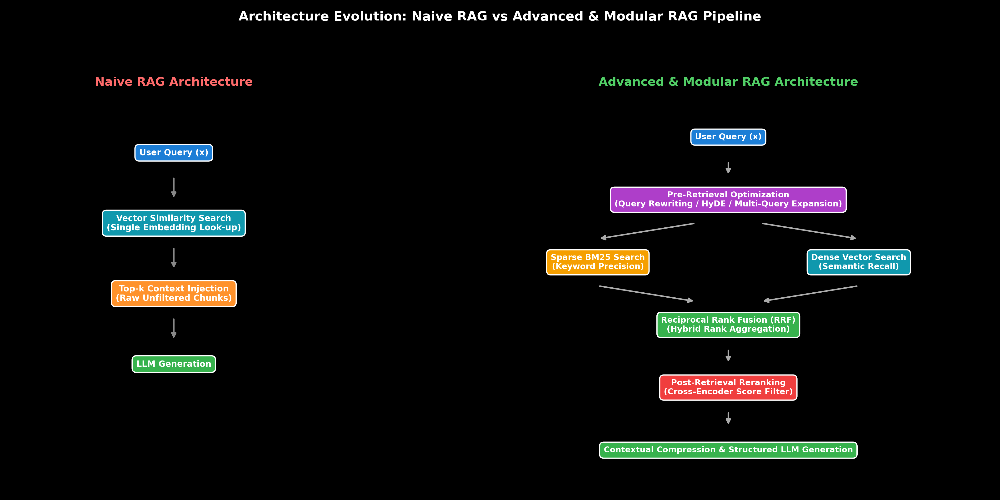

# Naive vs. Advanced & Modular RAG Architectures

This guide details the architectural evolution of Retrieval-Augmented Generation (RAG), comparing Naive RAG, Advanced RAG, and Modular RAG, complete with mathematical formulas, step-by-step calculations, LangChain code, and production failure modes.

> **Notebook Companion**: [01_naive_vs_advanced_rag_architectures.ipynb](file:///d:/Study/Prep/machine-learning-prep/generative-ai-and-agentic-ai/02_retrieval_augmented_generation_rag/01_naive_vs_advanced_rag_architectures.ipynb)

---

## 1. Architectural Evolution of RAG

RAG enhances Large Language Models by fetching relevant external knowledge from an index before generation, mitigating knowledge cutoff limits and hallucinations.

```text
Paradigm         Query Processing              Retrieval Mechanism         Post-Retrieval Processing
----------------------------------------------------------------------------------------------------------------------
Naive RAG        Raw Query Direct Pass         Single Dense Vector Similarity Top-k Context Direct Concatenation
Advanced RAG     Query Rewriting / HyDE        Hybrid Sparse + Dense Search   Cross-Encoder Reranking & Compression
Modular RAG      Adaptive Query Routing        Multi-Store Vector/KG/SQL      Self-RAG Reflection & CRAG Fallback
```



> [!NOTE]
> **Plot Interpretation & Interview Takeaways:**
> - **What is shown:** Architectural flowchart comparing Naive RAG (linear 4-step pipeline) against Advanced/Modular RAG (pre-retrieval query rewriting, parallel hybrid retrieval, RRF rank aggregation, cross-encoder reranking, and contextual compression).
> - **Key Systems Insight:** Naive RAG fails in production due to low retrieval precision (irrelevant chunks injected into context) and low recall (missing crucial facts). Advanced RAG introduces precision filters (Cross-Encoder rerankers) and query expansion (HyDE) to optimize context relevance.
> - **Interview Application:** When asked *"How do you upgrade a Naive RAG prototype to enterprise production standards?"*, detail pre-retrieval transformations, hybrid search, RRF, and cross-encoder reranking.

---

## 2. Mathematical Precision & Hand Calculation (Andrew Ng Style)

Let a retrieved document set be $D = \{d_1, d_2, \dots, d_k\}$. We evaluate context quality using **Context Relevance**:

$$\text{Context Relevance} = \frac{|D_{\text{relevant}}|}{k}$$

Where $D_{\text{relevant}} \subseteq D$ is the subset of retrieved chunks containing factual answers.

### Step-by-Step Hand Calculation on a 4-Chunk Retrieval Set:

Suppose an LLM issues a query: *"What is the memory benefit of PagedAttention?"*. The vector database retrieves $k=4$ chunks:

1. **Chunk Evaluation:**
   - Chunk 1: *"PagedAttention allocates KV cache in non-contiguous virtual pages, eliminating 96% VRAM fragmentation."* ($\mathbf{\text{RELEVANT}}$)
   - Chunk 2: *"PyTorch supports AdamW optimizer with weight decay 0.01."* ($\mathbf{\text{IRRELEVANT}}$)
   - Chunk 3: *"Grouped-Query Attention reduces KV cache size by 8x."* ($\mathbf{\text{IRRELEVANT}}$ - Right topic, wrong mechanism)
   - Chunk 4: *"PagedAttention allows sharing KV pages across parallel decoding beams."* ($\mathbf{\text{RELEVANT}}$)

2. **Compute Context Relevance Metric:**
   $$|D_{\text{relevant}}| = 2, \quad k = 4$$
   $$\text{Context Relevance} = \frac{2}{4} = \mathbf{0.50} \ (50\%)$$

**Production Takeaway:** In Naive RAG, $50\%$ of injected context tokens represent noise, wasting context window capacity and risking attention distraction.

---

## 3. Production LangChain RAG Implementation

```python
from langchain_text_splitters import RecursiveCharacterTextSplitter
from langchain_core.prompts import ChatPromptTemplate
from langchain_core.documents import Document

# 1. Document Chunking
raw_docs = [
    Document(page_content="PagedAttention allocates KV cache memory in non-contiguous virtual pages, eliminating 96% of VRAM fragmentation in vLLM."),
    Document(page_content="Grouped-Query Attention (GQA) groups 8 query heads per key-value head, reducing 70B model KV cache memory by 8x.")
]

splitter = RecursiveCharacterTextSplitter(chunk_size=120, chunk_overlap=20)
chunks = splitter.split_documents(raw_docs)

# 2. Prompt Assembly
rag_prompt = ChatPromptTemplate.from_messages([
    ("system", "You are an AI assistant. Answer using ONLY the provided context. If unsure, say 'I do not know.'"),
    ("user", "Context:\n{context}\n\nQuestion: {question}")
])

context_text = "\n\n".join([c.page_content for c in chunks])
formatted_prompt = rag_prompt.format(context=context_text, question="How does PagedAttention reduce VRAM fragmentation?")

print(formatted_prompt)
```

---

## 4. Production Failure Modes & Trade-offs

- **"Lost in the Middle" Effect**: LLMs attend heavily to the beginning and end of long contexts, while ignoring chunks placed in the middle ($20\% - 40\%$ recall drop).
- **Chunk Boundary Context Truncation**: Splitting text blindly across hard token limits cuts sentences in half, causing semantic loss.
