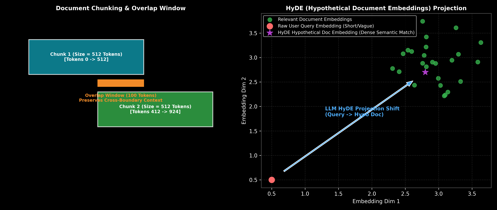

# Chunking Strategies & Query Transformations (HyDE)

This guide details document chunking strategies (Fixed-size, Semantic, Parent-Child) and Pre-Retrieval Query Transformations (HyDE, Step-Back, Multi-Query expansion), complete with step-by-step calculations, LangChain code, and production failure modes.

> **Notebook Companion**: [02_chunking_query_transformations_hyde.ipynb](file:///d:/Study/Prep/machine-learning-prep/generative-ai-and-agentic-ai/02_retrieval_augmented_generation_rag/02_chunking_query_transformations_hyde.ipynb)

---

## 1. Document Chunking & Pre-Retrieval Query Transformations

Short, raw user queries (e.g. *"FlashAttention memory"*) fail vector search because query embeddings sit far away from detailed document chunk embeddings in representation space.

```text
Technique Name            Mechanism                                            Primary Benefit
----------------------------------------------------------------------------------------------------------------------
Parent-Child Chunking     Retrieves small child chunks; passes parent context  High retrieval precision + rich context
HyDE (Hypothetical Doc)   LLM generates hypothetical answer; embeds hypo doc   Bridging query-to-document vector gap
Multi-Query Expansion     Generates 3-5 rephrased query variations            Higher recall across vocabulary synonyms
Step-Back Prompting       Generates high-level abstract concept question       Prevents over-specific retrieval traps
```



> [!NOTE]
> **Plot Interpretation & Interview Takeaways:**
> - **What is shown:** Left: Document chunk overlap window. Right: Vector space trajectory of a raw user query shifted into the document cluster via HyDE hypothetical document generation.
> - **Key Systems Insight:** Short user queries lack semantic density. HyDE asks an LLM to generate a hypothetical answer passage first. Even if the hypothetical answer contains factual inaccuracies, its vector embedding resides inside the document embedding manifold, dramatically improving dense vector retrieval recall.
> - **Interview Application:** When asked *"How do you handle short, ambiguous user queries in dense vector retrieval?"*, explain HyDE (Hypothetical Document Embeddings) and Multi-Query expansion.

---

## 2. Mathematical Intuition & Hand Calculation (Andrew Ng Style)

Let $q \in \mathbb{R}^d$ be the vector embedding of a raw user query, and let $d_{\text{hypo}} \in \mathbb{R}^d$ be the embedding of the generated hypothetical answer document.

The cosine similarity improvement to a true ground-truth document $d_{\text{true}}$ is:

$$\Delta \text{Sim} = \text{cos\_sim}(d_{\text{hypo}}, d_{\text{true}}) - \text{cos\_sim}(q, d_{\text{true}})$$

### Step-by-Step Hand Calculation on 2D Embeddings:

Let ground-truth document vector $d_{\text{true}} = \begin{bmatrix} 0.8 \\ 0.6 \end{bmatrix}$ (Unit vector, $\|d_{\text{true}}\| = 1.0$).

1. **Raw Short User Query ($q$):**
   - $q = \begin{bmatrix} 0.2 \\ 0.98 \end{bmatrix}$ (Normalized unit vector)
   - Cosine Similarity: $\text{sim}(q, d_{\text{true}}) = (0.2)(0.8) + (0.98)(0.6) = 0.16 + 0.588 = \mathbf{0.748}$

2. **HyDE Generated Hypothetical Passage Vector ($d_{\text{hypo}}$):**
   - $d_{\text{hypo}} = \begin{bmatrix} 0.75 \\ 0.66 \end{bmatrix}$ (Normalized unit vector)
   - Cosine Similarity: $\text{sim}(d_{\text{hypo}}, d_{\text{true}}) = (0.75)(0.8) + (0.66)(0.6) = 0.60 + 0.396 = \mathbf{0.996}$

3. **Compute Similarity Gain ($\Delta \text{Sim}$):**
   $$\Delta \text{Sim} = 0.996 - 0.748 = \mathbf{+0.248}$$

**Result:** HyDE boosts vector retrieval similarity score by $+0.248$, shifting a missed document into the top-$1$ position.

---

## 3. Production LangChain Code

```python
from langchain_text_splitters import RecursiveCharacterTextSplitter
from langchain_core.prompts import ChatPromptTemplate

# Parent-Child Chunk Splitters
parent_splitter = RecursiveCharacterTextSplitter(chunk_size=1000, chunk_overlap=100)
child_splitter = RecursiveCharacterTextSplitter(chunk_size=200, chunk_overlap=20)

# HyDE Query Expansion Template
hyde_prompt = ChatPromptTemplate.from_messages([
    ("system", "Write a detailed technical paragraph answering the question. Include relevant domain terminology."),
    ("user", "Question: {question}")
])

hypo_doc_prompt = hyde_prompt.format(question="What is the memory benefit of FlashAttention?")
print("HyDE Prompt Generated:\n", hypo_doc_prompt)
```

---

## 4. Production Failure Modes & Trade-offs

- **HyDE Hallucination Amplification**: If the LLM generates a completely hallucinated hypothetical document on obscure topics, vector search will retrieve documents matching the hallucination instead of the ground truth.
- **Latency Multiplication**: HyDE and Multi-Query expansion require an upfront LLM generation call before vector retrieval, adding $300\text{ms} - 800\text{ms}$ to Time-To-First-Token (TTFT).
