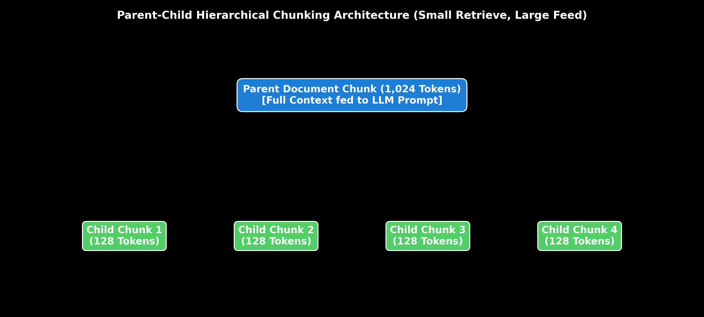

# Module 03: Advanced Chunking Strategies

This guide provides an in-depth, self-explanatory breakdown of 7 Chunking Strategies (Fixed-size Chunking, Sliding Window, Recursive Character Splitters, Semantic Chunking, Parent-Child / Hierarchical Chunking, Document-Aware Chunking, and Agentic Chunking), complete with trade-off matrices, overlap formulas, step-by-step hand calculations, and LangChain code.

> **Notebook Companion**: [03_advanced_chunking_strategies.ipynb](file:///d:/Study/Prep/machine-learning-prep/generative-ai-and-agentic-ai/02_retrieval_augmented_generation_rag/03_advanced_chunking_strategies.ipynb)

---

## 1. Chunking Paradigms Comparison Matrix

```text
Strategy               Mechanism                              Advantages                        Primary Disadvantage
----------------------------------------------------------------------------------------------------------------------
Fixed-Size             Splits text every K characters/tokens  Fast, zero compute overhead       Breaks sentences & context
Sliding Window         Fixed-size with K% chunk overlap      Prevents boundary context loss    Inflates vector index size
Recursive Character    Splits on ["\n\n", "\n", " ", ""]      Preserves paragraph structure     Arbitrary chunk boundaries
Semantic Chunking      Splits on sentence embedding shifts    Preserves semantic coherence      High embedding compute cost
Parent-Child           Small child retrieve, large parent feed High retrieval + Rich context     Requires dual vector mapping
Document-Aware         Splits by H1/H2 markdown headers       Preserves structural document hierarchy Requires clean input structure
Agentic Chunking       LLM determines chunk boundaries        Optimal semantic isolation        Slow & expensive API calls
```



> [!NOTE]
> **Plot Interpretation & Interview Takeaways:**
> - **What is shown:** Parent-Child Hierarchical Chunking mapping small 128-token child vector search chunks to 1,024-token parent document blocks.
> - **Key Systems Insight:** Small child chunks maximize vector retrieval precision, while large parent chunks provide full context to the LLM.
> - **Interview Application:** When asked *"How do you fix vector search returning incomplete sentence snippets?"*, explain Parent-Child chunking.

---

## 2. In-Depth Breakdown of 7 Chunking Strategies

### 2.1 Fixed-Size Chunking
Splits raw text every $N$ characters or tokens regardless of sentence structure.
- **Best Suited For**: Quick benchmarks, uniform fixed data.
- **Drawback**: Cuts sentences mid-word or mid-clause.

### 2.2 Sliding Window Chunking
Extends fixed-size chunking by adding an overlap $O$ between consecutive chunks.
- **Formula**: Stride $S = C - O$.
- **Best Suited For**: Preserving context at boundary cuts.

### 2.3 Recursive Character Chunking
Tries to split on paragraph breaks (`\n\n`), then line breaks (`\n`), spaces (` `), and finally characters (`""`) sequentially until chunks fall below size limit $C$.
- **Best Suited For**: General prose, documentation, code.

### 2.4 Semantic Chunking
Calculates Cosine Distance between consecutive sentence embeddings $d = 1 - \cos(\mathbf{e}_i, \mathbf{e}_{i+1})$. Splits document whenever distance exceeds a threshold percentile (e.g. 95th percentile).
- **Best Suited For**: Articles and narrative texts with dynamic topic shifts.

### 2.5 Parent-Child / Hierarchical Chunking
Embeds small 128-token child chunks into the vector database for high vector search precision, but links each child to a larger 1024-token parent document stored in a key-value docstore.
- **Best Suited For**: Enterprise Technical Specs & Legal Contracts.

### 2.6 Document-Aware Structural Chunking
Parses structural DOM or Markdown elements (H1, H2, H3 headers, code blocks, tables) to split documents cleanly along structural boundaries.
- **Best Suited For**: API Reference manuals and Markdown wikis.

### 2.7 Agentic Chunking
Uses an LLM agent to analyze text sequentially, prompting: *"Does the next sentence belong to the current topic block or start a new chunk?"*.
- **Best Suited For**: High-value legal & financial documents where precision overrides API cost.

---

## 3. Mathematical Hand Calculation: Sliding Window Overlap Math (Andrew Ng Style)

Given a document of length $L = 1,000$ tokens. We use a sliding window chunk size $C = 200$ tokens with overlap $O = 50$ tokens.

The step size (stride) $S$ between chunk start positions is:
$$S = C - O = 200 - 50 = \mathbf{150 \text{ tokens}}$$

The total number of generated chunks $N$ is:
$$N = \left\lceil \frac{L - C}{S} \right\rceil + 1 = \left\lceil \frac{1000 - 200}{150} \right\rceil + 1 = \left\lceil \frac{800}{150} \right\rceil + 1 = \lceil 5.33 \rceil + 1 = 6 + 1 = \mathbf{7 \text{ chunks}}$$

---

## 4. Production LangChain Code Implementation

```python
from langchain.text_splitter import RecursiveCharacterTextSplitter

parent_doc = """Microservice Architecture Specification:
Section 1: Microservice A handles authentication using JWT tokens signed by RS256.
Section 2: Microservice B processes payment transactions via Stripe API.
Section 3: Microservice C handles user notifications via AWS SNS.
All services log metrics to Datadog with trace IDs for observability."""

parent_splitter = RecursiveCharacterTextSplitter(chunk_size=300, chunk_overlap=0)
parents = parent_splitter.split_text(parent_doc)
print(f"=== Parent-Child Chunking Split ===")
print(f"Parent Chunks Count: {len(parents)}")
print("Parent Chunk #1:\n", parents[0])
```

---

## 5. Production Failure Modes & Selection Rules

- **Fragmented Context**: Arbitrary fixed-size splitting cuts sentences mid-word or separates subject from predicate.
  - *Fix:* Use **Recursive Character Splitter** with paragraph separators `["\n\n", "\n"]` or **Parent-Child Chunking**.