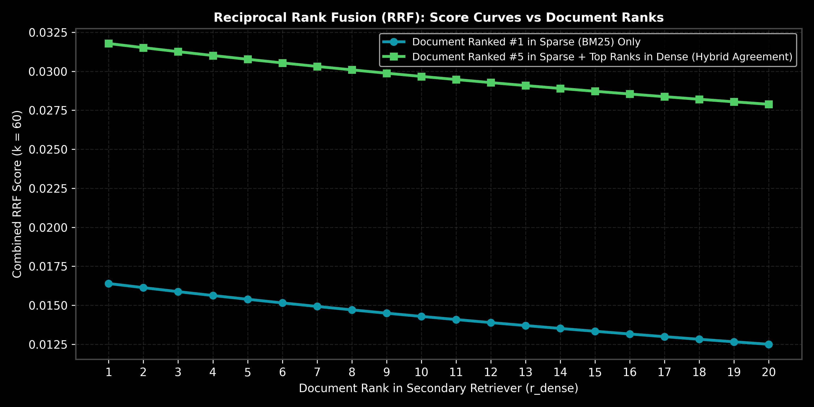

# Hybrid Search & Reciprocal Rank Fusion (RRF)

This guide details Hybrid Search architectures combining Sparse (BM25) and Dense (Bi-encoder) retrieval via Reciprocal Rank Fusion (RRF), complete with rank aggregation math, step-by-step calculations, Python/LangChain code, and production trade-offs.

> **Notebook Companion**: [03_hybrid_search_sparse_dense_rrf.ipynb](file:///d:/Study/Prep/machine-learning-prep/generative-ai-and-agentic-ai/02_retrieval_augmented_generation_rag/03_hybrid_search_sparse_dense_rrf.ipynb)

---

## 1. Why Hybrid Search is Necessary

Dense vector retrieval excels at capturing semantic intent but struggles with exact keyword matches (e.g. part numbers, technical codes like `"CVE-2024-3094"` or `"A100-80GB"`). Sparse retrieval (BM25) excels at exact term matches but lacks semantic understanding.

```text
Retrieval Method    Strength                              Weakness
----------------------------------------------------------------------------------------------------------------------
Sparse (BM25)       Exact term match, rare IDs/codes      Synonym blind, vocabulary mismatch problem
Dense Vector        Semantic intent, synonyms             Misses exact character/code string matches
Hybrid + RRF        Best of both (Exact match + Semantic) Requires combining non-comparable score distributions
```



> [!NOTE]
> **Plot Interpretation & Interview Takeaways:**
> - **What is shown:** RRF score curves combining sparse BM25 ranks and dense vector ranks as a function of secondary retriever position ($k=60$).
> - **Key Systems Insight:** Sparse BM25 returns raw floating-point scores (e.g. $18.4$), while dense vectors return cosine similarities (e.g. $0.82$). You **cannot** simply sum raw scores. RRF bypasses score calibration by operating strictly on document **rank positions**, ensuring robust rank aggregation across disparate search engines.
> - **Interview Application:** When asked *"How do you combine BM25 and vector search without manually tuning score weights?"*, state Reciprocal Rank Fusion (RRF).

---

## 2. Mathematical Formulation & Hand Calculation (Andrew Ng Style)

Given a set of retrievers $M$ and a document $d$, the Reciprocal Rank Fusion score is:

$$\text{RRF\_Score}(d) = \sum_{m \in M} \frac{1}{k + r_m(d)}$$

Where:
- $r_m(d)$ is the 1-based ordinal rank index of document $d$ in retriever $m$.
- $k$ is a smoothing constant (standard benchmark default $k = 60$).

### Step-by-Step Hand Calculation on 3 Documents:

Suppose Sparse BM25 and Dense Vector search return the following top ranks ($k=60$):

```text
Document ID     Sparse BM25 Rank r_sparse     Dense Vector Rank r_dense
-------------------------------------------------------------------------
Doc_A           Rank 1                         Rank 10
Doc_B           Rank 2                         Rank 2
Doc_C           Rank 15                        Rank 1
```

1. **Calculate RRF Score for Doc_A:**
   $$\text{RRF}(A) = \frac{1}{60 + 1} + \frac{1}{60 + 10} = \frac{1}{61} + \frac{1}{70} \approx 0.01639 + 0.01429 = \mathbf{0.03068}$$

2. **Calculate RRF Score for Doc_B:**
   $$\text{RRF}(B) = \frac{1}{60 + 2} + \frac{1}{60 + 2} = \frac{1}{62} + \frac{1}{62} \approx 0.01613 + 0.01613 = \mathbf{0.03226}$$

3. **Calculate RRF Score for Doc_C:**
   $$\text{RRF}(C) = \frac{1}{60 + 15} + \frac{1}{60 + 1} = \frac{1}{75} + \frac{1}{61} \approx 0.01333 + 0.01639 = \mathbf{0.02972}$$

4. **Final RRF Aggregate Ranking:**
   $$\text{Rank 1: Doc\_B } (0.03226) > \text{Rank 2: Doc\_A } (0.03068) > \text{Rank 3: Doc\_C } (0.02972)$$

**Key Insight:** `Doc_B` wins top overall rank because it enjoys strong consensus agreement across **both** retrievers (Rank 2 in both).

---

## 3. Production Python Implementation

```python
def reciprocal_rank_fusion(sparse_ranks: dict[str, int], dense_ranks: dict[str, int], k: int = 60) -> list[tuple[str, float]]:
    rrf_scores = {}
    all_docs = set(sparse_ranks.keys()).union(set(dense_ranks.keys()))
    
    for doc in all_docs:
        score = 0.0
        if doc in sparse_ranks:
            score += 1.0 / (k + sparse_ranks[doc])
        if doc in dense_ranks:
            score += 1.0 / (k + dense_ranks[doc])
        rrf_scores[doc] = score
        
    sorted_docs = sorted(rrf_scores.items(), key=lambda x: x[1], reverse=True)
    return sorted_docs

# Execution
sparse_res = {"Doc_A": 1, "Doc_B": 2, "Doc_C": 15}
dense_res = {"Doc_A": 10, "Doc_B": 2, "Doc_C": 1}

fused = reciprocal_rank_fusion(sparse_res, dense_res, k=60)
print("Final RRF Aggregated Ranking:")
for rank, (doc, score) in enumerate(fused, 1):
    print(f"  #{rank}: {doc} (RRF Score: {score:.5f})")
```

---

## 4. Production Failure Modes & Trade-offs

- **Infrastructure Complexity**: Running Hybrid Search requires maintaining two distinct indexing engines (e.g. Elasticsearch/BM25 + Qdrant Vector DB), doubling operational maintenance.
- **Top-k Sensitivity**: RRF performance depends on fetching a sufficiently deep top-$k$ candidate pool ($k \ge 50$) from both retrievers before rank fusion.
