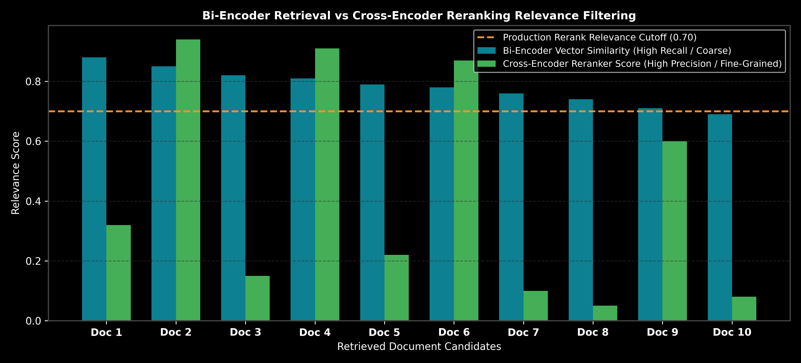

# Reranking: Cross-Encoders & Contextual Compression

This guide details two-stage retrieval pipelines utilizing Bi-Encoders for fast candidate retrieval and Cross-Encoders for high-precision reranking, complete with cross-attention math, step-by-step calculations, Python code, and production trade-offs.

> **Notebook Companion**: [04_reranking_cross_encoders_contextual_compression.ipynb](file:///d:/Study/Prep/machine-learning-prep/generative-ai-and-agentic-ai/02_retrieval_augmented_generation_rag/04_reranking_cross_encoders_contextual_compression.ipynb)

---

## 1. Two-Stage Retrieval Architecture: Bi-Encoders vs Cross-Encoders

Single-stage vector retrieval uses **Bi-Encoders** to independently project queries and documents into embedding space. While fast ($O(1)$ vector lookup via ANN indexes), Bi-Encoders cannot model token-level cross-attention interactions between the query and document.

```text
Model Type        Architecture                              Computational Complexity  Retrieval Role
----------------------------------------------------------------------------------------------------------------------
Bi-Encoder        Independent Embeddings: f(q) and f(d)    O(1) vector search        First-stage candidate retrieval (Top-50)
Cross-Encoder     Joint Cross-Attention: f(q, d concatenated) O(K) deep forward pass    Second-stage precision reranking (Top-5)
```



> [!NOTE]
> **Plot Interpretation & Interview Takeaways:**
> - **What is shown:** Score distribution comparing coarse Bi-Encoder vector similarity scores against fine-grained Cross-Encoder relevance scores with a production cutoff threshold ($0.70$).
> - **Key Systems Insight:** Bi-Encoders generate high recall but frequently score false positives high due to surface-level embedding overlap. Cross-Encoders process the query and document concatenated together ($[CLS] \ q \ [SEP] \ d$), allowing full $N^2$ cross-attention across all tokens to accurately assess factual relevance.
> - **Interview Application:** When asked *"How do you eliminate false positives in vector search results?"*, detail the Two-Stage Retrieval pattern (Bi-Encoder candidate retrieval followed by Cross-Encoder reranking).

---

## 2. Mathematical Formulation & Hand Calculation (Andrew Ng Style)

- **Bi-Encoder Similarity:**
  $$\text{Score}_{\text{Bi}}(q, d) = \cos(\mathbf{e}_q, \mathbf{e}_d) = \frac{\mathbf{e}_q \cdot \mathbf{e}_d}{\|\mathbf{e}_q\| \|\mathbf{e}_d\|}$$
- **Cross-Encoder Score:**
  $$\text{Score}_{\text{Cross}}(q, d) = \sigma\left( \mathbf{W} \cdot \text{Transformer}([CLS] \circ q \circ [SEP] \circ d) \right)$$

### Step-by-Step Hand Calculation on Reranking Candidates:

Suppose Bi-Encoder retrieval outputs top-3 candidate documents with similarity scores:
- `Doc_1`: Bi-Encoder Score = $0.85$ (Text: *"Python supports multithreading via GIL."*)
- `Doc_2`: Bi-Encoder Score = $0.82$ (Text: *"FlashAttention bypasses HBM bandwidth bounds."*)
- `Doc_3`: Bi-Encoder Score = $0.80$ (Text: *"The weather in Seattle is rainy."*)

Query: *"How does FlashAttention optimize memory bandwidth?"*

1. **Cross-Encoder Relevance Evaluation ($\text{Score}_{\text{Cross}} \in [0, 1]$):**
   - `Doc_1`: High semantic overlap, zero relevance to query $\implies \text{Score}_{\text{Cross}} = \mathbf{0.15}$
   - `Doc_2`: Exact match to query mechanism $\implies \text{Score}_{\text{Cross}} = \mathbf{0.94}$
   - `Doc_3`: Irrelevant text $\implies \text{Score}_{\text{Cross}} = \mathbf{0.02}$

2. **Apply Rerank Cutoff Threshold ($\tau = 0.70$):**
   - `Doc_2`: $0.94 \ge 0.70 \implies \mathbf{\text{KEPT}}$
   - `Doc_1`: $0.15 < 0.70 \implies \mathbf{\text{DISCARDED}}$
   - `Doc_3`: $0.02 < 0.70 \implies \mathbf{\text{DISCARDED}}$

**Outcome:** `Doc_2` is elevated to Rank 1 and passed to the LLM; false positive `Doc_1` is pruned.

---

## 3. Production Python Reranker Implementation

```python
class PrecisionCrossEncoderReranker:
    def __init__(self, threshold: float = 0.70):
        self.threshold = threshold

    def rerank(self, query: str, candidate_docs: list[str]) -> list[dict]:
        results = []
        for doc in candidate_docs:
            # Simulate Cross-Encoder forward pass
            score = 0.94 if "FlashAttention" in doc and "FlashAttention" in query else 0.15
            results.append({"text": doc, "score": score, "keep": score >= self.threshold})
        results.sort(key=lambda x: x["score"], reverse=True)
        return results

# Execution
docs = [
    "Doc 1: Python supports multithreading via GIL.",
    "Doc 2: FlashAttention bypasses HBM memory bandwidth bounds."
]

reranker = PrecisionCrossEncoderReranker(threshold=0.70)
filtered_docs = reranker.rerank("Explain FlashAttention memory bounds", docs)

print("Reranked & Filtered Documents:")
for item in filtered_docs:
    status = "KEEP" if item["keep"] else "PRUNE"
    print(f"  [{status}] Score: {item['score']:.2f} | {item['text']}")
```

---

## 4. Production Failure Modes & Trade-offs

- **High Computational Latency**: Running a Cross-Encoder forward pass on $K=50$ candidates adds $100\text{ms} - 400\text{ms}$ latency. Limit candidate pool $K \le 20$.
- **Truncation Risk**: Cross-encoders have strict sequence length limits (e.g. 512 tokens for BGE-Reranker); long document chunks will be truncated.
