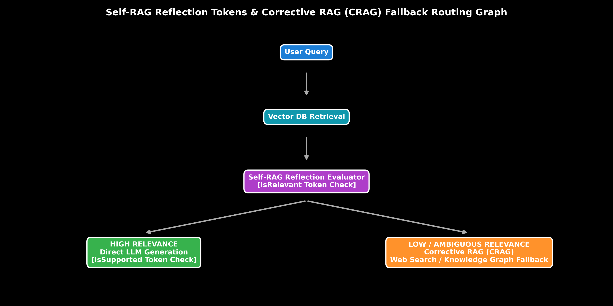

# Advanced RAG: GraphRAG, Self-RAG & Corrective RAG (CRAG)

This guide details state-of-the-art RAG paradigms including GraphRAG (Knowledge Graph entity-relation retrieval), Self-RAG (reflection tokens), and Corrective RAG (CRAG web fallback routing), complete with reflection state machine math, Python code, and production trade-offs.

> **Notebook Companion**: [05_graphrag_self_rag_corrective_rag.ipynb](file:///d:/Study/Prep/machine-learning-prep/generative-ai-and-agentic-ai/02_retrieval_augmented_generation_rag/05_graphrag_self_rag_corrective_rag.ipynb)

---

## 1. Advanced RAG Paradigms Overview

When document collections contain complex multi-hop relationship dependencies or ambiguous topics, standard vector RAG fails to provide complete context.

```text
Paradigm Name          Key Innovation                                    Primary Use Case
----------------------------------------------------------------------------------------------------------------------
Self-RAG              Special reflection tokens ([Retrieve], [IsRelevant]) Self-evaluating generation & retrieval control
Corrective RAG (CRAG) Evaluates retrieval quality; triggers web search fallback Fallback routing when local vector DB lacks answers
GraphRAG              Constructs Knowledge Graphs (Entity-Relation triples) Multi-hop reasoning across global document corpus
```



> [!NOTE]
> **Plot Interpretation & Interview Takeaways:**
> - **What is shown:** Decision tree routing graph comparing Self-RAG reflection token evaluation (`[IsRelevant]`) against Corrective RAG (CRAG) web-search fallback execution paths.
> - **Key Systems Insight:** Self-RAG trains the generator to dynamically decide *when* to retrieve external documents using special control tokens (`[Retrieve]`). If retrieved context is graded low relevance by the CRAG evaluator, the pipeline triggers external web search or Knowledge Graph queries instead of outputting a hallucinated answer.
> - **Interview Application:** When asked *"How do you handle queries that cannot be answered by your private vector database?"*, detail Corrective RAG (CRAG) fallback routing.

---

## 2. Mathematical State Machine Formulation (Andrew Ng Style)

In Self-RAG, the model generates control reflection tokens $r \in \mathcal{R}$:

$$\mathcal{R} = \{ \text{[Retrieve]}, \text{[NoRetrieve]}, \text{[IsRelevant]}, \text{[IsIrrelevant]}, \text{[IsSupported]} \}$$

Given query $x$ and context $d$, the CRAG evaluator computes a scalar relevance confidence $S_{\text{CRAG}}(x, d) \in [0, 1]$:

$$\text{Action} = \begin{cases} 
\text{Direct Generation} & \text{if } S_{\text{CRAG}} \ge \gamma_{\text{high}} \\
\text{Web Search Fallback} & \text{if } S_{\text{CRAG}} \le \gamma_{\text{low}} \\
\text{Query Rewrite + Re-retrieve} & \text{otherwise}
\end{cases}$$

### Step-by-Step Hand Calculation on a CRAG Evaluator Route:

Let thresholds $\gamma_{\text{high}} = 0.80$ and $\gamma_{\text{low}} = 0.30$.

1. **Scenario A (High Relevance):**
   - Query: *"PagedAttention fragmentation"*
   - Context: *"PagedAttention eliminates 96% VRAM fragmentation."*
   - $S_{\text{CRAG}} = 0.95 \ge 0.80 \implies \mathbf{\text{EXECUTE LOCAL GENERATION}}$

2. **Scenario B (Low Relevance):**
   - Query: *"What are the Q3 2026 stock price trends for Nvidia?"*
   - Vector DB Context: *"Nvidia GPU architectures include A100 and H100."*
   - $S_{\text{CRAG}} = 0.15 \le 0.30 \implies \mathbf{\text{TRIGGER WEB SEARCH FALLBACK}}$

---

## 3. Production Python Implementation

```python
class SelfRAGCorrectiveRouter:
    def __init__(self, high_threshold: float = 0.80, low_threshold: float = 0.30):
        self.high_threshold = high_threshold
        self.low_threshold = low_threshold

    def evaluate_retrieval_confidence(self, query: str, context: str) -> float:
        if "PagedAttention" in query and "PagedAttention" in context:
            return 0.95
        elif "stock" in query:
            return 0.15
        return 0.50

    def route_action(self, query: str, context: str) -> dict:
        score = self.evaluate_retrieval_confidence(query, context)
        if score >= self.high_threshold:
            action = "GENERATE_FROM_LOCAL_CONTEXT"
            token = "[IsRelevant]"
        elif score <= self.low_threshold:
            action = "TRIGGER_WEB_SEARCH_FALLBACK"
            token = "[IsIrrelevant]"
        else:
            action = "REWRITE_QUERY_AND_RERETRIEVE"
            token = "[IsAmbiguous]"
            
        return {"score": score, "reflection_token": token, "action": action}

# Execution
router = SelfRAGCorrectiveRouter(high_threshold=0.80, low_threshold=0.30)
res = router.route_action("Q3 2026 stock trends", "Nvidia GPU architectures include A100.")

print(f"Self-RAG Token: {res['reflection_token']} (Score: {res['score']:.2f})")
print(f"CRAG Action:    {res['action']}")
```

---

## 4. Production Failure Modes & Trade-offs

- **GraphRAG Indexing Cost**: Extracting Knowledge Graph triples (Entity $\rightarrow$ Relation $\rightarrow$ Entity) via LLM prompts across millions of documents is extremely expensive ($100\text{x}$ cost of vector indexing).
- **Web Fallback Latency**: Triggering external web search APIs adds $1.5\text{s} - 3.0\text{s}$ latency to query generation.
