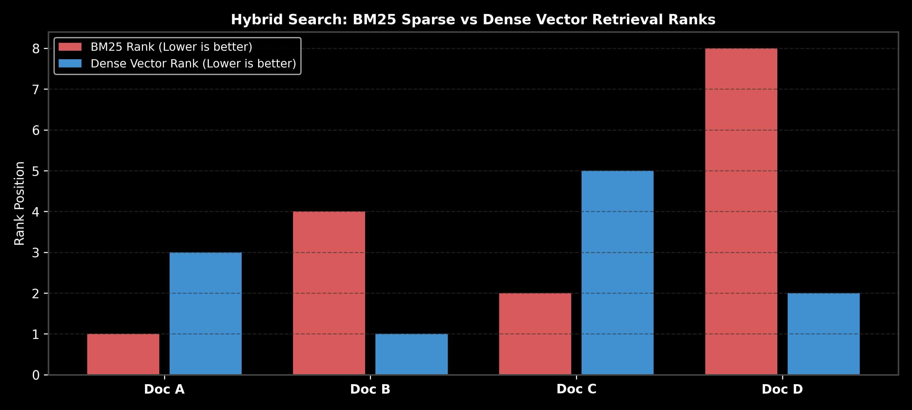

# Module 05: Hybrid Retrieval & Query Transformation Strategies

This guide details Dense Vector Search, Sparse BM25 Keyword Search, Hybrid Retrieval, Reciprocal Rank Fusion (RRF), Metadata Pre/Post-Filtering, Query Expansion (Multi-Query), Query Rewriting, HyDE (Hypothetical Document Embeddings), and Contextual Retrieval, complete with formulas, step-by-step hand calculations, and LangChain code.

> **Notebook Companion**: [05_hybrid_retrieval_and_query_transformations.ipynb](file:///d:/Study/Prep/machine-learning-prep/generative-ai-and-agentic-ai/02_retrieval_augmented_generation_rag/05_hybrid_retrieval_and_query_transformations.ipynb)

---

## 1. Dense Vector vs. Sparse BM25 Keyword Search

```text
Dimension              Dense Vector Search (Embeddings)        Sparse Keyword Search (BM25 / TF-IDF)
----------------------------------------------------------------------------------------------------------------------
Representation         Continuous dense vectors (R^d)         High-dimensional sparse term frequency vectors
Matching Paradigm      Semantic similarity (Cosine/Dot)       Exact term keyword matching (Term frequency & IDF)
Strengths              Captures synonyms, paraphrases, intent Matches exact product SKUs, serial numbers, rare names
Weaknesses             Misses exact numbers & rare SKUs       Fails on vocabulary mismatch & synonyms
```



---

## 2. Mathematical Precision: BM25 Scoring Formula (Andrew Ng Style)

The BM25 relevance score between query $Q$ (containing terms $q_1, \dots, q_n$) and document $D$ is:

$$\text{Score}_{\text{BM25}}(D, Q) = \sum_{i=1}^n \text{IDF}(q_i) \cdot \frac{f(q_i, D) \cdot (k_1 + 1)}{f(q_i, D) + k_1 \cdot \left( 1 - b + b \cdot \frac{|D|}{\text{avgdl}} \right)}$$

Where:
- $f(q_i, D)$ is the term frequency of $q_i$ in document $D$.
- $|D|$ is the document length in words, and $\text{avgdl}$ is average document length across the corpus.
- $k_1 = 1.2$ controls term frequency saturation.
- $b = 0.75$ controls document length normalization penalty.

---

## 3. Reciprocal Rank Fusion (RRF) Formula & Hand Calculation

RRF merges rank positions $r_m(d)$ from $M$ different retrieval methods (e.g., BM25 and Dense Vector search):

$$RRF(d) = \sum_{m \in M} \frac{1}{k + r_m(d)} \quad (k = 60)$$

### Step-by-Step Hand Calculation Example:
- Document A: BM25 Rank = 1, Dense Vector Rank = 4
- Document B: BM25 Rank = 2, Dense Vector Rank = 1

For constant $k = 60$:
- $RRF(\text{Doc A}) = \frac{1}{60 + 1} + \frac{1}{60 + 4} = \frac{1}{61} + \frac{1}{64} \approx 0.01639 + 0.01562 = \mathbf{0.03201}$
- $RRF(\text{Doc B}) = \frac{1}{60 + 2} + \frac{1}{60 + 1} = \frac{1}{62} + \frac{1}{61} \approx 0.01613 + 0.01639 = \mathbf{0.03252}$

**Winner:** **Document B** wins rank #1 ($0.03252 > 0.03201$).

---

## 4. Metadata Pre-Filtering vs. Post-Filtering

- **Pre-filtering**: Filters vector payload metadata (e.g. `role == 'Manager'`) *before* executing vector ANN search. Guarantees 100% security compliance but may restrict candidate space.
- **Post-filtering**: Fetches top-k vectors first, then filters metadata. Risks returning 0 valid results if top-k contains unauthorized documents.

---

## 5. Query Transformations: HyDE, Multi-Query & Sub-Query Decomposition

1. **HyDE (Hypothetical Document Embeddings)**: Uses an LLM to generate a hypothetical answer passage before embedding. Embedding the hypothetical passage shifts vector search closer to actual document chunks than raw short questions.
2. **Multi-Query Expansion**: Rewrites query into 3 semantically distinct variations, executing search for each and merging via RRF.
3. **Sub-Query Decomposition**: Decomposes complex multi-part queries into sub-questions (e.g. *"Compare revenue of Co A vs Co B"* $\rightarrow$ Query Co A revenue, Query Co B revenue).

---

## 6. Production LangChain Code Implementation

```python
def reciprocal_rank_fusion(bm25_ranks: dict, vector_ranks: dict, k: int = 60) -> dict:
    scores = {}
    all_docs = set(bm25_ranks.keys()).union(set(vector_ranks.keys()))
    for doc in all_docs:
        r_bm25 = bm25_ranks.get(doc, 999)
        r_vec = vector_ranks.get(doc, 999)
        scores[doc] = (1.0 / (k + r_bm25)) + (1.0 / (k + r_vec))
    return dict(sorted(scores.items(), key=lambda x: x[1], reverse=True))

bm25 = {"Doc_A": 1, "Doc_B": 2, "Doc_C": 5}
vector = {"Doc_B": 1, "Doc_C": 2, "Doc_A": 4}

rrf_merged = reciprocal_rank_fusion(bm25, vector)
print("=== Reciprocal Rank Fusion (RRF) Output Ranks ===")
for doc, score in rrf_merged.items():
    print(f"{doc}: RRF Score = {score:.6f}")
```