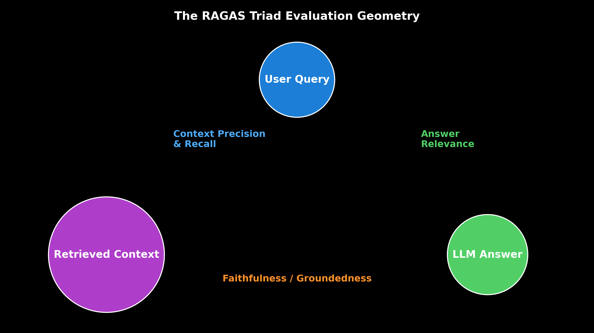

# Module 09: RAG Evaluation Frameworks & Metrics (RAGAS)

This guide details classical IR metrics (Precision@K, Recall@K, MRR, NDCG@K) and RAG Triad Metrics (Context Precision, Context Recall, Faithfulness, Answer Relevance) using RAGAS, DeepEval, TruLens, Synthetic Test Set Generation, and LLM-as-a-Judge evaluators.

> **Notebook Companion**: [09_rag_evaluation_frameworks_ragas.ipynb](file:///d:/Study/Prep/machine-learning-prep/generative-ai-and-agentic-ai/02_retrieval_augmented_generation_rag/09_rag_evaluation_frameworks_ragas.ipynb)

---

## 1. Classical Information Retrieval (IR) Metrics

1. **Mean Reciprocal Rank (MRR)**: Measures how early the first relevant document appears in the retrieved rank list:
   $$\text{MRR} = \frac{1}{|Q|} \sum_{i=1}^{|Q|} \frac{1}{\text{rank}_i}$$
2. **Normalized Discounted Cumulative Gain (NDCG@K)**: Evaluates multi-grade relevance scores with logarithmic rank position discounting:
   $$\text{DCG}@K = \sum_{i=1}^K \frac{2^{\text{rel}_i} - 1}{\log_2(i + 1)}, \quad \text{NDCG}@K = \frac{\text{DCG}@K}{\text{IDCG}@K}$$

---

## 2. RAGAS Triad Metrics Architecture

```text
Dimension              Evaluates                                                Formula / Method
----------------------------------------------------------------------------------------------------------------------
1. Context Precision   Ratio of relevant chunks in retrieved top-k context      LLM-as-a-Judge binary chunk scoring
2. Context Recall      Ratio of ground-truth facts present in context          Sentence decomposition matching
3. Faithfulness        Ratio of generated claims supported by context          Claims extraction & entailment check
4. Answer Relevance    Semantic similarity between User Query & LLM Answer     Embedding Cosine Similarity
```



> [!NOTE]
> **Plot Interpretation & Interview Takeaways:**
> - **What is shown:** RAGAS Triad connecting User Query, Retrieved Context, and LLM Answer.
> - **Key Systems Insight:** Evaluates retrieval quality (Context Precision/Recall) independently from generation quality (Faithfulness/Relevance).
> - **Interview Application:** When asked *"How do you evaluate RAG in production without ground truth labels?"*, explain LLM-as-a-Judge RAGAS Triad metrics.

---

## 3. Synthetic Test Set Generation & LLM-as-a-Judge

1. **Synthetic Test Set Generation**: Automatically converts raw enterprise document chunks into evaluation datasets containing (Question, Ground_Truth_Answer, Context) triples using an LLM prompt.
2. **LLM-as-a-Judge Faithfulness Prompt**:
   ```text
   Given the Context and Answer below, extract all claims from the Answer.
   For each claim, output 1 if the claim is directly supported by Context, else 0.
   Faithfulness = (Sum of Supported Claims) / (Total Claims).
   ```

---

## 4. Production Python Evaluation Code Implementation

```python
import numpy as np

def calculate_mrr(rank_positions: list[int]) -> float:
    return float(np.mean([1.0 / r for r in rank_positions]))

def calculate_ndcg_at_k(relevance_scores: list[int], k: int = 3) -> float:
    dcg = sum([(2**rel - 1) / np.log2(idx + 2) for idx, rel in enumerate(relevance_scores[:k])])
    ideal = sorted(relevance_scores, reverse=True)
    idcg = sum([(2**rel - 1) / np.log2(idx + 2) for idx, rel in enumerate(ideal[:k])])
    return float(dcg / idcg) if idcg > 0 else 0.0

ranks = [1, 2, 1, 4]
relevance = [3, 0, 2, 1]

print("=== IR Metric Benchmarks ===")
print(f"Mean Reciprocal Rank (MRR): {calculate_mrr(ranks):.4f}")
print(f"NDCG@3 Score:              {calculate_ndcg_at_k(relevance, k=3):.4f}")
```
