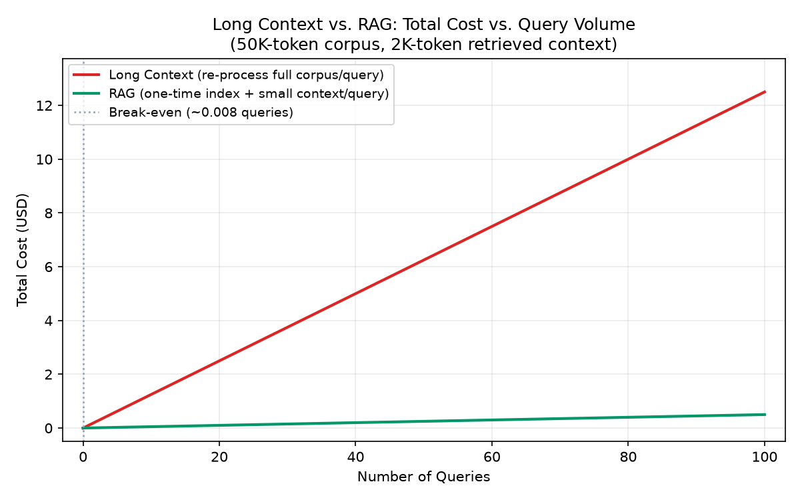

# Module 01: RAG Fundamentals & Production Architecture Patterns

## 1. Introduction & Intuition

### The Core Bottleneck
A pretrained (and even instruction-tuned/aligned — see `01_llm_foundations` and `02_llm_training_foundations`) LLM only knows what was baked into its weights at training time. It cannot answer questions about documents it never saw, it cannot stay current as facts change after its training cutoff, and it has no way to cite a verifiable source for a claim. Retrieval-Augmented Generation (RAG) solves this by fetching relevant external content at query time and feeding it to the model as context, so the model generates from evidence it can see right now rather than from memorized (and potentially stale or hallucinated) knowledge alone. The bottleneck that makes this hard in production isn't generation — it's that every stage upstream of generation (what gets indexed, how it's chunked, what gets retrieved, in what order) directly determines answer quality, and a naive implementation of any one of those stages silently degrades everything downstream of it.

### High-Level Intuition
Think of RAG as giving the model an open-book exam instead of a closed-book one. A closed-book exam (no RAG) relies entirely on what the model memorized during training — impressive for general knowledge, unreliable for anything specific, recent, or proprietary. An open-book exam (RAG) lets the model look things up, but only helps if it can actually find the right page — a badly organized textbook (bad chunking), a disorganized index (bad embeddings/ANN search), or flipping to the wrong section (bad retrieval ranking) all produce a wrong answer even though the right information exists somewhere in the book. Every module in this topic is really about making one part of that "open-book lookup" reliable at production scale.

RAG is not the only way to give a model access to information it wasn't trained on — the other two levers are **fine-tuning** (baking new knowledge/behavior into the weights, `02_llm_training_foundations`) and **long context** (just putting everything relevant directly in the prompt, no retrieval step at all). This module's job is establishing when each lever is the right one, and what a production RAG architecture actually looks like once you've chosen it.

---

## 2. Core Concepts & Mathematical Formulation

### The Naive RAG Pipeline & Its Failure Modes

#### Intuition & Practical Use
The simplest possible RAG system is a straight line: **ingest** documents, **chunk** them into retrievable units, **embed** each chunk into a vector, **index** those vectors, and at query time **retrieve** the nearest chunks to the query's embedding and **generate** an answer conditioned on them. This "naive RAG" pipeline is a reasonable starting point, but every stage has a distinct, well-known failure mode: bad chunking splits a fact across two chunks so neither one fully answers the question; a domain-mismatched embedding model puts semantically related text far apart in vector space; a query phrased differently from the source text ("vocabulary mismatch") retrieves nothing relevant even though the answer is in the corpus; and even perfect retrieval doesn't help if too many irrelevant chunks get stuffed into context, burying the signal ("lost in the middle"). Advanced RAG (the rest of this topic) is best understood as a systematic set of fixes targeted at specific stages of this naive pipeline, not a single replacement technique.

<div align="center" style="margin: 20px 0; max-width: 100%; overflow-x: auto;">
<svg viewBox="0 0 900 300" width="100%" height="auto" xmlns="http://www.w3.org/2000/svg" style="background-color: #f8fafc; border: 1px solid #e2e8f0; border-radius: 8px; font-family: system-ui, -apple-system, sans-serif;">
  <text x="450" y="24" text-anchor="middle" font-size="13" font-weight="bold" fill="#0f172a">Naive RAG Pipeline &amp; Advanced RAG's Three Staging Groups</text>

  <!-- Stage boxes -->
  <g font-size="11">
    <rect x="20" y="70" width="110" height="50" rx="6" fill="#eff6ff" stroke="#3b82f6" stroke-width="1.5"/>
    <text x="75" y="99" text-anchor="middle" fill="#1e3a8a" font-weight="600">Ingest</text>

    <rect x="160" y="70" width="110" height="50" rx="6" fill="#eff6ff" stroke="#3b82f6" stroke-width="1.5"/>
    <text x="215" y="99" text-anchor="middle" fill="#1e3a8a" font-weight="600">Chunk</text>

    <rect x="300" y="70" width="110" height="50" rx="6" fill="#eff6ff" stroke="#3b82f6" stroke-width="1.5"/>
    <text x="355" y="99" text-anchor="middle" fill="#1e3a8a" font-weight="600">Embed</text>

    <rect x="440" y="70" width="110" height="50" rx="6" fill="#eff6ff" stroke="#3b82f6" stroke-width="1.5"/>
    <text x="495" y="99" text-anchor="middle" fill="#1e3a8a" font-weight="600">Index</text>

    <rect x="580" y="70" width="130" height="50" rx="6" fill="#f5f3ff" stroke="#7c3aed" stroke-width="1.5"/>
    <text x="645" y="93" text-anchor="middle" fill="#5b21b6" font-weight="600">Retrieve</text>
    <text x="645" y="107" text-anchor="middle" fill="#5b21b6" font-size="9">(+ rerank)</text>

    <rect x="740" y="70" width="130" height="50" rx="6" fill="#ecfdf5" stroke="#059669" stroke-width="1.5"/>
    <text x="805" y="99" text-anchor="middle" fill="#065f46" font-weight="600">Generate</text>
  </g>

  <!-- Arrows between boxes -->
  <g stroke="#94a3b8" stroke-width="1.5" fill="none" marker-end="url(#arrow01)">
    <line x1="130" y1="95" x2="158" y2="95"/>
    <line x1="270" y1="95" x2="298" y2="95"/>
    <line x1="410" y1="95" x2="438" y2="95"/>
    <line x1="550" y1="95" x2="578" y2="95"/>
    <line x1="710" y1="95" x2="738" y2="95"/>
  </g>
  <defs>
    <marker id="arrow01" markerWidth="8" markerHeight="8" refX="6" refY="4" orient="auto">
      <path d="M0,0 L8,4 L0,8 Z" fill="#94a3b8"/>
    </marker>
  </defs>

  <!-- Staging group labels -->
  <g font-size="10">
    <rect x="20" y="150" width="390" height="30" rx="4" fill="#fef9c3" stroke="#ca8a04" stroke-width="1"/>
    <text x="215" y="169" text-anchor="middle" fill="#854d0e" font-weight="600">Pre-Retrieval (ingest, chunk, embed, index)</text>

    <rect x="580" y="150" width="130" height="30" rx="4" fill="#fce7f3" stroke="#db2777" stroke-width="1"/>
    <text x="645" y="169" text-anchor="middle" fill="#9d174d" font-weight="600">Retrieval</text>

    <rect x="740" y="150" width="130" height="30" rx="4" fill="#dcfce7" stroke="#16a34a" stroke-width="1"/>
    <text x="805" y="169" text-anchor="middle" fill="#14532d" font-weight="600">Post-Retrieval</text>
  </g>

  <!-- Failure mode callouts -->
  <g font-size="9.5" fill="#991b1b" text-anchor="middle">
    <text x="215" y="205">Failure: fact split</text>
    <text x="215" y="217">across two chunks</text>
    <text x="355" y="222">Failure: domain-mismatched</text>
    <text x="355" y="234">embedding model</text>
    <text x="645" y="205">Failure: query/vocabulary</text>
    <text x="645" y="217">mismatch</text>
    <text x="805" y="205">Failure: "lost in the</text>
    <text x="805" y="217">middle" context stuffing</text>
  </g>
  <g stroke="#fca5a5" stroke-width="1" stroke-dasharray="3,2">
    <line x1="215" y1="150" x2="215" y2="197"/>
    <line x1="355" y1="150" x2="355" y2="197"/>
    <line x1="645" y1="150" x2="645" y2="197"/>
    <line x1="805" y1="150" x2="805" y2="197"/>
  </g>

  <text x="450" y="260" text-anchor="middle" font-size="9.5" fill="#64748b">Advanced RAG (this topic's remaining modules) is a targeted fix per stage, not one replacement technique.</text>
</svg>
</div>

*   **Pre-retrieval** (Modules 02-03): getting chunking and embeddings right *before* anything is searched.
*   **Retrieval** (Modules 04-06): the search/ranking mechanics themselves — ANN indexing, hybrid fusion, reranking, query transformation.
*   **Post-retrieval** (Modules 07-09): what happens after candidates are found — structured/graph retrieval, agentic loops, and production evaluation/debugging/hardening.

---

### Long Context vs. RAG: A Quantified Decision Framework

#### Purpose & Intuition
Modern LLMs support context windows large enough to plausibly just paste an entire small-to-medium corpus directly into the prompt on every query — no retrieval step, no vector database, no chunking decisions. This genuinely eliminates RAG's failure modes above (nothing gets "missed" by retrieval if everything is already in context), but it isn't free: every token of that corpus gets re-processed and re-paid-for on *every single query*, while RAG pays a one-time cost to index the corpus once and only feeds a small relevant slice to the model per query. The right choice is a genuine engineering trade-off, not a "RAG is always better" or "just use long context" default — and it can be quantified directly from token economics rather than argued qualitatively.

#### Mathematical Formulation
For a corpus of $N_{\text{tokens,corpus}}$ tokens, $N_{\text{queries}}$ total queries, and a RAG system that retrieves $N_{\text{tokens,context}}$ tokens of context per query:
$$\text{Cost}_{\text{LC}} = N_{\text{queries}} \times N_{\text{tokens,corpus}} \times \text{price}_{\text{token}}$$
$$\text{Cost}_{\text{RAG}} = \underbrace{N_{\text{tokens,corpus}} \times \text{price}_{\text{embed}}}_{\text{one-time indexing}} + N_{\text{queries}} \times N_{\text{tokens,context}} \times \text{price}_{\text{token}}$$

---

### Hand Calculation: Cost Per Query, Long Context vs. RAG
Take a 50,000-token corpus, a RAG system that retrieves 2,000 tokens of context per query, generation input pricing of \$2.50 per million tokens, and embedding pricing of \$0.02 per million tokens (roughly the real-world ratio between generation and embedding token prices).

*   **Step 1: Long-context cost per query**
    $$\text{Cost}_{\text{LC/query}} = 50{,}000 \times \$0.0000025 = \$0.1250$$

*   **Step 2: RAG's marginal cost per query**
    $$\text{Cost}_{\text{RAG/query}} = 2{,}000 \times \$0.0000025 = \$0.0050$$

*   **Step 3: RAG's one-time indexing cost**
    $$\text{Cost}_{\text{embed,once}} = 50{,}000 \times \$0.00000002 = \$0.00100$$

*   **Step 4: Solve for the break-even query count**
    $$\$0.00100 + N \times \$0.0050 = N \times \$0.1250 \implies N = \frac{\$0.00100}{\$0.1250 - \$0.0050} \approx 0.0083 \text{ queries}$$

The break-even point is under a single query — because embedding is roughly two orders of magnitude cheaper per token than generation input, RAG's one-time indexing investment is recovered almost immediately. **The real crossover isn't about amortizing indexing cost over many queries; it's simply whether $N_{\text{tokens,context}} < N_{\text{tokens,corpus}}$ per query**, which is true almost by definition once a corpus exceeds a single context window. At $N=100$ queries, total cost is \$12.50 (long context) vs. \$0.501 (RAG) — a ~25x difference that only widens as query volume grows.



*   **Plot Interpretation:** The RAG cost line stays nearly flat (dominated by its small marginal per-query context cost) while the long-context line grows steeply and linearly — the visual gap between the two lines widens with every additional query, making the ~25x cost difference at $N=100$ immediately legible rather than requiring the reader to compare raw numbers.

### Decision Criteria Checklist (Beyond Cost Alone)
The cost formula settles the economics, but it isn't the whole decision — several qualitative axes matter just as much in practice:

| Criterion | Favors Long Context | Favors RAG |
|---|---|---|
| **Corpus size** | Fits inside one context window | Exceeds the context window (the common case at production scale) |
| **Freshness / update frequency** | Static, rarely-changing corpus | Frequently updated — re-indexing a chunk is cheap; re-uploading a giant static context on every call is wasteful |
| **Query frequency (volume)** | Very low query volume (cost difference barely matters) | High query volume (RAG's per-query marginal cost advantage compounds) |
| **Latency budget** | Can tolerate longer prefill time for a huge context | Tight latency budget — a small retrieved context prefills much faster |
| **Cost** | Small corpus, few queries | Large corpus and/or high query volume (per the formula above) |
| **Retrieval accuracy required** | Retrieval risk (missing a chunk) is unacceptable | Retrieval quality is well-tuned and validated (Module 09) |
| **Reasoning requirements** | Multi-hop reasoning that benefits from seeing the *entire* corpus at once | Single-hop or moderately-scoped lookups where a well-retrieved subset is sufficient |

In practice, many production systems use **both**: RAG to narrow a large corpus down to a relevant subset, then long context to let the model reason freely over that subset — the two techniques are complementary, not mutually exclusive, once corpus size exceeds what fits (or is worth paying for) in a single context window.

---

## 3. Implementation & Reference Code

Below is a self-contained implementation of the cost-crossover calculation from the hand calculation above, plus a small decision-checklist helper.

```python
from dataclasses import dataclass


@dataclass
class RAGCostModel:
    """Computes and compares Long-Context vs. RAG cost, matching the hand calculation above."""
    corpus_tokens: int
    context_tokens_per_query: int
    price_per_token: float       # generation input price, $/token
    price_per_embed_token: float  # embedding price, $/token

    def cost_long_context(self, n_queries: int) -> float:
        return n_queries * self.corpus_tokens * self.price_per_token

    def cost_rag(self, n_queries: int) -> float:
        embed_once = self.corpus_tokens * self.price_per_embed_token
        marginal = n_queries * self.context_tokens_per_query * self.price_per_token
        return embed_once + marginal

    def breakeven_queries(self) -> float:
        """Solves Cost_embed_once + N*rag_marginal_per_query = N*lc_per_query for N."""
        lc_per_query = self.corpus_tokens * self.price_per_token
        rag_marginal_per_query = self.context_tokens_per_query * self.price_per_token
        embed_once = self.corpus_tokens * self.price_per_embed_token
        savings_per_query = lc_per_query - rag_marginal_per_query
        assert savings_per_query > 0, "RAG's context must be smaller than the full corpus for a crossover to exist"
        return embed_once / savings_per_query


if __name__ == "__main__":
    model = RAGCostModel(
        corpus_tokens=50_000,
        context_tokens_per_query=2_000,
        price_per_token=2.50 / 1_000_000,
        price_per_embed_token=0.02 / 1_000_000,
    )

    breakeven = model.breakeven_queries()
    print(f"Break-even query count: {breakeven:.4f}")  # ~0.0083, matching the hand calc

    for n in (1, 10, 100):
        lc = model.cost_long_context(n)
        rag = model.cost_rag(n)
        print(f"N={n:>4}: Long-Context=${lc:.4f}  RAG=${rag:.4f}  RAG is {lc / rag:.1f}x cheaper")

    assert model.cost_rag(100) < model.cost_long_context(100), "RAG should already be far cheaper by N=100"
```

---

## 4. Interview Deep-Dive & System Trade-offs

### 1. Architectural & Production Trade-offs
* **Core Problem Solved:** Giving an LLM access to information beyond its training data and context window, grounded in retrievable, citable evidence, without re-training the model for every new fact.
* **Why Introduced over Legacy Approaches:** Fine-tuning-only knowledge injection requires a full re-training/re-fine-tuning cycle for every corpus update and can't cite sources; pure long-context stuffing doesn't scale economically or latency-wise past a single context window's worth of content.
* **Key Failure Modes & Limitations:** Naive RAG's per-stage failure modes (chunk-boundary fact splitting, embedding domain mismatch, query/vocabulary mismatch, lost-in-the-middle context stuffing) — each addressed by a later module in this topic, not by RAG itself as a single fix.

### 2. System Complexity & Scaling
* **Time Complexity (FLOPs):** Indexing is a one-time $O(N_{\text{tokens,corpus}})$ embedding cost; each query is $O(N_{\text{tokens,context}})$ generation cost plus retrieval search cost (Module 04), independent of total corpus size for the generation portion.
* **Space/Memory Footprint:** RAG's index grows with corpus size but lives outside the model (external vector store); long-context's "footprint" is a recurring per-query prefill cost, not persistent storage.
* **Primary Bottleneck Type:** RAG is retrieval-latency-bound at query time and storage-bound for the index; long-context is prefill-compute-bound (quadratic-ish attention cost) on every single query.
* **Variable Legend:** $N_{\text{tokens,corpus}}$ = total corpus size in tokens, $N_{\text{tokens,context}}$ = retrieved context size per query, $N_{\text{queries}}$ = query volume, $\text{price}_{\text{token}}$ = generation input token price, $\text{price}_{\text{embed}}$ = embedding token price.

### 3. Production & Scalability
* **Deployment Considerations:** Most production systems land on a hybrid: RAG to narrow a large/frequently-updated corpus, long context to let the model reason freely over the narrowed subset; pure long-context is reserved for genuinely small, static, high-value corpora where retrieval risk is unacceptable.
*   **Common Interviewer Follow-Up Questions:**
    1.  *Q:* If context windows keep growing, will RAG become obsolete?
        *   *A:* Unlikely for corpora that meaningfully exceed even a very large context window (enterprise document stores routinely reach millions of tokens), and the per-query cost/latency advantage of retrieving a small relevant slice persists regardless of how large context windows get — RAG's economics don't disappear just because the ceiling moves.
    2.  *Q:* How would you decide between RAG and long context for a 200K-token internal wiki with moderate query volume?
        *   *A:* Compute the crossover directly: at real-world price ratios the break-even point is typically under a handful of queries, so unless query volume is genuinely tiny (a few queries total, ever), RAG's economics win quickly — the more interesting question is usually freshness (a frequently-edited wiki favors incremental RAG re-indexing over re-uploading the whole corpus) rather than raw cost.
