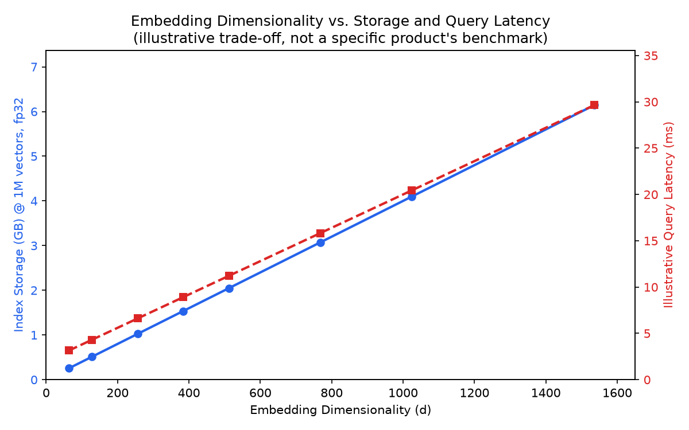

# Module 03: Embeddings for Retrieval & Vector Representations

## 1. Introduction & Intuition

### The Core Bottleneck
Retrieval works by turning text into vectors and finding nearby vectors — which means the *entire* system's retrieval quality is capped by how well the embedding model actually places semantically related text close together in vector space. A brilliant chunking strategy and a perfectly-tuned ANN index (Module 04) are both wasted if the embedding model itself puts a query and its correct answer far apart because it wasn't trained on this domain's vocabulary. Embeddings are the representation layer everything else in this topic is built on top of.

### High-Level Intuition
An embedding model is a translator that converts text into a point in a high-dimensional space, where "close together" is meant to mean "semantically related." Two sentences that mean roughly the same thing should land near each other even if they share almost no words in common ("the CEO stepped down" vs. "leadership announced a departure"); two sentences that share many words but mean different things should land far apart. Retrieval is then just "find the nearest points to my query's point" — which only works if the translator is actually good at this domain and language. This module covers what makes a translator good (bi-encoder vs. cross-encoder trade-offs, dimensionality choices) and how to measure "close together" precisely.

---

## 2. Core Concepts & Mathematical Formulation

### Similarity Metrics: Cosine Similarity vs. Dot Product

#### Purpose & Intuition
Once text is embedded as vectors, "how similar are these two pieces of text" becomes "how similar are these two vectors" — and the specific metric used to answer that changes retrieval rankings, sometimes significantly. Cosine similarity measures the *angle* between two vectors, ignoring their magnitude; the (unnormalized) dot product measures both angle *and* magnitude. This distinction matters because most embedding models don't guarantee every vector has the same length, and ranking by raw dot product can be quietly dominated by vector magnitude rather than genuine semantic relevance.

#### Mathematical Formulation
For two vectors $a, b \in \mathbb{R}^d$:
$$\text{dot}(a, b) = \sum_{i=1}^{d} a_i b_i, \qquad \cos(a, b) = \frac{\text{dot}(a, b)}{\|a\| \, \|b\|}$$

#### Tensor & Shape Tracking
*   **Embedding vectors $a$, $b$:** `[d]` each — a single dense vector per chunk/query.
*   **Batched similarity (query vs. many chunks):** query `[d]`, chunk matrix `[N, d]`, similarity output `[N]` (one score per chunk).

### Hand Calculation: Cosine vs. Dot Product Ranking
Take a 4-dimensional toy embedding space ($d=4$) with $a = [1, 2, 0, 1]$ and $b = [2, 1, 1, 0]$.

*   **Step 1: Dot product**
    $$\text{dot}(a,b) = (1)(2) + (2)(1) + (0)(1) + (1)(0) = 2 + 2 + 0 + 0 = 4$$

*   **Step 2: Vector norms**
    $$\|a\| = \sqrt{1^2+2^2+0^2+1^2} = \sqrt{6} \approx 2.449, \qquad \|b\| = \sqrt{2^2+1^2+1^2+0^2} = \sqrt{6} \approx 2.449$$

*   **Step 3: Cosine similarity**
    $$\cos(a,b) = \frac{4}{2.449 \times 2.449} = \frac{4}{6} \approx 0.667$$

**Why magnitude matters for ranking.** Take a query $q = [1,1,1,1]$ and two candidates: $p_1 = [1,1,1,1]$ (identical direction and magnitude to $q$) and $p_2 = [2,2,2,2]$ (identical *direction*, but double the magnitude). Both candidates are semantically identical to $q$ under cosine similarity ($\cos(q,p_1) = \cos(q,p_2) = 1.0$ exactly), but ranking by raw dot product gives $\text{dot}(q,p_1)=4$ vs. $\text{dot}(q,p_2)=8$ — $p_2$ would rank *higher* purely because its vector happens to have a larger magnitude, not because it's more relevant. This is exactly why most retrieval systems either L2-normalize embeddings before indexing (making dot product and cosine similarity equivalent) or explicitly use cosine similarity as the configured distance metric.

---

### Bi-Encoders vs. Cross-Encoders

#### Intuition & Practical Use
A **bi-encoder** embeds the query and each candidate document *independently*, then compares their vectors — this is what makes large-scale retrieval possible at all, since every document's vector can be precomputed once and stored, and a query only needs one new embedding call compared against millions of precomputed vectors via fast ANN search. A **cross-encoder** instead feeds the query *and* a candidate document together into one model, letting it directly attend across both — far more accurate, because the model can reason about query-document interactions a bi-encoder's independent embeddings structurally cannot capture, but far more expensive: it requires a full forward pass *per candidate document*, making it infeasible to run against an entire corpus. This is precisely why production systems use bi-encoders for the initial large-scale retrieval pass, and reserve cross-encoders for reranking a small candidate set afterward (Module 05).

<div align="center" style="margin: 20px 0; max-width: 100%; overflow-x: auto;">
<svg viewBox="0 0 820 220" width="100%" height="auto" xmlns="http://www.w3.org/2000/svg" style="background-color: #f8fafc; border: 1px solid #e2e8f0; border-radius: 8px; font-family: system-ui, -apple-system, sans-serif;">
  <text x="410" y="22" text-anchor="middle" font-size="13" font-weight="bold" fill="#0f172a">Bi-Encoder vs. Cross-Encoder</text>

  <!-- Bi-encoder -->
  <text x="20" y="50" font-size="11" font-weight="600" fill="#1e3a8a">Bi-Encoder (independent encoding, precomputable)</text>
  <rect x="20" y="60" width="150" height="40" rx="5" fill="#eff6ff" stroke="#3b82f6" stroke-width="1.3"/>
  <text x="95" y="84" text-anchor="middle" font-size="10" fill="#1e3a8a">Query -&gt; Encoder -&gt; vec_q</text>
  <rect x="20" y="115" width="150" height="40" rx="5" fill="#eff6ff" stroke="#3b82f6" stroke-width="1.3"/>
  <text x="95" y="139" text-anchor="middle" font-size="10" fill="#1e3a8a">Doc -&gt; Encoder -&gt; vec_d</text>
  <g stroke="#3b82f6" stroke-width="1.3" fill="none" marker-end="url(#arrow03a)">
    <line x1="170" y1="80" x2="230" y2="105"/>
    <line x1="170" y1="135" x2="230" y2="110"/>
  </g>
  <rect x="230" y="90" width="110" height="35" rx="5" fill="#dbeafe" stroke="#1d4ed8" stroke-width="1.3"/>
  <text x="285" y="112" text-anchor="middle" font-size="9.5" fill="#1e3a8a">cos(vec_q, vec_d)</text>
  <text x="200" y="180" font-size="8.5" fill="#1e3a8a" width="160">
    <tspan x="20" dy="0">Doc vectors precomputed once,</tspan>
    <tspan x="20" dy="12">reused across all future queries.</tspan>
  </text>

  <!-- Cross-encoder -->
  <text x="450" y="50" font-size="11" font-weight="600" fill="#5b21b6">Cross-Encoder (joint encoding, per-pair cost)</text>
  <rect x="450" y="75" width="330" height="45" rx="5" fill="#f5f3ff" stroke="#7c3aed" stroke-width="1.3"/>
  <text x="615" y="102" text-anchor="middle" font-size="10" fill="#5b21b6">[Query ; Doc] -&gt; ONE joint Encoder -&gt; relevance score</text>
  <defs>
    <marker id="arrow03a" markerWidth="8" markerHeight="8" refX="6" refY="4" orient="auto">
      <path d="M0,0 L8,4 L0,8 Z" fill="#3b82f6"/>
    </marker>
  </defs>
  <text x="450" y="150" font-size="8.5" fill="#5b21b6" width="330">
    <tspan x="450" dy="0">Must re-run the full model for EVERY query-document pair --</tspan>
    <tspan x="450" dy="12">accurate, but infeasible over a full corpus. Used for reranking</tspan>
    <tspan x="450" dy="12">a small candidate set only (Module 05).</tspan>
  </text>
</svg>
</div>

---

### Matryoshka Representation Learning & Embedding Truncation

#### Intuition & Practical Use
A Matryoshka-trained embedding model is explicitly trained so that its early dimensions (the first 64, the first 128, and so on) form a *usable, still-meaningful* smaller embedding on their own — nested inside the full-size vector like Russian nesting dolls, hence the name. This means a single embedding model can serve multiple storage/latency budgets: truncate the vector to fewer dimensions when storage or query latency is tight, and use the full vector when retrieval quality matters more than either. Truncation of a *normal* (non-Matryoshka-trained) embedding model, by contrast, discards genuinely important information from arbitrary dimensions and degrades quality far more sharply, since nothing during training organized information to survive truncation gracefully.



*   **Plot Interpretation:** Both index storage and query latency scale roughly linearly with embedding dimensionality $d$ — the exact trade-off Matryoshka truncation lets you navigate deliberately (drop to a smaller $d$ for a smaller/faster index) instead of being locked into whatever dimensionality the embedding model happened to ship with.

### Embedding Fine-Tuning for Domain Adaptation

#### Intuition & Practical Use
General-purpose embedding models are trained on broad web text and can underperform on specialized vocabulary (legal, medical, internal company jargon) where domain-specific terms that should be considered similar aren't, or where the model has never seen the specific terminology at all. Fine-tuning an embedding model on domain-specific (query, relevant-document) pairs — typically via a contrastive objective that pulls matching pairs together and pushes non-matching pairs apart — closes this gap, at the cost of needing labeled or weakly-labeled domain pairs to fine-tune against and the operational overhead of maintaining a custom model instead of a hosted general-purpose one.

---

## 3. Implementation & Reference Code

Below is a self-contained implementation of the cosine/dot-product comparison from the hand calculation above, plus a small Matryoshka-style truncation demonstration.

```python
import numpy as np


def dot_product(a: np.ndarray, b: np.ndarray) -> float:
    return float(np.dot(a, b))


def cosine_similarity(a: np.ndarray, b: np.ndarray) -> float:
    return float(np.dot(a, b) / (np.linalg.norm(a) * np.linalg.norm(b)))


if __name__ == "__main__":
    # Hand calc: a and b, d=4
    a = np.array([1, 2, 0, 1], dtype=float)
    b = np.array([2, 1, 1, 0], dtype=float)
    print(f"dot(a, b) = {dot_product(a, b):.4f}")
    print(f"cos(a, b) = {cosine_similarity(a, b):.4f}")
    assert dot_product(a, b) == 4.0
    assert abs(cosine_similarity(a, b) - 2 / 3) < 1e-6

    # Why magnitude matters: q vs p1 (same vector) vs p2 (same direction, 2x magnitude)
    q = np.array([1, 1, 1, 1], dtype=float)
    p1 = np.array([1, 1, 1, 1], dtype=float)
    p2 = np.array([2, 2, 2, 2], dtype=float)

    print(f"\ndot(q, p1) = {dot_product(q, p1):.2f}, cos(q, p1) = {cosine_similarity(q, p1):.4f}")
    print(f"dot(q, p2) = {dot_product(q, p2):.2f}, cos(q, p2) = {cosine_similarity(q, p2):.4f}")
    assert cosine_similarity(q, p1) == cosine_similarity(q, p2) == 1.0
    assert dot_product(q, p2) > dot_product(q, p1), "Raw dot product ranks p2 higher despite equal cosine similarity"

    # Matryoshka-style truncation: a well-trained Matryoshka embedding stays usable when truncated
    rng = np.random.default_rng(42)
    full_dim = 768
    truncated_dim = 128

    # Simulate two "documents": doc_a is semantically close to the query, doc_b is not,
    # with signal concentrated in the first `truncated_dim` dims (Matryoshka training's effect).
    query_full = rng.normal(size=full_dim)
    doc_a_full = query_full + rng.normal(scale=0.1, size=full_dim)   # close to query
    doc_b_full = rng.normal(size=full_dim)                            # unrelated

    for dims in (full_dim, truncated_dim):
        q_t, a_t, b_t = query_full[:dims], doc_a_full[:dims], doc_b_full[:dims]
        sim_a = cosine_similarity(q_t, a_t)
        sim_b = cosine_similarity(q_t, b_t)
        print(f"dims={dims:>4}: cos(q,doc_a)={sim_a:.4f}  cos(q,doc_b)={sim_b:.4f}  correct ranking={sim_a > sim_b}")
        assert sim_a > sim_b, "Truncated embedding should still rank the related doc higher"
```

---

## 4. Interview Deep-Dive & System Trade-offs

### 1. Architectural & Production Trade-offs
* **Core Problem Solved:** Converting text into a vector representation where semantic similarity corresponds to geometric closeness, making large-scale similarity search over a corpus computationally feasible.
* **Why Introduced over Legacy Approaches:** Classical sparse representations (`00_nlp_fundamentals`'s TF-IDF/BM25) match on literal term overlap and miss semantically related text with no shared vocabulary; dense embeddings capture meaning beyond exact word match, at the cost of losing BM25's precise term-matching guarantees (motivating Module 05's hybrid fusion).
* **Key Failure Modes & Limitations:** Domain mismatch (a general-purpose embedding model underperforming on specialized vocabulary), magnitude-sensitive ranking when using raw dot product on non-normalized vectors, and embedding drift when a corpus's content distribution shifts meaningfully after the model was chosen/fine-tuned.

### 2. System Complexity & Scaling
* **Time Complexity (FLOPs):** Bi-encoder embedding is $O(1)$ model forward passes per document (precomputed once) plus $O(1)$ per query at retrieval time; cross-encoders require $O(N_{\text{candidates}})$ full forward passes, one per query-document pair being scored.
* **Space/Memory Footprint:** Index storage scales as $N_{\text{chunks}} \times d \times 4$ bytes (fp32) — directly why embedding dimensionality $d$ is a first-order storage cost lever, and why Matryoshka truncation is attractive at scale.
* **Primary Bottleneck Type:** Bi-encoder retrieval is memory/storage-bound at index scale and latency-bound on the ANN search itself (Module 04); cross-encoder scoring is compute-bound, one full model pass per candidate.
* **Variable Legend:** $d$ = embedding dimensionality, $N_{\text{chunks}}$ = total indexed chunks, $N_{\text{candidates}}$ = candidate set size being scored by a cross-encoder.

### 3. Production & Scalability
* **Deployment Considerations:** Normalize embeddings at indexing time (making dot product and cosine similarity equivalent and avoiding the magnitude-ranking pitfall above); choose embedding dimensionality as a deliberate storage/latency-vs-quality trade-off, using Matryoshka-capable models where the corpus is large enough for dimensionality to matter economically.
*   **Common Interviewer Follow-Up Questions:**
    1.  *Q:* Why can't you just use a cross-encoder for the entire retrieval step and skip bi-encoders altogether?
        *   *A:* A cross-encoder requires a full model forward pass per query-document pair — over a corpus of millions of documents, that's computationally infeasible per query; bi-encoders make large-scale search tractable by precomputing document vectors once, with cross-encoders reserved for reranking the small candidate set a bi-encoder already narrowed down.
    2.  *Q:* How would you detect embedding drift in production?
        *   *A:* Monitor retrieval quality metrics (Module 09's Recall@k/MRR/NDCG) over time on a fixed evaluation set, and separately track the distributional similarity between the corpus's current content and the embedding model's original training/fine-tuning distribution — a widening gap on either signal indicates the model may need re-fine-tuning or replacement.
