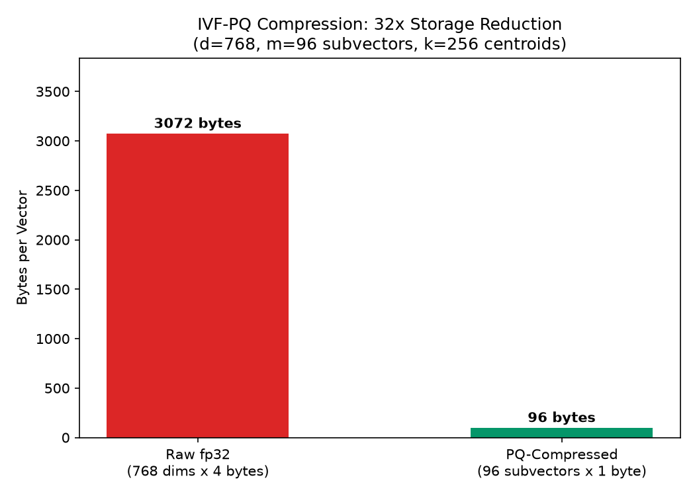
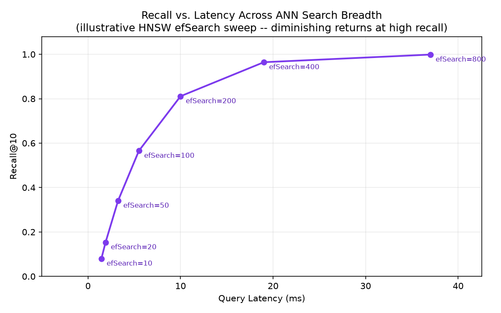

# Module 04: Vector Indexing, ANN Search & Vector Database Internals

## 1. Introduction & Intuition

### The Core Bottleneck
Comparing a query vector against every single vector in a corpus (brute-force/exact search) is $O(N)$ per query — perfectly fine for a few thousand chunks, but it stops scaling once a corpus reaches millions of chunks and query latency has to stay in the tens of milliseconds. Approximate Nearest Neighbor (ANN) search trades a small, controllable amount of recall for a massive latency win, and every ANN algorithm is really just a different strategy for organizing vectors so most of the corpus can be safely skipped per query without ever computing an exact distance to it.

### High-Level Intuition
Exact search is reading every page of a book to find a fact. ANN search is using the book's index and table of contents to jump almost straight to the right chapter, accepting a small chance you jump to a *nearby* chapter instead of the exact right one. Every ANN structure in this module is a different kind of "index and table of contents": HNSW builds a navigable graph you can hop through, IVF partitions the space into clusters so you only search the nearest few, and Product Quantization compresses each vector so more of them fit in fast memory at once. None of these change *what* similarity means (Module 03's cosine/dot-product metrics still apply) — they change *how much of the corpus* you actually have to touch to find a good approximate answer.

---

## 2. Core Concepts & Mathematical Formulation

### Distance Metrics in Practice

#### Purpose & Intuition
Module 03 introduced cosine similarity and dot product; ANN indexes are typically built against one specific configured metric (cosine, dot product, or Euclidean/L2 distance), and the choice affects both index behavior and which nearest neighbors get found — a genuinely different distance metric can genuinely reorder rankings, not just rescale them.

#### Mathematical Formulation
For two vectors $a, b \in \mathbb{R}^d$:
$$\text{Euclidean}(a,b) = \sqrt{\sum_{i=1}^{d}(a_i - b_i)^2}, \qquad \text{dot}(a,b) = \sum_{i=1}^{d} a_i b_i, \qquad \cos(a,b) = \frac{\text{dot}(a,b)}{\|a\|\|b\|}$$

### Hand Calculation: Three Metrics Can Rank Differently
Take a query $q = [1, 0]$ and two candidates $x = [2, 0]$ (same direction, larger magnitude) and $y = [1, 1]$ (different direction, unit-ish magnitude).

*   **Euclidean distance** (smaller = closer): $\text{Euclidean}(q,x) = \sqrt{(1-2)^2 + 0^2} = 1.0$; $\text{Euclidean}(q,y) = \sqrt{(1-1)^2+(0-1)^2} = 1.0$ — **tied**.
*   **Dot product** (larger = closer): $\text{dot}(q,x) = (1)(2)+(0)(0) = 2.0$; $\text{dot}(q,y) = (1)(1)+(0)(1) = 1.0$ — **$x$ wins**.
*   **Cosine similarity** (larger = closer): $\cos(q,x) = 2.0/(1 \times 2) = 1.0$ (identical direction); $\cos(q,y) = 1.0/(1 \times 1.414) \approx 0.707$ — **$x$ wins, by a wider relative margin than dot product's raw numbers suggest**.

All three metrics agree $x$ is at least as close as $y$ here, but Euclidean distance sees them as *exactly tied* while dot product and cosine both clearly prefer $x$ — demonstrating concretely that metric choice isn't a cosmetic configuration detail, it can change which candidate a real query surfaces first.

---

### HNSW: Graph-Based ANN Search

#### Intuition & Practical Use
Hierarchical Navigable Small World (HNSW) builds a multi-layer graph where each vector is a node connected to a small number of its nearest neighbors. The top layer is sparse (long-range "highway" connections), and each layer below is progressively denser, down to the bottom layer, which contains every vector. A query starts at an entry point in the sparse top layer, greedily hops to whichever neighbor is closest to the query, and drops down a layer once no neighbor at the current layer is closer — repeating until it reaches the bottom layer and returns the best candidates found along the way. This is not a single closed-form calculation the way distance metrics or compression ratios are — it's a graph-search procedure — so it's worth building numeric intuition for its parameters directly rather than pretending there's one formula to memorize:

*   **$M$ (max connections per node):** roughly how many edges each node keeps per layer. $M=16$ means each node has on the order of 16 neighbor edges — higher $M$ means a denser, more accurate graph (better recall) at the cost of more memory (more edges to store) and slower index construction.
*   **`efConstruction`:** how many candidate neighbors are considered *while building* the graph for each new node — higher values build a higher-quality graph (better long-term recall) at the cost of slower index construction time (a one-time cost, paid once at build time).
*   **`efSearch`:** how many candidates are explored *during a query* before returning results — `efSearch=50` means the search keeps a working set of up to 50 candidates as it traverses the graph. Higher `efSearch` means better recall (less likely to miss the true nearest neighbors) at the direct cost of higher per-query latency, since more of the graph gets visited.

<div align="center" style="margin: 20px 0; max-width: 100%; overflow-x: auto;">
<svg viewBox="0 0 760 280" width="100%" height="auto" xmlns="http://www.w3.org/2000/svg" style="background-color: #f8fafc; border: 1px solid #e2e8f0; border-radius: 8px; font-family: system-ui, -apple-system, sans-serif;">
  <text x="380" y="22" text-anchor="middle" font-size="13" font-weight="bold" fill="#0f172a">Toy HNSW Multi-Layer Graph &amp; Greedy Search Path</text>

  <!-- Layer 2 (top, sparse) -->
  <text x="30" y="55" font-size="10" fill="#7c3aed" font-weight="600">Layer 2 (sparse)</text>
  <circle cx="150" cy="55" r="10" fill="#f5f3ff" stroke="#7c3aed" stroke-width="1.5"/>
  <circle cx="400" cy="55" r="10" fill="#f5f3ff" stroke="#7c3aed" stroke-width="1.5"/>
  <text x="150" y="59" text-anchor="middle" font-size="8" fill="#5b21b6">EP</text>
  <line x1="160" y1="55" x2="390" y2="55" stroke="#c4b5fd" stroke-width="1.3"/>

  <!-- Layer 1 (mid) -->
  <text x="30" y="140" font-size="10" fill="#2563eb" font-weight="600">Layer 1 (medium)</text>
  <circle cx="150" cy="140" r="10" fill="#eff6ff" stroke="#3b82f6" stroke-width="1.5"/>
  <circle cx="280" cy="140" r="10" fill="#eff6ff" stroke="#3b82f6" stroke-width="1.5"/>
  <circle cx="400" cy="140" r="10" fill="#eff6ff" stroke="#3b82f6" stroke-width="1.5"/>
  <circle cx="520" cy="140" r="10" fill="#eff6ff" stroke="#3b82f6" stroke-width="1.5"/>
  <line x1="160" y1="140" x2="270" y2="140" stroke="#93c5fd" stroke-width="1.3"/>
  <line x1="290" y1="140" x2="390" y2="140" stroke="#93c5fd" stroke-width="1.3"/>
  <line x1="410" y1="140" x2="510" y2="140" stroke="#93c5fd" stroke-width="1.3"/>

  <!-- Layer 0 (bottom, dense, all nodes) -->
  <text x="30" y="225" font-size="10" fill="#059669" font-weight="600">Layer 0 (all nodes)</text>
  <g fill="#ecfdf5" stroke="#059669" stroke-width="1.5">
    <circle cx="120" cy="225" r="9"/>
    <circle cx="200" cy="225" r="9"/>
    <circle cx="280" cy="225" r="9"/>
    <circle cx="360" cy="225" r="9"/>
    <circle cx="440" cy="225" r="9"/>
    <circle cx="520" cy="225" r="9"/>
    <circle cx="600" cy="225" r="9"/>
  </g>
  <g stroke="#a7f3d0" stroke-width="1.2">
    <line x1="129" y1="225" x2="191" y2="225"/>
    <line x1="209" y1="225" x2="271" y2="225"/>
    <line x1="289" y1="225" x2="351" y2="225"/>
    <line x1="369" y1="225" x2="431" y2="225"/>
    <line x1="449" y1="225" x2="511" y2="225"/>
    <line x1="529" y1="225" x2="591" y2="225"/>
  </g>

  <!-- Query & greedy descent path -->
  <text x="660" y="55" font-size="9.5" fill="#991b1b" font-weight="600">query</text>
  <circle cx="660" cy="70" r="7" fill="#fef2f2" stroke="#dc2626" stroke-width="1.5"/>
  <g stroke="#dc2626" stroke-width="1.6" fill="none" stroke-dasharray="4,2" marker-end="url(#arrow04a)">
    <path d="M655,75 Q500,55 405,55"/>
    <path d="M400,65 L400,132"/>
    <path d="M400,140 L525,140"/>
    <path d="M520,150 L520,217"/>
  </g>
  <defs>
    <marker id="arrow04a" markerWidth="7" markerHeight="7" refX="5" refY="3.5" orient="auto">
      <path d="M0,0 L7,3.5 L0,7 Z" fill="#dc2626"/>
    </marker>
  </defs>

  <text x="380" y="260" text-anchor="middle" font-size="9" fill="#64748b">Greedy descent: enter sparse top layer, hop toward the query, drop a layer when no closer neighbor remains.</text>
</svg>
</div>

---

### IVF: `nlist` / `nprobe` Recall-Latency Trade-off

#### Purpose & Intuition
Inverted File Index (IVF) first clusters the corpus into $n_{\text{list}}$ groups (via k-means-style clustering), each with a centroid. At query time, instead of comparing against every vector, IVF only searches the $n_{\text{probe}}$ clusters whose centroids are closest to the query — skipping every vector inside the remaining $n_{\text{list}} - n_{\text{probe}}$ clusters entirely. This is a direct, quantifiable way to control how much of the corpus a query actually touches.

#### Mathematical Formulation
$$\text{fraction\_scanned} = \frac{n_{\text{probe}}}{n_{\text{list}}}, \qquad \text{approx. speedup vs. brute-force} \approx \frac{n_{\text{list}}}{n_{\text{probe}}}$$

### Hand Calculation: IVF with 100 Clusters, Probing 8
$$\text{fraction\_scanned} = \frac{8}{100} = 0.08 \;(8\%), \qquad \text{approx. speedup} \approx \frac{100}{8} = 12.5\text{x}$$

Only 8% of the corpus is actually compared against the query — a roughly 12.5x speedup over brute-force search, at the risk that the true nearest neighbor happens to sit in one of the 92 unsearched clusters (the recall cost this speedup is traded against).

---

### IVF-PQ: Product Quantization Compression Ratio

#### Purpose & Intuition
Product Quantization compresses each vector by splitting it into $m$ subvectors, and replacing each subvector with the ID of its nearest entry in a small, shared codebook of $k$ centroids (learned via clustering on that subvector's slice across the whole corpus), rather than storing the subvector's raw floats. This trades a small, controllable reconstruction error for a large, precisely quantifiable storage reduction — critical once a corpus is large enough that raw fp32 vector storage no longer fits in fast memory.

#### Mathematical Formulation
For a $d$-dimensional fp32 vector split into $m$ subvectors, each quantized against a $k$-entry codebook:
$$\text{bytes}_{\text{raw}} = d \times 4, \qquad \text{bytes}_{\text{PQ}} = m \times \frac{\log_2(k)}{8}$$

### Hand Calculation: Compressing a 768-Dim Embedding
With $d=768$, $m=96$ subvectors, and $k=256$ centroids per subvector codebook ($\log_2(256)=8$ bits $=1$ byte per subvector):

*   **Step 1: Raw fp32 storage**
    $$\text{bytes}_{\text{raw}} = 768 \times 4 = 3{,}072 \text{ bytes}$$

*   **Step 2: PQ-compressed storage**
    $$\text{bytes}_{\text{PQ}} = 96 \times \frac{8}{8} = 96 \text{ bytes}$$

*   **Step 3: Compression ratio**
    $$\frac{\text{bytes}_{\text{raw}}}{\text{bytes}_{\text{PQ}}} = \frac{3{,}072}{96} = 32\text{x}$$

A 32x storage reduction — a corpus that would need 3TB of raw fp32 vector storage fits in roughly 94GB PQ-compressed, the difference between "needs a distributed cluster" and "fits on one machine's RAM," at the cost of the small reconstruction error introduced by replacing each subvector with its nearest codebook entry.



*   **Plot Interpretation:** The bar chart makes the 32x gap viscerally obvious in a way the raw numbers alone don't — the PQ-compressed bar is barely visible next to the raw fp32 bar at the same vertical scale.

---

### Vector Database Architecture

#### Intuition & Practical Use
Production vector databases (Pinecone, Weaviate, Qdrant, Milvus, and others) wrap an ANN index (typically HNSW, IVF, or a hybrid) with the surrounding infrastructure a raw index library doesn't provide on its own: **sharding** (splitting a corpus too large for one node across many), **filtering** (combining vector similarity search with structured metadata filters — Module 02's metadata enrichment — so a query can be "nearest neighbors, but only from documents tagged `department=legal`"), and **hybrid queries** (combining dense vector search with sparse/keyword search, the subject of Module 05). The specific engineering trade-offs (which ANN algorithm, how filtering is implemented — pre-filter vs. post-filter vs. filtered-search — how sharding is coordinated) differ by product, but the architectural pattern is consistent across all of them.

### Closing Drill: Parameters vs. Recall / Latency / Memory
The interview-relevant skill isn't reciting these definitions — it's reasoning live about what happens when a parameter moves:

| Parameter | What it controls | Increasing it: Recall | Increasing it: Latency | Increasing it: Memory |
|---|---|---|---|---|
| `nlist` (IVF cluster count) | How finely the corpus is partitioned | ↑ if `nprobe` scales with it (finer clusters, more precise candidates); ↓ if `nprobe` stays fixed (each cluster covers less of the space) | ↓ per-cluster scan cost, but more clusters to route to | ~flat (centroid storage grows slightly) |
| `nprobe` (IVF clusters searched) | How many clusters are scanned per query | ↑ (more of the corpus considered) | ↑ (more vectors scanned) | flat (query-time only, no storage change) |
| $M$ (HNSW max connections) | Graph density | ↑ (more neighbor options at each hop) | ↑ slightly per-hop, but often fewer hops needed overall | ↑ (more edges stored per node) |
| `efConstruction` (HNSW build quality) | Graph quality at build time | ↑ (better-formed graph, helps all future queries) | flat at query time; ↑ **build** time only | flat (doesn't change stored graph size directly) |
| `efSearch` (HNSW query breadth) | Candidates explored per query | ↑ (less likely to miss true neighbors) | ↑ directly (more of the graph visited) | flat (query-time working set only) |



*   **Plot Interpretation:** Recall climbs steeply at first as `efSearch` increases from 10 to 200, then flattens — the diminishing-returns curve visible here is exactly why "just crank `efSearch` way up" isn't free: past a point, large additional latency buys only a small additional recall gain.

---

## 3. Implementation & Reference Code

Below is a self-contained implementation of the three hand-calculated formulas above (distance metrics, IVF fraction-scanned, PQ compression ratio).

```python
import math
import numpy as np


def euclidean(a: np.ndarray, b: np.ndarray) -> float:
    return float(np.linalg.norm(a - b))


def dot_product(a: np.ndarray, b: np.ndarray) -> float:
    return float(np.dot(a, b))


def cosine_similarity(a: np.ndarray, b: np.ndarray) -> float:
    return float(np.dot(a, b) / (np.linalg.norm(a) * np.linalg.norm(b)))


def ivf_fraction_scanned(nlist: int, nprobe: int) -> float:
    """Fraction of the corpus actually scanned per query. Matches the hand calculation above."""
    assert nprobe <= nlist
    return nprobe / nlist


def pq_compression_ratio(d: int, m: int, k: int) -> tuple[int, float, float]:
    """Raw vs. PQ-compressed bytes/vector and the resulting compression ratio."""
    assert d % m == 0, "d must be divisible by m (each subvector must be the same size)"
    bytes_raw = d * 4  # fp32
    bytes_pq = m * (math.log2(k) / 8)
    return bytes_raw, bytes_pq, bytes_raw / bytes_pq


if __name__ == "__main__":
    # Distance metrics: three metrics, one of them a tie, the other two agreeing but by different margins
    q = np.array([1.0, 0.0])
    x = np.array([2.0, 0.0])
    y = np.array([1.0, 1.0])
    print(f"Euclidean(q,x)={euclidean(q,x):.3f}  Euclidean(q,y)={euclidean(q,y):.3f}")
    print(f"dot(q,x)={dot_product(q,x):.3f}  dot(q,y)={dot_product(q,y):.3f}")
    print(f"cos(q,x)={cosine_similarity(q,x):.3f}  cos(q,y)={cosine_similarity(q,y):.3f}")
    assert euclidean(q, x) == euclidean(q, y) == 1.0, "Euclidean should tie in this toy example"
    assert dot_product(q, x) > dot_product(q, y)
    assert cosine_similarity(q, x) > cosine_similarity(q, y)

    # IVF fraction scanned
    frac = ivf_fraction_scanned(nlist=100, nprobe=8)
    print(f"\nIVF fraction scanned: {frac:.2%}  (speedup ~{1/frac:.1f}x)")
    assert abs(frac - 0.08) < 1e-9

    # PQ compression ratio
    bytes_raw, bytes_pq, ratio = pq_compression_ratio(d=768, m=96, k=256)
    print(f"\nPQ: raw={bytes_raw} bytes, compressed={bytes_pq:.0f} bytes, ratio={ratio:.1f}x")
    assert bytes_raw == 3072
    assert bytes_pq == 96.0
    assert ratio == 32.0
```

---

## 4. Interview Deep-Dive & System Trade-offs

### 1. Architectural & Production Trade-offs
* **Core Problem Solved:** Making nearest-neighbor search over millions-to-billions of vectors fast enough for real-time queries by approximating exact search — accepting a small, tunable recall loss in exchange for a large latency win.
* **Why Introduced over Legacy Approaches:** Brute-force exact search is $O(N)$ per query and simply doesn't scale past a modest corpus size at production latency budgets; ANN structures (graph-based, cluster-based, or compression-based) all trade a controllable amount of accuracy for sublinear-ish practical query cost.
* **Key Failure Modes & Limitations:** Recall loss from approximation (a true nearest neighbor missed because it wasn't in a searched cluster/graph path), the memory-vs-recall trade-off of graph density ($M$) or cluster granularity (`nlist`), and PQ's reconstruction error compounding when applied on top of an already-noisy embedding space.

### 2. System Complexity & Scaling
* **Time Complexity (FLOPs):** Brute-force search is $O(N \times d)$ per query; IVF is roughly $O(n_{\text{probe}}/n_{\text{list}} \times N \times d)$ plus a small centroid-routing cost; HNSW search is roughly logarithmic in corpus size in the well-behaved case, driven by graph hop count rather than a direct linear scan.
* **Space/Memory Footprint:** Raw fp32 storage is $N \times d \times 4$ bytes; PQ compression reduces this by the ratio computed above; HNSW additionally stores $O(N \times M)$ graph edges on top of (or instead of) raw vectors.
* **Primary Bottleneck Type:** Query-time latency is typically the driving constraint for `efSearch`/`nprobe` tuning (memory-bandwidth-bound on scanning candidate vectors); index build/insertion time is the driving constraint for `efConstruction`/`nlist` tuning (compute-bound, but a one-time or infrequent cost).
* **Variable Legend:** $N$ = corpus size (number of indexed vectors), $d$ = embedding dimensionality, $M$/`efConstruction`/`efSearch` = HNSW parameters, $n_{\text{list}}$/$n_{\text{probe}}$ = IVF parameters, $m$/$k$ = PQ subvector count / codebook size.

### 3. Production & Scalability
* **Deployment Considerations:** Re-indexing cost on corpus updates is a first-order operational concern at scale — HNSW graph insertion is generally incremental-friendly, while some IVF implementations require periodic re-clustering (recomputing centroids) as the corpus's distribution shifts; PQ codebooks similarly need periodic retraining if the corpus distribution drifts meaningfully from what the codebook was originally trained on.
*   **Common Interviewer Follow-Up Questions:**
    1.  *Q:* If I double `nprobe`, what happens to my p99 latency and recall?
        *   *A:* Latency increases roughly proportionally (twice as many clusters scanned means roughly twice the vector comparisons for the IVF portion of the query), and recall improves (fewer chances the true nearest neighbor was in an unsearched cluster) — but with diminishing returns past a point, since the closest clusters to the query already captured most of the true nearest neighbors.
    2.  *Q:* When would you choose IVF-PQ over HNSW?
        *   *A:* When corpus scale makes raw vector storage the binding constraint (billions of vectors where even HNSW's graph-plus-vectors footprint is too large) — IVF-PQ's compression directly targets memory footprint, while HNSW targets query latency/recall at the cost of storing full (or lightly compressed) vectors plus graph edges; many production systems combine both (HNSW graph over PQ-compressed vectors) to get benefits of each.
